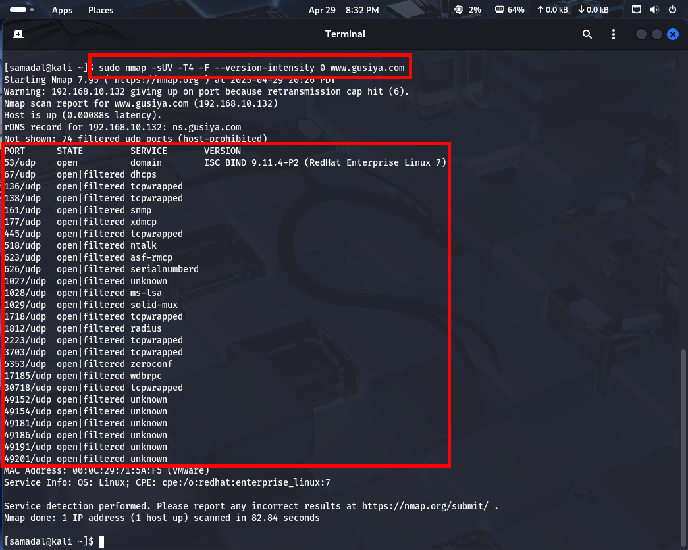
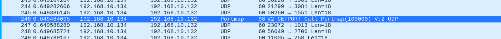
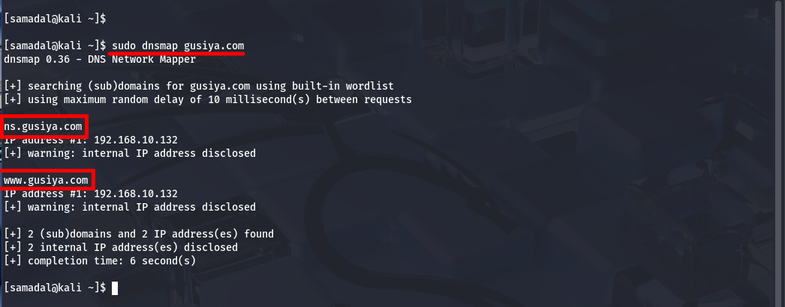
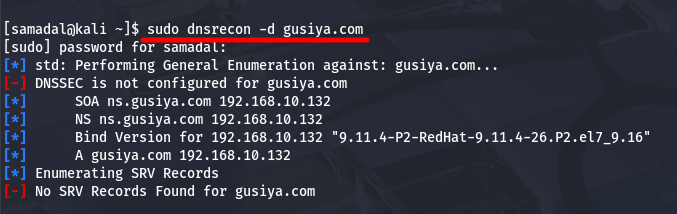

# Port Scanning (포트 스캐닝)

## 1. UDP Scan(nmap, unicornscan)

### 개요

- UDP를 이용한 포트 스캔을 말한다.
- UDP는 목적지 대상의 동의 여부와 무관하게 데이터를 전송하기 때문에 '음향' 또는 스트리밍 서비스에 주로 사용된다.
- UDP를 사용하는 대표적인 서비스에는 DHCP, DNS, SNMP, TFTP 등이 있다.
- TCP에 비해 매우 느린 포트 스캔을 한다.

### 특징

- 포트가 열려 있을 때 
공격자 → FIN, URG, PSH 패킷 전송 → 공격대상 → 무시하고 무응답 → 공격자

- 포트가 닫혀 있을 때 
공격자 → FIN, URG, PSH 패킷 전송 → 공격대상 → ACK 패킷 전송 → 공격자

### UDP 관련 스캐닝 명령어

- nmap
- unicornscan<br>
→ UDP 스캔에 소요되는 시간을 단축시켜 준다.
→ 정보 수집 툴(도구, 프로그램)이면서 속도가 빠르고 정확성을 제공한다.

### 실습환경
### 🖥️ 시스템 구성
- 192.168.10.134 → Kali Linux (클라이언트)

- 192.168.10.132 → CentOS (서버)

```
sudo nmap -sU www.gusiya.com
```

실습 1. 응답을 받지 못한 경우라면 포트가 열려 있는지 차단되었는지 파악 불가 <br>

실습 2.

```
sudo nmap -sUV -F --version-intensity 0 www.gusyia.com
sudo nmap -sUV -T4 -F --version-intensity 0 www.gusyia.com

```


## 실습 3. unicornscan

- 특징 <br>
→ 콘솔창에서는 내요잉 출력되지 않고 샥스핀을 통해서만 확인이 가능하다.<br>

### 예제 1. 정방향 조회영역/역방향 조회영역의 내용이 함께 출력

```
sudo unicornscan -m U -lv www.gusiya.com
```

### 예제 2. Source에는 kali의 IP만 나오고 지정한 포트의 범위에 있는 포트만 출력

```
udo unicornscan -m U -lv www.gusiya.com:21-3306
```
### 예제 3. 초당 전송되는 패킷 수를 지정한다.(기본값은 300)
```
udo unicornscan -m U -lv www.gusiya.com:21-3306 -r 10000
```


## 실습4. dnsmap
- DNS Server를 분석하고 관련 정보를 수집한다.
- DNS Server의 정보를 해킹할 때 유용하게 사용 가능하다.

### 예제 1. 하위 도메인 정보(Host Name)를 출력

```
sudo dnsmap gusiya.com
```

## 실습 5. dnsrecon

- 리버스 범위 검색, 최상위 도메인 확장, 단어 목록을 이용한 DNS 호스트, 도메인 브루트포스, NS, SOA, MX레코드 질의 등 발견된 NS 서버를 대상으로 영역 전송 실행한다.

### 🖥️ 시스템 구성(Host-only)
- 192.168.10.134 → Kali Linux (클라이언트)

- 192.168.10.132 → CentOS (서버)

- 192.168.10.130 → Window 10

