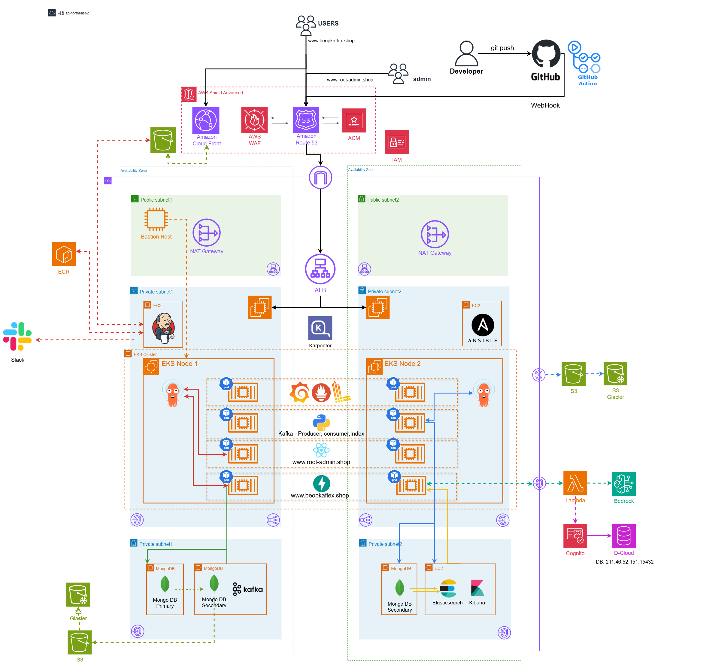
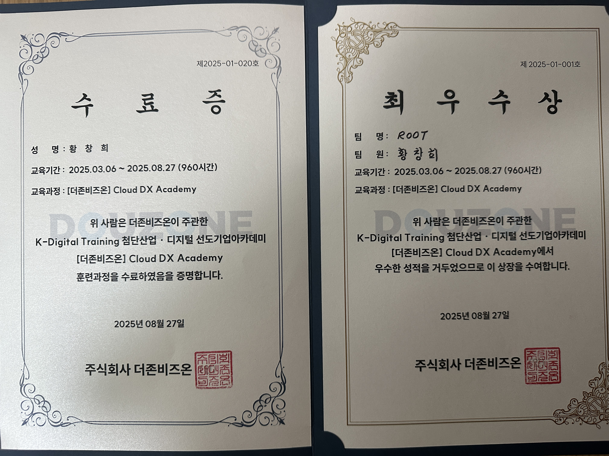

# 황창희 | 신입 서버 엔지니어

**이메일**: i0223542@gmail.com | **휴대폰**: 010-3733-9505 | **GitHub**: [https://github.com/CHANGHEE9505](https://github.com/CHANGHEE9505)

---

### 🙋‍♂️ **소개 (Introduction)**
안녕하세요. '왜?'라는 질문으로 문제의 근원을 파고드는 신입 서버 엔지니어 황창희입니다. 프론트엔드 개발자로 참여한 프로젝트에서 API 지연 문제를 계기로, 코드 너머의 서버 환경을 처음으로 탐험하며 문제의 실마리를 찾았던 경험을 통해 인프라 엔지니어링의 세계에 눈을 떴습니다. 그때의 아쉬움을 동력 삼아, Linux와 네트워크라는 튼튼한 뿌리 위에 AWS, Docker, Kubernetes와 같은 현대적인 인프라 기술의 가지를 뻗어왔습니다. 프론트엔드를 이해하는 넓은 시야와 인프라의 깊이를 탐구하는 전문성을 바탕으로, 그 어떤 상황에서도 흔들리지 않는 안정적인 서비스를 구축하는 데 기여하고 싶습니다.

---

### 🛠️ **보유 기술 (Skills)**
*각 뱃지를 클릭하시면 세부 기술 내역을 확인하실 수 있습니다.*

---

### 🚀 **프로젝트 (Projects)**

### 1. 법카플렉스 프로젝트

| 항목 | 내용 |
| --- | --- |
| **소개** | '법카 플렉스'는 직장인들을 위한 회식 장소 추천 플랫폼입니다. 기존 온프레미스 환경의 확장성 한계, 단일 장애점(SPOF) 문제, 제한적인 모니터링 환경을 해결하고, AWS Bedrock 기반의 신규 AI 챗봇 서비스를 도입하기 위해 클라우드 마이그레이션을 진행했습니다. |
| **기간/인원** | 8주 (2025.07.07 - 2025.08.25) / 5명 |
| **기술 스택** | `Ubuntu`, `Docker`, `Kubernetes`, `Helm`, `Grafana`, `Prometheus`, `Loki`, `React.js`, `FastAPI`, `Jenkins`, `Harbor`, `ArgoCD`, `GitHub`, `Kafka`, `MongoDB`, `Elasticsearch`, `Kibana`, `AWS` |
| **링크** | [https://github.com/hyegyeong-kang/ROOT](https://github.com/hyegyeong-kang/ROOT) |

**아키텍처**

**주요 기능 상세**
- **EKS 기반 컨테이너 오케스트레이션**: EC2 기반 k8s 환경을 AWS EKS로 전환하여 운영 부담 감소
- **고가용성 확보 (Multi-AZ)**: DB 및 서비스 노드를 여러 가용 영역에 분산 배치하여 장애 발생 시 서비스 연속성 보장
- **자동 확장 (Auto Scaling)**: Kubernetes HPA를 이용해 트래픽에 따라 Pod 수를 자동으로 조절하여 자원 효율성 확보
- **서버리스 아키텍처 도입**: Lambda, API Gateway를 활용하고, MongoDB를 DynamoDB로 이전하여 서버리스 구축 **(담당)**
- **하이브리드 클라우드 구성**: AWS Cognito와 기존 D-Cloud의 데이터베이스를 연동하여 회원 정보 이중 관리 **(담당)**
- **MongoDB Replica Set 구축**: Primary/Secondary로 구성된 복제 세트를 구축하여 데이터 이중화 및 고가용성 확보
- **Elasticsearch 연동 검색 서비스**: 대용량 식당 데이터의 빠른 검색을 위해 Elasticsearch 도입
- **자동화된 CI/CD 파이프라인**: Github, Jenkins, Harbor, ArgoCD를 연동하여 빌드, 테스트, 배포 자동화
- **실시간 알림 연동**: Jenkins 및 ArgoCD의 배포 결과를 Slack으로 실시간 전송
- **WAF를 통한 웹 공격 방어**: SQL 인젝션, XSS 등 일반적인 웹 공격 차단 및 특정 IP 접근 제어 **(담당)**
- **IAM을 통한 접근 제어**: IAM 역할과 정책을 통해 AWS 리소스 접근 권한 최소화 **(담당)**
- **다차원적 시스템 모니터링**: Prometheus, Grafana, Kibana를 활용하여 인프라 및 애플리케이션 성능 지표 시각화 **(담당)**
- **AI 챗봇 기능**: AWS Bedrock(Claude 3 Haiku)이 MongoDB의 리뷰 데이터를 요약하여 사용자에게 제공 **(담당)**

---

### 2. LMS 플랫폼 구축 프로젝트

| 항목 | 내용 |
| --- | --- |
| **소개** | 'Adventure With Samadal'은 여러 외부 플랫폼 사용으로 인한 공지 누락, 과제 제출 혼선 문제를 해결하기 위해 SMDU(스마트 미디어 디지털 대학교) 맞춤형 학습 관리 시스템(LMS)을 구축하는 프로젝트입니다. 서버 기능을 물리적으로 분리하고 사용자 네트워크를 나누어 보안과 안정성을 강화했습니다. |
| **기간/인원** | 2주 (2025.04.28 - 2025.05.12) / 3명 |
| **기술 스택** | `CentOS`, `Windows 10 Server`, `VMware Workstation`, `Apache`, `PHP`, `MariaDB`, `SquirrelMail`, `sendmail`, `dovecot`, `BIND(DNS)`, `DHCP`, `Notion` |
| **링크** | -|

**주요 기능 상세**
- **서버 기능 분리**: Web, DB, Mail 기능을 각각 독립된 CentOS 서버로 분리하여 안정성 및 관리 효율성 증대
- **네트워크 분리 및 보안 강화**: 교수와 학생의 네트워크를 별도 라우터로 분리하여 내부 트래픽 제어
- **DHCP를 이용한 IP 자동 할당**: 학생용 네트워크에 DHCP 서버를 구성하여 IP 자동 할당 **(담당)**
- **DNS 서버 구축**: BIND를 이용하여 lms.smdu.ac.kr, mail.smdu.ac.kr 등 내부 서비스 도메인 관리 **(담당)**
- **DB 서버 설계 및 구축**: MariaDB 서버 구축 및 별도 디스크 파티션에 데이터를 분리 저장
- **메일 서버 구축 및 연동**: SquirrelMail, sendmail, dovecot을 활용한 웹메일 시스템 구축 및 LMS와 연동 **(담당)**

---

### 3. 자연어 처리(NLP) 기술로 발표 능력을 분석하는 모바일 앱 개발 프로젝트

| 항목 | 내용 |
| --- | --- |
| **소개** | 자연어 처리(NLP) 기술을 기반으로 사용자의 발표 능력을 스스로 분석하고 개선하도록 돕는 모바일 애플리케이션입니다. 발표에 대한 긴장감, 시간 관리의 어려움, 객관적인 피드백 부족 문제를 해결하기 위해 개발되었습니다. |
| **기간/인원** | 8주 (2024.04.17 - 2024.06.09) / 4명 |
| **기술 스택** | `React Native`, `Node.js`, `Python`, `MongoDB`, `NLP`, `Google Speech-to-Text API`, `Google Cloud Storage` |
| **링크** | [FeedBack-RN](https://github.com/ghkdckdgmlek/FeedBack-RN), [FeedBack-node](https://github.com/ghkdckdgmlek/FeedBack-node), [FeedBack-py](https://github.com/ghkdckdgmlek/FeedBack-py) |

**주요 기능 상세**
- **STT 및 오디오 기반 다각적 분석**: Google STT API로 음성을 텍스트로 변환하고, Librosa 라이브러리로 음성 원본을 분석
- **발표 속도 및 에너지 분석**: Librosa를 활용해 전체 단어 수와 발표 시간을 계산하여 발표 속도(단어/분) 측정 **(담당)**
- **침묵 구간 및 비형태소 감지**: Google STT의 타임스탬프를 이용해 단어 사이의 침묵 구간을 감지하고, 정규표현식으로 '음', '어' 등 불필요한 비형태소 사용 빈도 측정
- **핵심 키워드 추출**: Okt 형태소 분석기와 TF-IDF, PageRank 알고리즘을 적용하여 내용의 핵심 키워드와 단어별 중요도 분석
- **혐오 표현 감지**: 한국어 혐오 표현 데이터셋으로 학습된 앙상블 모델을 통해 부적절한 표현 사용 여부 탐지

---

### 4. 운해 보러갈래? 프로젝트

| 항목 | 내용 |
| --- | --- |
| **소개** | 최근 등산에 대한 관심이 높아진 MZ세대를 겨냥하여, 환상적인 '운해'의 인증샷을 남길 수 있는 최적의 장소를 추천하는 모바일 애플리케이션입니다. React Native를 기반으로 개발되었으며, Firebase와 연동하여 실시간으로 데이터를 관리합니다. 이 앱을 통해 사용자들은 운해를 볼 확률이 높은 산을 확인하고, 산림청 기준 100대 명산의 정보를 얻을 수 있습니다. 또한, 자신이 직접 다녀온 산에 인증샷을 기록하며 다른 사용자들과 경험을 공유할 수 있습니다. |
| **기간/인원** | 5주 (2023.09.18 - 2023.10.21) / 1명 |
| **기술 스택** | `React Native (expo-router)`, `expo go`, `JavaScript`, `Firebase`, `Firestore` |
| **링크** | [https://github.com/ghkdckdgmlek/ghkdckdgmlek](https://github.com/ghkdckdgmlek/ghkdckdgmlek) |

**주요 기능 상세**
- **React Native 기반 앱 개발**: expo-router를 활용하여 모바일 앱의 전체적인 화면 구성 및 기능 구현
- **Firebase 연동 데이터 관리**: Firebase Firestore를 백엔드로 사용하여 100대 명산 정보, 사용자 인증샷 등 주요 데이터를 저장하고 관리
- **운해 관측 확률 정보 제공**: 각 산의 특성을 기반으로 사용자가 운해를 볼 수 있는 확률 정보 제공
- **사용자 인증샷 기록**: 사용자가 직접 다녀온 산의 위치에 자신의 인증샷을 기록하고 관리하는 기능
- **100대 명산 정보 제공**: 산림청 기준 대한민국 100대 명산의 위치, 정보 등을 지도와 함께 제공

### 5. 펫미팅 프로젝트

| 항목 | 내용 |
| --- | --- |
| **소개** | '펫미팅'은 반려동물의 사회성을 높이고 반려인 간의 교류를 활성화하기 위해 기획된 모바일 소셜 네트워킹 앱입니다. 이 앱은 바쁜 반려인을 위한 '대리 산책' 커뮤니티, 산책 중 자연스러운 만남을 주선하는 '산책 중 만남', 그리고 새로운 친구를 찾아주는 '반려동물 소개팅'이라는 세 가지 핵심 기능을 제공합니다. 이를 통해 반려동물에게 건강한 친구를 만들어주고, 반려인들에게는 유용한 정보 교류의 장을 마련하는 것을 목표로 합니다. |
| **기간/인원** | 7주 (2023.10.30 - 2023.12.18) / 2명 |
| **기술 스택** | `React Native (expo-router)`, `Expo`, `JavaScript`, `Firebase Firestore` |
| **링크** | [https://github.com/lailihe/23-2Mobile-Project](https://github.com/lailihe/23-2Mobile-Project) |

**주요 기능 상세**
- **반려동물 소개팅**: 사용자가 반려동물의 상세 프로필(사진, 품종, 나이, 성격 등)을 생성 및 관리하는 기능. 조건별 필터를 통해 원하는 친구를 찾을 수 있는 매칭 시스템. 인기 프로필 및 랜덤 프로필 추천으로 새로운 만남 기회 제공.
- **대리 산책 커뮤니티**: 사용자가 대리 산책을 구하거나 지원하는 게시글을 자유롭게 작성하고 조회하는 기능.
- **채팅 기능**: 소개팅 매칭 또는 대리 산책 약속 조율을 위해 사용자 간에 1:1로 소통할 수 있는 실시간 채팅 기능.

### 🎓 **교육 및 훈련 (Education & Training)**

#### [더존비즈온 | Hybrid Cloud 전문가 양성과정](https://dx.himedia.co.kr/) (2025.03 ~ 2025.08)
- **On-Premises & 가상화**: Linux/Network 인프라, 애플리케이션 & DB 구축
- **자동화 및 관리**: Ansible을 활용한 배포 자동화 및 관리
- **컨테이너 오케스트레이션**: Docker, Kubernetes를 활용한 컨테이너 관리 및 모니터링 환경 구축
- **CI/CD 파이프라인**: GitHub, Jenkins를 활용한 파이프라인 구축
- **클라우드 인프라**: AWS Public Cloud 활용 및 Terraform을 이용한 코드형 인프라(IaC) 구현
- **프로젝트**: D-Cloud를 이용한 하이브리드 클라우드 프로젝트 수행

---

### 📜 **자격증 (Certifications)**
- 정보처리기사 (2025.09)
- 네트워크관리사 2급 (2025.07)
- 리눅스마스터 2급 (2025.03)
- OPIC Intermediate Mid1 (2024.12)
- 1종보통운전면허 (2016.04)

---

### 🤝 **주요 경험 (Experiences)**

- **라누바 (스쿼시 동아리)**: 신입 부원들의 빠른 적응을 돕는 '웰컴 파트너' 역할을 자처하며 팀워크와 소통 능력 함양
- **딥서프 (서핑샵)**: 고객 맞춤형 응대로 단골 고객 확보 및 고객 관리 능력 인정
- **탕정 송아지 (소고기집)**: 위기 상황 대처 능력과 문제 해결 능력을 인정받아 '가장 믿을 수 있는 해결사'로 신뢰 획득

---

### 📫 **취미**
- **Instagram**: [chang._.he](https://www.instagram.com/chang._.he) 

---

### 🛠️ **세부 기술 (Detailed Skills)**

- **기본 설정**: 다양한 배포판 사용 경험 (CentOS, Ubuntu, Rocky Linux, Kali Linux), 네트워크 및 보안 초기 설정, 패키지 관리 (yum, apt), 소유권/허가권에 대한 이해 및 관리
- **서버 핵심 서비스 구축 및 운영**: Web/WAS (Apache, Nginx) 구축, 가상 호스트 설정 및 부하 분산 구성
- **네트워크 서비스**: DNS (BIND), DHCP, NFS 서버 구축 및 장애 대응
- **원격 접속**: SSH, Telnet 등 원격 접속 프로토콜 설정 및 보안 강화
- **시스템 관리 및 자동화**: Crontab을 활용한 주기적인 작업 스케줄링, Shell script 작성
- **스토리지 관리**: LVM을 이용한 파티션 생성 및 확장, fstab을 통한 오토마운트 설정

- **이미지 관리**: Dockerfile을 직접 작성하여 커스텀 이미지 빌드, Docker Hub를 이용한 이미지 관리
- **컨테이너 운영**: Apache, MariaDB 등 주요 애플리케이션의 컨테이너화, 데이터 영속성 관리
- **네트워크**: Docker Network에 대한 이해 및 컨테이너 간 통신 제어

- **클러스터 구축 및 운영**: On-premise 환경에서 Kubernetes 클러스터 구축, Pod, Deployment, Service, ReplicaSet 등 핵심 오브젝트 운영
- **트래픽 관리 및 스케일링**: Ingress를 통한 외부 트래픽 제어, HPA를 이용한 트래픽 기반 오토 스케일링

#### 
- **인프라 자동화**: Terraform 코드를 사용하여 AWS 인프라(VPC, Subnet, EC2 등) 정의 및 자동화, 변수, 출력, 모듈을 활용하여 재사용 가능하고 효율적인 코드 작성

#### 
- **구성 관리 자동화**: Vagrant로 가상화 테스트 환경을 구축하고 Ansible 플레이북 작성, 다수 서버의 패키지 설치, 설정 변경 등 반복 작업을 자동화
- **플레이북 작성**: 조건문, 반복문을 활용하여 유연하고 확장성 있는 자동화 스크립트 작성

####  
- **컴퓨트 & 컨테이너**: EKS, EC2, Lambda
- **네트워킹 및 콘텐츠 전송**: VPC, Route 53, CloudFront, ALB, API Gateway
- **스토리지**: S3
- **보안 및 자격 증명**: IAM, Cognito, ACM
- **AI / Machine Learning**: Amazon Bedrock

#### 
- **Front-End Development**: DOM 조작 및 이벤트 처리, ES6+ 문법 활용, 비동기 처리(Promise, async/await)
- **Basic Concepts**: 데이터 타입, 스코프, 클로저 등 핵심 개념 이해

####  
- **Component-Based-Architecture**: 컴포넌트 기반 아키텍처 이해 및 활용
- **State Management**: `useState`, `useEffect` 등 Hooks를 사용한 상태 관리
- **API-Integration**: Axios, Fetch API를 이용한 REST API 연동

####  
- **Back-End Development**: Express.js를 이용한 REST API 서버 구축
- **Module System**: CommonJS 모듈 시스템 이해 및 활용

####  
- **Back-End Development**: FastAPI를 이용한 REST API 서버 구축
- **Database Integration**: SQLAlchemy를 이용한 MySQL 연동

####  
- **Basic-SQL**: 기본적인 CRUD SQL 문법 사용
- **Database-Modeling**: 간단한 데이터베이스 모델링

#### 
- **Version Control**: Git을 이용한 버전 관리
- **Collaboration**: `push`, `pull`, `merge`, `branch` 등 협업을 위한 Git 명령어 활용
- **CI/CD**: GitHub Actions를 이용한 간단한 CI/CD 파이프라인 구축 경험