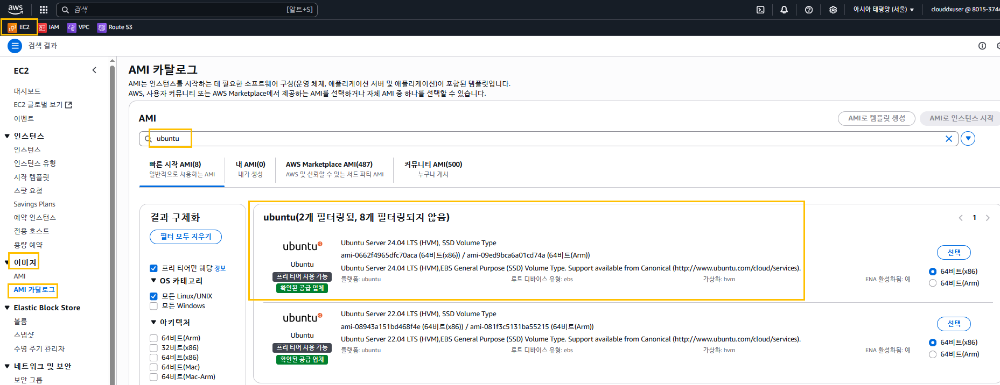

# Terraform

## 단일서버 배포

## 용어

### ami
- **EC2 Instance** 를 생성하는 **Amazon Machine Image** 를 말한다.
- **AWS Management Console** 좌측에 있는 '이미지' 하위에 있는 'AMI 카탈로그'를 클릭
- **AWS 마켓플레이스**에서 **무료 및 유료 AMI** 검색해서 생성
### instance_type
- 실행 할 'EC2 Instance'의 유형을 말한다.
- 'EC2 Instance'의 유형은 'https://aws.amazon.com/ko/ec2/instance-types/'를 참고한다.
# 실습 1. '공급자(Provider)'와 '리소스(Resource)' 구성을 위한 main.tf 코드

### 개요
- 'ami 매게 변수' 'us-east-2'에서 'ubuntu 18.04' 버전의 'AMI ID(ami-0c55b159cbfafe1f0)를 지정하고 있고 무료로 사용할 수 있다.'
- 'instance_type'은 '프리티어'에서 사용 가능한 't2.micro' 인스턴스이고 '가상 CPU 1개', '메모리 1GB'를 제공하고 있다.

### 작업
- 소스 코딩

/sdb/Terraform/main.tf --- main_01.tf
```
provider "aws" {
        region = "us-east-2"
}

resource "aws_instance" "ubuntu1804" {
        ami = "ami-0c55b159cbfafe1f0"
        instance_type = "t2.micro"
}
```

## Step 1. 초기화 (init)


업그레이드


### 개요
- Terraform 을 처음 실행(init)하면 소스 코드를 스캔하고 어떤 공급자인지 확인하고 필요한 코드를 다운로드 하도록 해야 한다.
- 새로운 코드를 시작할 때마다 이 명령을 실행해야 한다.

### 실행

## Step 2. 검증 (validate)


## Step 3. 계획 (plan)
- 개요
  - 실제 생성하기 전에 apply 명령의 시뮬레이션이라고 생각하면 된다.
  - 실제 운영 환경에 적용하기 전에 코드의 문제점을 검사할 수 있는 방법이다.

```
E:\Terraform>terraform plan

Planning failed. Terraform encountered an error while generating this plan.

╷
│ Error: No valid credential sources found
│
│   with provider["registry.terraform.io/hashicorp/aws"],
│   on main.tf line 1, in provider "aws":
│    1: provider "aws" {
│
│ Please see https://registry.terraform.io/providers/hashicorp/aws
│ for more information about providing credentials.
│
│ Error: failed to refresh cached credentials, no EC2 IMDS role found, operation error ec2imds: GetMetadata, request
│ canceled, context deadline exceeded
```
이 오류는 aws와 연결하지 않아서 생기는 오류

- 실행


## Step 4. 적용 (apply)
- 개요
  - 실행 결과는 'AWS Management Console'에서의 'EC2'에서 확인한다
- 결과
- 'Enter a value:' 에서 'yes'를 입력하면 'EC2 Instance'가 생성되는 것을 알 수 있다. 이것을 '배포한다'라고 한다. 즉, '단일 배포'가 된다.


## 추가 사항  1. 'AMI Image'가 없는 경우 'EC2 Instance'를 생성할 수가 없다.

### 코드(main.tf) 생성
- 'Backup' 폴더를 생성하고 'Terraform' 폴더 안에 있는 'main.tf' 파일을 'main_01.tf' 파일로 복사한다.

- 'main.tf' 파일 수정

명령 실행
```
terraform init
terraform validate
terraform plan
terrafrom apply
```
결과
- 원인이 되는 문구


- 버전을 더 이상 지원 x

## 추가 사항 2. 'Name' 필드에 이름을 지정해서 'EC2 Instance'를 생성
### 개요
- '실습 1.'의 실행 결과를 확인해보면 'EC2 Instance'의 이름이 없다.
- 'aws_instance' 리소스의 'tags'에 'Name'이라는 태그로 이름을 추가하면 된다.

#### main_02.tf
```
resource "aws_instance" "ubuntu1804" {
        ami = "ami-0c55b159cbfafe1f0"
        instance_type = "t2.micro"

        tags = {
                Name = "terraform-ubuntu1804"
        }
}
```


# 실습 2. 'hashcorp/aws' 버전에 따른 
## 구분 1.
- 개요
  - 코드 안에 'terraform {}' 블록을 삽입하지 않은 경우 
    - 'hashcorp/aws'의 버전을 자동으로 인식하기 때문에 오류가 발생하지 않는다.
  - 코드 안에 'terraform {}' 블록을 삽입한 경우 
    - 'hashcorp/aws'의 버전을 현재 설치되어 있는 버전과 반드시 일치시켜야 한다.

명령실행 
### Step 1. init(초기화)
### Step 2. validate(검증)
### Step 3. plan (계획)
### Step 4. apply (적용)
### Step 5. 'EC2 Instance' 확인

#### main_03.tf

```
terraform {
        required_providers {
      aws = {
         source = "hashicorp/aws"
                        version = "~> 4.67.0"
      }
   }
   required_version = ">= 1.4"
}

provider "aws" {
        region = "ap-northeast-2"
}

resource "aws_instance" "app_server" {

        ami = "ami-0c55b159cbfafe1f0"
        instance_type = "t2.micro"

        tags = {
                 Name = "terraform-ubuntu1804"
        }
}

```


### Step 6. show(상태 확인), 코드의 세부 내용을 확인할 수가 있다.


### Step 7. destroy (제거)

- terrafrom destroy


### Step 8. show 2. 


## 구분 2.
- 현재 소스 코드에 입력되어 있는 버전은 최신 버전이 아니다.
- 따라서 소스 코드를 '초기화'한 후 나타난 버전을 확인한 후 작업을 해야 한다.
### Step 1. 'hashcorp/aws' 최신 버전 확인


### Step 2. 'main_03.tf' 수정 -- main_04.tf

```
terraform {
        required_providers {
                aws = {
                        source = "hashicorp/aws"
                        version = "~> 5.100.0"
                }
        }
        required_version = ">= 1.4"
}

provider "aws" {
        region = "us-east-2"
}

resource "aws_instance" "app_server" {

        ami = "ami-0c55b159cbfafe1f0"
        instance_type = "t2.micro"

        tags = {
                 Name = "terraform-ubuntu1804"
        }
}

```
### Step 3. init (초기화)


### Step 4. validate (검증)


### Step 5. plan (계획)


### Step 6. apply (적용)


### Step 7. show (AWS에서도 확인)


### Step 8. destroy


# 실습 3. 'Ubuntu 최신 버전'인 'Ubuntu Server 24.04'로 'EC2 Instance'를 생성

## 개요
- 서브넷
- 가장 먼저 'ami'를 찾는다.
- Access key 검색 및 등록
- Region 선택

## main_05.tf 생성

```
terraform {
        required_providers {
                aws = {
                        source = "hashicorp/aws"
                        version = "~> 5.100.0"
                }
        }
        required_version = ">= 1.4"
}

provider "aws" {
        region = "ap-northeast-2"
}

resource "aws_instance" "app_server" {

        ami = "ami-0662f4965dfc70aca"
        instance_type = "t2.micro"

        tags = {
                 Name = "terraform-ubuntu2404"
        }
}

```
- 작업 1. 'Ubuntu Server 24.04' AMI 검색 후 'EC2 Instance' 생성 후에 삭제




- 작업 2.'VPC'의 'Subnet' 삭제 후 'terraform apply' 실행 오류 발생


- vpc 삭제로 다 날린 후에 다시 vpc 기본생성


- 그리고 다시 작업 1. 해보기 


# 실습 4. Local File로 접속 및 저장, VPC 모듈화, Access_Key 자동인식
- 기본 사용법