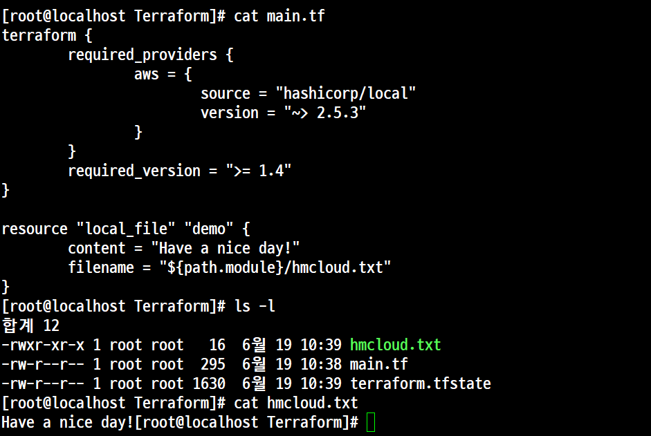
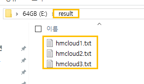

# 실습 4. Local File로 접속 및 저장, VPC 모듈화, Access_Key 자동인식


## 실습 4-1 **Local File**로 **접속 및 저장**

### 예제 1. 'Local File'을 이용한 출력 내용을 hmcloud.txt 파일로 저장


#### 개요
- 'hashicorp/local'인 경우에는 다음의 사이트에서 'Local' 버전을 확인하고 입력해야 한다.
- https://registry.terraform.io/providers/hashicorp/local/latest
- 'hashicorp/aws'인 경우와 입력되는 값이 다르다. 즉, version = "~> 5.100.0"와 같이 입력해야 한다. 이 경우 '5.100'만 일치가 된다면 나머지는 상관 안하겠다.

##### 'main_06.tf' 파일 생성

```
terraform {
        required_providers {
                aws = {
                        source = "hashicorp/local"
                        version = "~> 2.5.3"
                }
        }
        required_version = ">= 1.4"
}

resource "local_file" "demo" {
        content = "Have a nice day!"
        filename = "${path.module}/hmcloud.txt"
}
```
init 후 apply



### 예제 2. 'Local File'을 이용한 출력 내용을 파일 3개(localfile1~3.txt) 파일'로 저장

#### 개요
- 'local_file'은 예약어(reserved word)


##### main_07.tf 파일 생성
```
terraform {
        required_providers {
      local = {
         source = "hashicorp/local"
                        version = "2.5.3"
      }
   }
   required_version = ">= 1.4"
}


resource "local_file" "lf1" {
   content = "Cloud1"
   filename = "e:/result/localfile1.txt"
}


resource "local_file" "lf2" {
   content = "Cloud2"
   filename = "e:/result/localfile2.txt"

}
resource "local_file" "lf3" {
   content = "Cloud3"
   filename = "e:/result/localfile3.txt"
}
```
init 후 apply



# 실습 4-2 'AWS VPC 모듈화'

- main_08.tf
```
resource "aws_vpc" "main" {
        cidr_block = "10.0.0.0/16"
        tags = {
                Name = "Terraform VPC"
        }
}
```

- Provider.tf
```
terrafrom{
        required_providers {
                aws = {
                        source = "hashicorp/aws"
                        version = "5.100.0"
                }
        }
        required_version = ">= 1.4"
}
provider = "aws" {}
```

- VPC 변수 (variable.tf) 선언
```
variable "vpc_cidr" {
        type = string
}
```
- VPC 변수 (terraform.tfvars) 초기화
```
vpc_cidr = "10.0.0.0/16"
```

## 단일 서버 배포
### Terraform 의 모듈화
- 개요
    - (핵심)'Terraform 모듈화'는 복잡한 인프라 구조를 '보다 쉽게 관리'하고 '재사용'할 수 있도록 만드는 'Terraform'의 핵심 기능이다.
    - (설명)'Terraform' 구성 파일(*,tf) 들을 모아서 하나의 디렉터리(폴더)에 위치시키는 것으로 특정 인프라 구성 요소를 정의하고 필요에 따라서 다른 프로젝트에서 재사용할 수 있게 한다.

- 'Terraform' 모듈의 구성
    - 'Terraform'의 모듈화의 핵심은 각각의 모듈이 독립적으로 동작하면서도 전체 인프라 구성의 일부로서 함께 작동한다.

    - 구조는 tree 명령으로 확인 가능하다.

```
E:\>tree
Folder PATH listing for volume 64GB
Volume serial number is 72F1-6528
E:.
├───main.tf (모듈의 주요 리소스와 구성을 정의)
├───variables.tf (모듈이 사용하는 변수들을 정의)
├───outputs.tf (모듈에서 생성된 리소스의 출력값을 정의)
└───README.md (옵션, 모듈의 사용 방법과 목적등을 설명)
```
