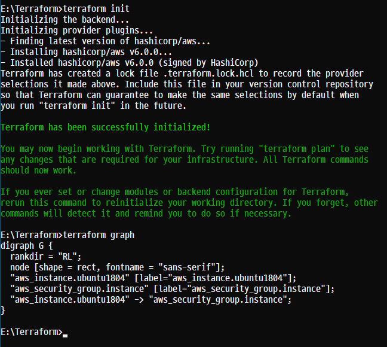
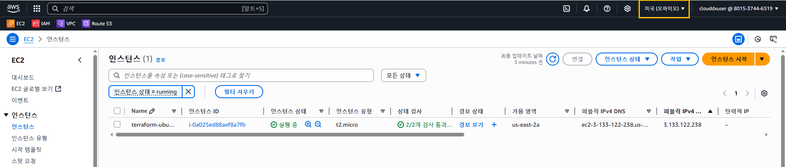
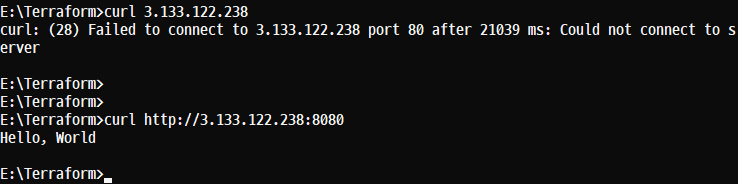
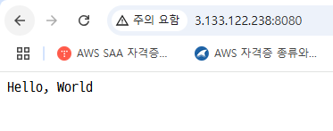
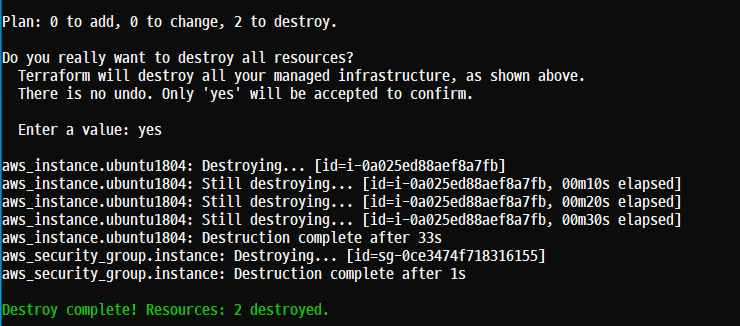

# 실습 1. 'EC2 Instance' 생성


오류 발생 키 페어 생성


```
tar cvf vpc_ec2.tar Terraform/*
```

# 단일 웹서버 배포
## 개요
- 'EC2 Instance' 에서 '웹 서버를 실행하는 것' 을 말한다.
- 실제 사용하는 환경에서는 'Ruby on Rails' 또는 'Django'와 같은 웹 프레임워크를 사용해서 웹 서버를 구축하는 것이 일반적이다.

### Step 1. 웹 서버를 위한 'Bash Script'
- 개요
    - 'Hello, World'를 출력하는 'Shell Scripting'을 사용한다.
    - 단순 응답만을 위해서 'Bash Script'를 사용한다.

- 'Bash Script'
```
#!/bin/bash
echo "Hello, World!" > index.html
nohup busybox httpd -f -p 8080 &
```

- 설명
    - 'index.html'dp 'Hello, World'라는 문자열을 입력, 저장하고 '8080' 포트를 'Listening'하고 있는 'busybox' 유틸리티를 'Background Mode(&)'에서 지속적으로 실행(nohup)한다.
    - 'index.html' 파일에 텍스트를 저장한 후 Busybox라는 도구로 포트 8080에서 웹 서버를 실행하여 해당 파일을 제공한다.

- Busybox
    - 공식 사이트는 'https://www.busybox.net'이다.
    - 'GPL 라이센스'로 개발되어 있는 수많은 리눅스 커멘드라인 명령어들을 모아놓은 단일 실행 파일을 말한다.

```
General Software        (정식)
Trial Software          (기간 제한 x  기능 제한 o)
Free Software           (기간 제한 중간  기능 제한 중간)
share Software          (기간 제한 ㅇ  기능 제한 x)
```

### Step 2. 'EC2 Instance'를 위한 구성 파일 'main.tf' 준비

- 개요
    - 'EC2 Instance' 에서 이 스크립트를 실행하려면 웹 서버가 설치된 사용자 지정 AMI(clouddxuser) 를 생성하면 된다.

    - 필요한 것들
        - 'EC2 Instance' 1개가 필요한다.
        - 'Security Group' 1개가 필요하다.

### Step 3. 리소스간의 의존성 관계도 'graph' init, 'validate', 'plan', 'apply' 실행

- 개요
    - 리솟그 간의 관계가 형성되면 서로 의존성이 발생하게 되는데 해당 의존성 관계에 따라 생성 순서를 알아서 관리해 준다.
    - 이와 같이 의존성 관계에 있는 리소스들간의 정보를 확인할 수 있다.



### Step 4. 생성된 'EC2 Instance'와 출력 확인
- 생성된 것을 확인



- 사이트 출력 내용 확인

3.133.122.238 퍼블릭 IP





### Step 5. 상태 목록 확인, 'state list'
- 리소스의 목록을 출력한다.
- Terraform이 관리하고 있는 모든 '리소스의 식별자들을 확인'할 수 있다.

    - resource "aws_instance" "ubuntu1804" { ... }
    - resource "aws_sercurity_group" "instance" { ... }

- (핵심) 이 명령어는 상태 파일을 수동으로 관리할 필요가 있을 때 유용하게 사용된다.
    - 리소스를 다른 상태 파일로 이동하거나 Terraform 구성에서 삭제된 리소스를 수동으로 상태 파일에서 제거할 때 등과 같이 사용된다.
    - 리소스를 정확하게 알아내고 필요한 경우 '옵션(mv, rm)'을 사용해서 상태를 관리할 수 있다.

- 수동으로 상태를 관리하는 방법
    - terraform statr mv
    - terraform statr rm

- Step 6. 삭제




