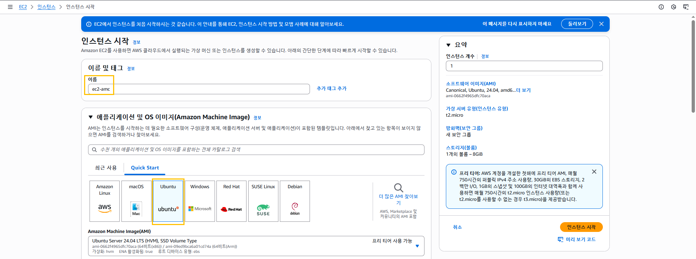
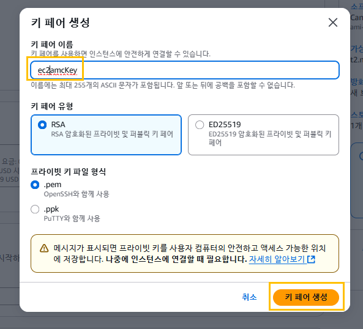
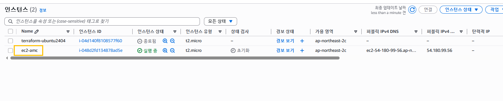
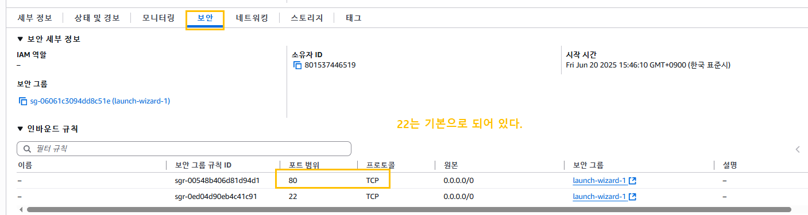
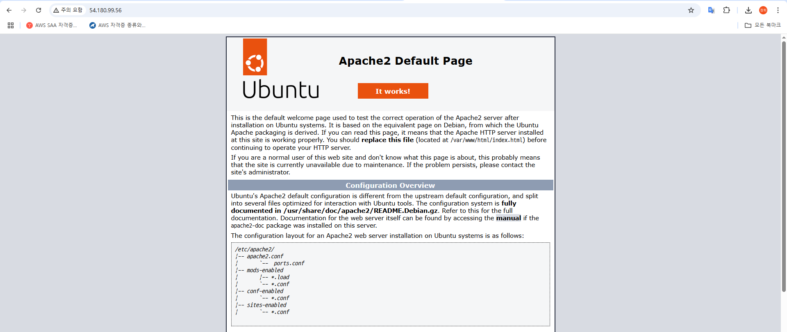
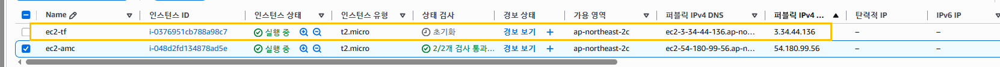
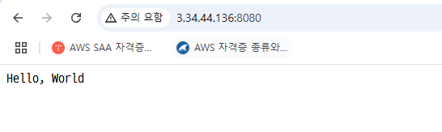

# 실습 1.


## Step 1. 'AWS Management Console' (ec2-amc)

작업 개요<br>







. ppk로 저장 <br>

-> 'EC2 Instance(terraform-ubuntu2404)'를 '키페어'와 함께 생성한다. <br>

- 생성된 'EC2 Instance'에 원격 접속을 한다. 

- 'Ubuntu'에서 해야 할 기본 작업들을 모두 적용, 완료한다.
```
sudo apt update
sudo apt upgrade
sudo apt install net-tools
```
인바운드 규칙 http 80번을 추가해주고 나서 아파치 서버 다운로드



```
sudo apt install apache2
```

- 'Apache 2 Web Server'를 활성화 시킨 후 사이트 출력이 되는지 확인한다.




 ## Step 2. 'Terraform' (ec2-tf 실습1. 아파치 다음)
   -> 'Terraform 코드'를 이용해서 'Busybox' 'Bash Script' 사이트를 출력한다.





## Step 3. 'Redirection'
   -> 'ec2-amc' 사이트 출력 시 'ec2-tf' 사이트로 자동으로 넘어가도록 한다.
   -> 참고
      : <meta http-equiv="refresh" content="5;url=http://3.34.44.136:8080/" />

## Step 4. 인터넷에서 등록한 개인 도메인과 연동시킨다.
   
# 실습 2.
- 작업 개요
   - Step 1. 'VM 
      - (CentOS 7.9.2207)' 
      - 외부망 통신 가능하게 설정 (NAT / 192.168.10.132 / C Class / 192.168.2 / 192.168.2)
   - Step 2. 'Local Web Server' 구축
      - (CentOS 7.9.2207)' 
      - DNS Server
         - Package 설치
         - 각종 설정
         - 기본 경로 변경
      - Web SErver
         - 'www.samadal.com'
         - Package 설치
         - 기본 경로 변경
   - Step 3. 'VM 추가'
      - 'Windows 10'
      - 외부망 통신 가능하게 설정 (NAT / 192.168.10.130 / C Class / 192.168.10.132 / 192.168.10.132)
      - 네임서버 조회
   - Step 4. 사이트 출력
      - 'Windows 10'
      - http://www.samadal.com 출력 without 'Redirection'
            - "CentOS" 의 내용 출력
      - http://www.samadal.com 출력 with 'Redirection'
            - 'ec2-amc' Instance를 등록하면 'ec2-amc' Instance로 주소 변경
            - 변경된 주소는 다시 'ec2-tf' Instance를 변경