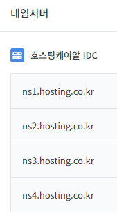
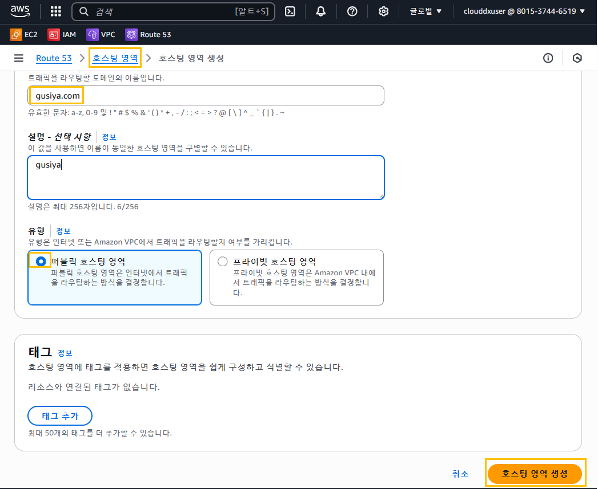
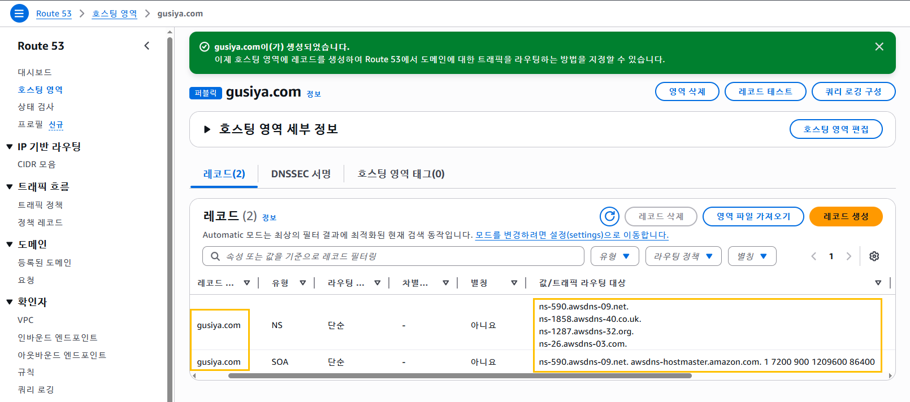
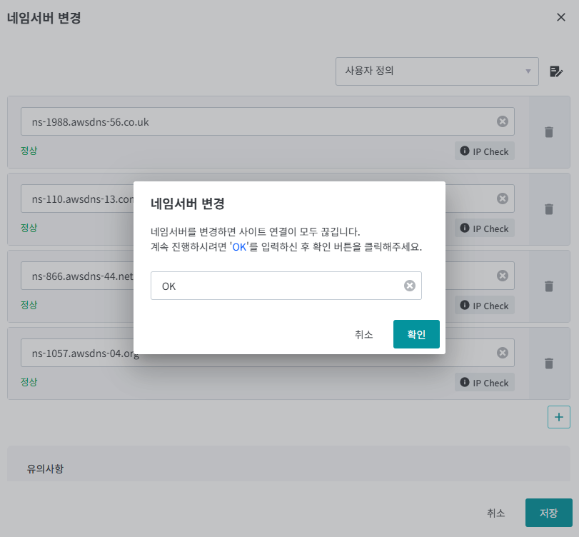
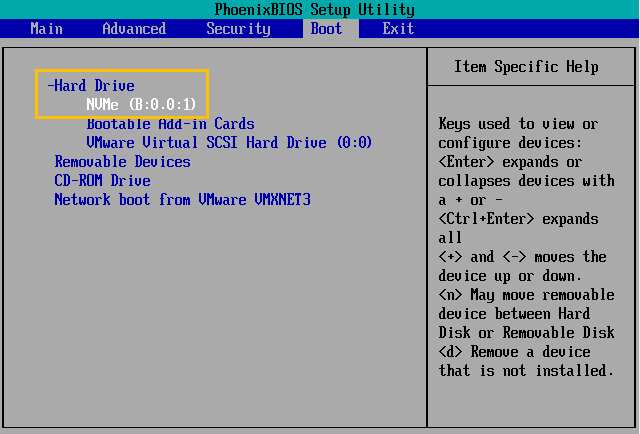

# 실습 3. AWS Route53 (도메인을 이용한 출력)
## 개요
- 보유하고 있는 도메인을 AWS의 Route53을 통해 네임서버로 등록

## 도메인 등록 종류
- AWS 에서 도메인 등록 후 'Route53'에서 서비스를 한 경우
- 'Web Hosting' 업체에서 도메인을 등록한 경우

## Name Server 설정 1. 'AWS'에서 도메인 구매 및 등록 후 'Route53'에서 서비스를 한 경우
### 개요
- 별도의 작업(네임서버 설정 등) 없이 도메인 등록을 하고 옵션으로 'Route53' 서비스를 신청하고 '호스트'만 추가해서 사용하면 된다.
- 'Public IP'와 등록하고자 하는 호스트만 연결시켜줌으로써 쉽게 설정을 할 수가 있다.

### 설정
-
### 시작 지점 선택 6개 항목
- 도메인 등록
    - 사용자가 애플리케이션에 액세스하는 데 사용하는 이름(예: example.com)을 등록한다.
    - 도메인을 '신규'로 등록하고자 할 때 사용한다.
    - 신규 도메인 유지 기간은 기본적으로 '1년(365일) + 1개월'이다.
- 도메인 이전
    - 도메인 이름을 다른 도메인 등록자로 등록한 'Route 53'으로 이전할 수 있다.
    - 다른 업체(웹호스팅 업체)에서 등록한 도메인을 'Route53'으로 이전하는 것을 말한다.
    - 도메인 관리만 이전을 한다. 즉, 도메인을 관리를 AWS에게 위임하는 것을 말한다.
- 호스팅 영역 생성
    - 호스팅 영역을 'Route 53' 'example.com'과 같은 도메인의 DNS 쿼리에 응답하는 방법을 알려준다.
    - 다른 업체(웹호스팅 업체)에서 등록한 도메인을 'Route 53'과 연동하고자 할 때 사용한다.
    - 예를 들어 메가존(hosting.kr)의 '네임서버/DNS' 항목에 있는 '네임서버'에 4개의 주소가 등록되어 있는데 이 주소를 'Route 53'의 주소로 변경, 설정하는 것을 말한다.

    

- 상태 검사 구성
- 트래픽 흐름 구성
- Resolver 구성


## Name Server 설정 2. 'Web Hosting' 업체에서 도메인을 등록한 경우

### 개요
- 'web Hosting' 업체에서 등록한 도메인을 'Route53'과 연결하고자 할 때 사용한다.
### 설정
- 호스팅 영역 생성 과 동일한 방법으로 진행한다.
### 도메인 파악
- 네임 서버 등록에 필요한 도메인 파악
    - 내가 보유하고 있는 도메인                     - gusiya.com
    - 내가 보유하고 있는 도메인 위탁 관리 업체       - godo.co.kr 
 
- 네임 서버 등록에 필요한 도메인 설정 상태 파악
    - 내가 보유하고 있는 도메인의 네임서버 위치       - 서비실 (공인 IP를 적용)
    - 내가 보유하고 있는 도메인의 네임서버 설정       - ns.gusiya.com /210.102.55.92

- AWS에서의 작업
    - 서비스 실행
        - AWS 로그인 후 상단의 '서비스'에 있는 '네트워킹 및 콘텐츠 전송'에 있는 'Route 53'을 클릭한다.
    - DNS 설정
        - '호스팅 영역 생성'의 '호스팅 영역 구성'에서 다음과 같이 입력, 선택한다.
        - '도메인 이름'은 'gusiya.com'을 입력한다.
        - '설명'은 옵션인데 그냥 'gusiya'를 입력한다.
        - '유형'은 '퍼블릭 호스팅 영역'을 클릭한다.
        - 입력이 완료되면 우측 하단에 있는 '호스팅 영역 생성'을 클릭한다.

        

        
- 도메인 등록 대행 업체(odo.co.kr, 고도몰)에서의 작업
    - 현재 설정된 호스트 확인 (1차 네임 서버 및 IP 주소)
        - ns.guiya.com / 210.102.55.92
    - 'Route 53'과의 연결 작업을 위한 네임서버 설정
        - 입력 시 도메인만 입력한다.
        - 입력 시 맨 뒤의 '도트(.)'는 생략한다..
        - 입력할 네임서버
        ```
        ns-590.awsdns-09.net.
        ns-1858.awsdns-40.co.uk.
        ns-1287.awsdns-32.org.
        ns-26.awsdns-03.com.
        ```
        - 'IP(EC2의 Public IP)'는 1차 네임서버만 입력해도 된다.
    - 네임 서버 조회
        - 업체별로 조건 및 확인 방법이 다르기 때문에 기다린다.
        - 국내 도메인의 경우 최장 1일 ~ 2일 정도가 소요된다.
        - 국제 도메인의 경우 최장 1일 정도가 소요된다.
    - '호스트 네임(Host Name)' 설정 시 자주 사용하는 이름
        - ns, ns1, ns2, dns , dns1, dns2, ...

    




