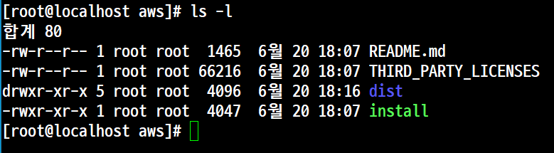
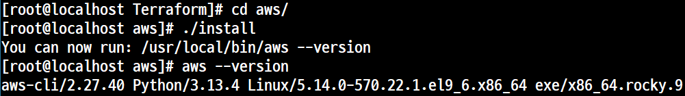
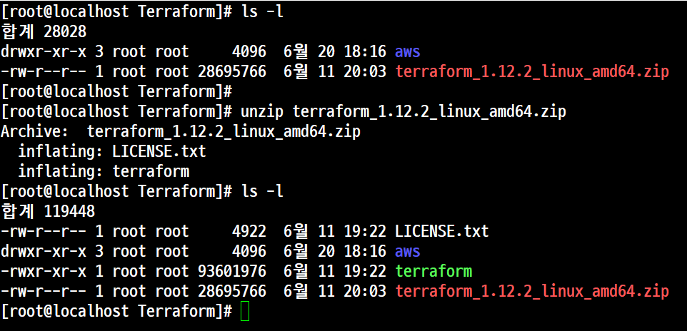
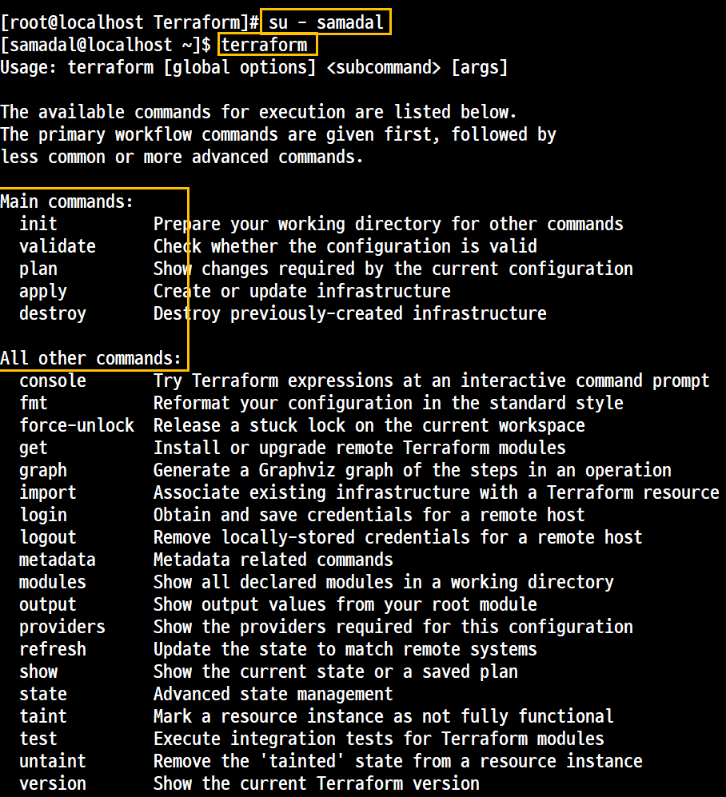
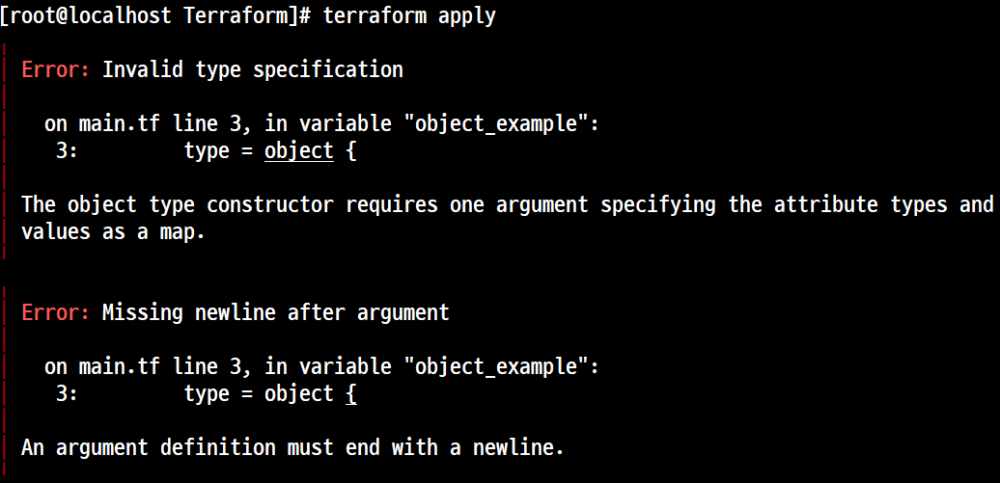
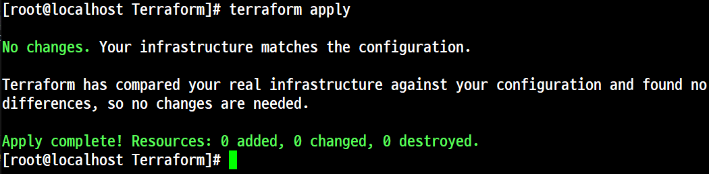
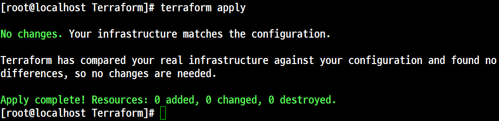
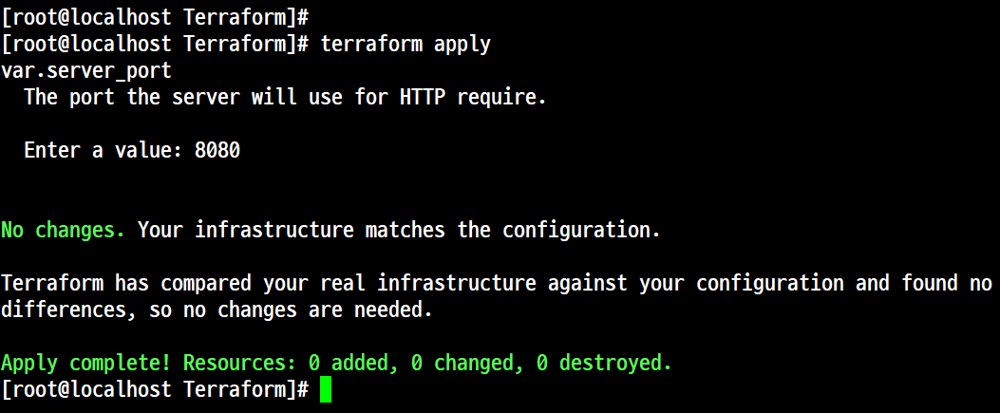
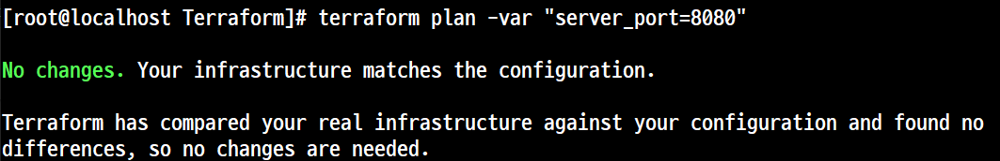
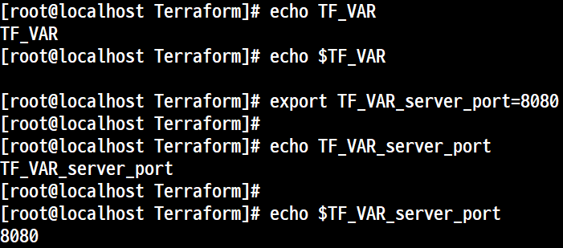

# 'Terraform'에서 구성 가능한 웹 서버 배포
## 기본 설정 구성

- 시스템 환경 설정
- AWS CLI 설치
```
curl "https://awscli.amazonaws.com/awscli-exe-linux-x86_64.zip" -o "awscliv2.zip"
```





- 'Terraform CLI' 다운로드

```
wget https://releases.hashicorp.com/terraform/1.12.2/terraform_1.12.2_linux_amd64.zip
```



- 'Terraform' 설치
    - 설치
    - 경로와 상관없이 어떤 곳에서도 명령 실행 가능하게 한다.
        - 시스템에서 기본적으로 실행파일이 있는 위치는 '/usr/bin/, /usr/sbin/'
        - 사용자에 의해서 설치된 패키지의 실행 파일 위치는 '/user/local/bin'이다.
    - 실행 파일 이동
    ```
    mv terraform /usr/local/bin
    ```
    - 설치 확인 및 테스트

    

## 구성 가능한 웹 서버 배포
- 변수(Variable)
    - 특징
        - 변수 선언의 본문에는 '3개의 매개 변수'가 포함될 수 있고 나머지는 '모두 선택적 매개 변수'이다.
        - 'Terraform'은 입력 변수를 정의하게 하기 때문에 코드가 중복되지 않고 구성을 관리하기도 쉽다.
    - 변수 선언
        - variable "NAME" {
                [CONFIG ...]
        }
    - '3개의 매개 변수' 사용 및 전달 방법
        - 'description (변수의 문서화)'
            - 변수 사용 방법을 문서화 하려면 이 매개변수를 사용한다.
            - 즉, 어떤 변수가 어떤 값을 가지고 어디에 어떻게 적용되는지 등을 설명을 통해 알아 볼 수 있도록 한다.
            - 만약 팀별로 프로젝트를 한다고 가정하면 팀원은 코드를 읽을 때뿐만 아니라 'plan' 또는 'apply' 등의 명령어를 실행할 때 이 설명을 볼 수가 있다.
        - 'type (변수)'
            - 'Type Constraint (유형 제약 조건)'으로 사용자가 전달하는 변수의 유형을 지정
            - 'string(문자열)', 'number(숫자)', 'bool(대수, true, false)', 'list(리스트)', 'map(맵)', 'set(집합)', 'object(객체)', 'tuple(튜플)' 등의 제약 조건이 있다.
            - 유형을 지정하지 않으면 'any' 로 간주한다. 
        - 'default (값)'
            - 변수에 값을 전달하는 방법으로 사용되는 변수이다.
            - 전달 방법
                - '명령 줄(--var 옵션 사용)'로 전달
                - '파일(-var~file 옵션 사용)'로 전달
                - '환경변수('Terrafrom'은 이름이 'TF_VAR_<variable_name>'인 환경변수를 찾는다)'를 변수에 값을 전달
                - 만약 값이 전달되지 않으면 기본값이 전달된다. 
                - 기본값이 없으면 'Terraform'은 대화식으로 사용자에게 변수에 대한 정보를 묻는다.
        - 변수 사용 예
            - 전달할 값이 'number(숫자)'인지 확인
            ```
            variable "number_example" {
                description = "An example of a number variable in Terraform."
                type = number
                default = 42
            }
            ```

            - 전달할 값이 'list(리스트)'인지 확인
            ```
            variable "list_example" {
                description = "An example of a number variable in Terraform."
                type = list
                default = ["a", "b", "c"]
            }
            ```

            - 제약조건도 결합해서 사용 할 수가 있다.
            ```
            variable "list_numeric_example" {
                description = "An example of a numeric list in Terraform."
                type = list(number)
                default = [1,2,3]
            }
            ```

            - 모든 값이 'string(문자열)'인 'map'인 예
            ```
            variable "list_example" {
                description = "An example of a map in Terraform."
                type = map(string)
                default = {
                        key1 = "value1"
                        key2 = "value2"
                        key3 = "value3"
                }
            }
            ```

## 실습 1. 'object', 또는 'tuple' 제약 조건을 사용할 때 복잡한 구조적 유형을 작성

### 개요

- 입력 변수가 'name, age, tags, enabled'로 구성되어 있는 'object'를 지정하는 소스
- 이 변수에 유형이 일치하지 않는 값을 설정하려고 하면 유형 오류가 출력된다.
```
variable "object_example" {
        description = "An example of a structural type in Terraform."
        type = object {
            name = string
            age = number
            tags = list(string)
            enabled = bool
        }
        default = {
            name = "value1"
            age = 1501
            tags = ["a", "b", "c"]
            enabled = true
        }
}
```
#### 실행 1. 'type = object {...}' 오류




#### 수정 1. 'type = object({...})' 소괄호 집어 넣기
```
variable "object_example" {
        description = "An example of a structural type in Terraform."
        type = object({
            name = string
            age = number
            tags = list(string)
            enabled = bool
        })
        default = {
            name = "value1"
            age = 1501
            tags = ["a", "b", "c"]
            enabled = true
        }
}
```
#### 실행 2. 오류가 발생하지 않는다.


#### 결과 확인
- 소스에 오류가 없기 때문에 즉, 이 소스는 변수에 대한 설정만 되어 있고 '출력'에 대한 내용은 없기 때문에 아무런 내용도 출력되지 않는다.

#### 수정 2.
- 'Terraform'dptj 'type'은 일반적ㅇ니 의미인 '유형'만을 말하는 것이 아니라 '유형과 변수'를 함께 선언한 것이다.
- 따라서 '변수'를 선언했을 때는 반드시 값도 있어야 한다.

```
variable "object_example" {
        description = "An example of a structural type in Terraform."
        type = object({
            name = string
            age = number
            tags = list(string)
            enabled = bool
        })
        default = {
            name = "value1"
            # age = 1501  ------------ 수정
            tags = ["a", "b", "c"]
            enabled = true
        }
}
```

#### 실행 3. 

#### 수정 3. 'C/C++'에서의 구조체는 '선언한 순서'가 매우 중요하지만 'Terraform'에서는 '순서(위치)'와 상관없이 '그냥 있기만 하면' 자동으로 인식한다.

```
variable "object_example" {
        description = "An example of a structural type in Terraform."
        type = object({
            name = string
            age = number
            tags = list(string)
            enabled = bool
        })
        default = {
            name = "value1"
            enabled = true -----------------
            tags = ["a", "b", "c"]         ㅣ 순서 변경
            age = 1501 ---------------------
        }
}
```
#### 실행 4. 정상


## 실습 2. 'enabled' 에 'Boolean'이 아닌 '문자열(invalid)'을 설정하면 오류가 발생한다.

```
variable "object_example_with_error" {
        description = "An example of a structural type in Terraform with an error."
        type = object({
            name = string
            age = number
            tags = list(string)
            enabled = bool
        })
        default = {
            name = "value2"
            age = 1501
            tags = ["a", "b", "c"]
            enabled = "invalid"
        }
}
```
## 실습 3. 기본값이 없으면 사용자에게 변수에 대한 값을 묻는다.

- 소스(main.03_tf)
```
variable "object_example" {
        description = "An example of a structural type in Terraform."
        type = object({
            name = string
            age = number
            tags = list(string)
            enabled = bool
        })
        default = {
            name = "value1"
            age = 1501
            tags = ["a", "b", "c"]
            enabled = true
        }
}
variable "server_port" {
        description = "The port the server will use for HTTP require."
        type = number
}
```
- 실행 1. '*.tf' 파일은 모두 자동으로 인식하기 때문에 오류가 발생한다.



## 실습 4. 대화식으로 명령어를 처리하지 않으려면 명령 줄의 '-var'옵션으로 변수값을 제공한다.



## 실습 5. 환경변수
- 개요
    - 'TF_VAR_<name>' 이라는 환경 변수를 통해 변수를 설정할 수도 있다.
    - 여기서 '<name>'은 설정하려는 변수의 이름이다.
    

## 실습 6. 'Terraform' 코드에서 입력 변수의 값을 사용하려면 '변수 참조(Variable Reference)'라는 새로운 유형의 표현식을 사용한다.

- 개요
    - 'Terraform' 코드에서 입력 변수의 값을 사용하려면 '변수 참조'라는 새로운 유형의 표현식을 사용한다.
    - 이 소스는 '보안 그룹'의 'from_port' 및 'to_port' 라는 매개 변수를 'server_port'라는 변수의 값으로 설정하는 방법을 표현한 것이다.
- 표현식
    - var.<VARIABLE_NAME>
- 코드

    resource "aws_security_group" "instance" {
            name = "terraform-example-instance"
            ingress {
                from_port = var.server_port
                to_port = var.server_port
                cidr_blocks = ["0.0.0.0/0"]
            }
    }

- 주의할 사항 (권장 사함)
    - 내용 1. 사용자 데이터 스크립터에 스드를 설정할 때도 동일한 변수를 사용하는 것이 좋다.
        - '문자열 리터럴(Literal, 변수에 넣는 값이 변하지 않는 데이터, '상수'와 유사)' 내에서 참조를 사용하려면 '보간(Interpolation)'이라는 새로운 유형의 표현식을 사용한다.
        - 'PHP'에서 변수를 표현하는 것과 매우 유사하다.
        - '중괄호' 안에 참조를 넣을 수 있으며 'Terraform'은 이를 문자열로 변환한다.
        - 표현식
            - "${...}"
        - 코드(사용자 데이터 문자열 내에서 'var.server_port'를 사용)
        ```
        user_data = <<-EOF
                #!/bin/bash
                echo "Hello World!" > index.html
                nohup busybox httpd -f -p ${var.server_port} &
                EOF
        ```

    - 내용 2. 'Terraform' 에서는 '입력 변수'뿐만 아니라 '출력 변수'도 정의할 수가 있다.

        - '<NAME>'은 출력 변수의 이름이며 'VALUE'는 출력하려는 'Terraform' 표현식이다.

        ```
        outpu "<NAME>" {
            value = <VALUE>
            [CONFIG ...]
        }
        ```
        - 'CONFIG'는 다음의 2가지의 선택적 매개 변수를 추가로 포함할 수 있다.
            - 'description'
                - 출력 변수에 어떤 유형의 데이터가 포함되어 있는지 알려준다.
            - 'sensitive'
                - 'terraform apply'의 실행이 끝날 때 출력을 기록하지 않도록 'Terraform'에 지시하려면 'sensitive' 매개 변수를 'true'로 설정하면 된다.
            
        - 서버의 IP주소를 찾기 위해 'EC2 Console'을 수동으로 조회하는 대신IP주소를 출력 변수로 제공할 수 있다.
        - 이 코드는 속성 참조를 다시 사용하는데 'aws_instance' 리소스의 'public_ip' 속성을 참조

        ```
         output "public_ip" {
                value = aws_instance.example.public_ip
                description = "The public IP address of the wbe Server"
         }
        ```
    - 내용 3. 새로운 결과값 출력
        - 'apply' 명령을 다시 실행하면 'Terraform'은 변경 사항을 적용하지는 않지만(리소스를 변경하지 않았기 때문에) 맨 끝에 새로운 결과 값을 출력한다.

        - 'apply' 명령을 실행하면 '콘솔(터미널창)'에 '출력 변수'가 표시된다.

        ```
        

        terraform output
        ```


