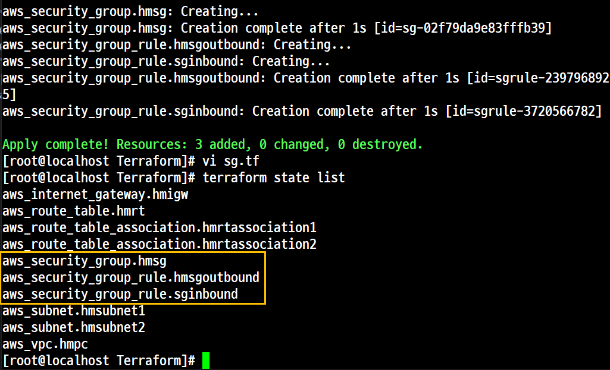
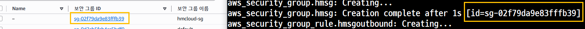
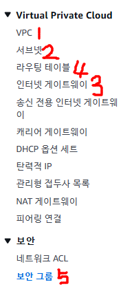
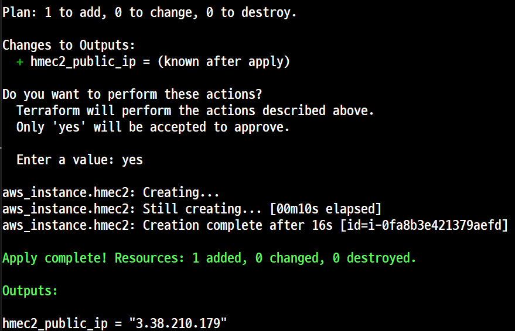
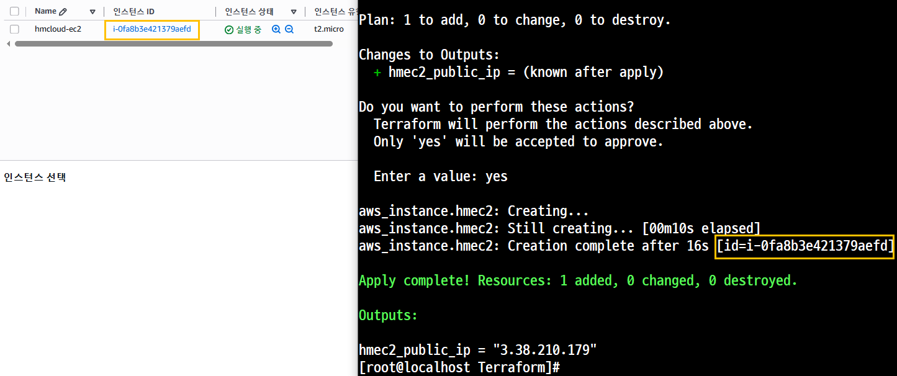
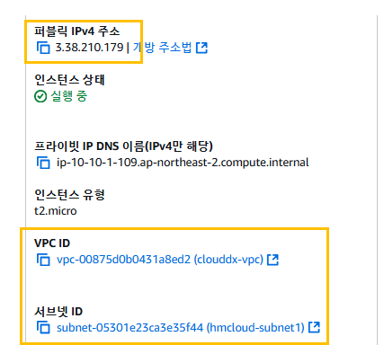

# 실습 2. 'Security Group(보안그룹)' 배포

## Step 1. 'Security Group(보안그룹)' 파일 생성 (sg.tf)
## Step 2. 명령 실행
## Step 3. 확인

```
resource "aws_security_group" "hmsg" {
        vpc_id          = aws_vpc.hmpc.id
        name            = "hmcloud-sg"
        description     = "hmcloud-sg"
}

resource "aws_security_group_rule" "sginbound" {
        type                    = "ingress"
        from_port               = 0
        to_port                 = 80
        protocol                = "tcp"
        cidr_blocks             = ["0.0.0.0/0"]
        security_group_id       = aws_security_group.hmsg.id
}

resource "aws_security_group_rule" "hmsgoutbound" {
        type                    = "egress"
        from_port               = 0
        to_port                 = 0
        protocol                = "-1"
        cidr_blocks             = ["0.0.0.0/0"]
        security_group_id       = aws_security_group.hmsg.id
}
```






미리 네트워크 설정 후

다음으로는 ec2생성

# 실습 3. 'EC2' 배포 (with Amazon Linux)
## Step 1. 'EC2' 파일 생성 (ec2.tf)
## Step 2. 명령 실행
## Step 3. 확인

```
data "aws_ami" "hm_amazonlinux2" {
  most_recent = true

  filter {
    name   = "owner-alias"
    values = ["amazon"]
  }

  filter {
    name   = "name"
    values = ["amzn2-ami-hvm-*-x86_64-ebs"]
  }

  owners = ["amazon"]
}

resource "aws_instance" "hmec2" {
  depends_on                   = [aws_internet_gateway.hmigw]
  ami                          = data.aws_ami.hm_amazonlinux2.id
  associate_public_ip_address  = true
  instance_type                = "t2.micro"
  vpc_security_group_ids       = [aws_security_group.hmsg.id]
  subnet_id                    = aws_subnet.hmsubnet1.id

  user_data = <<-EOF
    #!/bin/bash
    wget https://busybox.net/downloads/binaries/1.31.0-defconfig-multiarch-musl/busybox-x86_64
    mv busybox-x86_64 busybox
    chmod +x busybox
    RZAZ=$(curl http://169.254.169.254/latest/meta-data/placement/availability-zone-id)
    IID=$(curl 169.254.169.254/latest/meta-data/instance-id)
    LIP=$(curl 169.254.169.254/latest/meta-data/local-ipv4)
    echo "<h1>RegionAz($RZAZ) : Instance ID($IID) : Private IP($LIP) : Web Server</h1>" > index.html
    nohup ./busybox httpd -f -p 80 &
  EOF

  user_data_replace_on_change = true

  tags = {
    Name = "hmcloud-ec2"
  }
}

output "hmec2_public_ip" {
  value       = aws_instance.hmec2.public_ip
  description = "The public IP of the Instance"
}

```





