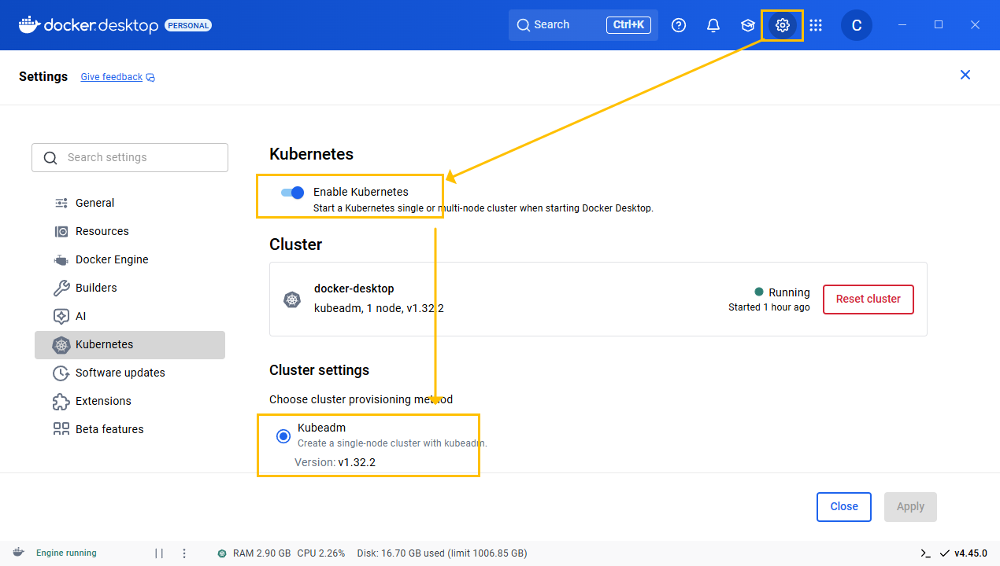
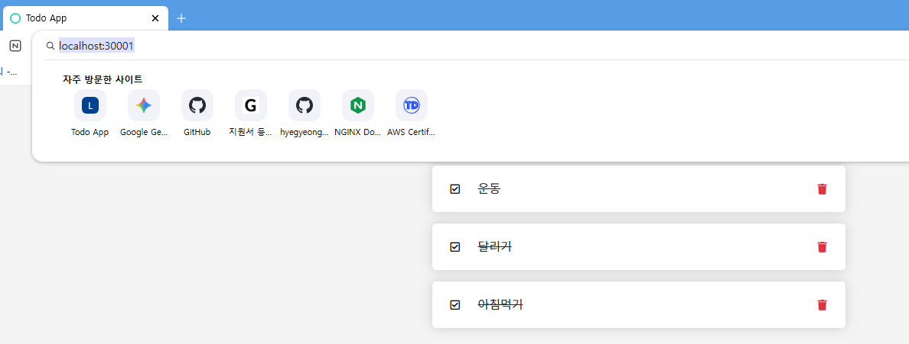
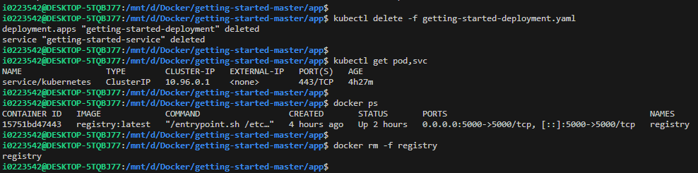

# Docker Desktop과 Kubernetes를 이용한 로컬 앱 배포 가이드

이 문서는 Docker Desktop에 내장된 Kubernetes 환경을 사용하여, Node.js 애플리케이션을 컨테이너화하고 배포하는 전체 과정을 안내합니다.

---

## 1부: 사전 준비

### 1.1. Docker Desktop에서 Kubernetes 활성화

먼저 Docker Desktop 설정에서 Kubernetes를 활성화해야 합니다.

- **Settings > Kubernetes > Enable Kubernetes** 항목을 체크합니다.



### 1.2. 실습 파일 준비

가이드에서 사용할 예제 애플리케이션 소스 파일을 준비합니다.

1.  `C:\Users\i0223\Desktop\TIL\source\2\getting-started-master.zip` 압축 파일을 해제합니다.
2.  터미널 또는 VS Code에서 압축 해제한 폴더의 `app` 디렉토리로 이동합니다. 이후 모든 명령어는 이 `app` 디렉토리에서 실행합니다.

---

## 2부: Docker 이미지 빌드 및 로컬 레지스트리 배포

애플리케이션을 Kubernetes에 배포하려면 먼저 Docker 이미지로 만들어야 합니다.

### 2.1. Dockerfile 분석

`app` 디렉토리 안에 있는 `Dockerfile`은 다음과 같습니다. 이 파일은 Docker 이미지를 만드는 설계도 역할을 합니다.

```dockerfile
# 베이스 이미지: Node.js LTS 버전이 설치된 가벼운 Alpine Linux
FROM node:lts-alpine

# yarn install 시 필요한 패키지 설치
RUN apk add --no-cache python3 g++ make

# 작업 디렉토리 설정
WORKDIR /app

# 현재 디렉토리의 모든 파일을 컨테이너의 /app 디렉토리로 복사
COPY . .

# 의존성 설치
RUN yarn install --production

# 컨테이너 실행 시 실행될 명령어
CMD ["node", "/app/src/index.js"]
```

### 2.2. 로컬 Docker Registry 실행

Kubernetes가 이미지를 가져갈 수 있도록, 이미지를 저장할 레지스트리가 필요합니다. 여기서는 PC에 로컬 레지스트리를 컨테이너로 실행합니다.

```bash
# registry 이미지를 받아 5000번 포트로 컨테이너 실행
docker run -d -p 5000:5000 --restart always --name registry registry:latest
```
*이 단계는 한 번만 실행하면 됩니다. PC를 재부팅해도 registry 컨테이너는 자동으로 다시 시작됩니다.*

### 2.3. 이미지 빌드, 태그, 푸시

이제 `Dockerfile`을 이용해 이미지를 빌드하고, 로컬 레지스트리에 저장(push)합니다.

```bash
# 1. 현재 디렉토리의 Dockerfile로 'getting-started'라는 이름의 이미지 빌드
docker build -t getting-started .

# 2. 로컬 레지스트리(localhost:5000)에 푸시하기 위해 이미지 이름 변경 (태그)
docker tag getting-started localhost:5000/getting-started

# 3. 로컬 레지스트리에 이미지 푸시
docker push localhost:5000/getting-started
```

---

## 3부: Kubernetes에 애플리케이션 배포

이제 이미지가 준비되었으니 Kubernetes에 배포할 차례입니다.

### 3.1. 배포 YAML 파일 분석

`getting-started-deployment.yaml` 파일은 Kubernetes에 "어떻게 배포할지"를 정의합니다. 파일은 `Deployment`와 `Service` 두 부분으로 나뉩니다.

```yaml
# --- Deployment: 파드를 관리하고 앱을 실행 ---
apiVersion: apps/v1
kind: Deployment
metadata:
  name: getting-started-deployment
spec:
  replicas: 1 # 동일한 파드를 1개 유지
  selector:
    matchLabels:
      app: getting-started # 이 라벨을 가진 파드를 찾아서 관리
  template:
    metadata:
      labels:
        app: getting-started # 파드에 붙이는 라벨
    spec:
      containers:
        - name: getting-started
          # 2부에서 로컬 레지스트리에 푸시한 이미지를 사용
          image: localhost:5000/getting-started
          ports:
            - containerPort: 3000 # 앱이 3000번 포트를 사용한다고 명시

---
# --- Service: 외부에서 파드에 접근할 수 있도록 통로를 열어줌 ---
apiVersion: v1
kind: Service
metadata:
  name: getting-started-service
spec:
  selector:
    app: getting-started # 'app: getting-started' 라벨이 붙은 파드에만 트래픽 전달
  ports:
    - protocol: TCP
      port: 3000       # 서비스 자체의 포트
      targetPort: 3000 # 파드 내부의 포트
      nodePort: 30001  # PC(노드)의 30001번 포트를 열어서 서비스에 연결
  type: NodePort # 서비스를 외부로 노출하는 방식
```

### 3.2. 애플리케이션 배포 및 확인

작성된 YAML 파일을 `kubectl` 명령어로 Kubernetes 클러스터에 적용합니다.

```bash
# 1. YAML 파일 적용하여 배포
kubectl apply -f getting-started-deployment.yaml

# 2. 배포된 파드(pod)와 서비스(svc) 상태 확인
kubectl get pod,svc
```



`STATUS`가 `Running`이고 `READY`가 `1/1`이면 정상적으로 배포된 것입니다.

---

## 4부: 접속 및 트러블슈팅

### 4.1. NodePort로 접속하기

웹 브라우저에서 아래 주소로 접속합니다.
> **http://localhost:30001**

`nodePort`로 지정한 `30001` 포트를 통해 앱에 접근할 수 있습니다.

### 4.2. 접속 문제 해결

만약 `localhost:30001` 접속이 안 된다면, 이전 실습에서 겪었던 Docker Desktop의 네트워크 문제일 수 있습니다.

1.  **진단:** `kubectl port-forward` 명령어로 파드에 직접 접속을 시도합니다.
    ```bash
    kubectl port-forward deployment/getting-started-deployment 3000:3000
    ```
    이후 `http://localhost:3000` 접속이 잘 된다면, 앱과 파드는 정상이지만 Docker Desktop의 `NodePort` 연결에 문제가 있는 것입니다.

2.  **해결:** **Docker Desktop을 완전히 종료했다가 다시 시작**하면 대부분 해결됩니다.

---

## 5부: 리소스 정리 (실습 종료 후)

실습이 끝난 후에는 다음 명령어로 관련 리소스를 깨끗하게 삭제할 수 있습니다.

### 5.1. Kubernetes 리소스 삭제




```bash
# YAML 파일에 정의된 모든 리소스(Deployment, Service) 삭제
kubectl delete -f getting-started-deployment.yaml
```

### 5.2. Docker 리소스 삭제

```bash
# 로컬 레지스트리 컨테이너 중지 및 삭제
docker rm -f registry

# 실습에 사용된 도커 이미지 삭제
# docker images 명령어로 이미지 ID 확인 후 삭제
docker rmi localhost:5000/getting-started
docker rmi getting-started
docker rmi registry
```
