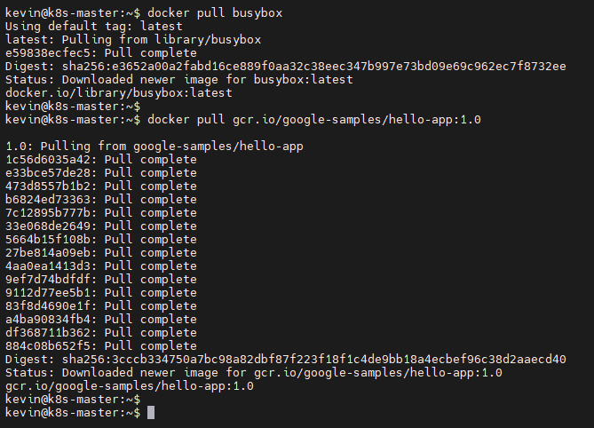

# docker 컨테이너 서비스를 위한 image

- docker image는 Container runtime에 필요한 바이너리, 라이브러리 및 설정 값 등을 포함하고, 변경되는 상태 값을 보유하지 않고(stateless) 변하지 않는다. (Immutable, RO)
- 일반적인 컨테이너 애플리케이션 서비스 개발 과정 이해를 통해 image에 대해 이해

# 이미지 내려받기

- Docker는 hub.docker.com(docker.io)으로부터 이미지를 제공 받거나 제공한다.
- 또는, 기업의 인프라에 개별적인 Private registry 서버를 두고, 이곳에 이미지를 pull/push 하기도 한다. 

# 이미지 구조 확인
- docker images inspect: 생성된 image의 내부 구조 정보를 JSON 형태로 제공

# 이미지 구조 확인

- 아래 그림과 같은 형태로 이미지는 불변 즉, read only 형태로 만들어지고
- docker run 명령으로 컨테이너 생성하면서 [Container layer]가 read write로 추가된다.
- 하나의 이미지는 원하는 만큼의 컨테이너를 생성할 수 있다. 

# 이미지 올리기 (push)
- 
