# Windows에 WSL2, Ubuntu, Docker 개발 환경 구축 가이드

이 문서는 Windows 11 환경에서 WSL2(Windows Subsystem for Linux 2)를 기반으로 Ubuntu와 Docker를 설치하여 개발 환경을 구축하는 과정을 안내합니다.

---

### ✅ 시작 전 중요: 보안 안내

**절대로 아이디, 비밀번호와 같은 민감한 개인정보를 파일에 직접 저장하지 마세요.**

포트폴리오나 공개된 저장소(GitHub 등)에 올릴 경우, 개인정보가 그대로 노출되어 보안 사고로 이어질 수 있습니다. 비밀번호 관리는 `1Password`, `Bitwarden`과 같은 전문적인 비밀번호 관리 도구를 사용하는 것을 강력히 권장합니다.

---

## 1단계: WSL 및 가상 머신 플랫폼 활성화

WSL을 사용하려면 먼저 Windows의 관련 기능을 활성화해야 합니다. 명령어 방식과 GUI 방식 중 하나를 선택하여 진행하세요.

### 방법 1: PowerShell 명령어 사용 (권장)

Windows PowerShell을 **관리자 권한**으로 실행한 후, 다음 두 명령어를 차례대로 입력합니다.

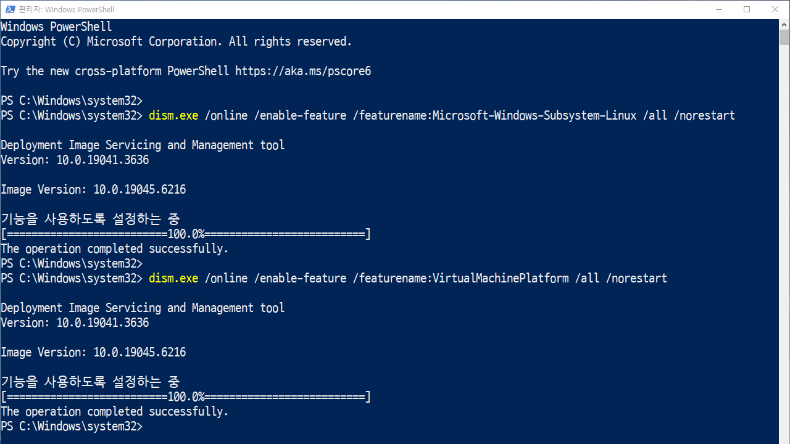

1.  **WSL 기능 활성화:**
    ```powershell
    dism.exe /online /enable-feature /featurename:Microsoft-Windows-Subsystem-Linux /all /norestart
    ```

2.  **가상 머신 플랫폼(가상화) 기능 활성화:**
    ```powershell
    dism.exe /online /enable-feature /featurename:VirtualMachinePlatform /all /norestart
    ```

*   `dism.exe`: Windows 이미지 서비스 및 관리 도구로, Windows 기능을 켜고 끄는 데 사용됩니다.
*   `/online`: 현재 실행 중인 운영체제에 적용합니다.
*   `/enable-feature`: 지정된 기능을 활성화합니다.
*   `/all`: 기능에 필요한 모든 상위 기능을 함께 활성화합니다.
*   `/norestart`: 작업 후 자동으로 재시작하지 않습니다. 모든 설정이 끝난 후 수동으로 재시작하는 것이 좋습니다.

### 방법 2: GUI (Windows 기능 켜기/끄기) 사용

1.  `Win + R` 키를 눌러 실행창을 열고 `optionalfeatures.exe`를 입력하여 'Windows 기능 켜기/끄기'를 엽니다.
2.  목록에서 다음 두 항목을 찾아 체크합니다.
    *   `Linux용 Windows 하위 시스템`
    *   `가상 머신 플랫폼`
    
    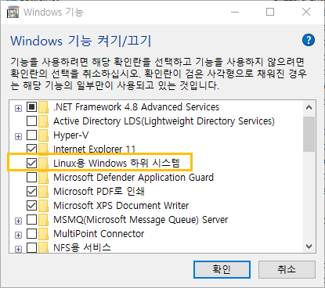
    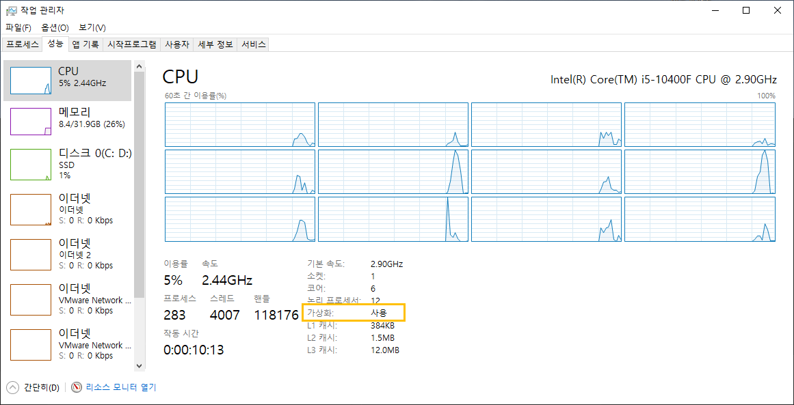
    
3.  `확인`을 누르고 시스템을 재시작합니다.

---

## 2단계: WSL2를 기본 버전으로 설정

최신 Linux 커널을 사용하는 WSL2는 성능이 더 뛰어납니다. 다음 명령어를 통해 WSL의 기본 버전을 2로 설정합니다. 이 과정에서 커널 업데이트가 필요하다는 메시지가 나타나면, 메시지의 링크를 통해 커널 업데이트 패키지를 다운로드하여 설치하세요.

```powershell
wsl --set-default-version 2
```

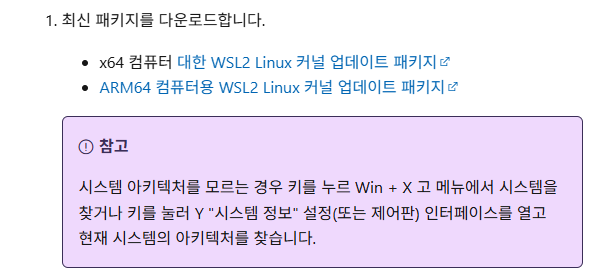

**설정 후 컴퓨터를 재부팅해주세요.**

---

## 3단계: Ubuntu 설치 및 설정

1.  **Microsoft Store**를 열고 `Ubuntu 24.04 LTS` (또는 원하는 버전)를 검색하여 설치합니다.
    
    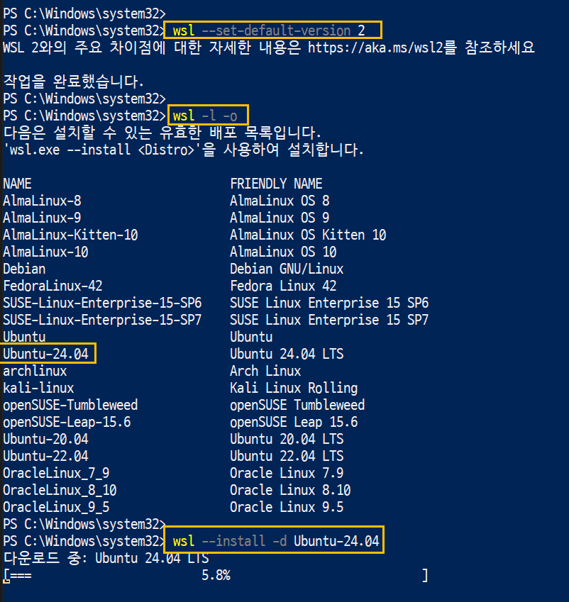
    
2.  설치가 완료되면 Ubuntu를 실행합니다. 최초 실행 시, 터미널 환경에서 사용할 **사용자 이름(Username)**과 **비밀번호(Password)**를 설정하게 됩니다.
    *   **주의:** 여기서 설정하는 계정은 Windows 계정과 별개인 Ubuntu 전용 계정입니다.
    
    

---

## 4단계: Docker Desktop 설치 및 WSL2 연동

1.  [Docker 공식 홈페이지](https://www.docker.com/products/docker-desktop/)에서 **Docker Desktop for Windows**를 다운로드하여 설치합니다.
2.  설치 과정에서 "Use WSL 2 instead of Hyper-V (recommended)" 옵션이 선택되어 있는지 확인합니다.
3.  설치 완료 후 Docker Desktop을 실행합니다.
4.  **Settings > General** 메뉴에서 "Use the WSL 2 based engine"이 체크되어 있는지 확인합니다.
5.  **Settings > Resources > WSL Integration** 메뉴에서, Docker를 사용할 Ubuntu 배포판(예: `Ubuntu-24.04`)이 활성화되어 있는지 확인합니다.

    
    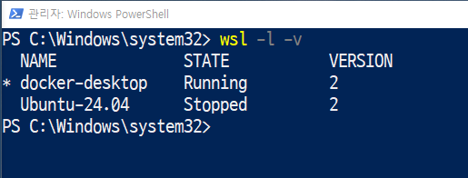

---

## 5단계: 개발 환경 연동 (VS Code)

VS Code를 사용하면 Windows에서 WSL 환경에 직접 연결하여 코드를 작성하고 디버깅할 수 있어 매우 편리합니다.

1.  [Visual Studio Code](https://code.visualstudio.com/)를 설치합니다.
2.  VS Code의 **확장(Extensions)** 탭에서 다음 두 가지를 검색하여 설치합니다.
    *   `WSL`: 원격 WSL에 연결하고 개발할 수 있게 해줍니다.
    *   `Docker`: 컨테이너와 이미지를 관리하는 UI를 제공합니다.
    
    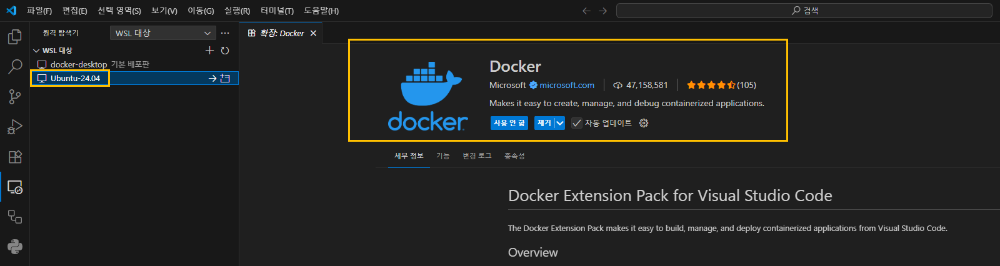

---

## 6단계: 설치 확인 및 기본 명령어

모든 설치가 완료되었는지 확인하고, 자주 사용하는 몇 가지 명령어를 알아봅니다.

### WSL 확인

PowerShell에서 다음 명령어를 실행하여 설치된 Linux 배포판 목록과 WSL 버전을 확인합니다.

```powershell
# 설치된 배포판 목록과 상태, WSL 버전 확인
wsl -l -v
# NAME            STATE           VERSION
# * Ubuntu-24.04    Running         2

# 기본 WSL 배포판을 Ubuntu로 설정 (여러 개 설치된 경우)
wsl --set-default Ubuntu-24.04
```

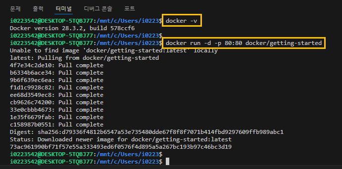
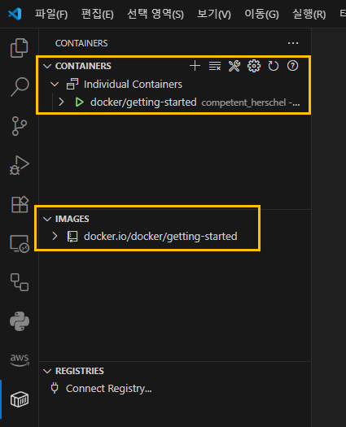
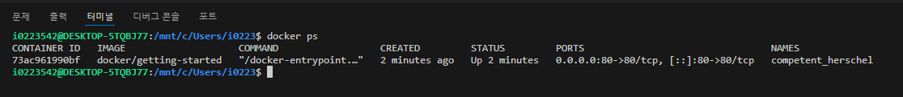

### Docker 확인

Ubuntu 터미널(또는 VS Code의 WSL 터미널)에서 다음 명령어를 실행합니다.

```bash
# Docker 버전 확인
docker --version

# 실행 중인 컨테이너 목록 확인
docker ps

# 모든 컨테이너(중지된 것 포함) 목록 확인
docker ps -a

# 특정 컨테이너 중지
docker stop [컨테이너_ID_또는_이름]

# 특정 컨테이너 삭제
docker rm [컨테이너_ID_또는_이름]
```

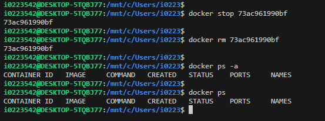

이제 Windows에서 WSL2와 Docker를 사용한 효율적인 개발 환경 구축이 완료되었습니다.
