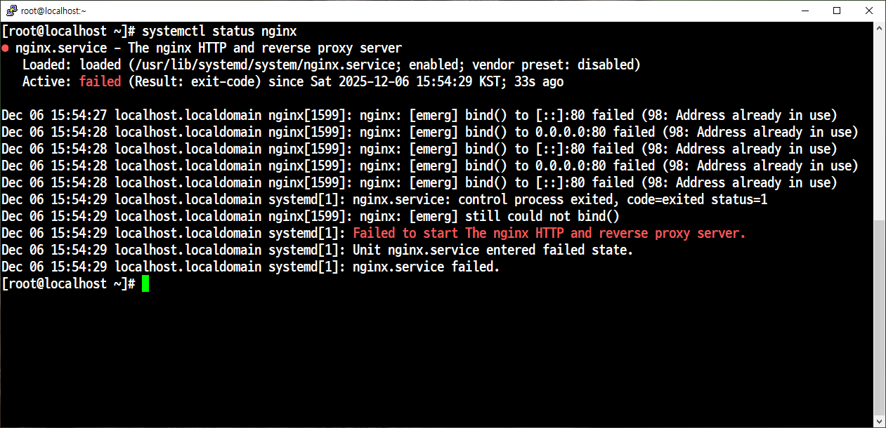
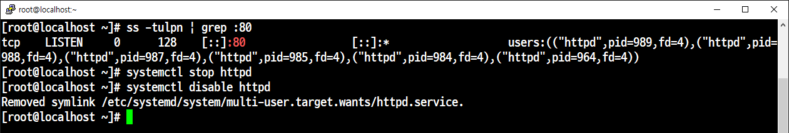
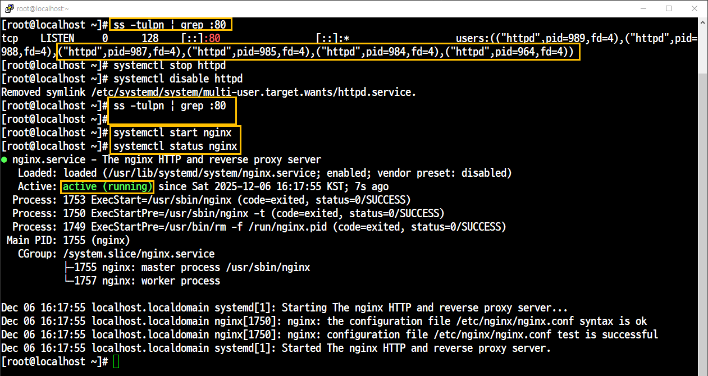

# systemctl start nginx 실행 시 실패



## 현상

### 에러 로그: bind() to 0.0.0.0:80 failed (98: Address already in use) 확인.
---
## 원인 분석


```
ss -tulpn | grep :80
```
으로 80번 포트 확인 

## 조치

### 기본 점유 서비스 중지 및 자동 실행 해제
```
systemctl stop httpd
systemctl disable httpd
```

## 결과

### Nginx 서비스 정상 구동 성공
### 상태확인: Active: active (running)