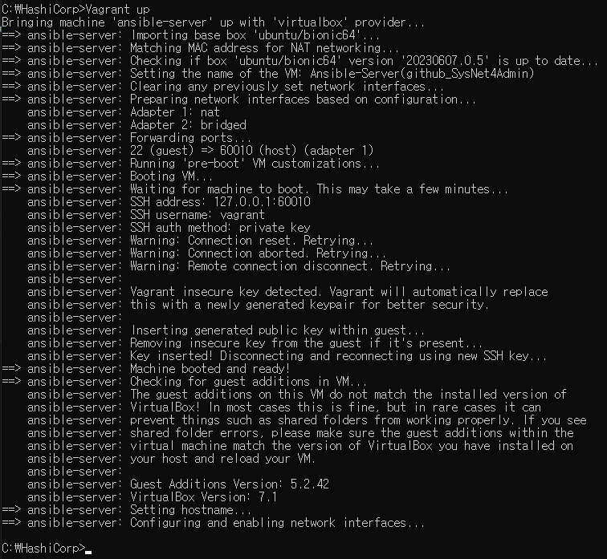
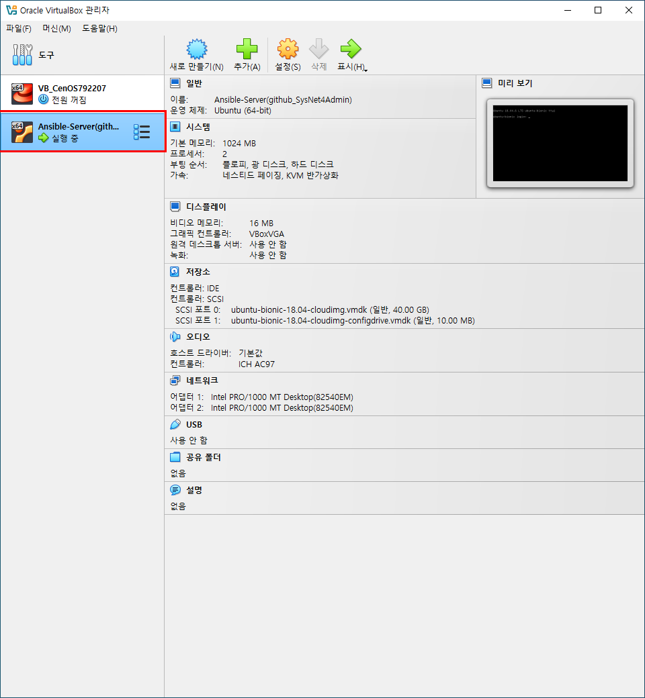
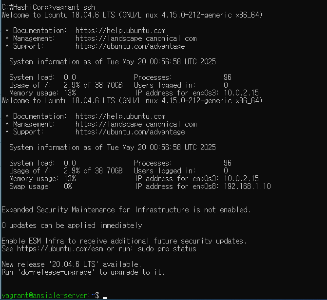
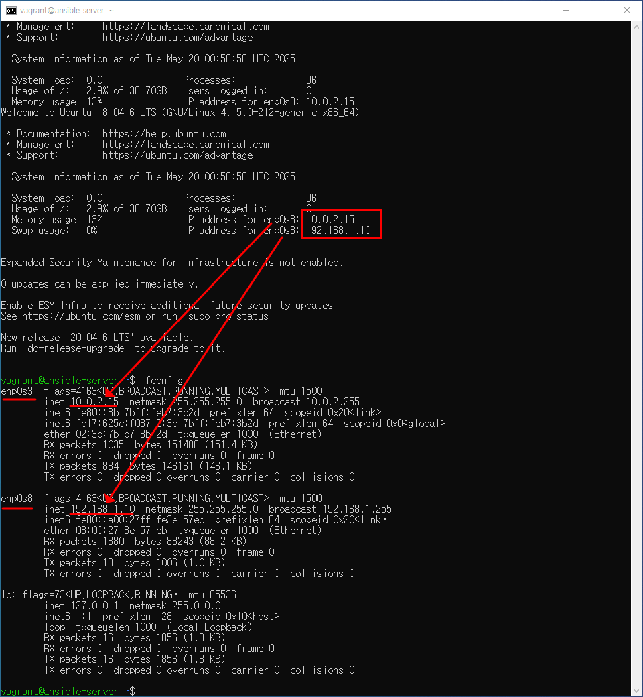

# vagrant를 이용한 Ansible 서버 관리 자동화

## 서버 환경 파일

>https://notepad-plus-plus.org/downloads/

### 서버 환경 구성 2. 

#### 코드 입력
```
Vagrant.configure("2") do |config|
  config.vm.define "ansible-server" do |cfg|
    cfg.vm.box = "ubuntu/bionic64"  
      cfg.vm.provider "virtualbox" do |vb|
         vb.name = "Ansible-Server(github_SysNet4Admin)"  
      end
      cfg.vm.host_name = "ansible-server"  
      cfg.vm.network "public_network", ip: "192.168.1.10"
      cfg.vm.network "forwarded_port", guest: 22, host: 60010, auto_correct: true, id: "ssh"
      cfg.vm.synced_folder "../data", "/vagrant", disabled: true
    end
  end
```

위의 코드가 안될 시
```
Vagrant.configure("2") do |config|
  config.vm.box = "ubuntu/bionic64"
  config.vm.box_version = "20230607.0.5"
end
```
#### 코드 실행









#### 삭제

vagrant destroy

