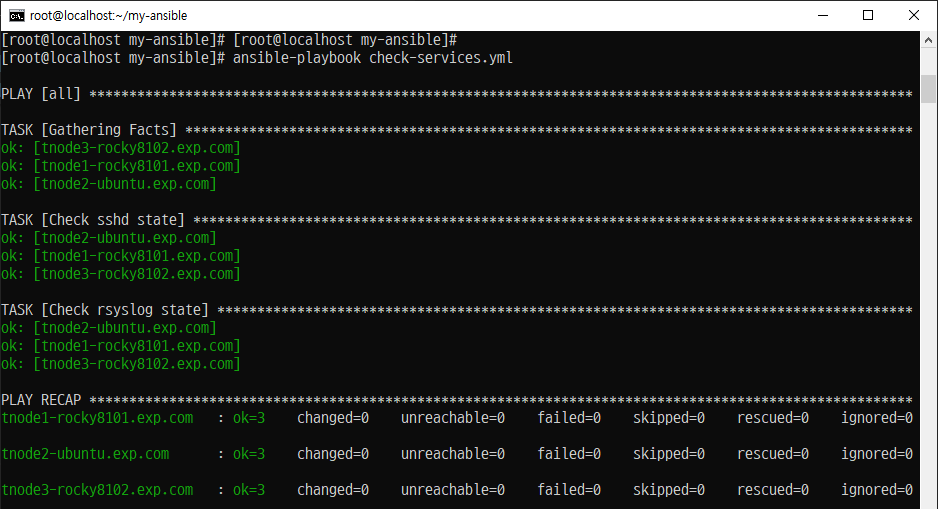
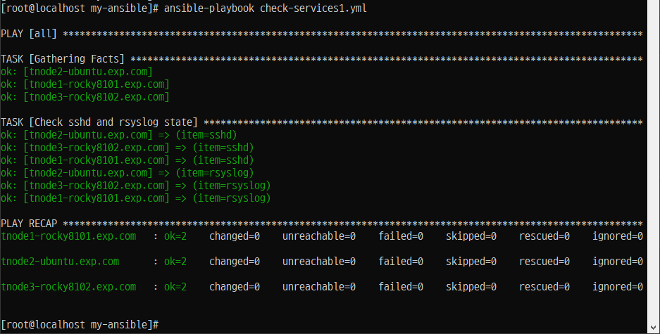
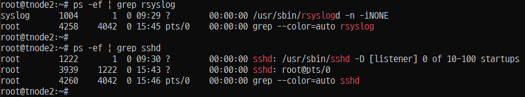
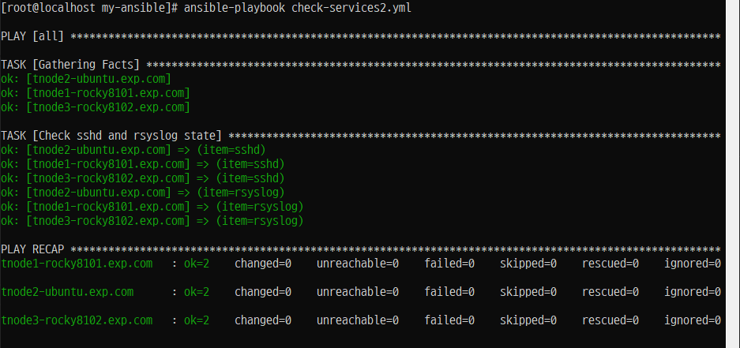
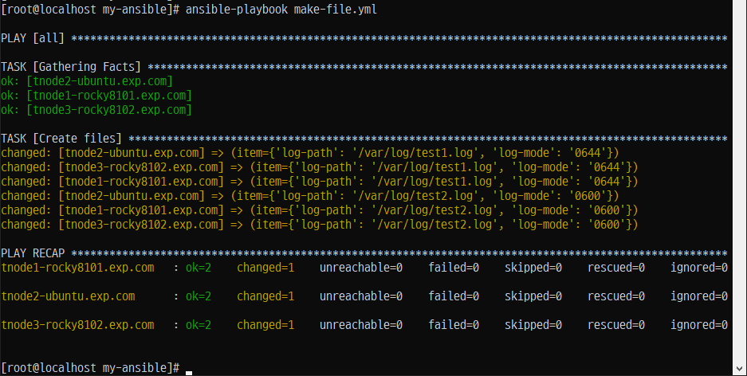
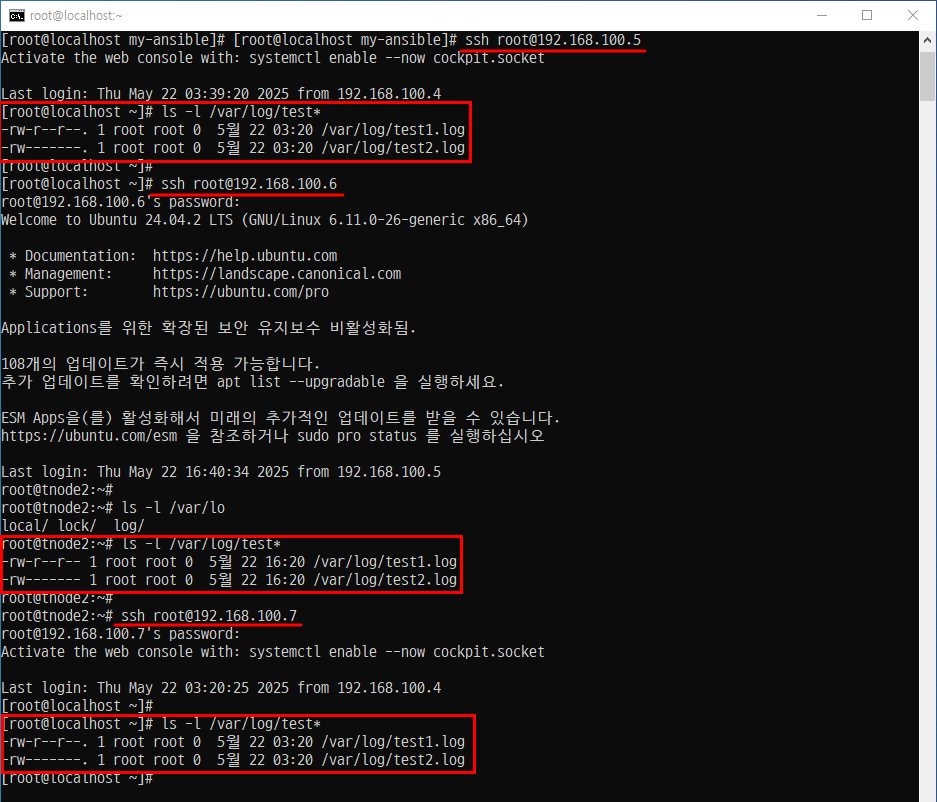
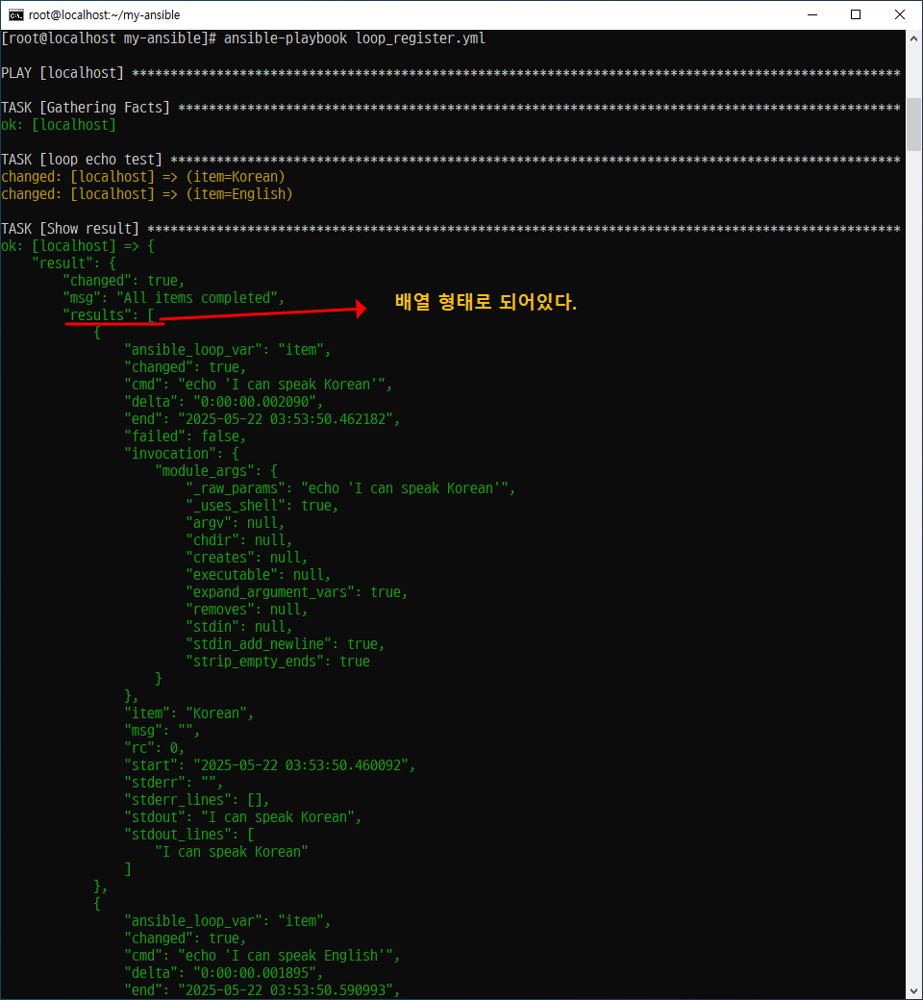
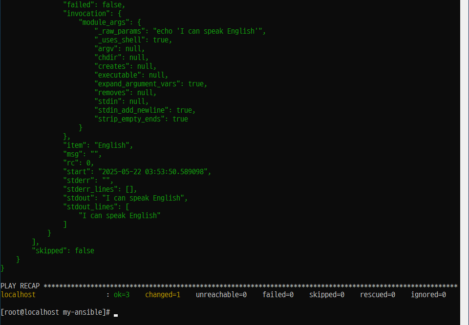
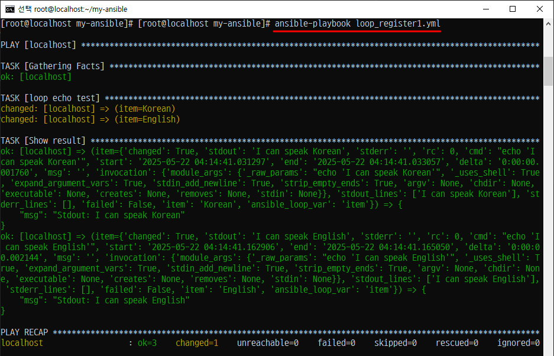

# Ansible 반복문

## 단순 반복문

### 개요
- 특정 항목에 대한 작업을 반복한다.
- 'loop' 키워드를 작업에 추가하면 작업을 반복해야 하는 항목의 목록을 값으로 사용할 수 있다.
- 해당하는 값을 사용하려면 'item' 변수(매개변수)를 이용한다.


### Step 1. 'sshd 서비스'와 'rsyslog  서비스'의 상태 체크를 'ansible.builtin.service' 모듈을 이용한 파일 생성
#### /root/my-ansible/check-services.yml
```
---

- hosts: all
  tasks:
    - name: Check sshd state
      ansible.builtin.service:
        name: sshd
        state: started


    - name: Check rsyslog state
      ansible.builtin.service:
        name: rsyslog
        state: started
```
### Step 2. 플레이북 실행


### Step 3. 테스트
```
[root@localhost my-ansible]# ssh root@192.168.100.7
Activate the web console with: systemctl enable --now cockpit.socket

Last login: Thu May 22 02:13:37 2025 from 192.168.100.4
[root@localhost ~]#
[root@localhost ~]# netstat -atunp | grep sshd | nl
     1  tcp        0      0 0.0.0.0:22              0.0.0.0:*               LISTEN      733/sshd
     2  tcp        0      0 192.168.100.7:22        192.168.100.4:44240     ESTABLISHED 25446/sshd: root [p
     3  tcp6       0      0 :::22                   :::*                    LISTEN      733/sshd
```

### Step 4. 'loop' 키워드를 이용한 반복문 적용

#### /root/my-ansible/check-services1.yml

```
     1 ---
      2
      3 - hosts: all
      4   tasks:
      5     - name: Check sshd and rsyslog state
      6       ansible.builtin.service:
      7         name: "{{ item }}"
      8         state: started
      9       loop:
     10         - sshd
     11         - rsyslog
```

### Step 5. 플레이북 실행



### Step 6. 테스트



### Step 7.

'loop'문에 사용하는 'item'을  변수에 저장하면 'loop'키워드에 해당 변수를 사용 가능

#### /root/my-ansible/check-services2.yml
```
---

- hosts: all
  vars:
    services:
      - sshd
      - rsyslog

  tasks:
    - name: Check sshd and rsyslog state
      ansible.builtin.service:
        name: "{{ item }}"
        state: started
      loop: "{{ services }}"
```

### Step 8. 플레이북 실행




## 🔁 Ansible 반복문: 사전 목록에 의한 반복

### 📌 개요

- Ansible에서는 `loop`를 사용해 반복 작업을 수행할 수 있음
- 단순 문자열 목록뿐 아니라, **사전(dictionary)의 목록**을 활용하면 더 복잡한 구조의 반복도 가능
- 예: 사용자 계정 생성 시 이름, 패스워드, 셸 등 여러 항목을 함께 정의

---

### Step 1. 'loop 키워드' 아래에 'log-path'라는 변수와 'log-mode'라는 변수 선언

#### /root/my-ansible/make-file
```
---

- hosts: all

  tasks:
    - name: Create files
      ansible.builtin.file:
        path: "{{ item['log-path'] }}"
        mode: "{{ item['log-mode'] }}"
        state: touch
      loop:
        - log-path: /var/log/test1.log
          log-mode: '0644'
        - log-path: /var/log/test2.log
          log-mode: '0600'
```

### Step 2. 플레이북 실행



### Step 3. 플레이북 확인



## 이전 앤서블 스타일 반복문 (생략)

## 반복문과 Register 변수 사용

### Step 1. register 키워드를 이용한 실행 결과를 변수로 저장

#### /root/my-ansible/loop_register.yml
```
---
- hosts: localhost
  tasks:
    - name: loop echo test
      ansible.builtin.shell: "echo 'I can speak {{ item }}'"
      loop:
        - Korean
        - English
      register: result

    - name: Show result
      ansible.builtin.debug:
        var: result
```

### Step 2. 플레이북 실행




### Step 3. 'results'의 특정값을 플레이북에서 사용할 경우 'loop'문을 사용할 수 있다. 
#### /root/my-ansible/loop_register1.yml
```
---
- hosts: localhost
  tasks:
    - name: loop echo test
      ansible.builtin.shell: "echo 'I can speak {{ item }}'"
      loop:
        - Korean
        - English
      register: result

    - name: Show result
      ansible.builtin.debug:
        msg: "Stdout: {{ item.stdout }}"
      loop: "{{ result.results }}"
```
### Step 4. 플레이북 실행
