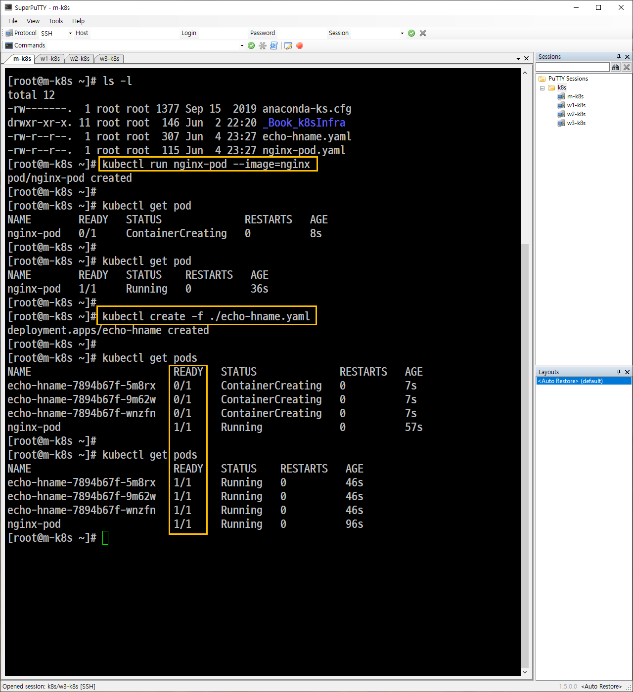
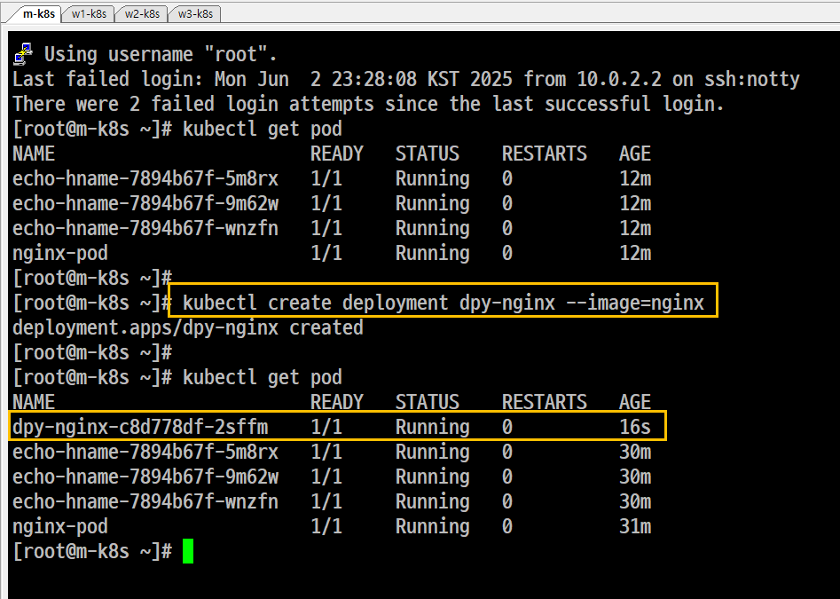
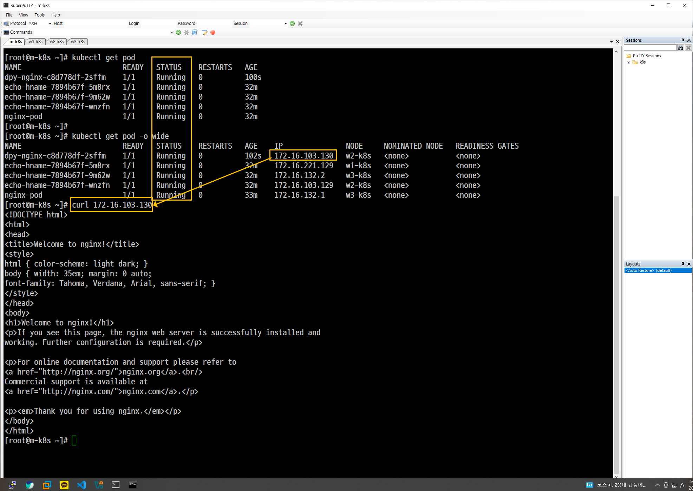
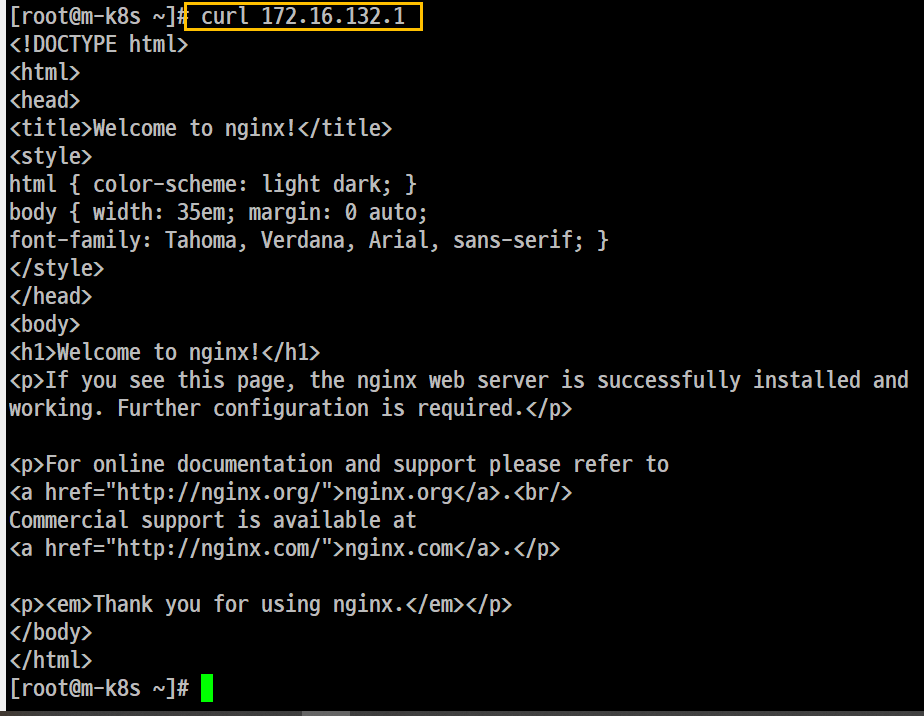
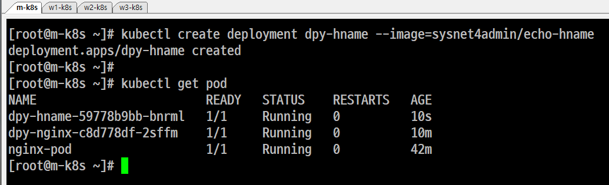
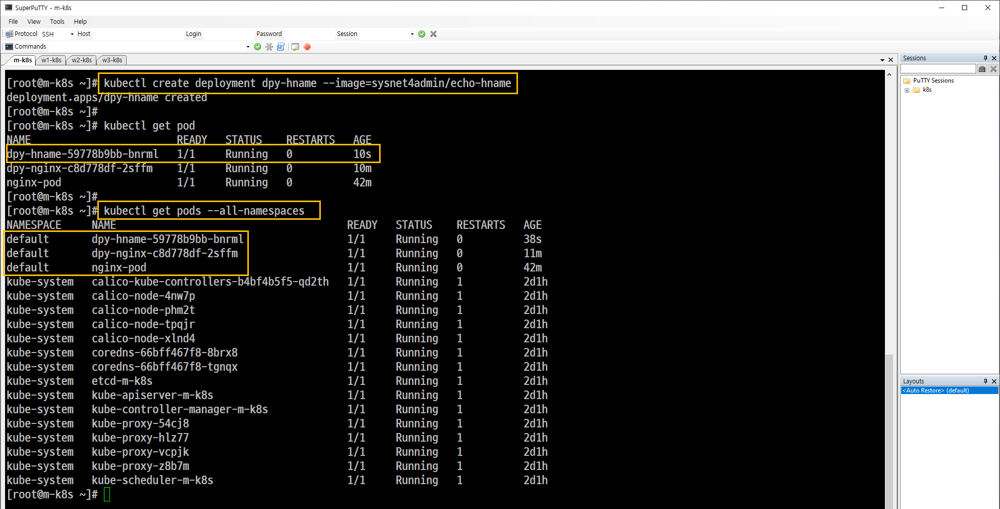
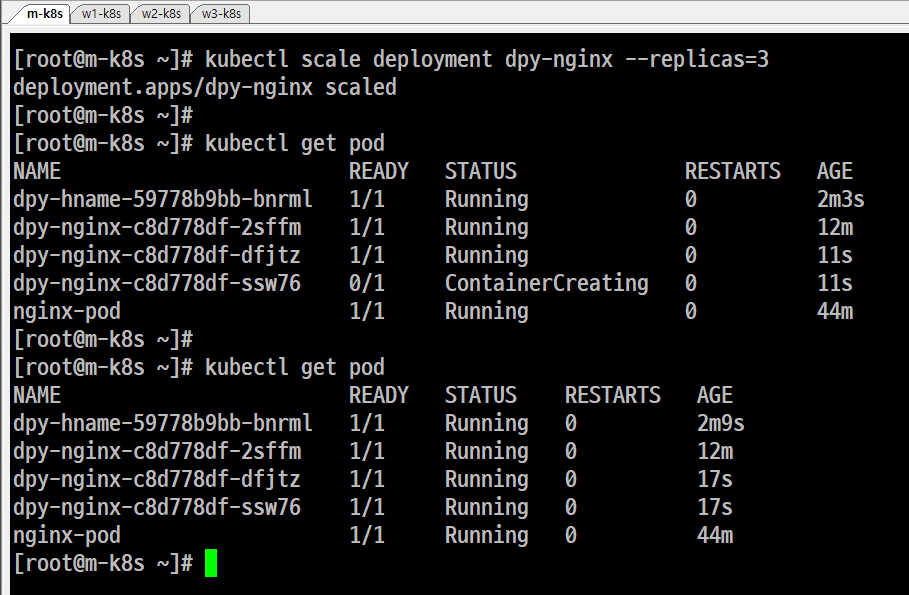
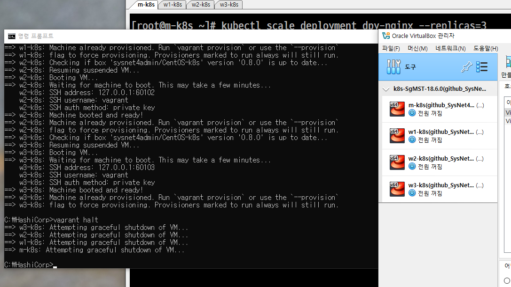

```
[root@m-k8s ~]# kubectl create -f ./echo-hname.yaml

--> 삭제시 kubectl delete deployment echo-hname
[root@m-k8s ~]# kubectl run nginx-pod --image=nginx

--> 삭제시 kubectl delete pod
```

| 항목              | `kubectl create`                            | `kubectl run`                               |
| --------------- | ------------------------------------------- | ------------------------------------------- |
| ✅ 목적            | **YAML 파일 등 명시된 리소스를 생성**                   | 테스트용으로 **간단히 파드(Pod)를 실행**                  |
| 📁 주 사용 방식      | `kubectl create -f file.yaml`               | `kubectl run <name> --image=<image>`        |
| 🧱 생성 대상        | Deployment, Service, Pod 등 **여러 리소스 종류 가능** | 기본적으로 **Pod 하나** 생성 (옵션으로 Deployment 등도 가능) |
| 📦 YAML 필요 여부   | **반드시 필요함** (`-f` 옵션으로 파일 지정)               | YAML 없이도 CLI만으로 실행 가능                       |
| 🎯 실전 사용 용도     | 프로덕션용 배포, 프로젝트 구성                           | 테스트용 임시 파드 실행, 디버깅                          |
| ⛔ Deprecated 사항 | -                                           | 예전에는 Deployment도 만들었지만, 현재는 일부 기능 제한됨       |
| 예시 명령           | `kubectl create -f echo-hname.yaml`         | `kubectl run testpod --image=nginx`         |














