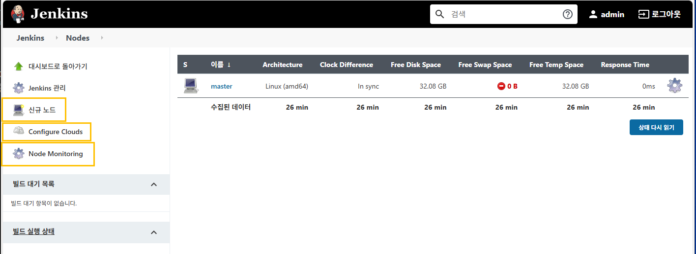
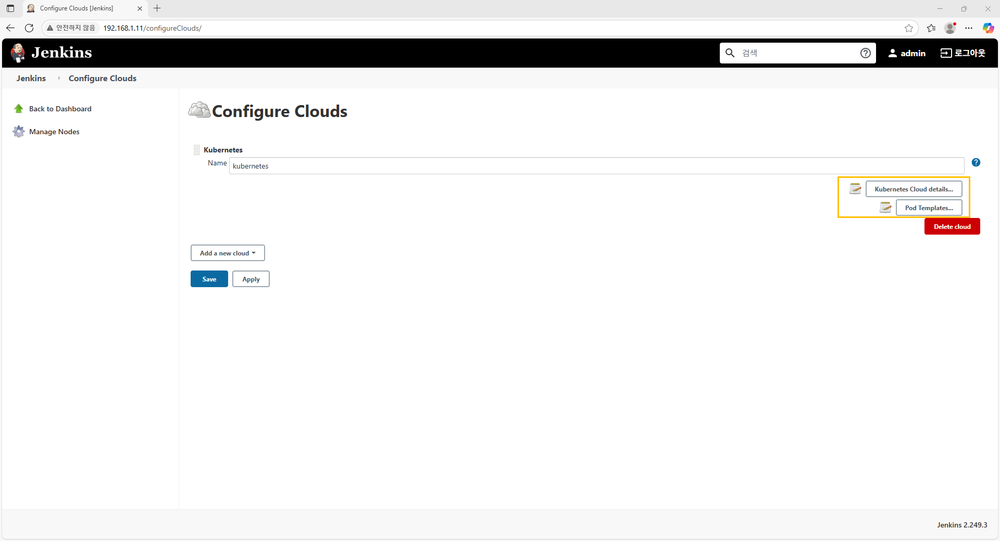
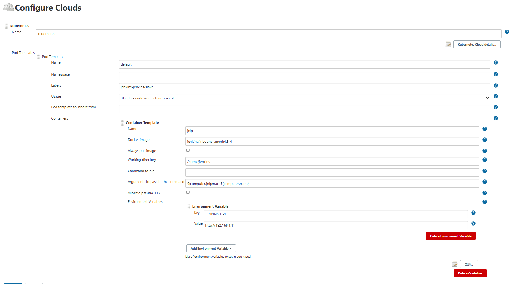
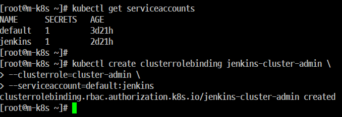
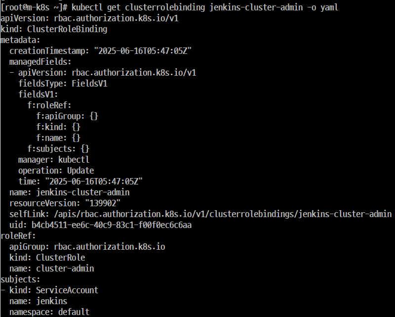
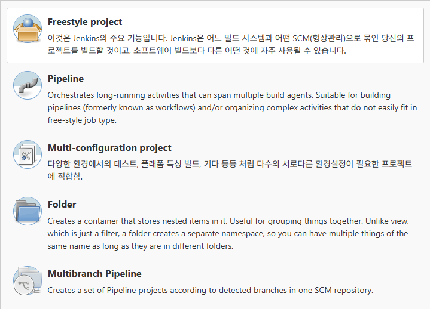

# Jenkins Agent 설정하기
## Jenkins '노드관리'



### Step 1. '신규 노드'

- 'Agent Node'를 추가한다.
- 고정된 여러 대의 서버에서 'Agent Node'를 추가해야 할 때 사용된다.

### Step 2. 'Configure Clouds'
- 클라우드 환경 기반의 Agent를 설정할 때 사용된다.
- 'Kubernetes' 위에 설치된 'Jenkins'의 Agent에 관련된 설정도 한다.
### Step 3. 'Node Monitoring'
- 'Agent Node'의 안전성을 위한 각종 모니터링과 관련된 사항을 설정한다.

### Step 4. '노드 목록'
- 현재 구성된 노드의 목록을 보여준다.
- 'kubernetes'상에 설치된 'Jenkins'는 작업이 진행될 때만 'Pod 형태의 'Agent'가 생성되고 작업이 끝나면 'Pod'가 사라지기 때문에 작업중이 아니라면 이 목록에는 'Jenkins Controller Node', 만 표시된다.

## Kubernetes 에서 Jenkins Agent 구성



### Step 1. kubernetes
- Kubernetes 설정과 관련된 영역이다. 'Name'에 이름을 지정할 수 있다.

### Step 2. 'Kubernetes Cloud Details'
- kubernetes Cluster 에 접속하기 위한 정보를 설정할 수 있다.
- 'Helm'을 통해서 'Kubernetes' 위에 설치한 'Jenkins'는 'Kubernetes Cluster' 내부에서 동작하기 때문에 기본값으로 둔다.
- 만약, 'Kubernetes Cluster' 외부에 'Jenkins'를 설치할 경우에는 이곳에서 'Kubernetes'에 대한 정보를 수정해야 한다.

### Step 3. 'Pod Templates'상세 내용
- 'kubernetes' 위에 설치된 'Jenkins'는 작업시 Agent를 'Pod' 형태로 생성한다.
- 이 'Agent'로 사용할 'Pod'와 관련된 설정을 한다.
- 이 때 'Pod Templates'은 'Jenkins Controller'를 다시 시작하면 모든 설정이 초기화 된다. 즉, 현재 상황에서 'Master Node'를 다시 시작하면 모든 설정이 초기화 된다. 
- 이를 해결하기 위해 'Helm' 설치 시에 구성한 설정값 ('jenkins-config.yaml')을 읽어드린다.


## 'Jenkins Service Account'를 위한 권한 설정
## 개요
- Jenkins Agent Pod 에서 Kubernete API Server로 통신하려면
'Service Account'에 권한을 줘야한다.
- 권한을 주기 전에 Jenkins Service Account 가 존재하는지 확인해야 한다.
- 'JSA'를 통해서 'Jenkins Agent Pod'를 생성하고 'Jenkins Agent Pod' 내부에서 'Kubernetes'의 Object에 제약없이 접근하려면 'cluster-admin 역할(Role)'을 부여해야한다.
- 일반적으로 필요한 영역을 나워서 부여해야 하지만 효율적인 관리를 위해서 
Service Account에 이 권한을 1개(Jenkins)를 부여했다.
- Service Account에 'cluster-admin' 역할을 부여하고 이를 권한이 필요한 'Service Account(사용자, 그룹)'인 Jenkins에 묶어(binding)준다.
- 이런 방식을 역할 기반 접근 제어라고 한다.(RBAC)
### Step 1. 'Jenkins Service Account' 존재 유무 확인


### Step 2. 'Jenkins Service Account' 계정인 Jenkins에 'Kubernetes Cluster'에 대한 'admin' 권한 부여


```
kubectl create clusterrolebinding jenkins-cluster-admin --clusterrole=cluster-admin --serviceaccount=default:jenkins
```


```
kubectl get clusterrolebinding jenkins-cluster-admin -o yaml
```
- 용어

    ```
    kubectl create
    : object를 생성하는 명령어
    clusterrolebinding 
    : 생성되는 Object가 clusterrolebinding임을 나타낸다.
    jenkins-cluster-admin 
    : clusterrolebinding으로 생성되는 Object의 이름이 'jenkins-cluster-admin'
    --clusterrole=cluster-admin
    : clusterrolebinding의 첫 번째 옵션으로 cluster-admin 역할 부여 
    --serviceaccount=default:jenkins
    : clusterroebinding의 두 번째 옵션으로 default에 있는 jenkinds라는 Service Account에 이 권한을 부여한다. 
    ```
### Step 3.

### Step 4.

### Step 5.

### Step 6.

### Step 7.

### Step 8.

# 'Jenkins' 설치 및 설정('Kubernetes' 환경에서 'Jenkins'를 사용하기 위한 설정)

# 'Jenkins'로 CI/CD 구현하기
## 개요
             
- 그런데 아이덴이란 무엇일까요? 'Jenkins'에서 '아이템(Item)'이란 새롭게 정의할 작업을 의미한다.


- 'Jenkins'가 'CI/CD 도구'임을 익히 들어서 알고 있지만 사실 'CI/CD'를 하려면 각각의 작업은 모두 정의가 필요하다.

        
- 만약 작업을 코드로 정의한 경우라고 해도 작업 순서 정도는 알려줘야 한다.


- 모든 작업의 정의와 순서를 모아 둔 전체 작업을 'Project'라고 하는데 'Project'를 생성하는 방식은 'Freestyle', 'Pipeline' 등이 있다.


- 이렇게 'Project'를 정의하고 생성하는 것을 '아이템(Item)' 이라고 하며 'Project' 외에 실제로 작업에 도움이 되는 내용들을 정의하는 것도 아이템을 생성한 다고 할 수 있다.


- 예를 들면 'Project'를 구분해 저장해 두는 디렉터리인 Folder가 그러하다고 할수 있다. 이러한 용어를 몰라도 실습하는 데는 크게 문제가 없지만 추후 설명을 읽다 보면 용어에 혼동 이룰수 있기 때문에 이번에 정확하게 정의하고 넘어가겠다.

### Step 1. Freestyle project(단순한 작업은 쉽고 복잡한 과정은 어렵다)
- 스타일의 자유도가 높은 방식으로 브라우저에서 사용자가 직접 설정값과 수행할 동작을 입력할 수 있다.
- 화면에 보이는 항목을 입력하면서 구상할 수가 있기 때문에 'Jenkins' 관련 경험이 부족해도 쉽게 구성할 수가 있다.
- 과정이 복잡한 작업을 구성하기 어렵고 'Freestyle'로 생성한 아이템은 입력한 항목의 명세서를 별도로 저장하는 과정이 없기 때문에 작성한 내용을 공유하기 어렵다.
### Step 2. Pipeline (프로그래밍 기법을 이용한 재사용)
- 'Jenkins'에서 지원하는 고유의 'Pipeline' 문법으로 코드를 작성해서 작업을 정의하는 프로젝트를 말한다.
- 'Freestyle'과 비교하면 사전에 숙지해야 한다는 점 때문에 비교적 진입 장벽이 있다. 
- 변수 정의, 반복문, 조건문 등의 프로그래밍 기법을 사용할 수 있기 때문에 좀 더 복잡한 방식의 작업을 정의하는 것이 가능하다. 즉, 다양한 구문들을 처리할 수가 있다.
- 작성한 코드를 통해 새로운 프로젝트를 바로 생성할 수 있고, 코드를 일부만 수정해서 재사용하기도 수월하다.
- 'gitHub'와 같은 '코드 저장소'에 Application Code를 올릴 때 'Pipeline' 코드로 작성한 파일을 함께 올려두면 'Application Code'와 배포 방법을 함께 관리할 수 있기 때문에 관리 편의성이 높다고 할 수 있다.
### Step 3. Multi-configuration project (여러 조건의 조합을 이용한 환경 구성 후 배포)
- 하나의 소스 코드를 여러 조건의 조합으로 나온 경우의 수에 해당하는 환경에 동시에 배포하는 Project이다.
### Step 4. Folder (관련 작업 분류를 이용한 관리의 편이성)
- 중첩된 항목을 저장하는 컨테이너를 생성합니다. 항목을 그룹화하는 데 유용합니다. 필터 역할을 하는 view와 달리, 폴더는 별도의 네임스페이스를 생성하므로 같은 이름의 항목을 여러 개 만들어도 서로 다른 폴더에 저장할 수 있습니다.
- 'Jenkins'의 작업이 늘어나면 늘어날수록 단순하게 관리하기 어려운데 이런 경우 관련 있는 작업들을 분류해 둘 필요가 있다.
- 분류 가능한 디렉터리를 생성하는 것이 'Folder' 이다.
### Step 5. Multibranch Pipeline (SCM의 소스코드를 이용한 '다중 Branch' 적용)
- 하나의 'SCM 저장소(소스 코드 저장소)'에서 'branch' 에 따라 'Pipeline' 프로젝트 세트를 생성합니다.
- 하나의 소스 코드 저장소
- 하나의 'SCM 저장소(소스 코드 저장소)' 내에 존재하는 각 'Branch'에서 'Jenkins Pipeline' 코드가 작성된 파일을 불러와서 한 번에 여러 'Branch'에 대해 품질 검증, 테스트, 빌드 등의 작업을 할 수 있도록 해준다.



### 결론
- 5개의 'item' 중에서 주로 사용되는 것은 'Freestyle'과 'Pipeline'이다.
- 일반적으로 간단한 작업이나 공유 보다는 직접 사용을 염두에 둔 작업은 'Freestyle'로 정의하고 복잡도가 높아서 고려할 것이 많거나 정의 해 둔 내용의 공유 및 재사용을 염두해 둔 작업을 할 때는 'Pipeline'을 사용한다.