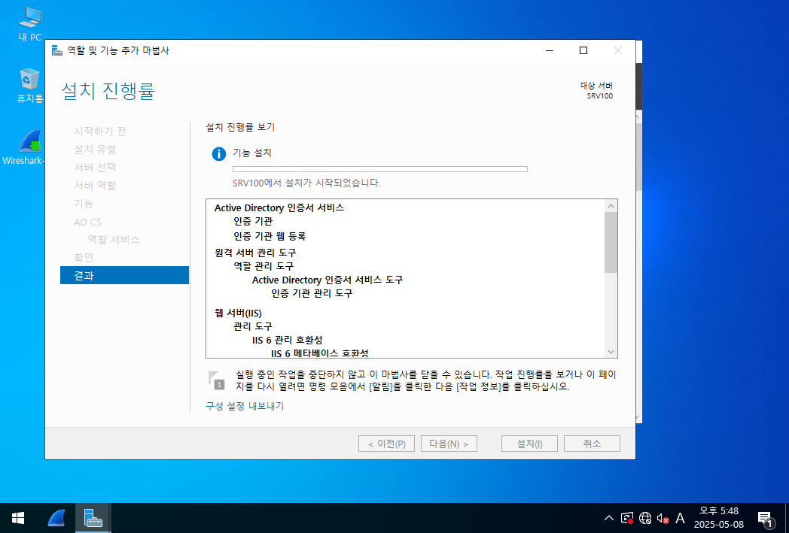
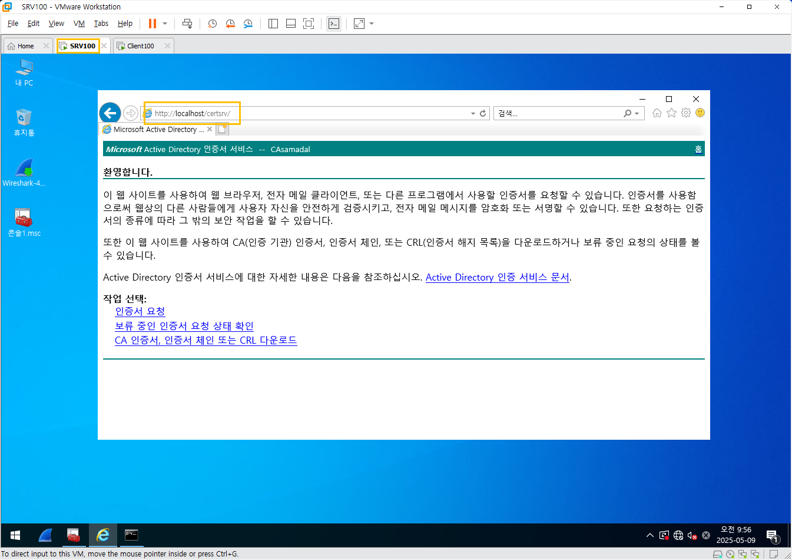

## 6. 실습 3. CA 인증서

시스템 구성
- SRV100 (인증기관, 인증서 발급)
- Client100 (인증서 요청)
- SRV100
    - 인증기관 설치
---

### ✅ 실습 개요

- **목표**: SRV100에 인증기관(CA, Certificate Authority)을 설치하여 IPSec 구성 시 **공식 인증 방식 사용**
- **시스템 구성**:  
  - `SRV100` : 인증기관 역할 수행 (CA 서버로 동작)

---

### 🏗️ CA 인증기관 설치 과정 (SRV100)

#### 1. `서버 관리자` 실행

> 시작 메뉴 → **[서버 관리자]** 실행

---

#### 2. [역할 및 기능 추가] 클릭

- 시작 화면에서 **[역할 및 기능 추가]** 선택
- 이후 **"다음"** 3번 클릭하여 진행

<br>

---

#### 3. 인증기관 역할 선택

- **"인증 기관"**, **"인증 기관 웹 등록"** 체크
- 기능 추가 메시지에서 → **[기능 추가] 클릭**

📸 예시:

<br>

---

#### 4. 다음 → 설치 진행

- 요약 화면 확인 후 → **[설치] 클릭**
<br>

- 설치가 완료되면 재부팅 없이 바로 구성 가능

<br>
<br>
<br>
<br>
<br>
<br>
<br>

## 인증서 환경설정
- 윈도우 알
- mmc(Microsoft Management Console)

<br>
내 사용자 계정 -> 컴퓨터 계정 순으로
<br>
<br>
<br>

시작 들어가서 Internet Explorer 들어가기
<br>

### 인증서 신청 <br>

- Internet Explorer 설정
확인
<br>
- 인증서버 접속
```
http://localhost/certsrv/
```
<br>

<br>

<br>

<br>

<br>

<br>

<br>

<br>

<br>
마지막에 제출 버튼이 활성화 된 이유는 전전전전 사진에서 스크립팅하기 안전하지 ~ **사용**으로 선택 했기 때문이다.
<br>

<br>
모든작업 -> 발급 발급 받기
<br>


- Step 2. 보류 중인 인증서 요청 상태 확인

<br>

<br>

- (X) CA 인증서, 인증서 체인 또는 CRL 다운로드

- 인증서 구성 
<br>

<br>

<br>

<br>

<br>

<br>

<br>

<br>

<br>

### Client 100
<br>
- MMC를 이용한 인증서 작업 환경 구성

<br>

- Step 1. CA 인증서, 인증서 체인 또는 CRL 다운로드

<br>

<br>

<br>

<br>

<br>

<br>

<br>

- Step 2. 인증서 요청

<br>

<br>
SRV100으로 이동<br>
<br>
모든작업 발급<br>
<br>

- Step 3. 보류 중인 인증서 요청 상태 확인

<br>

<br>

<br>

---

<br>

<br>

<br>

<br>

### 테스트 1.
- 'ICMP' 가 출력된다.

<br>

<br>

- 방화벽 구성
window로고 + R
secpol.msc 치고
SRV100, Client100 모두 구성
<br>

### 테스트 2.
- 'ESP'가 출력된다.
<br>

<br>
