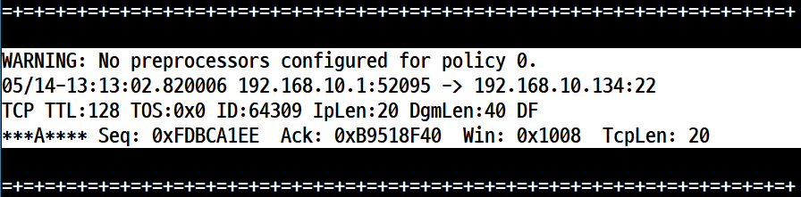
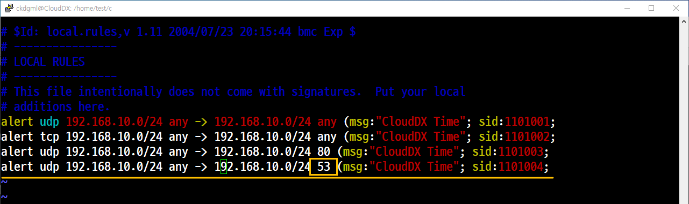

# 📘 IDS 

## 1. 개요

- 원래 목적은 트래픽 분산을 확인하고 사용하는 프로그램이다.
- 네트워크 침입 **차단** 시스템이면서 네트워크 침입 **탐지** 시스템의 표준이다.
- **Role(롤, 미리 정해 놓은 규칙)** 기반의 패턴 매치 기법이 추가되고 PCRE를 이용한 정규표현식을 지원하면서 IDS/IPS의 기술 표준으로 자리 잡았다. 

- Victim 시스템에 Snort를 설치하고 진행하는 kali를 이용한다.

## IDS /
   

### IDS (Intrusion **Detection** System, 침입 탐지 시스템)

         
- 룰 기반의 패턴 매치 기법으로 악의적인 공격 시도를 **탐지**하여 내부 자산의 피해를 최소화하기 위한 시스템을 말한다.


### (Intrusion **Protection** System, 침입 차단 시스템)
      
      
- IDS와 같이 패턴 매치 기법으로 공격을 탐지하고 **차단 및 방어** 기능도 포함한 시스템을 말한다.


### DAQ (Data Acquisition)       
- Data 수집

## 3. Snort

### 🖥️ 실습 환경 (NAT 구성)

### ✅ kali
- IP: `192.168.10.134`
- 게이트웨이: `192.168.10.2`
- DNS: `192.168.10.2`

kali update, upgrade를 해줌

kali는 기본적으로 Snort를 위한 저장소(Repository)가 없다. <br>
따라서 패키지를 이용해서 설치해 주면 된다.<br>
저장소(Repository) 파일 백업


```
[samadal@kali ~]$ sudo ls -l /var/lib/apt/lists
total 167812
drwxr-xr-x 2 _apt root     4096 Apr 28 04:10 auxfiles
-rw-r--r-- 1 root root   410588 Apr 17 05:04 http.kali.org_kali_dists_kali-rolling_contrib_binary-amd64_Packages
-rw-r--r-- 1 root root   528842 Apr 17 05:04 http.kali.org_kali_dists_kali-rolling_contrib_Contents-amd64.lz4
-rw-r--r-- 1 root root    41480 Apr 17 05:05 http.kali.org_kali_dists_kali-rolling_InRelease
-rw-r--r-- 1 root root 82282115 Apr 17 05:03 http.kali.org_kali_dists_kali-rolling_main_binary-amd64_Packages
-rw-r--r-- 1 root root 85869117 Apr 17 05:04 http.kali.org_kali_dists_kali-rolling_main_Contents-amd64.lz4
-rw-r--r-- 1 root root  1019653 Apr 17 05:04 http.kali.org_kali_dists_kali-rolling_non-free_binary-amd64_Packages
-rw-r--r-- 1 root root  1565188 Apr 17 05:04 http.kali.org_kali_dists_kali-rolling_non-free_Contents-amd64.lz4
-rw-r--r-- 1 root root    39841 Apr 17 05:04 http.kali.org_kali_dists_kali-rolling_non-free-firmware_binary-amd64_Pack                      ages
-rw-r--r-- 1 root root    41083 Apr 17 05:04 http.kali.org_kali_dists_kali-rolling_non-free-firmware_Contents-amd64.lz 
```

```
[samadal@kali ~]$ sudo find /var/lib/apt/lists -type f -exec rm {} \;  -----> 제거

[samadal@kali ~]$ sudo ls -l /var/lib/apt/lists
total 8

drwxr-xr-x 2 _apt root 4096 Apr 28 04:10 auxfiles
drwx------ 2 _apt root 4096 May 13 17:56 partial
```

#### 소스 파일(sources.list) 생성 및 내용 입력

[samadal@kali ~]$ sudo vi /etc/apt/sources.list


```
deb http://archive.ubuntu.com/ubuntu/ focal main restricted universe multiverse
deb-src http://archive.ubuntu.com/ubuntu/ focal main restricted universe multiverse

deb http://archive.ubuntu.com/ubuntu/ focal-updates main restricted universe multiverse
deb-src http://archive.ubuntu.com/ubuntu/ focal-updates main restricted universe multiverse

deb http://archive.ubuntu.com/ubuntu/ focal-security main restricted universe multiverse
deb-src http://archive.ubuntu.com/ubuntu/ focal-security main restricted universe multiverse
   
deb http://archive.ubuntu.com/ubuntu/ focal-backports main restricted universe multiverse
deb-src http://archive.ubuntu.com/ubuntu/ focal-backports main restricted universe multiverse

deb http://archive.canonical.com/ubuntu focal partner
deb-src http://archive.canonical.com/ubuntu focal partner
```

#### 지정된 공개 키 추가
```
sudo apt-key adv --keyserver keyserver.ubuntu.com --recv-keys 3B4FE6ACC0B21F32
sudo apt-key adv --keyserver keyserver.ubuntu.com --recv-keys 871920D1991BC93C
```
#### 패키지 설치를 위한 저장소 갱신 및 패키지 설치
```
sudo apt update
sudo apt install snort
```
#### 확인


## 실습

### Snort 주요 옵션 정리

| 옵션         | 의미        | 설명                                                                 |
|--------------|-------------|----------------------------------------------------------------------|
| `-d`         | Decode      | 패킷의 해독된 내용(페이로드)도 함께 출력                             |
| `-e`         | Ethernet    | Ethernet 헤더(MAC 주소 포함)도 출력                                  |
| `-v`         | Validated   | 간단한 검증 모드(패킷 요약 출력)                                     |
| `-V`         | Version     | Snort 버전 정보 출력                                                 |
| `-l <경로>`  | Log         | 로그 파일 저장 디렉토리 지정                                         |
| `-n <숫자>`  | Number      | 캡처할 패킷 수 지정                                                  |
| `-h <CIDR>`  | Host        | 내부 네트워크 대역 지정 (예: `192.168.1.0/24`)                        |
| `-A`         | Alert       | 경고(Alert) 생성 모드로 실행                                         |
| `-b`         | Binary      | `tcpdump(스니핑 도구)`와 호환되는 바이너리 로그 형식으로 저장                    |

---

### 예제 1. 버전 확인 

```
[samadal@kali ~]$sudo snort -V

   ,,_     -*> Snort! <*-
  o"  )~   Version 2.9.7.0 GRE (Build 149)
   ''''    By Martin Roesch & The Snort Team: http://www.snort.org/contact#team
           Copyright (C) 2014 Cisco and/or its affiliates. All rights reserved.
           Copyright (C) 1998-2013 Sourcefire, Inc., et al.
           Using libpcap version 1.10.4 (with TPACKET_V3)
           Using PCRE version: 8.39 2016-06-14
           Using ZLIB version: 1.3

```
### 예제 2. 패킷 헤더 확인
**IP와 TCP/UDP/ICMP의 헤더를 확인한다.**


```
sudo snort -v
```

**관리자 권한으로 하지 않을 시 오류**
```
[samadal@kali ~]$snort -v
Running in packet dump mode

        --== Initializing Snort ==--
Initializing Output Plugins!
pcap DAQ configured to passive.
Acquiring network traffic from "eth0".
ERROR: Can't start DAQ (-1) - socket: Operation not permitted!
Fatal Error, Quitting..

```


```
sudo snort -v > /home/samadal/snort-v.log
less /home/samadal/snort-v.log
```


#### Pkts/sec (초당 전송되는 패킷 수)
#### Analyzed (패킷 입출력에서의 탐지율 분석)
#### Outstanding (4개는 두드러진 특징을 갖고 있다고 분석)


#### IP4 / TCP / UDP / ICMP (탐지율)


#### 192.168.10.1 은 DHCP

#### 샥스핀을 이용한 패킷 분석


### 예제 3. 패킷 헤더 확인 (-d)

IDS가 동작하고 있으며 외부로 부터 들어오는 패킷을 탐지하고 있다. <br>
내부에서 외부로 나가는 패킷을 해독된 상태로 출력을 한다.<br>
'출력이 해독' 되었다는 것은 문제를 드러내는 것과 동일하지만 여기서는 전혀 문제가 되지 않는다. 왜? 외부로 나가는 것은 IDS와 무관하기 때문이다. 즉, 침입이 아니기 때문이다.



단순 실행
```
sudo $sudo snort -vde
```


맥주소 추가 


#### 로그 파일 생성 1. Ethernet 헤더와 Application 데이터를 로그 디렉터리에 파일로 저장

단순 로그파일 생성
```
$sudo snort -dev -l ./
```


필요한 갯수 만큼 저장
```
sudo snort -dev -l /home/samadal/log/ -n 5 -h 192.168.10.0/24
```
**확인방법**
-r <tf>    Read and process tcpdump file <tf> <br>
r 옵션을 써야 확인 가능
```
sudo snort -der snort.log.1747202823
```


### 예제 5. tcpdump 형식으로 로그 패킷을 전송하고 경고를 생성한다.


## **Snort Rule(/etc/snort/rules/local.rules)** 정책(Policy)

### 개요
- Snort는 기본적으로 'Rule 기반(Rule Policy)'으로 시스템을 탐지하기 때문에 사용자가 직접 작성한다.

- Rule은 Rule Header와 Rule Option의 구조로 되어 있다.

### 구성

- 형태
    - [Rule Header][Protocol(UDP/TCP/HTTP/IP)]<br>
     [출발지IP][포트]<br>
     [->, <>]<br>
     [도착지IP][포트]<br>
     [Rule Option]
- 입력
    - IP 대신에 대역(CIDR 표기 형태. 192.168.10.0/24)을 지정할 수도 있다.
    - 단일 포트 대신 모든 포트(any)를 지정할 수 있다.

## Rule Options

### 개요
- Rule Options은 여러 개를 한꺼번에 입력이 가능한데 ';'으로 구분하면 된다.

### 자주 사용되는 Rule Options
- msg (메시지 출력. ""를 이용해서 앞과 뒤를 묶어줘야 한다.)
- sid (Secure ID(whoami /user), 식별자 '1,000,000'번 이상으로 주면 된다.) 
- content (페이로드 내부에서 검색할 문자열을 출력.""를 이용해서 앞과 뒤를 묶어주면 된다.)
    - **실제 출력되는 내용(유효한)** <- (payload) 즉, 문자열로 출력한다. 
- depth (탐지할 위치를 지정)
- nocase (대문자와 소문자를 구분 하지 않는다.)
- resp (지정된 응답(Response) 패킷을 전송, 종류로는 rst_send/rst_rcv/rst_all, icmp_net 등)
- react (패킷을 차단하거나 경고 메시지 출력)

## 실습 1. 내부에서 외부로 나가는 UDP/TCP/HTTP 트래픽 탐지 

- rule 설정
- 명령 실행


## 실습 2. 'Client의 웹브라우저' 에서 '사이트(gusiya.com)' 출력을 시도할 때의 탐지

## 🖥️ 실습 환경 (NAT 구성)

### ✅ Windows 10
- IP: `192.168.10.130`
- 게이트웨이: `192.168.10.2`
- DNS: `192.168.10.132`

### ✅ CentOS with DNS Server
- IP: `192.168.10.132`
- 게이트웨이: `192.168.10.2`
- DNS: `192.168.10.132`

### ✅ Kali
- IP: `192.168.10.134`
- 게이트웨이: `192.168.10.2`
- DNS: `192.168.10.132`

룰 하나 더 추가



```
         =+=+=+=+=+=+=+=+=+=+=+=+=+=+=+=+=+=+=+=+=+=+=+=+=+=+=+=+=+=+=+=+=+=+=+=+=+      GET / HTTP/1.1 (Request)

         WARNING: No preprocessors configured for policy 0.
         09/13-10:43:01.847228 00:0C:29:7F:88:44 -> 00:0C:29:90:A9:A5 type:0x800 len:0x3C
         192.168.10.131:59655 -> 192.168.10.129:80 TCP TTL:128 TOS:0x0 ID:50138 IpLen:20 DgmLen:40 DF
         ***A**** Seq: 0xF07FB8D9  Ack: 0x23F6FD72  Win: 0x2014  TcpLen: 20

         =+=+=+=+=+=+=+=+=+=+=+=+=+=+=+=+=+=+=+=+=+=+=+=+=+=+=+=+=+=+=+=+=+=+=+=+=+

         WARNING: No preprocessors configured for policy 0.
         09/13-10:43:01.853369 00:0C:29:7F:88:44 -> 00:0C:29:90:A9:A5 type:0x800 len:0x27C
         192.168.10.131:59538 -> 192.168.10.129:80 TCP TTL:128 TOS:0x0 ID:50139 IpLen:20 DgmLen:622 DF
         ***AP*** Seq: 0xB0E6A12A  Ack: 0x556737A1  Win: 0x2014  TcpLen: 20
         47 45 54 20 2F 20 48 54 54 50 2F 31 2E 31 0D 0A  GET / HTTP/1.1..         → Request(요청)
         48 6F 73 74 3A 20 77 77 77 2E 67 75 73 69 79 61  Host: www.gusiya         → 요청한 내용(도메인)
         2E 63 6F 6D 0D 0A 43 6F 6E 6E 65 63 74 69 6F 6E  .com..Connection
         3A 20 6B 65 65 70 2D 61 6C 69 76 65 0D 0A 43 61  : keep-alive..Ca
         63 68 65 2D 43 6F 6E 74 72 6F 6C 3A 20 6D 61 78  che-Control: max
         2D 61 67 65 3D 30 0D 0A 55 70 67 72 61 64 65 2D  -age=0..Upgrade-
         49 6E 73 65 63 75 72 65 2D 52 65 71 75 65 73 74  Insecure-Request
         73 3A 20 31 0D 0A 55 73 65 72 2D 41 67 65 6E 74  s: 1..User-Agent
         3A 20 4D 6F 7A 69 6C 6C 61 2F 35 2E 30 20 28 57  : Mozilla/5.0 (W
         69 6E 64 6F 77 73 20 4E 54 20 31 30 2E 30 3B 20  indows NT 10.0; 
         57 69 6E 36 34 3B 20 78 36 34 29 20 41 70 70 6C  Win64; x64) Appl         → 요청할 때 사용된 OS
         65 57 65 62 4B 69 74 2F 35 33 37 2E 33 36 20 28  eWebKit/537.36 (
         4B 48 54 4D 4C 2C 20 6C 69 6B 65 20 47 65 63 6B  KHTML, like Geck
         6F 29 20 43 68 72 6F 6D 65 2F 39 30 2E 30 2E 34  o) Chrome/90.0.4
         34 33 30 2E 32 32 39 20 57 68 61 6C 65 2F 32 2E  430.229 Whale/2.         → 요청에 사용된 Web Browser
         31 30 2E 31 32 33 2E 34 32 20 53 61 66 61 72 69  10.123.42 Safari
         2F 35 33 37 2E 33 36 0D 0A 41 63 63 65 70 74 3A  /537.36..Accept:
         20 74 65 78 74 2F 68 74 6D 6C 2C 61 70 70 6C 69   text/html,appli
         63 61 74 69 6F 6E 2F 78 68 74 6D 6C 2B 78 6D 6C  cation/xhtml+xml
         2C 61 70 70 6C 69 63 61 74 69 6F 6E 2F 78 6D 6C  ,application/xml
         3B 71 3D 30 2E 39 2C 69 6D 61 67 65 2F 61 76 69  ;q=0.9,image/avi
         66 2C 69 6D 61 67 65 2F 77 65 62 70 2C 69 6D 61  f,image/webp,ima
         67 65 2F 61 70 6E 67 2C 2A 2F 2A 3B 71 3D 30 2E  ge/apng,*/*;q=0.
         38 2C 61 70 70 6C 69 63 61 74 69 6F 6E 2F 73 69  8,application/si
         67 6E 65 64 2D 65 78 63 68 61 6E 67 65 3B 76 3D  gned-exchange;v=
         62 33 3B 71 3D 30 2E 39 0D 0A 41 63 63 65 70 74  b3;q=0.9..Accept
         2D 45 6E 63 6F 64 69 6E 67 3A 20 67 7A 69 70 2C  -Encoding: gzip,
         20 64 65 66 6C 61 74 65 0D 0A 41 63 63 65 70 74   deflate..Accept
         2D 4C 61 6E 67 75 61 67 65 3A 20 6B 6F 2D 4B 52  -Language: ko-KR
         2C 6B 6F 3B 71 3D 30 2E 39 2C 65 6E 2D 55 53 3B  ,ko;q=0.9,en-US;
         71 3D 30 2E 38 2C 65 6E 3B 71 3D 30 2E 37 0D 0A  q=0.8,en;q=0.7..
         49 66 2D 4E 6F 6E 65 2D 4D 61 74 63 68 3A 20 22  If-None-Match: "
         34 2D 35 63 62 64 36 38 66 32 65 39 65 66 34 22  4-5cbd68f2e9ef4"
         0D 0A 49 66 2D 4D 6F 64 69 66 69 65 64 2D 53 69  ..If-Modified-Si
         6E 63 65 3A 20 4D 6F 6E 2C 20 31 33 20 53 65 70  nce: Mon, 13 Sep
         20 32 30 32 31 20 30 31 3A 34 31 3A 30 39 20 47   2021 01:41:09 G
         4D 54 0D 0A 0D 0A                                MT....

         =+=+=+=+=+=+=+=+=+=+=+=+=+=+=+=+=+=+=+=+=+=+=+=+=+=+=+=+=+=+=+=+=+=+=+=+=+      HTTP/1.1   (Reponse)

         WARNING: No preprocessors configured for policy 0.
         09/13-10:43:01.853533 00:0C:29:90:A9:A5 -> 00:0C:29:7F:88:44 type:0x800 len:0x3C
         192.168.10.129:80 -> 192.168.10.131:59538 TCP TTL:64 TOS:0x0 ID:26188 IpLen:20 DgmLen:40 DF
         ***A**** Seq: 0x556737A1  Ack: 0xB0E6A370  Win: 0xEE  TcpLen: 20

         =+=+=+=+=+=+=+=+=+=+=+=+=+=+=+=+=+=+=+=+=+=+=+=+=+=+=+=+=+=+=+=+=+=+=+=+=+

         WARNING: No preprocessors configured for policy 0.
         09/13-10:43:01.854200 00:0C:29:90:A9:A5 -> 00:0C:29:7F:88:44 type:0x800 len:0xE8
         192.168.10.129:80 -> 192.168.10.131:59538 TCP TTL:64 TOS:0x0 ID:26189 IpLen:20 DgmLen:218 DF
         ***AP*** Seq: 0x556737A1  Ack: 0xB0E6A370  Win: 0xEE  TcpLen: 20
         48 54 54 50 2F 31 2E 31 20 33 30 34 20 4E 6F 74  HTTP/1.1 304 Not         → Reponse(응답)
         20 4D 6F 64 69 66 69 65 64 0D 0A 44 61 74 65 3A   Modified..Date:
         20 4D 6F 6E 2C 20 31 33 20 53 65 70 20 32 30 32   Mon, 13 Sep 202
         31 20 30 31 3A 34 32 3A 35 39 20 47 4D 54 0D 0A  1 01:42:59 GMT..
         53 65 72 76 65 72 3A 20 41 70 61 63 68 65 2F 32  Server: Apache/2         → 응답에 사용된 Web Browser
         2E 34 2E 36 20 28 43 65 6E 74 4F 53 29 0D 0A 43  .4.6 (CentOS)..C         → 응답할 때 사용된 OS
         6F 6E 6E 65 63 74 69 6F 6E 3A 20 4B 65 65 70 2D  onnection: Keep-
         41 6C 69 76 65 0D 0A 4B 65 65 70 2D 41 6C 69 76  Alive..Keep-Aliv
         65 3A 20 74 69 6D 65 6F 75 74 3D 35 2C 20 6D 61  e: timeout=5, ma
         78 3D 31 30 30 0D 0A 45 54 61 67 3A 20 22 34 2D  x=100..ETag: "4-
         35 63 62 64 36 38 66 32 65 39 65 66 34 22 0D 0A  5cbd68f2e9ef4"..
         0D 0A                                            ..
```


```
sudo snort -vd > /home/samadal/rules-2.txt
sudo snort -vde > /home/samadal/rules-2.txt ---> MAC주소도 나옴 
```

#### /etc/snort/rules/local.rules
```
alert udp 192.168.10.0/24 any -> 192.168.10.0/24 any (msg:"loudDX Time"; sid:1101001;)
alert tcp 192.168.10.0/24 any -> 192.168.10.0/24 any (msg:"loudDX Time"; sid:1101002;)
alert udp 192.168.10.0/24 any -> 192.168.10.0/24 80 (msg:"loudDX Time"; sid:1101003;)
alert udp 192.168.10.0/24 any -> 192.168.10.0/24 53 (msg:"loudDX Time"; sid:1101004;)
alert tcp 192.168.10.0/24 any -> any 80 (msg:"Get loudDX"; content:"get"; nocase; sid:1101005;)
alert tcp 192.168.10.0/24 any -> any 80 (msg:"Get loudDX"; content:"GET"; sid:1101006;)
```

```
sudo snort -vdc /etc/snort/rules/local.rules -i eth0 > /home/samadal/rules-vdc.log
```

## Security Onion

### 개요

- 보안 모니터링 및 로그 관리를 위한 무료 오픈소스 Linux 배포판
- Snort 패턴 작업 업문에서 Security Onion 애플리케이션을 사용한다.
- Ubunut 64bit를 기반으로 개발되었다.


### 다운로드 및 초기 환경 구성

- 'Security Onion ISO' 다운로드
    - 공식 사이트
    - 미러 사이트 [링크 사이트](securityonionsolutions.com)

## 🖥️ 실습 환경 (NAT 구성)

### ✅ Security
- IP: `192.168.10.128`
- 게이트웨이: `192.168.10.2`
- DNS: `192.168.10.2`

### 설치


### 초기화면

설치가 완료된 화면이 아니고 설치를 할 수 있는 화면이다.

#### ISO 삽입 후 설치


여기서 iso 파일 제거


### 네트워크 설정
#### 기본설정


로그인 한 초기화면


iso 파일 삽입 


sudo ./vmware-install.pl

처음에만 yes 나머지 기본값 Enter

#### 네트워크 추가


### 보안 도구
##### 기본 작업


- Evaluation Mode
    - 처음 사용하는 사용자에게 적합한 모드이다.
- Production Mode
    - 세부설정을 하고자하는 사용자에게 적합한 모드이다.

우리는 **Evaluation Mode** 선택


P@ssw0rd2


보안도구 설치 완

### 원격 접속


### Sguil 도구 (Snort 패턴 작성 및 Sguil 접속 확인)

- **Rules** 수정 및 업데이트 


```
alert icmp any any -> any any (msg:“Have a nice day!”; sid:1000001;)
```

rule-update


- 실행


P@ssw0rd2
- 테스트


