# Paros

## 개요

### Web Site에 대한 취약점 분석뿐만 아니라


### 🖥️ 작업환경 (NAT 구성)

#### ✅ 테스트용 시스템
- CentOS (DNS, Web Server, DB Server 통합)
- IP: `192.168.10.132`
- 게이트웨이: `192.168.10.2`
- DNS: `192.168.10.132`

#### ✅ Web Proxy 시스템
- Windows 10
- Paros 설치
- IP: `192.168.10.130`
- 게이트웨이: `192.168.10.2`
- DNS: `192.168.10.132`
---

## 실습
설정 전에 확인
- 리눅스 시스템
- 윈도우 시스템

## Java 설치
> https://www.oracle.com/java/technologies/downloads/#java8-windows

- 다운로드 및 설치
- 환경변수 설정

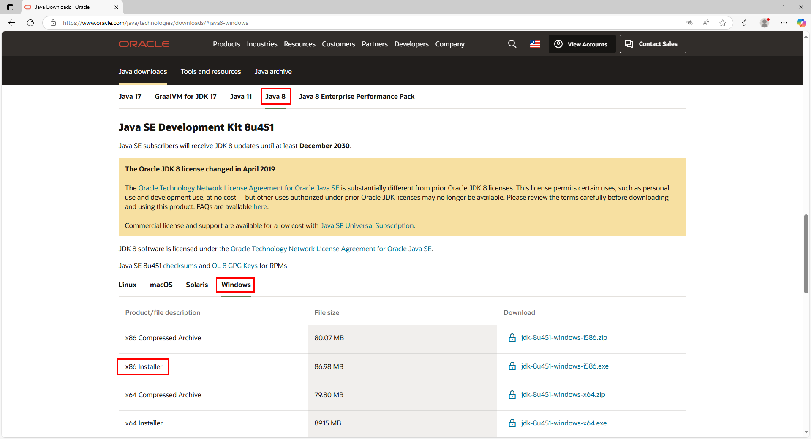<br>

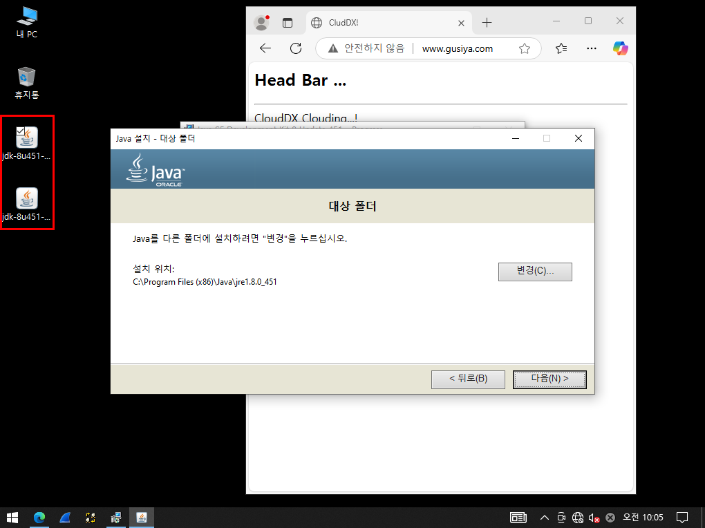<br>

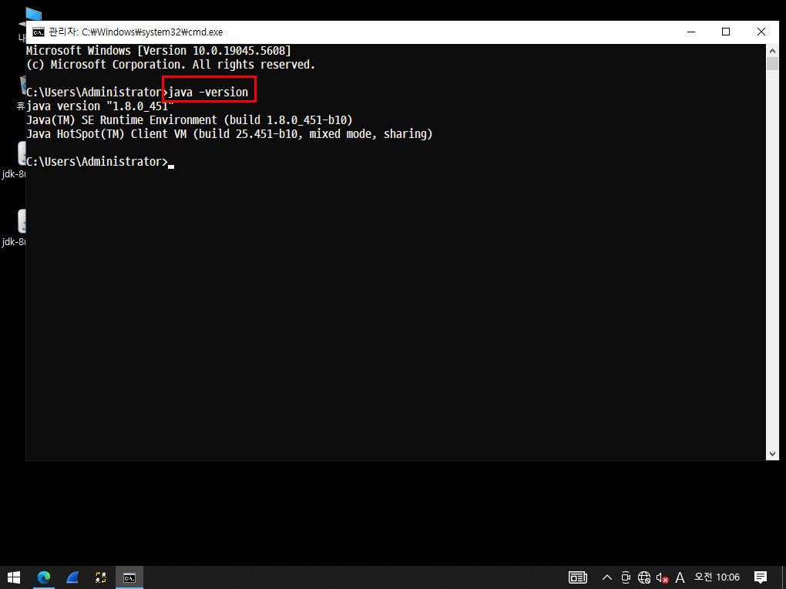<br>

> sysdm.cpl

<br>


## Apache ANT
> https://ant.apache.org/bindownload.cgi
### 개요
### 프로그램 다운로드 및 설치
- 자바 프로그래밍 언어에서 사용하는 자동화된 소프트웨어 도구
- 빌드(코드 분석, 동작할 수 있는 파일로 만들어 주는 과정)하는데 필요한 필수 도구
- 기본적인 빌드 파일명은, 'bulid.xml'이다.
<br>

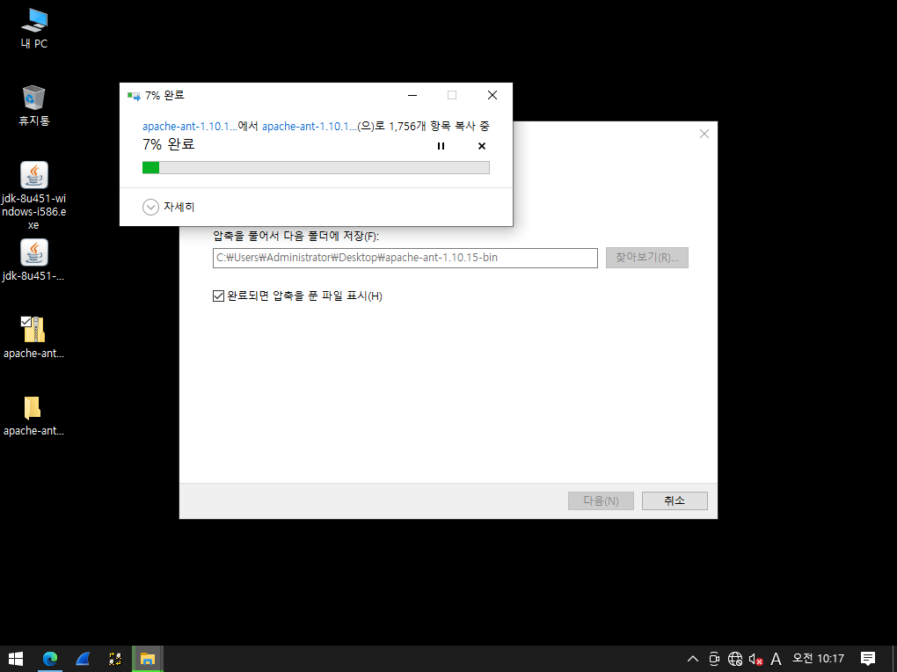<br>
압축 해제 후 폴더 안의 파일을 Java가 있는 파일로 옮기기
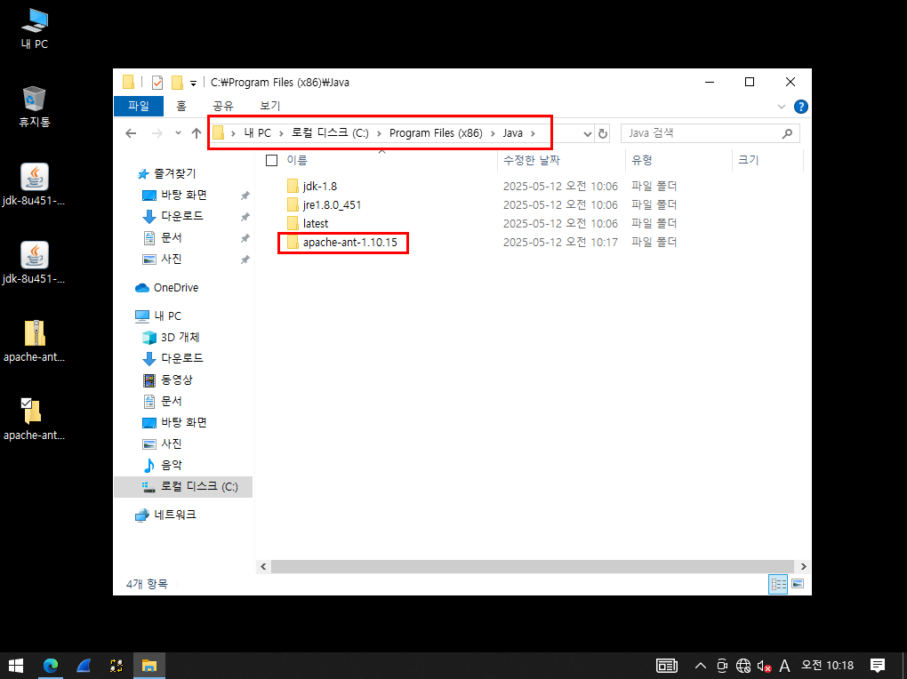<br>

### 시스템 환경 변수 설정
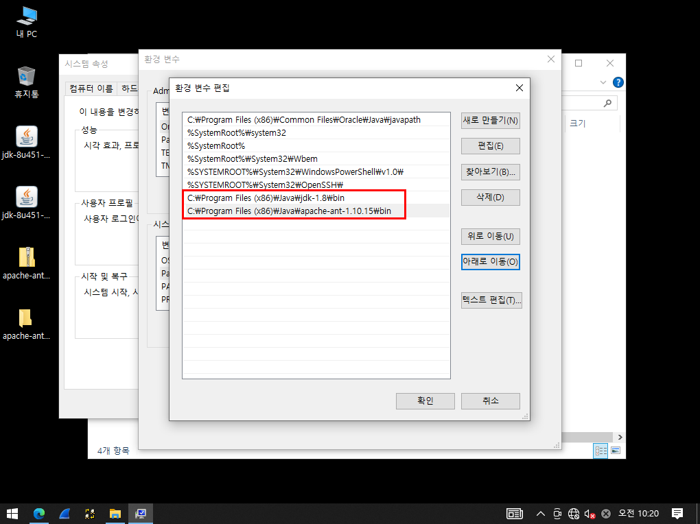<br>

## Paros
### 다운로드 및 설치
>https://sourceforge.net/projects/paros/files/Paros/

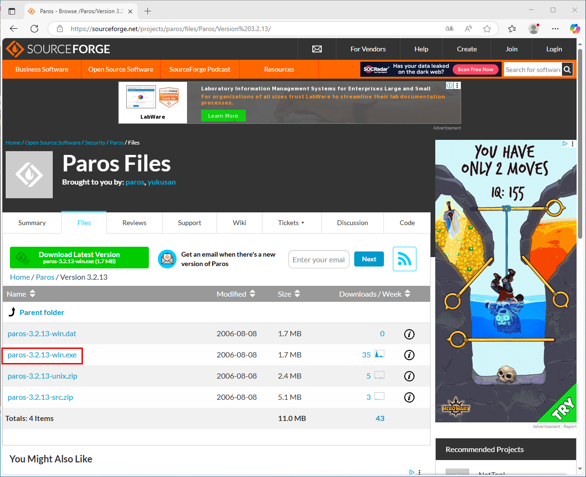<br>

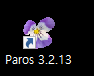<br>

### 실행
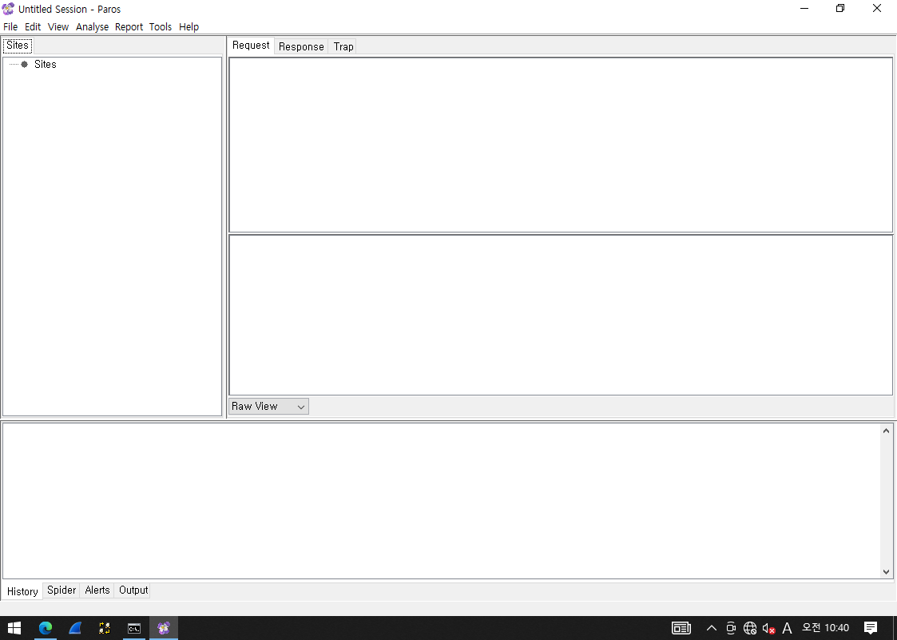<br>

## 테스트 1. without DB

### Windows 10 

## windows 1-에서의 Proxy 설정
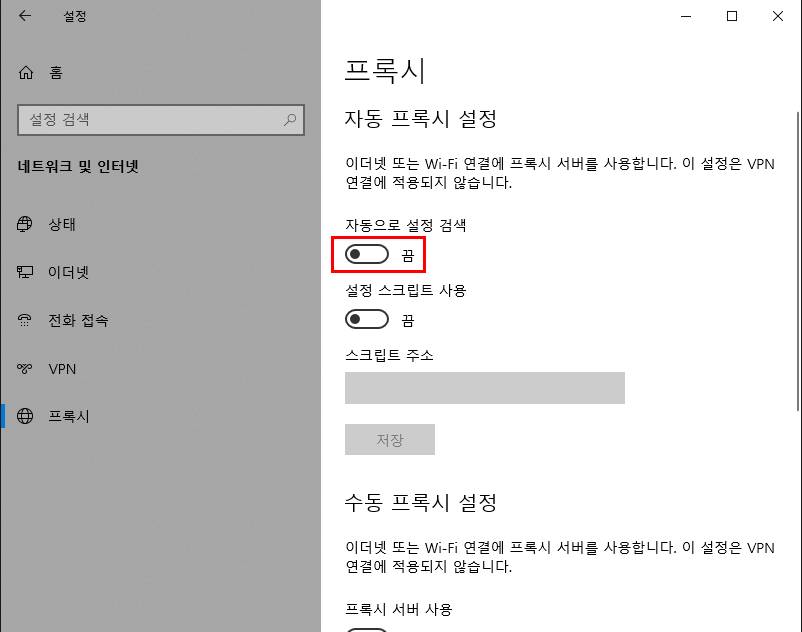<br>

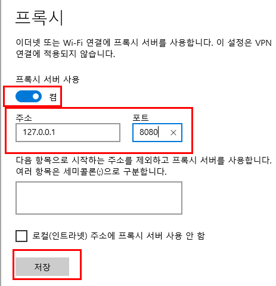<br>

## 실행 1. 포트(8080)가 추가 되어 있지 않은 상태 (비정상)

### request
```
GET http://www.gusiya.com/favicon.ico HTTP/1.1
Host: www.gusiya.com
Proxy-Connection: keep-alive
User-Agent: Mozilla/5.0 (Windows NT 10.0; Win64; x64) AppleWebKit/537.36 (KHTML, like Gecko) Chrome/134.0.0.0 Safari/537.36 Edg/134.0.0.0 Paros/3.2.13
Accept: image/avif,image/webp,image/apng,image/svg+xml,image/*,*/*;q=0.8
Referer: http://www.gusiya.com/
Accept-Language: ko,en;q=0.9,en-US;q=0.8
```

### response
```
HTTP/1.1 404 Not Found
Date: Mon, 12 May 2025 01:53:44 GMT
Server: Apache/2.4.6 (CentOS) PHP/7.4.33
Content-Length: 209
Content-Type: text/html; charset=iso-8859-1
```

```
<!DOCTYPE HTML PUBLIC "-//IETF//DTD HTML 2.0//EN">
<html><head>
<title>404 Not Found</title>
</head><body>
<h1>Not Found</h1>
<p>The requested URL /favicon.ico was not found on this server.</p>
</body></html>
```
실행 2. 포트(8080)가 추가 되어 있는 상태 (정상)
### request
```
GET http://www.gusiya.com/ HTTP/1.1
Host: www.gusiya.com
Proxy-Connection: keep-alive
Cache-Control: max-age=0
Upgrade-Insecure-Requests: 1
User-Agent: Mozilla/5.0 (Windows NT 10.0; Win64; x64) AppleWebKit/537.36 (KHTML, like Gecko) Chrome/134.0.0.0 Safari/537.36 Edg/134.0.0.0 Paros/3.2.13
Accept: text/html,application/xhtml+xml,application/xml;q=0.9,image/avif,image/webp,image/apng,*/*;q=0.8,application/signed-exchange;v=b3;q=0.7
Accept-Language: ko,en;q=0.9,en-US;q=0.8
```

### response
```
HTTP/1.1 200 OK
Date: Mon, 12 May 2025 01:56:27 GMT
Server: Apache/2.4.6 (CentOS) PHP/7.4.33
Last-Modified: Mon, 12 May 2025 00:47:39 GMT
ETag: "84-634e5a9b605dc"
Accept-Ranges: bytes
Content-Length: 132
Content-Type: text/html; charset=UTF-8
```

```
<html>
	<head>
		<title> CludDX! </title>
	</head>
	<body>
		<H2> Head Bar ... </H2>
		<HR>
		CloudDX Clouding...!
	</body>
</html>
```

## 테스트 2. withDB
방화벽 x

<br>

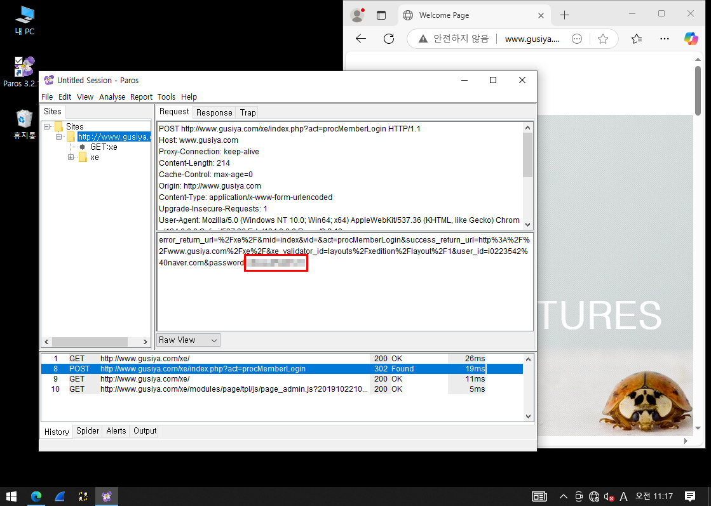<br>
post 방식 비번 노출
