## Module 생성 1. Module 파일들 생성
### 'VPC' Module
- VPC와 관련된 모든 리소스(VPC, 서브넷, 라우팅 테이블 등)를 포함하는 모듈
- '/sdb/Terraform/modules/vpc/' 안에 생성한다.

### 'EC Instance' Module
- VPC와 관련된 모든 리소스(VPC, 서브넷, 라우팅 테이블 등)를 포함하는 모듈
- '/sdb/Terraform/modules/ec2_instance/' 안에 생성한다.

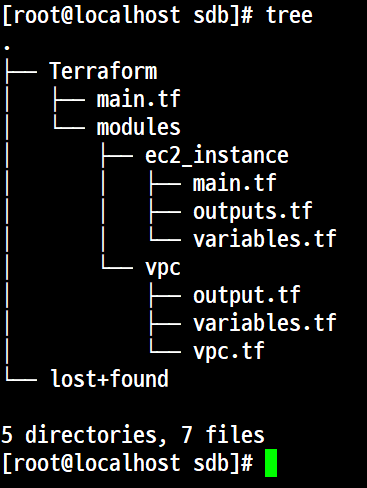

---
: Module 생성 2. 'main.tf' 파일 생성

---
##### vpc.tf
```
resource "aws_vpc" "example" {
        cidr_block = var.vpc_cidr_block
}

resource "aws_subnet" "example" {
        vpc_id = aws_vpc.example.id
        cidr_block = var.subnet_cidr_block
}

```

##### variables.tf

```
variable "vpc_cidr_block" {
        description = "The CIDR block for the VPC."
        type = string
}

variable "subnet_cidr_block" {
        description = "The CIDR block for the subnet."
        type = string
}
```
##### output.tf
```
output "vpc_id" {
        value = aws_vpc.example.id
}

output "subnet_id" {
        value = aws_subnet.example.id
}
```

## Module 생성 2. 'main.tf' 파일 생성
##### ec2.tf
```
resource "aws_instance" "example" {
        ami = var.ami_id
        instance_type = var.instance_type
        tags = {
                Name = "TerraformUbutu2404Instance"
        }
}
```

##### outputs.tf
```
output "instance_id" {
        value = aws_instance.example.id
}
output "instacne_public_ip" {
        value = aws_instance.example.public_ip
}
```
##### variables.tf
```
variable "ami_id" {
        description = "The AMI ID to use for the instance."
        type        = string
}
variable "instance_type" {
        description = "The type of instance to start."
        type        = string
}
```
---
pwd = /sdb/Terraform/main.tf
##### main.tf
```
terrafrom{
        required_providers{
                aws = {
                        source = "hashicorp/aws"
                        version = "~>5.100.0"
                }
        }
        required_version = ">1.4"
}

provider "aws" {
        region = "ap-northeast-2"
}

module "vpc" {
        source = "./modules/vpc"
        vpc_cidr_block    = "10.0.0.0/16"
        subent_cidr_block = "10.0.1.0/24"
}
module "ec2_instance" {
        source          = "./modules/ec2_instance"
        ami_id          = "ami-0dc44556af6f78a7b"
        instance_type   = "t2.micro"
}

```

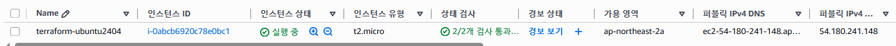

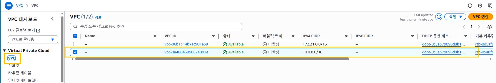

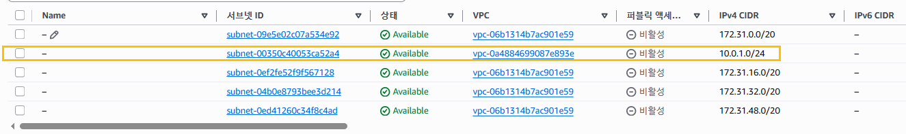

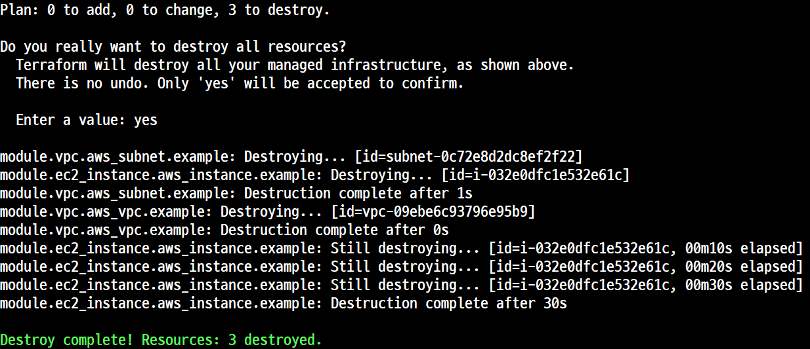

## Terraform Code를 이용한 접속키 등록

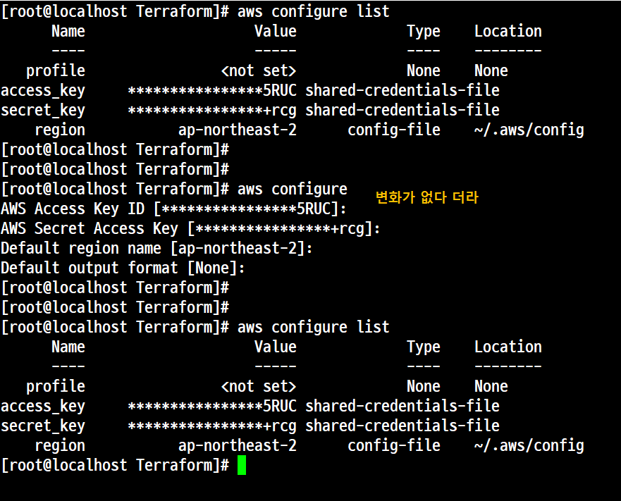

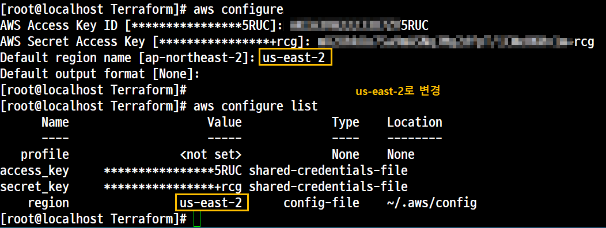

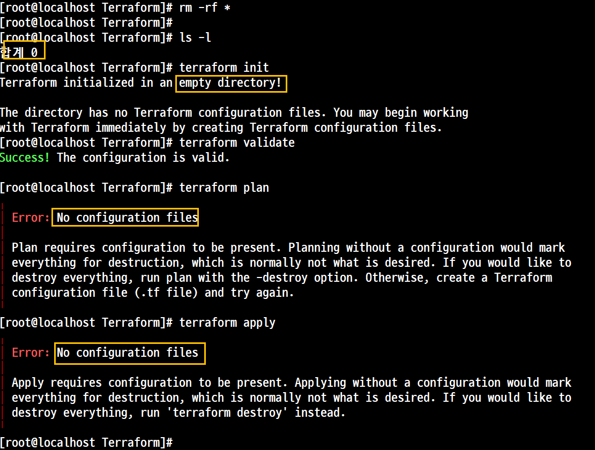

# 실습 1. 'Terraform'으로 'VPC', 'Subnet' 'IGW', 'Routing' 생성
### pwd = /sdb/Terraform/main.tf
```
terraform{
        required_providers {
                aws = {
                        source = "hashicorp/aws"
                        version = "5.100.0"
                }
        }
}

provider "aws" {
        region = "ap-northeast-2"
        access_key = "5RUC"
        secret_key = "+rcg"
}

```

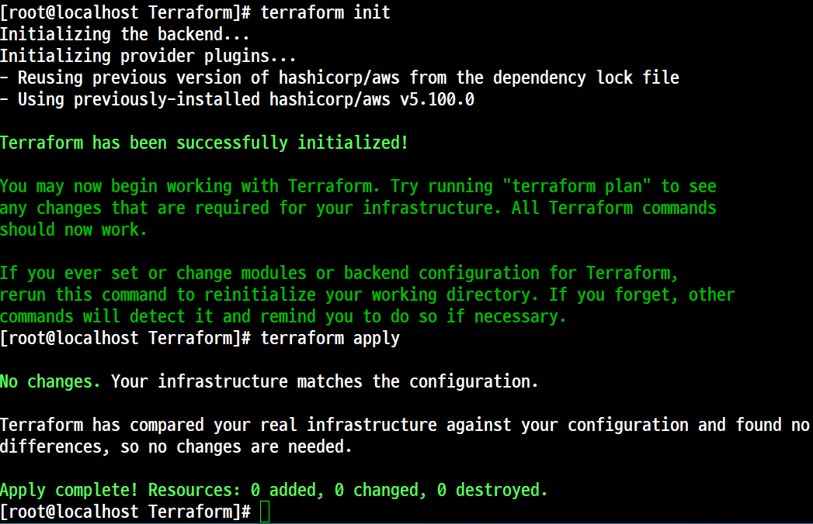

- 'aws configure' 명령이 Terraform 파일보다 우선권을 가진다.

## 'Terraform' 으로 'VPC' 생성하기  -- 예제파일 main-vpc.tf

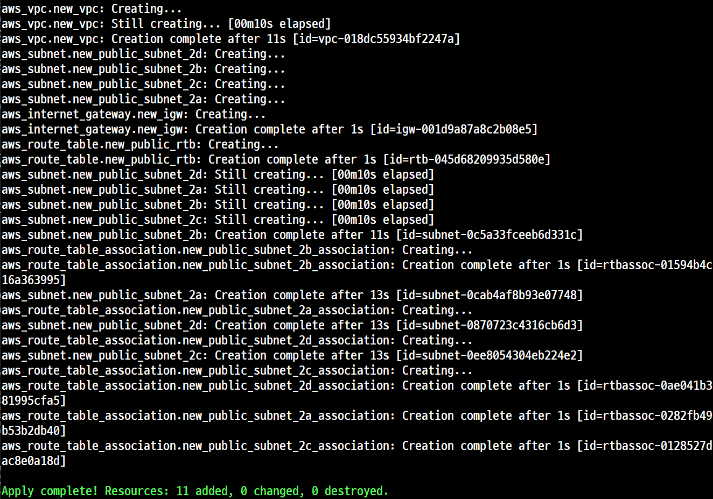


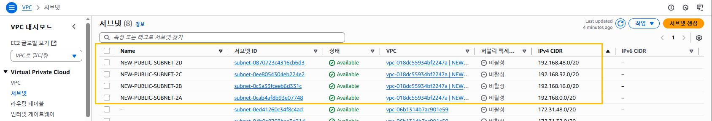

