# 실습 1. 'VPC' 배포
## 개요
### Terraform을 사용해서 'Amazon Linux'에서 작업한다.
#### Step 1. VPC 생성

main.tf
```
provider "aws" {
        region = "ap-northeast-2"
}
resource "aws_vpc" "hmvpc"{
        cidr_block = "10.10.0.0/16"
        tags = {
                Name = "clouddx-vpc"
        }
}

```
- 명령 실행

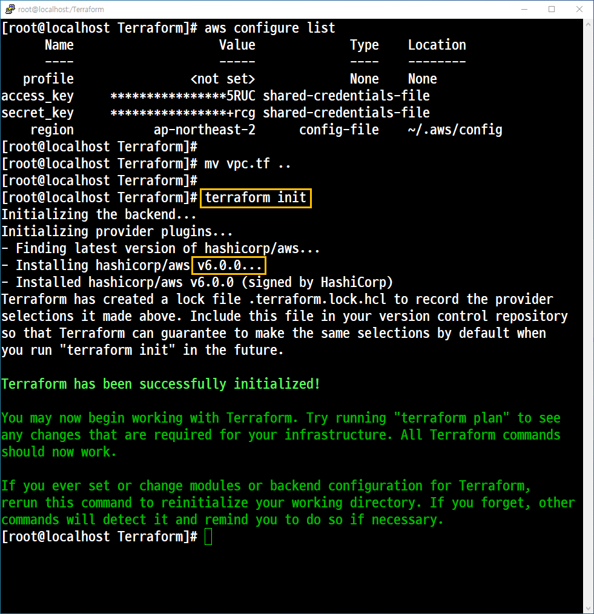

- 확인

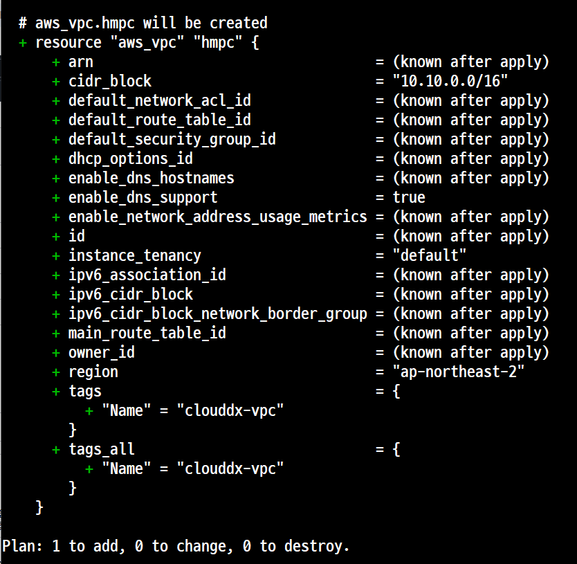


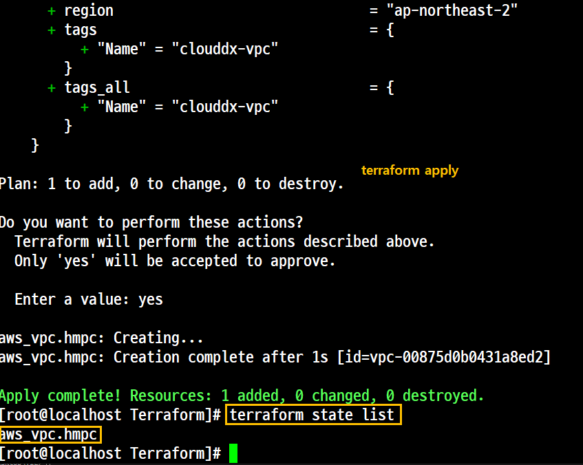

- 확인 1. 'AWS Management Console'

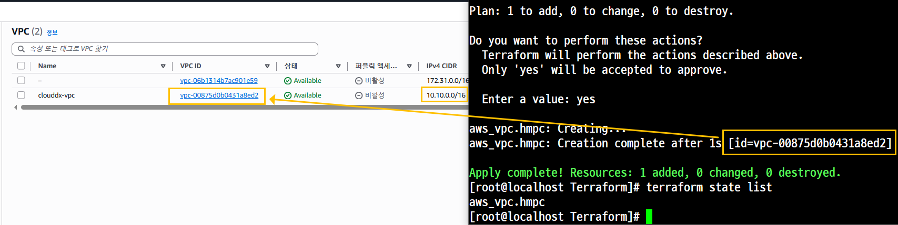

```
aws ec2 describe-vpcs --output yaml
```
- 확인 2. CLI Mode를 통한 확인

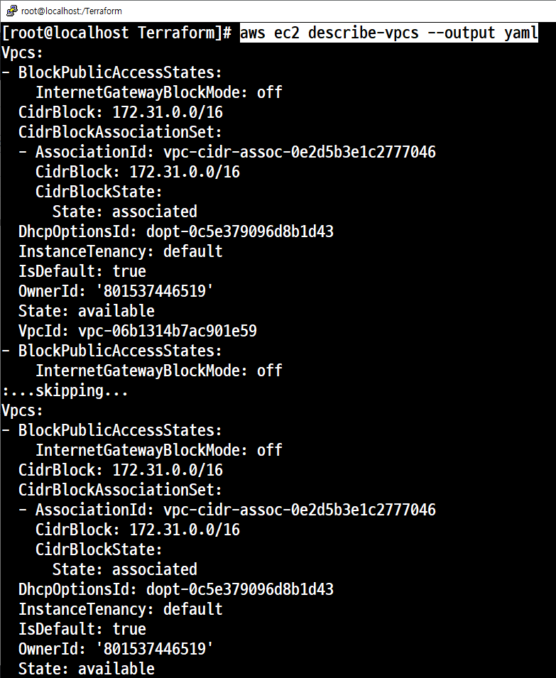
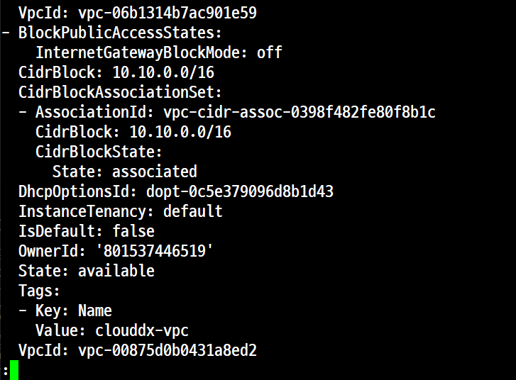

#### Step 2. 생성한 VPC DNS 옵션 수정 (main.tf)
##### 개요
- VPC에 DNS를 설정하려면 'DNS 호스트 이름'과 'DNS 확인'이 모두 VPC에서 활성화되어 있는지 확인해야 한다.
- 즉, VPC 네티워크 속성 'enableDnsHostnames'와 'enableDnsSupport'를 'true'로 설정

- main.tf 수정

```
provider "aws" {
        region = "ap-northeast-2"
}

resource "aws_vpc" "hmvpc"{
        cidr_block = "10.10.0.0/16"
        enable_dns_support = true
        enable_dns_hostnames = true
        tags = {
                Name = "clouddx-vpc"
        }
}
```
- 명령 실행

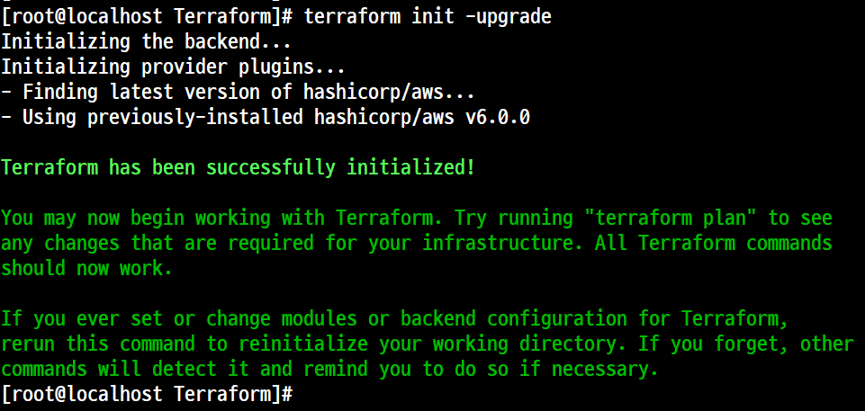

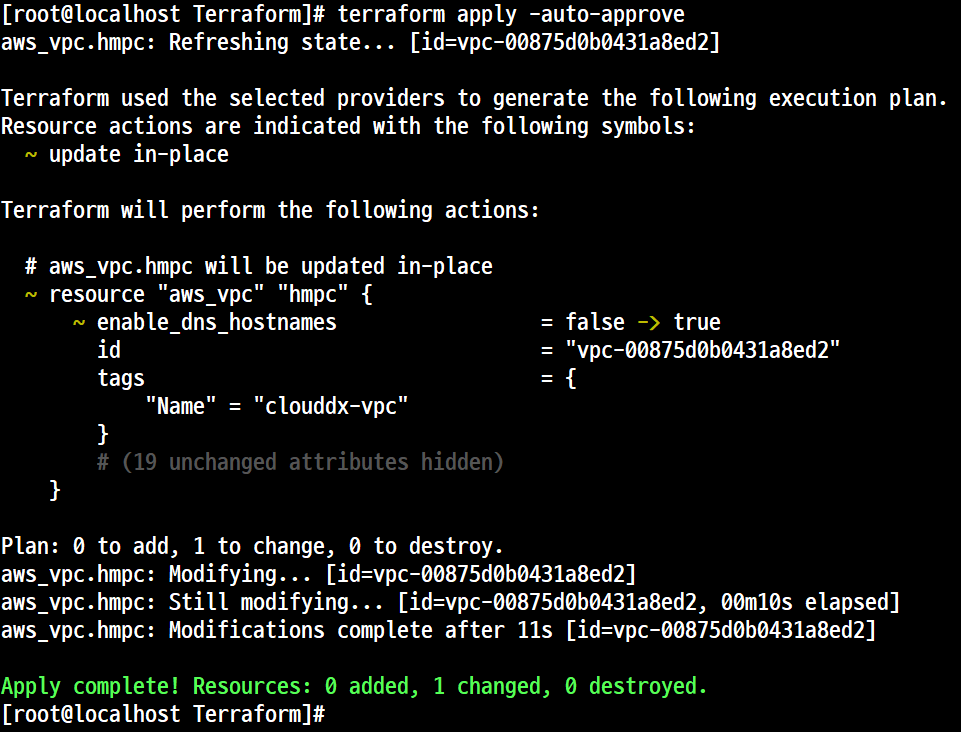

- 확인 1. 'AWS Management Console'을 통한 확인

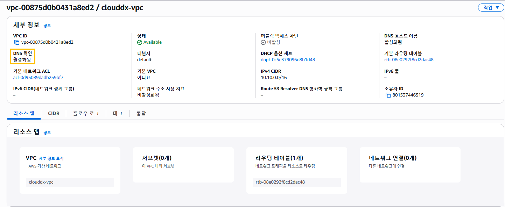

- 확인 2. CLI Mode를 통한 확인

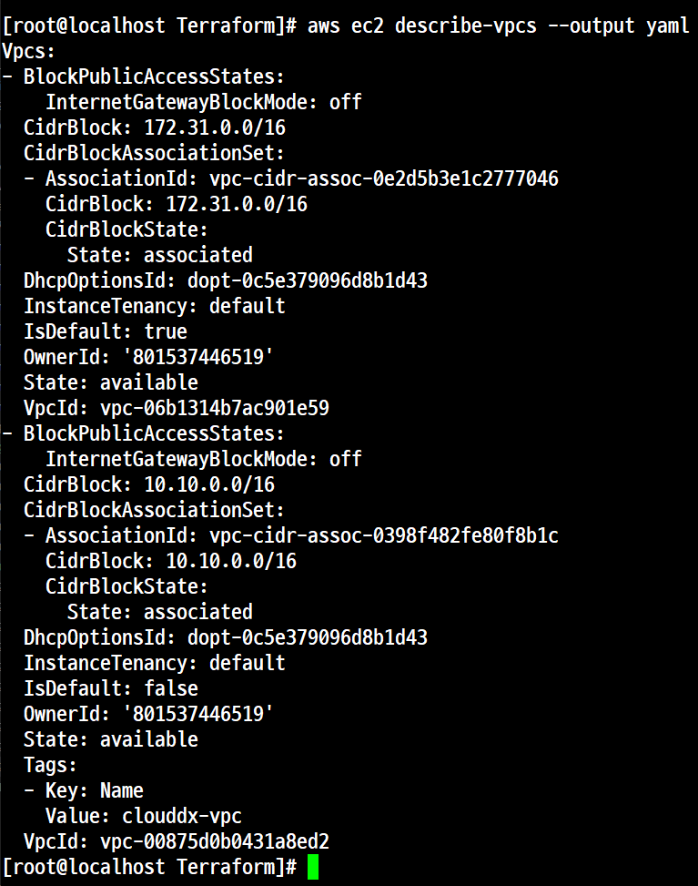


#### Step 3. Subnet 추가
main.tf 아래 추가
```
resource "aws_subnet" "hmsubnet1" {
        vic_id = aws_vpc.hmvpc.id
        cidr_block = "10.10.1.0/24"
        availability_zone = "ap-northeast-2a"

        tags = {
                Name = "hmcloud-subnet1"
        }
}

resource "aws_subnet" "hmsubnet2" {
        vic_id = aws_vpc.hmvpc.id
        cidr_block = "10.10.2.0/24"
        availability_zone = "ap-northeast-2c"

        tags = {
                Name = "hmcloud-subnet2"
        }
}
```

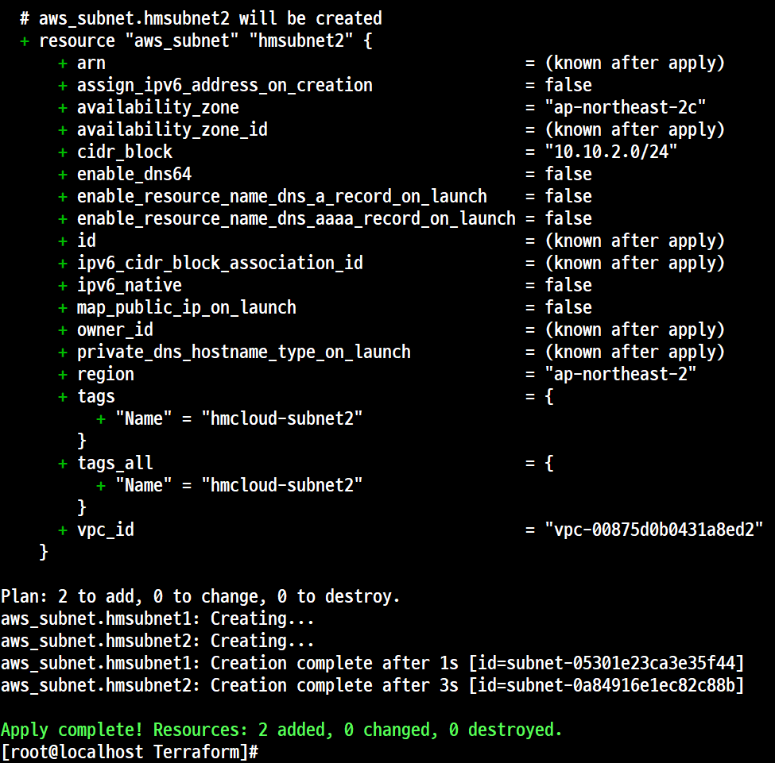

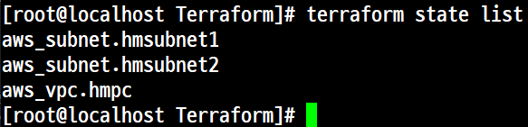

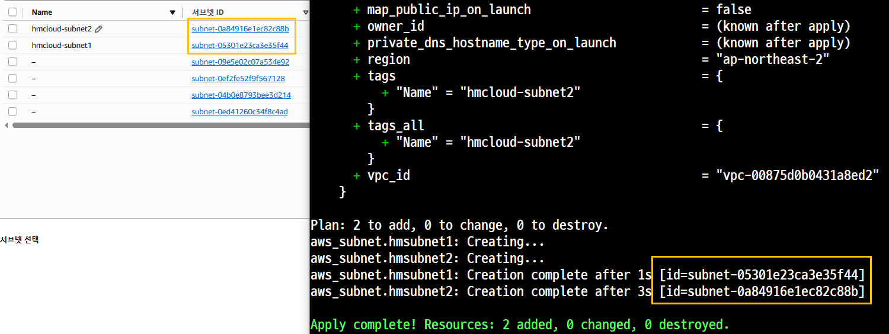

#### Step 4. iGW 생성

main.tf 아래 추가
```
resource "aws_internet_gateway" "hmigw" {
        vpc_id = aws_vpc.hmvpc.id

        tags = {
                Name = "hmcloud-igw"
        }
}
```
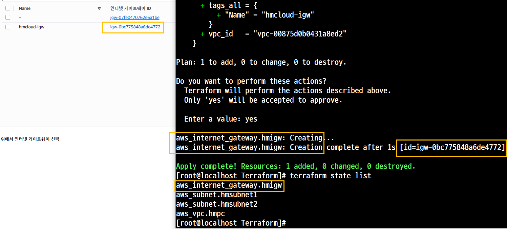

#### Step 5. 라우팅 테이블 생성
- 개요
    - 'Route Table'은 여러 Subnet에서 동시에 사용할 수 있는데 이와 같이 여러 Subnet에서 사용할 수 있도록 연결하는 작업을 'Association' 이라고 한다.
    - 앞에서 추가한 Subnet이 2개이므로 이 2개의 연결을 위한 aws_route_table_association을 사용한다
main.tf 아래추가

```
resource "aws_route_table" "hmrt" {
        vpc_id = aws_vpc.hmvpc.id

        tags = {
                Name = "hmcloud-rt"
        }
}

resource "aws_route_table_association" "hmrtassociation1"{
        subnet_id = aws_subnet.hmsubnet1.id
        route_table_id = aws_route_table.hmrt.id
}

resource "aws_route_table_association" "hmrtassociation2"{
        subnet_id = aws_subnet.hmsubnet2.id
        route_table_id = aws_route_table.hmrt.id
}

resource "aws_route" "mydefaultroute" {
        route_table_id          = aws_route_table.hmrt.id
        destination_cidr_block  = "0.0.0.0/0"
        gateway_id              = aws_internet_gateway.hmigw.id
}

```
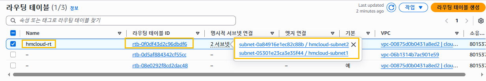

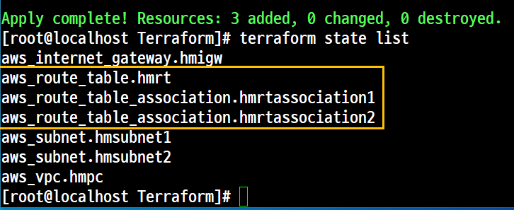

라우터에 연결된 서브넷

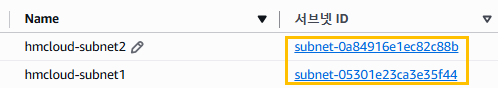