# Kali Linux 2024.3

## 1. 일반
### 개요

- 일반적인 리눅스(RedHat, Ubuntu, CentOS 등)와 달리, 수많은 해킹 관련 도구와 설명서들이 포함되어 있어 모의해킹에 많이 사용된다.
- BackTrack은 Ubuntu를 기반으로 개발되었고, Kali Linux는 Debian을 기반으로 개발되었다.
- **(매우 중요)** Kali Linux는 대부분 가상 머신에서 사용된다.

## 2. 다운로드

- 공식 홈페이지: [www.kali.org](https://www.kali.org)

## 3. 시스템 구성

- 사용 환경: VMWare

## 4. 설치

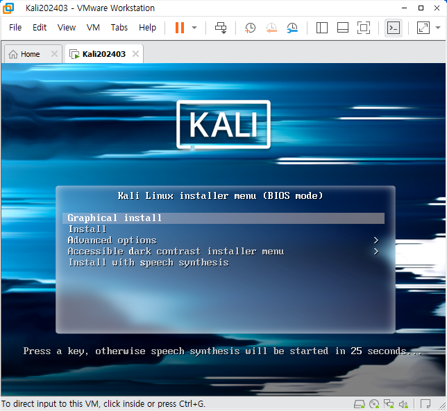

---

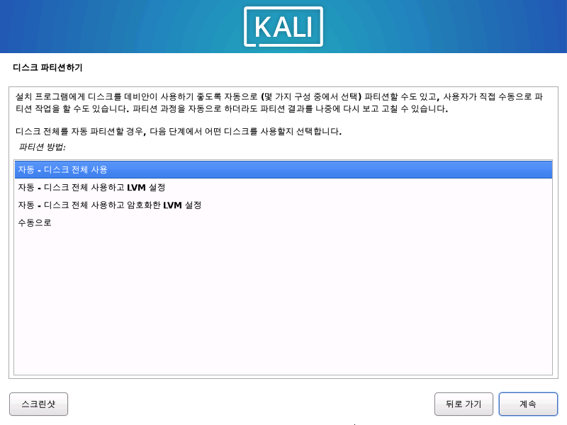

---

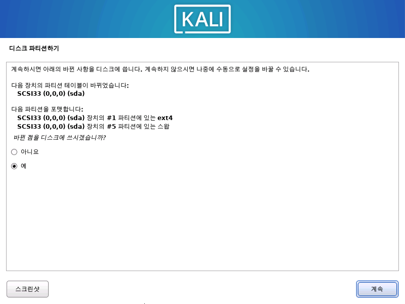

---

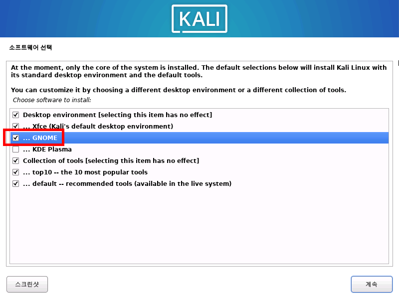

---

- 기본값으로 설치
- GRUB 부트로더 반드시 예

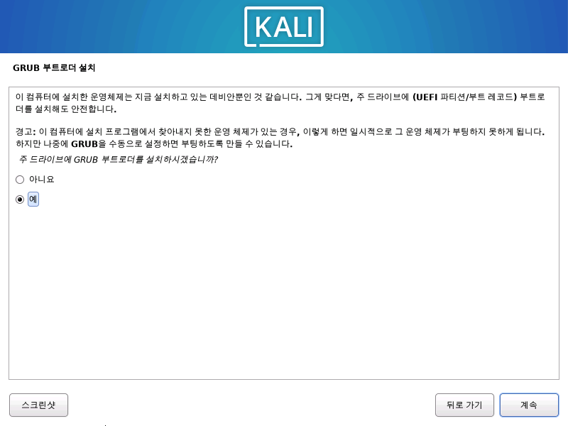

---

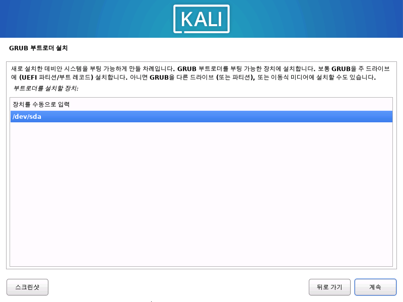

---

## 2. 설치 후 기본 설정

- 로그인<br>

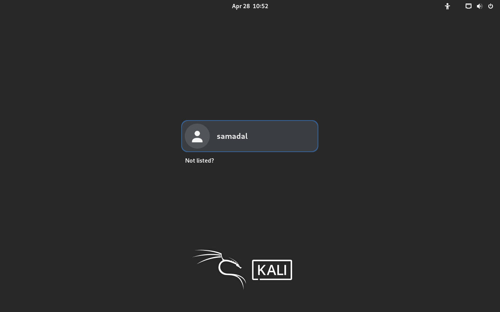

---

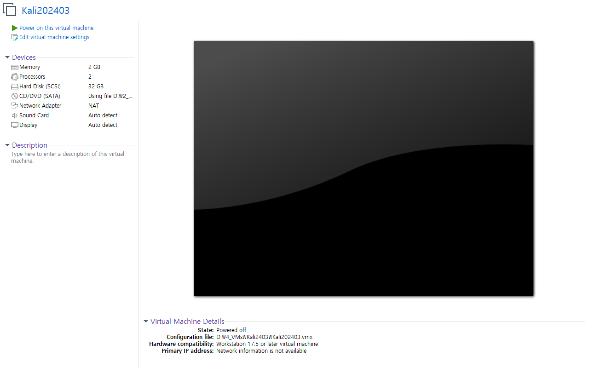

---

### VMWare Tools<br>
---

### 관리자 및 사용자 '쉘 변경'과 '비밀 번호 재설정'<br>
- 관리자 계정으로 들어가기<br>
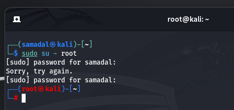

---

- 관리자 쉘 변경<br>
    - 기본 쉘 확인<br>
    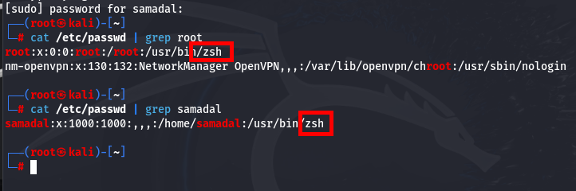
    - 기본 쉘 변경<br>
    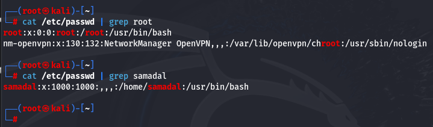
    - 기본 쉘 적용

    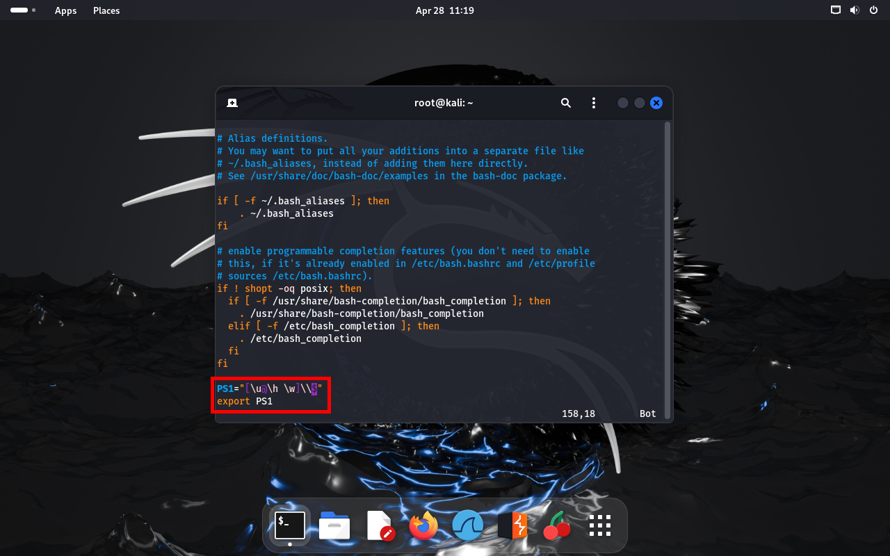
    ```
    vi /root/.bashrc
    vi /home/samadal/.bashrc
    ```
- 비밀번호 재설정<br>
passwd root<br>
passwd samadal

---
## 3. 네트워크 설정
- GUI Mode<br>
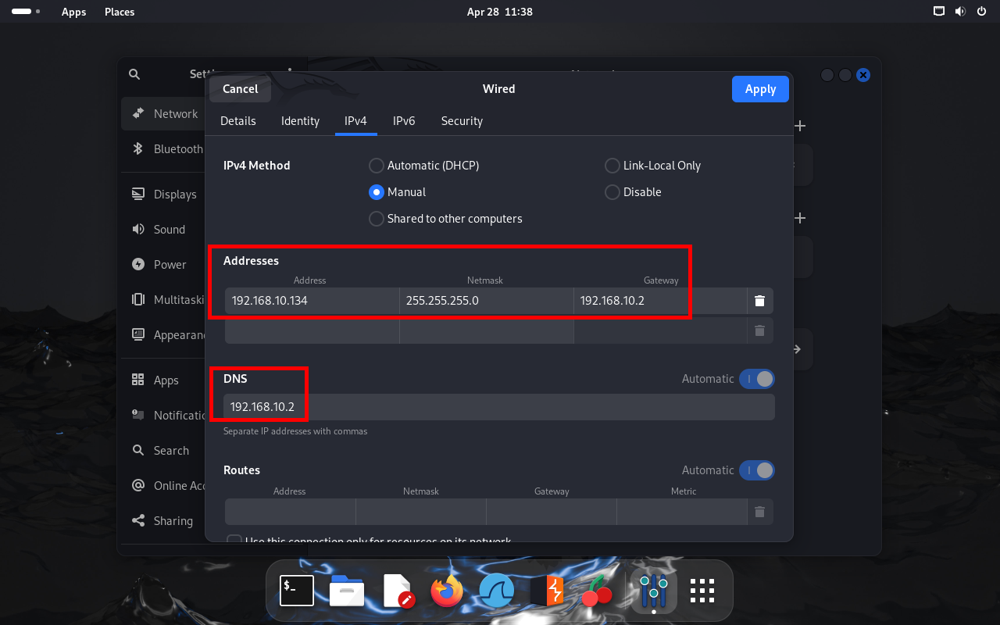<br>
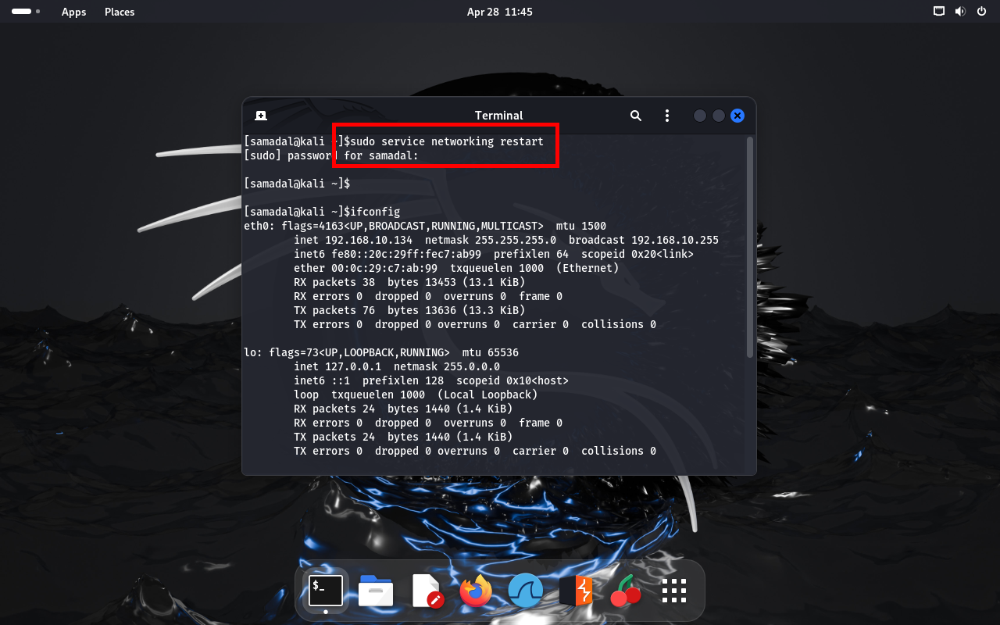<br>

- CLI Mode<br>
```
vi /etc/network/interfaces
```
<br>
```
#Static Settings
auto eth0
iface eth0 inet static
address 192.168.10.134
gateway 192.168.10.2
broadcast 192.168.10.255
newwork 255.255.255.0
```

## 4. SSH Service를 이용한 원격 접속
- SSH 설정
```
vi /vi /etc/ssh/sshd_config
```
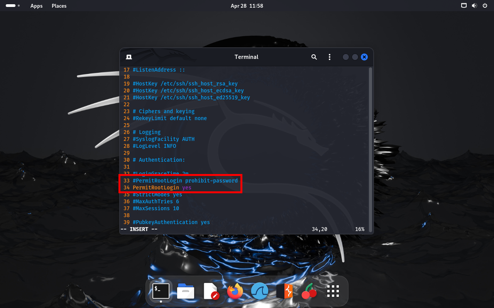<br>
```
sudo systemctl restart ssh #같은명령어

sudo service ssh restart
```
- 방화벽 설정
```
sudo apt install ufw
```
<br>

만약에 업데이트 안될시
```
sudo apt-get update
sudo apt-get upgrade
sydo apt-get install -y ssh
```
```
sudo ufw allow 20/tcp && ufw allow 21/tcp && ufw allow 22/tcp && ufw allow 80/tcp
```
<br>

```
sudo ufw enable
sudo ufw reload
```
<br>

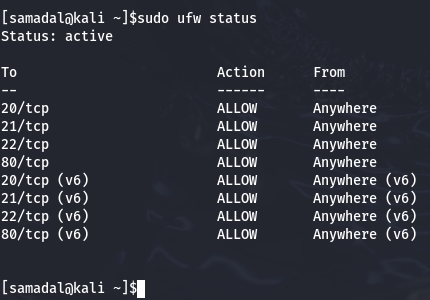

