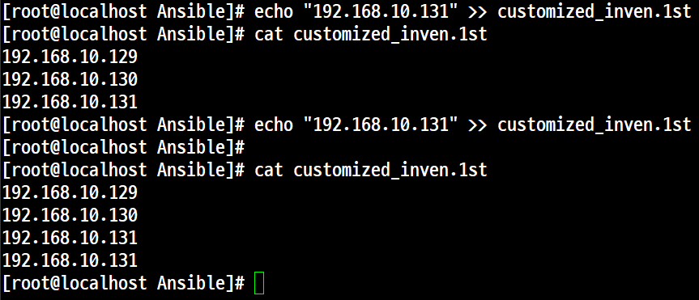
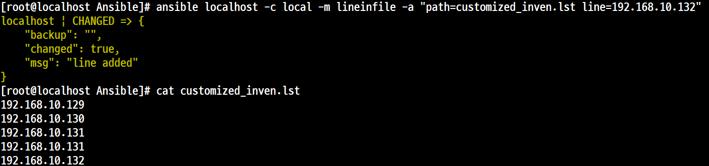
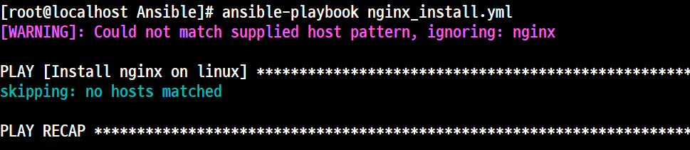
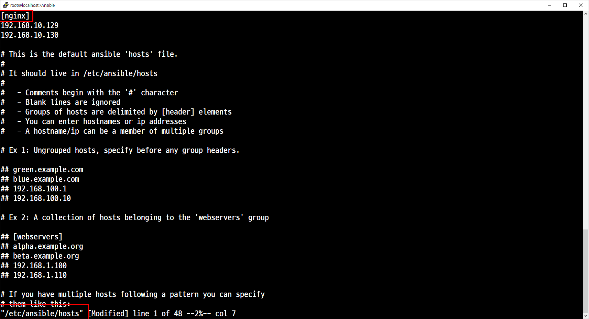
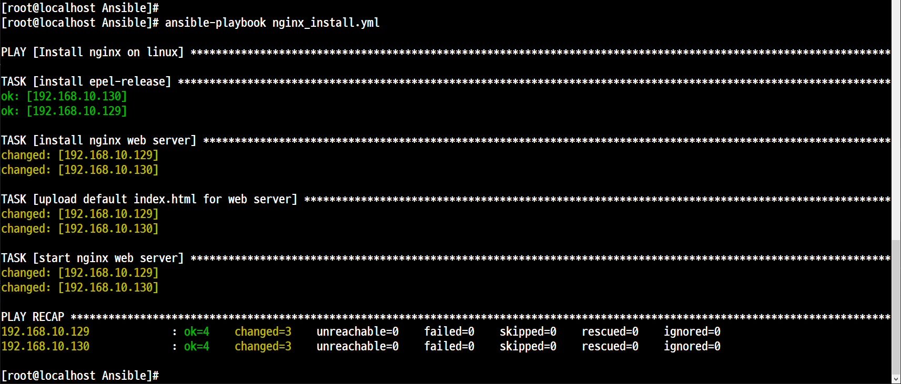
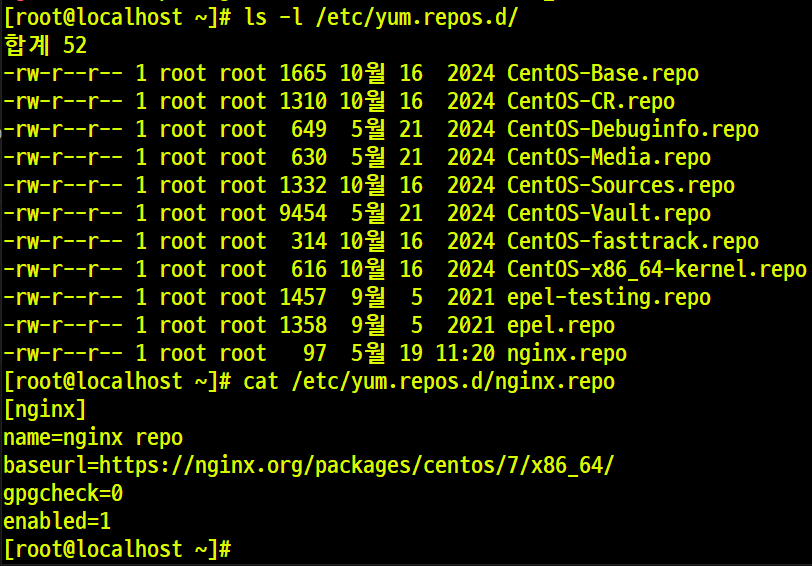
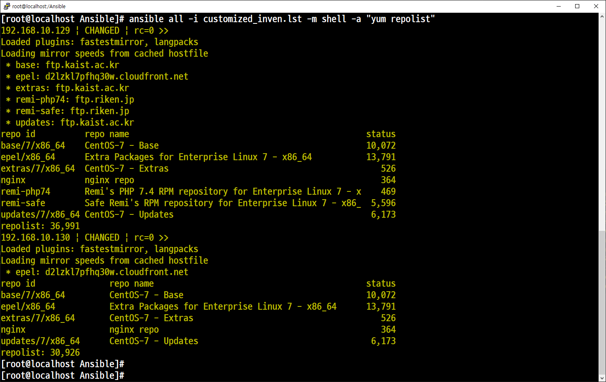

# Ansible 

## 복습

### 인벤토리

Ansible Node 서버의 IP를 기록하는 것
- 기본 인벤토리 ( /etc/ansible/hosts)
- 사용자 지정 인벤토리 (/Ansible/customized_inven)

## 멱등성 (Idempotence)

### 멱등성이 없는 경우



### 멱등성이 있는 경우
- **Ansible**에서 제공한는 대부분의 모듈은 멱등성이 적용되어 있지만 **shell** 모듈은 명령을 그대로 전달하기 때문에 즉, 멱등성이 없기 때문에 **lineinfile** 모듈을 사용한다.



```
"path=customized_inven.lst line=192.168.10.132"
```
path = 경로를 포함한 파일 <br>
line = <추가할 내용>

## 플레이북(playbook)

### nginx_install.yml
```
---
- name: Install nginx on linux
  hosts: nginx
  gather_facts: no

  tasks:
    - name: install epel-release
      yum: name=epel-release state=latest
    - name: install nginx web server
      yum: name=nginx state=present
    - name: upload default index.html for web server
      get_url: url=https://www.nginx.com dest=/usr/share/nginx/html/ mode=0644
    - name: start nginx web server
      service: name=nginx state=started
```
실행 오류



실행 정상





### 설명
'---' <br>
yaml 파일임을 명시한다.  <br>
Shell Scripting 에서의 맨 첫줄에 입력되는 '#!/bin/ksh'등과 유사하다.

'- name: Install nginx on linux' <br>
현재 어떤 노드들에 대해서 'nginx 웹 서버'를 설치할 것인지를 지정한다.

'gather_facts: no' <br>
필요하지 않은 즉, '불필요한 내용은 수집하지 않는다.'는 옵션이다.

'tasks' <br>
플레이북을 실제로 수행하는 테스크 부분이다.<br>
Nginx CentOS 기본 저장소에 있지 않기 때문에 EPEL 저장소를 설치해야 한다.<br>
'Extra Packages for Enterprise Linux'<Br>
최신 버전을 적용해야 하기 때문에 'state=latest'<br>
'get_url' 모듈을 통해서 공식 사이트의 메인 페이지를 가지고 와서 각 노드들의 설치된 nginx 웹 서버의 첫 페이지를 nginx 공식 홈페이지로 변경하는 작업이다.


```
ansible all -i customized_inven.lst -m shell -a "yum -y install epel-release"
```

```
ansible all -i customized_inven.lst -m shell -a "yum -y install epel-relea
```

```
ansible all -i customized_inven.lst -m shell -a "systemctl restart nginx"
```

### 컨트롤러 128
```
yum -y install epel-release
vi /etc/nginx.repo
[nginx]
name=nginx repo
baseurl=https://nginx.org/packages/centos/7/x86_64/
gpgcheck=0
enabled=1

yum -y install nginx-*
yum -y install nginx-* --skip-broken
systemctl restart nginx
curl http://192.168.10.128

```

### 129,130
```
ansible all -i customized_inven.lst -m shell -a "yum -y install epel-release"
ansible all -i customized_inven.lst -m copy -a "src=/etc/yum.repos.d/nginx.repo 
dest=/etc/yum.repos.d/nginx.repo"
ansible all -i customized_inven.lst -m shell -a "yum repolist"
ansible all -i customized_inven.lst -m shell -a "yum -y install nginx-*"
ansible all -i customized_inven.lst -m shell -a "yum -y install nginx-*" --skip-broken
ansible all -i customized_inven.lst -m shell -a "firewall-cmd --permanent
--add-port=tcp/80"
ansible all -i customized_inven.lst -m shell -a "rpm -qa | grep nginx | nl"
ansible all -i customized_inven.lst -m shell -a "systemctl restart nginx"
ansible all -m service -a "name=nginx state=started"
```




