# Ansible 실습 2.

## 첫 번째 플레이북 작성하기
### 플레이북 환경 설정 
- 'Ansible'(root/my-ansible/ansible.cfg)
 
```
[root@localhost my-ansible]# vi ansible.cfg
[root@localhost my-ansible]#
[root@localhost my-ansible]# cat ansible.cfg
[defaults]
inventory = ./inventory
remote_user = user
ask_pass = false

[privilege_escalation]
become = true
become_methode = sudo
become_user = root
become_ask_pass = false
```
### SSH key 생성
```
ssh-keygen
엔터 x 3
Your identification has been saved in /root/.ssh/id_rsa.
Your public key has been saved in /root/.ssh/id_rsa.pub.
The key fingerprint is:
SHA256:3i/IatRDKlTC/ZZwFtOEFKOE6yaUxQzPbfGl/LWvOEU root@localhost.localdomain
The key's randomart image is:
+---[RSA 2048]----+
|  .= oo.**o      |
|   oBo+=+=.      |
|   oo++=+.  .    |
|  o o.  =. .E.   |
| . o   =S ...    |
|  . + o.o.  ..   |
|   o o ..o..  .  |
|      . o oo .   |
|     ...  .oo    |
+----[SHA256]-----+
```
### 관리 노드(Ansible Node 서버들)로 복사


### 첫 번째 플레이북 작성하기
#### 플레이북 작성하기
(ansible-rocky810)# cd /root/my-ansible
(ansible-rocky810)# vi first-playbook.yml

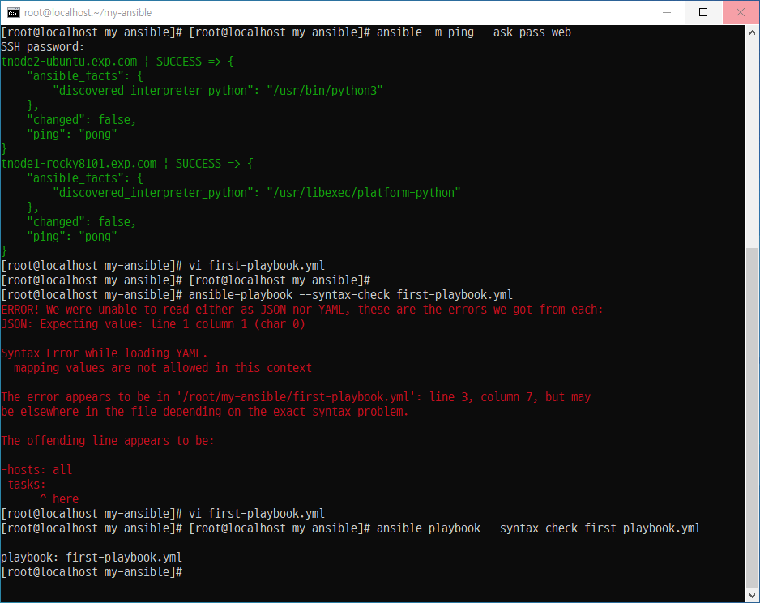

#### 플레이북 문법 체크하기

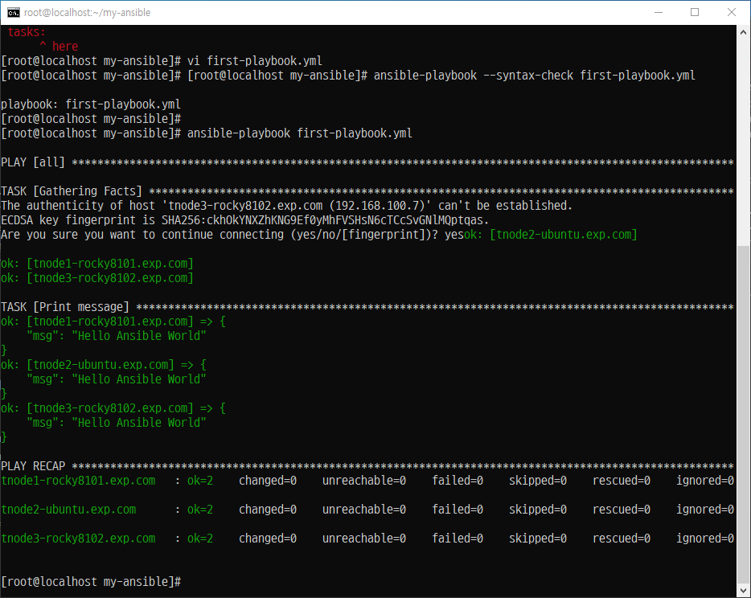

#### 플레이북 실행 점검하기

##### Step 1. 'sshd 서비스' 를 위한 '파일(restart-service.yml)' 생성

##### Step 2. 각 'Node Server'에서 'sshd' 서비스(데몬) 실행 하기 전에 'check'

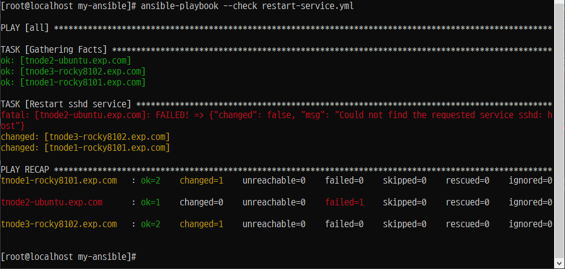

##### Step 3. 각 'Node Server'에서 'sshd' 서비스(데몬) 실행


```
systemctl enable ssh ---> 우분투에서
```
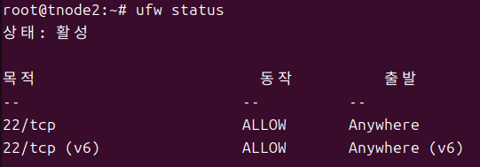


##### Step 4. log (/var/log/messages)

```
May 21 03:13:50 localhost systemd[2212]: tracker-extract.service: Scheduled restart job, restart counter is at 2.
May 21 03:13:50 localhost systemd[2212]: Stopped Tracker metadata extractor.
May 21 03:13:50 localhost systemd[2212]: Starting Tracker metadata extractor...
.... 계속나옴
```

##### Step 5. 

## 3. 변수와 팩트 사용하기

### 📌 변수와 팩트 사용하기

Ansible에서는 동일한 코드 구문에 입력되는 값에 따라 동작을 변경하여 **반복적인 사용**이 가능하도록 변수를 정의하고 사용할 수 있습니다.

변수를 어디에 정의하느냐에 따라 다음과 같이 분류됩니다.

- **그룹 변수 (Group Variables)**
- **호스트 변수 (Host Variables)**
- **플레이 변수 (Play Variables)**

---

### 🔸 일반적인 의미의 변수 종류

| 종류 | 설명 |
|------|------|
| 일반 변수 | 일반적인 내용을 저장 |
| 보안 변수 | 패스워드처럼 암호화가 필요한 정보를 저장 |
| 시스템 변수 (팩트) | 시스템에서 수집한 값들을 저장 |

---

### 🔸 변수의 종류와 사용법

Ansible은 다양한 변수를 사용하여 다음과 같은 작업 값을 저장할 수 있습니다.

- 사용자
- 설치할 패키지
- 재시작할 서비스
- 생성 또는 삭제할 파일명 등

이를 통해 **플레이북을 재사용**할 수 있고, **사용자 입력값을 쉽게 반영**할 수 있습니다.

Ansible에서 사용되는 변수 종류는 다음과 같습니다.

- **그룹 변수 (Group Vars)**
- **호스트 변수 (Host Vars)**
- **플레이 변수 (Play Vars)**
- **추가 변수 (Extra Vars)**
- **작업 변수 (Task Vars)** → 플레이 결과를 저장하는 데 사용

---

> ✅ 정리: 변수 활용을 통해 코드 재사용성을 높이고, 다양한 환경에 유연하게 대응할 수 있습니다.

### 그룹 변수

#### Step 1. '/root/my-ansible/inventory' 파일 수정

```
[web]
tnode1-rocky8101.exp.com
tnode2-ubuntu.exp.com

[db]
tnode3-rocky8102.exp.com

[all:children]
web
db

[all:vars]
user=ansible            ----> 아래 두줄 추가
```
#### Step 2. '/root/my-ansible/create-user.yml' 파일 생성

```
---


- hosts: all
  tasks:
    - name: Create User {{ user }}
      ansible.builtin.user:
        name: "{{ user }}"
        state: present
```

#### Step 3. 플레이북 실행

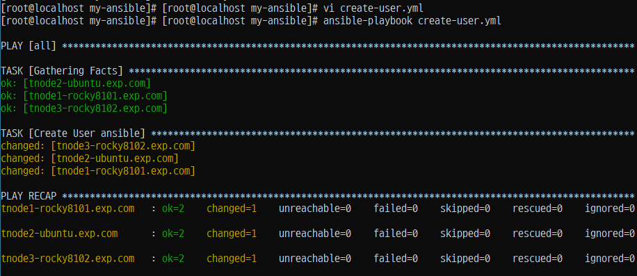
```
ansible-playbook create-user.yml
```

#### Step 4. 각 'Node Server'에서 확인

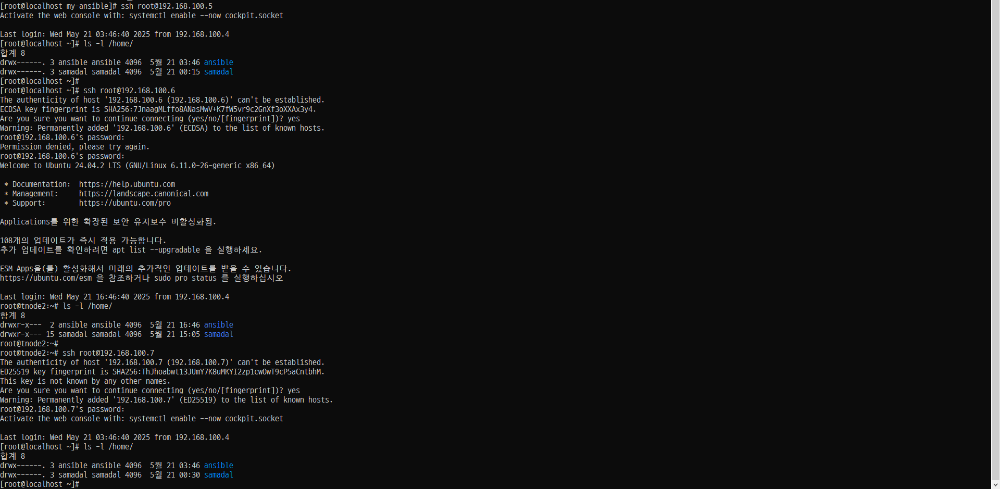

### 호스트 변수 (변수를 해당 호스트에서만 사용할 수 있다.)

#### Step 1. (root/my-ansible/inventory) 수정

```
[web]
tnode1-rocky8101.exp.com
tnode2-ubuntu.exp.com

[db]
tnode3-rocky8102.exp.com user=ansible1

[all:children]
web
db

[all:vars]
user=ansible
```

#### Step 2. (root/my-ansible/create-user1.yml) 파일 생성

```
---


- hosts: db
  tasks:
    - name: Create User {{ user }}
      ansible.builtin.user:
        name: "{{ user }}"
        state: present
```

#### Step 3. 플레이북 실행

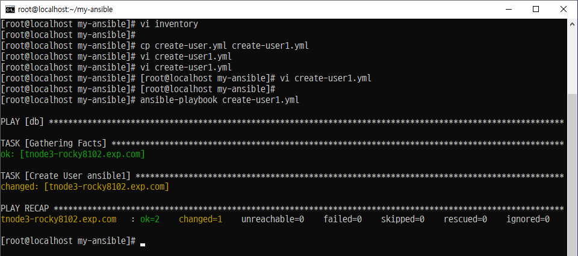

#### Step 4. 각 'Node Server' 에서 확인

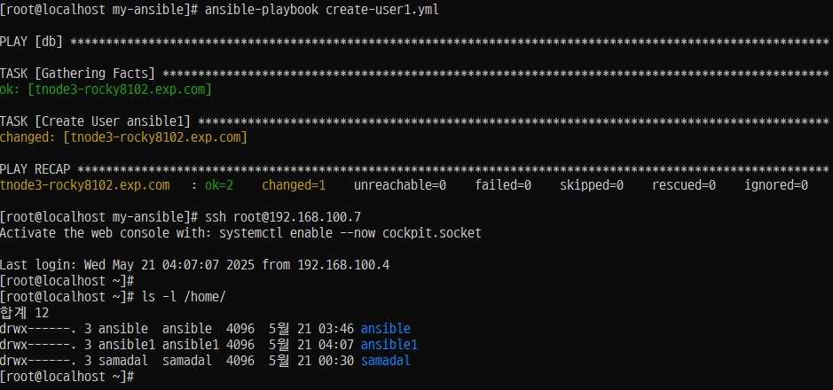

### 플레이 변수 (플레이북 내에서 선언되는 변수를 말한다.)

#### Step 1. (root/my-ansible/create-user3.yml) 파일 생성
```
---


- hosts: all
  vars:
    user: ansible2


  tasks:
  - name: Create User {{ user }}
    ansible.builtin.user:
      name: "{{ user }}"
      state: present
```
#### Step 2. 플레이북 실행

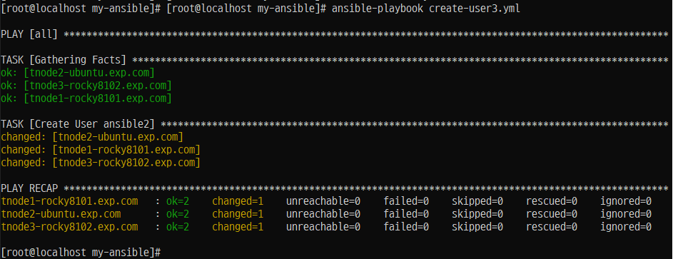
```
ansible-playbook create-user3.yml
```

#### Step 3. 확인

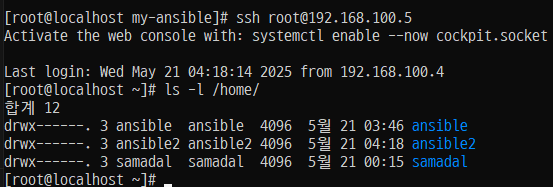

#### Step 4. 플레이 변수를 별도의 파일로 분리, 정의하고 플레이북에 선언하는 변수 (root/my-ansible/vars/users.yml)

```
---


- hosts: all
  vars_files:
    - vars/users.yml


  tasks:
  - name: Create User {{ user }}
    ansible.builtin.user:
      name: "{{ user }}"
      state: present
```

#### Step 5. 실행
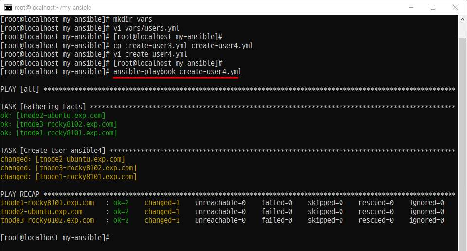

#### Step 6. 확인

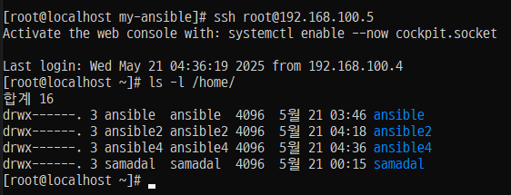

### 추가 변수 (파라미터 실행할 때)


```
ansible-playbook -e user=ansible5 create-user4.yml
```

-e 옵션은 --extra_vars의 약어로 **추가 변수**를 의미함

#### 확인

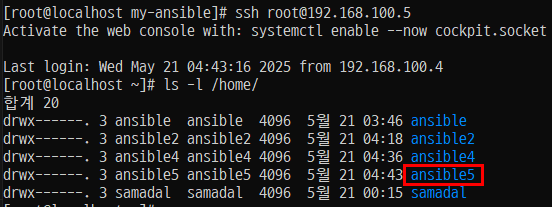


### 작업 변수

- 개요
    - 작업 변수는 플레이북의 태스크 부행 결과를 저장한 것을 의미한다.
    - 특정 작업 수행 후 그 결과를 후속 작업에서 사용할 때 주로 사용된다.
    - 예를 들어 클라우드 시스템에 VM을 생성한다고 가정해보겠다.
    이를 위해서는 네트워크나 운영체제 이미지와 같은 가상 자원이 필요하다. 가상 자원을 조회하고, 결과를 가지고 VM을 생성할 때는 작업 변수를 사용하면 좋다.
    - (핵심) 명령의 결과를 화면에 출력할 뿐이다.

#### Step 1. (root/my-ansible/create-user6.yml) 파일 추가

- create-user1.yml 파일을 create-user6.yml 파일로 복사한다.
- create-user6.yml 파일을 열고 Create User 태스크에 'register:result'라는 문구를 추가한다.
- register를 선언하면 태스크를 실행한 결과를 register 다음에 나오는 result라는 변수에 저장하겠다는 의미가 된다.그리고 result라는 변수에 저장한 결과를 debug 모듈을 통해 출력한다.
```
---


- hosts: db
  tasks:
  - name: Create User {{ user }}
    ansible.builtin.user:
      name: "{{ user }}"
      state: present
    register: result

  - ansible.builtin.debug:
      var: result
```

#### Step 2. 파일 실행
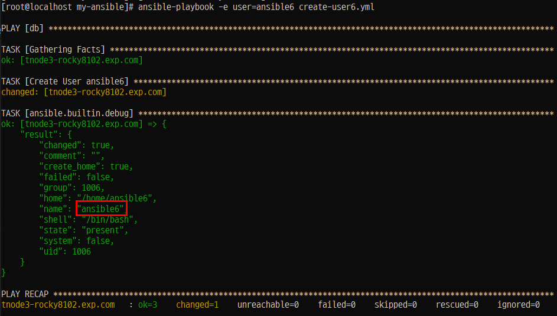

```
ansible-playbook -e user=ansible6 create-user6.yml
```

#### Step 3. 확인

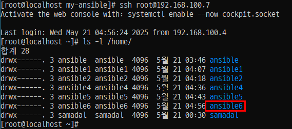


