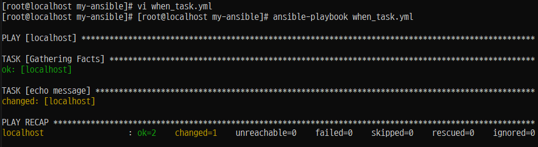
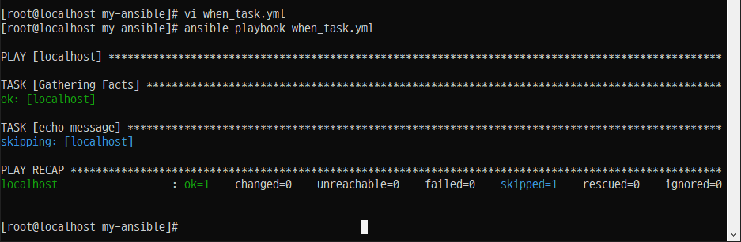
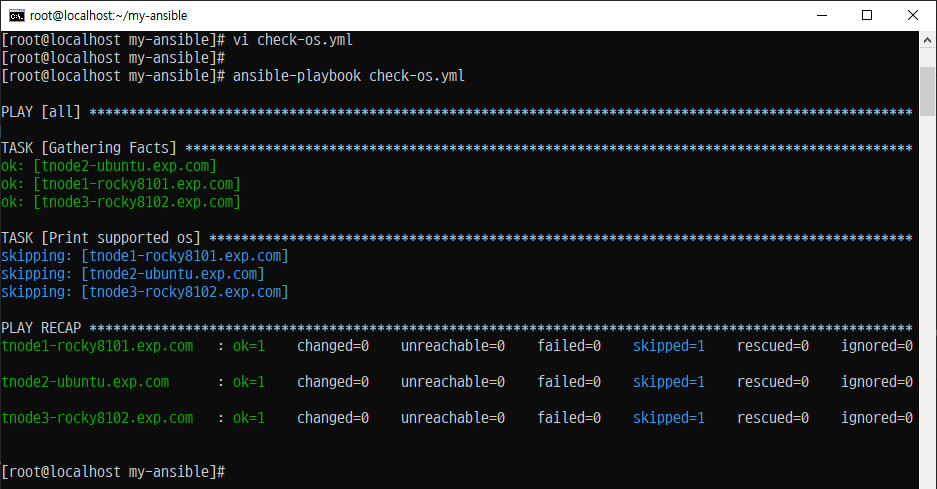
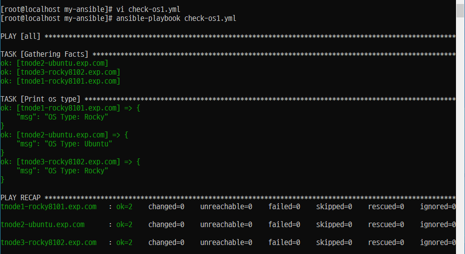
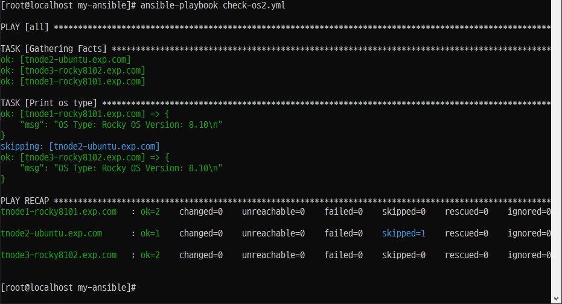
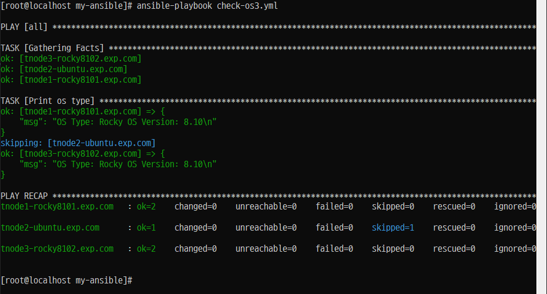
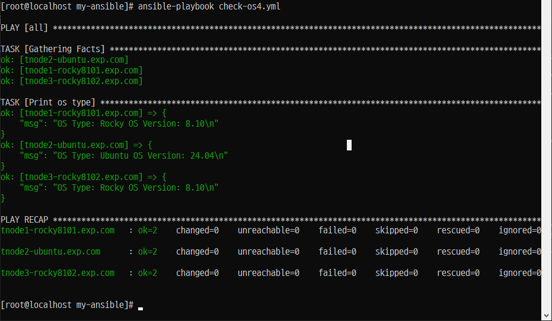
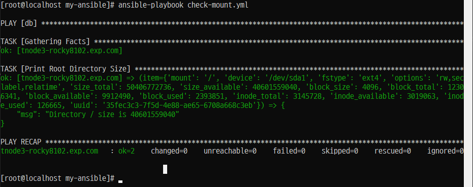
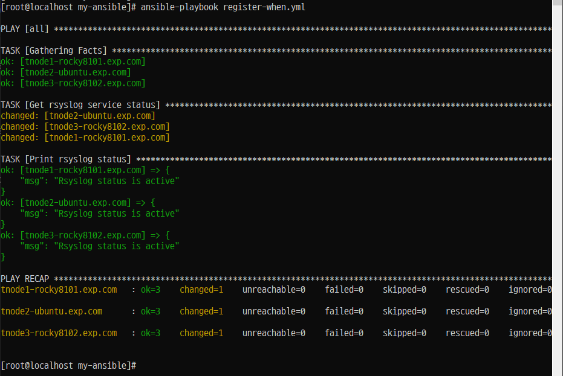

# ⚙️ Ansible 조건문 (when)

## 📌 개요

- Ansible에서는 `when` 조건문을 사용하여 **특정 조건이 참일 때만 작업(task)이나 플레이(play)를 실행**할 수 있습니다.
- 조건문을 활용하면 운영체제 종류, 변수 값, Ansible 팩트 등에 따라 **유연한 작업 제어**가 가능합니다.

---

## 🛠 조건문 작성 방식

```yaml
- name: Install Nginx on CentOS only
  yum:
    name: nginx
    state: present
  when: ansible_facts.distribution == "CentOS"
```

---

## ✅ 사용할 수 있는 조건 요소

- **플레이 변수**
- **작업 변수**
- **Ansible 팩트 (`ansible_facts.*`)**
- **Boolean 값**

---

### 조건 작업 구문

개요


- 'when 문'은 조건부로 작업을 실행할 때 테스트할 조건을 값으로 사용한다.


- 조건이 충족되면 작업이 실행되고. 조건이 충족되지 않으면 작업을 건너뛴다.


- 'when 문'을 테스트하는 가장 간단한 조건 중 하나는 'Boolean 변수'가 'true'인지 'false'인지의 여부이다.

### Step 1. 'Boolean 대수'를 이용한 'when'문이 동작되는 파일 생성

#### /root/my-ansible/when_task.yml
```
---

- hosts: localhost
  vars:
    run_my_task: true


  tasks:
    - name: echo message
      ansible.builtin.shell: "echo test"
      when: run_my_task
```
### Step 2. 플레이북 실행



### Step 3.'Boolean 대수'를 이용한 'when'문이 동작되는 파일 수정

#### /root/my-ansible/when_task.yml
```
---

- hosts: localhost
  vars:
    run_my_task: false


  tasks:
    - name: echo message
      ansible.builtin.shell: "echo test"
      when: run_my_task
```

### Step 4. 플레이북 실행 2




# 조건 연산자

## 개요
: OS 종류에 따라 데스크를 수행한다.

### Step 1. 'vars' 키워드를 이용한 변수를 사전 타입의 값으로 저장하고 조건문을 추가
#### /root/my-ansible/check-os.yml
```
---

- hosts: all
  vars:
    supported_distros:
      - RedHat
      - CentOS


  tasks:
    - name: Print supported os
      ansible.builtin.debug:
        msg: "This {{ ansible_facts['distribution'] }} need to use dnf"
      when: ansible_facts['distribution'] in supported_distros
```
### 플레이북 실행




# 복수 조건문(다중 조건문)

## 개요
- 조건문안에 또다른 조건문이 포함된 형태

### Step 1. 파일 복사 후 수정 1. OR

#### /root/my-ansible/check-os1.yml
```
---

- hosts: all


  tasks:
    - name: Print os type
      ansible.builtin.debug:
        msg: "OS Type: {{ ansible_facts['distribution'] }}"
      when: ansible_facts['distribution'] == "Rocky" or ansible_facts['distribution'] == "Ubuntu"
```
### Step 2. 플레이북 실행


### Step 3. 파일 복사 후 수정 2. and

#### /root/my-ansible/check-os2.yml

```
---

- hosts: all


  tasks:
    - name: Print os type
      ansible.builtin.debug:
        msg: >
             OS Type: {{ ansible_facts['distribution'] }}
             OS Version: {{ ansible_facts['distribution_version'] }}
      when: ansible_facts['distribution'] == "CentOS" and ansible_facts['distribution'] == "8"
```

### 번외 OR

```
---

- hosts: all


  tasks:
    - name: Print os type
      ansible.builtin.debug:
        msg: >
             OS Type: {{ ansible_facts['distribution'] }}
             OS Version: {{ ansible_facts['distribution_version'] }}
      when: ansible_facts['distribution'] == "Rocky" or ansible_facts['distribution'] == "8"
```

### Step 4. 플레이북 실행




### Step 5. 파일 수정, 사전 이용
#### /root/my-ansible/check-os3.yml
```
---

- hosts: all


  tasks:
    - name: Print os type
      ansible.builtin.debug:
        msg: >
             OS Type: {{ ansible_facts['distribution'] }}
             OS Version: {{ ansible_facts['distribution_version'] }}
      when:
        - ansible_facts['distribution'] == "Rocky"
        - ansible_facts['distribution_version'] == "8.10"
```

### Step 6. 플레이북 실행



### Step 7. 파일수정

#### /root/my-ansible/check-os4.yml

```
---

- hosts: all


  tasks:
    - name: Print os type
      ansible.builtin.debug:
        msg: >
             OS Type: {{ ansible_facts['distribution'] }}
             OS Version: {{ ansible_facts['distribution_version'] }}
      when: >
          ( ansible_facts['distribution'] == "Rocky" and
            ansible_facts['distribution_version'] == "8.10" )
          or
          ( ansible_facts['distribution'] == "Ubunut" and
            ansible_facts['distribution_version'] == "24.04" )
```

### Step 8. 플레이북 실행



# 반복문과 조건문

## 개요

### Step 1. 파티션 용량
#### /root/my-ansible/check-mount
```
---

- hosts: db


  tasks:
    - name: Print Root Directory Size
      ansible.builtin.debug:
        msg: "Directory {{ item.mount }} size is {{ item.size_available }}"
      loop: "{{ ansible_facts['mounts'] }}"
      when: item['mount'] == "/" and item['size_available'] > 300000000
```

### Step 2. 플레이북 실행



### Step 3. 'register' 키워드를 이용한 작업변수
#### /root/my-ansible/register-when.yml
```
---

- hosts: all

  tasks:
    - name: Get rsyslog service status
      ansible.builtin.command: systemctl is-active rsyslog
      register: result


    - name: Print rsyslog status
      ansible.builtin.debug:
        msg: "Rsyslog status is {{ result.stdout }}"
      when: result.stdout == "active"
```
### Step 4. 플레이북 실행

