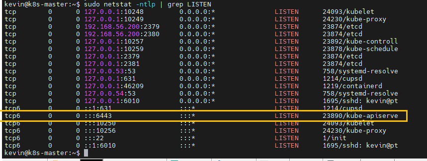
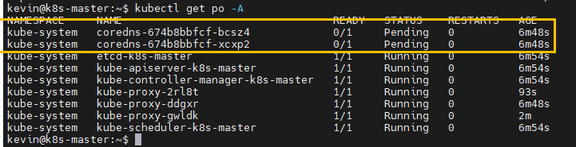
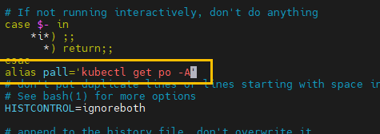
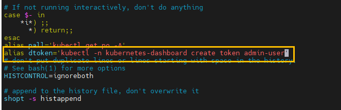
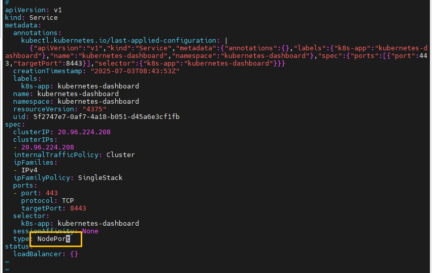
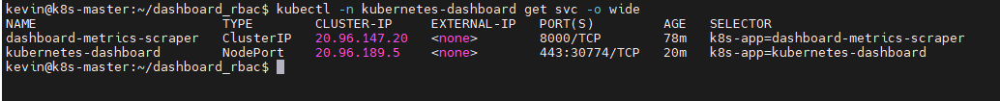
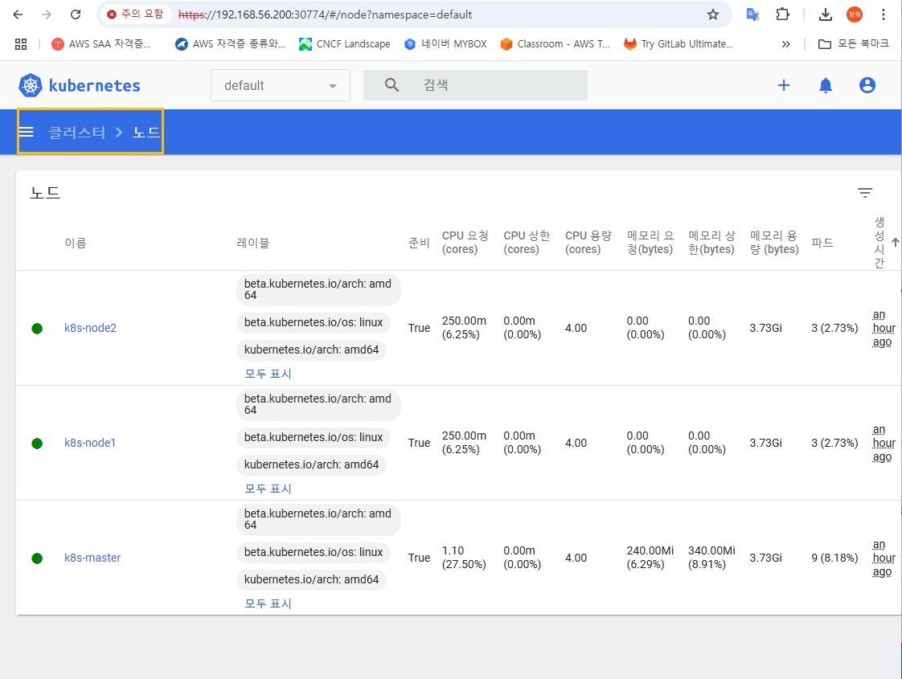

```
kevin@k8s-master:~$ sudo kubeadm init --pod-network-cidr=10.96.0.0/12 --service-cidr=20.96.0.0/16 --apiserver-advertise-address=192.168.56.200

[init] Using Kubernetes version: v1.33.2
[preflight] Running pre-flight checks
[preflight] Pulling images required for setting up a Kubernetes cluster
[preflight] This might take a minute or two, depending on the speed of your internet connection
[preflight] You can also perform this action beforehand using 'kubeadm config images pull'
W0703 16:46:42.774755   22869 checks.go:846] detected that the sandbox image "registry.k8s.io/pause:3.8" of the container runtime is inconsistent with that used by kubeadm.It is recommended to use "registry.k8s.io/pause:3.10" as the CRI sandbox image.
[certs] Using certificateDir folder "/etc/kubernetes/pki"
[certs] Generating "ca" certificate and key
[certs] Generating "apiserver" certificate and key
[certs] apiserver serving cert is signed for DNS names [k8s-master kubernetes kubernetes.default kubernetes.default.svc kubernetes.default.svc.cluster.local] and IPs [20.96.0.1 192.168.56.200]
[certs] Generating "apiserver-kubelet-client" certificate and key
[certs] Generating "front-proxy-ca" certificate and key
[certs] Generating "front-proxy-client" certificate and key
[certs] Generating "etcd/ca" certificate and key
[certs] Generating "etcd/server" certificate and key
[certs] etcd/server serving cert is signed for DNS names [k8s-master localhost] and IPs [192.168.56.200 127.0.0.1 ::1]
[certs] Generating "etcd/peer" certificate and key
[certs] etcd/peer serving cert is signed for DNS names [k8s-master localhost] and IPs [192.168.56.200 127.0.0.1 ::1]
[certs] Generating "etcd/healthcheck-client" certificate and key
[certs] Generating "apiserver-etcd-client" certificate and key
[certs] Generating "sa" key and public key
[kubeconfig] Using kubeconfig folder "/etc/kubernetes"
[kubeconfig] Writing "admin.conf" kubeconfig file
[kubeconfig] Writing "super-admin.conf" kubeconfig file
[kubeconfig] Writing "kubelet.conf" kubeconfig file
[kubeconfig] Writing "controller-manager.conf" kubeconfig file
[kubeconfig] Writing "scheduler.conf" kubeconfig file
[etcd] Creating static Pod manifest for local etcd in "/etc/kubernetes/manifests"
[control-plane] Using manifest folder "/etc/kubernetes/manifests"
[control-plane] Creating static Pod manifest for "kube-apiserver"
[control-plane] Creating static Pod manifest for "kube-controller-manager"
[control-plane] Creating static Pod manifest for "kube-scheduler"
[kubelet-start] Writing kubelet environment file with flags to file "/var/lib/kubelet/kubeadm-flags.env"
[kubelet-start] Writing kubelet configuration to file "/var/lib/kubelet/config.yaml"
[kubelet-start] Starting the kubelet
[wait-control-plane] Waiting for the kubelet to boot up the control plane as static Pods from directory "/etc/kubernetes/manifests"
[kubelet-check] Waiting for a healthy kubelet at http://127.0.0.1:10248/healthz. This can take up to 4m0s
[kubelet-check] The kubelet is healthy after 1.014399188s
[control-plane-check] Waiting for healthy control plane components. This can take up to 4m0s
[control-plane-check] Checking kube-apiserver at https://192.168.56.200:6443/livez
[control-plane-check] Checking kube-controller-manager at https://127.0.0.1:10257/healthz
[control-plane-check] Checking kube-scheduler at https://127.0.0.1:10259/livez
[control-plane-check] kube-controller-manager is healthy after 4.114129976s
[control-plane-check] kube-scheduler is healthy after 4.952635059s
[control-plane-check] kube-apiserver is healthy after 7.001418942s
[upload-config] Storing the configuration used in ConfigMap "kubeadm-config" in the "kube-system" Namespace
[kubelet] Creating a ConfigMap "kubelet-config" in namespace kube-system with the configuration for the kubelets in the cluster
[upload-certs] Skipping phase. Please see --upload-certs
[mark-control-plane] Marking the node k8s-master as control-plane by adding the labels: [node-role.kubernetes.io/control-plane node.kubernetes.io/exclude-from-external-load-balancers]
[mark-control-plane] Marking the node k8s-master as control-plane by adding the taints [node-role.kubernetes.io/control-plane:NoSchedule]
[bootstrap-token] Using token: 5ovslq.7g6tybvspoxt65c3
[bootstrap-token] Configuring bootstrap tokens, cluster-info ConfigMap, RBAC Roles
[bootstrap-token] Configured RBAC rules to allow Node Bootstrap tokens to get nodes
[bootstrap-token] Configured RBAC rules to allow Node Bootstrap tokens to post CSRs in order for nodes to get long term certificate credentials
[bootstrap-token] Configured RBAC rules to allow the csrapprover controller automatically approve CSRs from a Node Bootstrap Token
[bootstrap-token] Configured RBAC rules to allow certificate rotation for all node client certificates in the cluster
[bootstrap-token] Creating the "cluster-info" ConfigMap in the "kube-public" namespace
[kubelet-finalize] Updating "/etc/kubernetes/kubelet.conf" to point to a rotatable kubelet client certificate and key
[addons] Applied essential addon: CoreDNS
[addons] Applied essential addon: kube-proxy

Your Kubernetes control-plane has initialized successfully!

To start using your cluster, you need to run the following as a regular user:

  mkdir -p $HOME/.kube
  sudo cp -i /etc/kubernetes/admin.conf $HOME/.kube/config
  sudo chown $(id -u):$(id -g) $HOME/.kube/config

Alternatively, if you are the root user, you can run:

  export KUBECONFIG=/etc/kubernetes/admin.conf

You should now deploy a pod network to the cluster.
Run "kubectl apply -f [podnetwork].yaml" with one of the options listed at:
  https://kubernetes.io/docs/concepts/cluster-administration/addons/

Then you can join any number of worker nodes by running the following on each as root:

kubeadm join 192.168.56.200:6443 --token 5ovslq.7g6tybvspoxt65c3 \
        --discovery-token-ca-cert-hash sha256:5e791104fa33d15caf36234a0c12ae5a696cabd1d17f930ed96ba7817840ed63

```
```
  mkdir -p $HOME/.kube
  sudo cp -i /etc/kubernetes/admin.conf $HOME/.kube/config
  sudo chown $(id -u):$(id -g) $HOME/.kube/config
```

node1, node2

```
sudo kubeadm join 192.168.56.200:6443 --token 5ovslq.7g6tybvspoxt65c3 \
        --discovery-token-ca-cert-hash sha256:5e791104fa33d15caf36234a0c12ae5a696cabd1d17f930ed96ba7817840ed63
```





```
curl -O https://raw.githubusercontent.com/projectcalico/calico/v3.30.2/manifests/calico.yaml
```

- apply tab키 먹히게 하기

```
kevin@k8s-master:~$ source <(kubectl completion bash)
kevin@k8s-master:~$ echo "source <(kubectl completion bash)" >> ~/.bashrc
kevin@k8s-master:~$ . .bashrc
kevin@k8s-master:~$
kevin@k8s-master:~$ kubectl apply -f calico.yaml

```

```
docker pull docker.io/calico/cni:v3.30.2
docker pull docker.io/calico/node:v3.30.2
docker pull docker.io/calico/kube-controllers:v3.30.2
```

```
kubectl delete -f calico.yaml
kubectl apply -f calico.yaml
```

- 자주 쓰는 명령어 별칭으로 줄여쓰기

```
kubectl get po -A 
vi .bashrc

alias pall='kubectl get po -A'

. .bashrc = source .bashrc  ----> 적용
pall
```



https://github.com/kubernetes/dashboard/releases

```
kubectl apply -f https://raw.githubusercontent.com/kubernetes/dashboard/v2.7.0/aio/deploy/recommended.yaml
```
```
mkdir dashboard_rbac && cd $_
```

```
vi dashboard-admin-user.yaml

apiVersion: v1
kind: ServiceAccount
metadata:
  name: admin-user
  namespace: kubernetes-dashboard

vi ClusterRoleBinding-admin-user.yaml

apiVersion: rbac.authorization.k8s.io/v1
kind: ClusterRoleBinding
metadata:
  name: admin-user
roleRef:
  apiGroup: rbac.authorization.k8s.io
  kind: ClusterRole
  name: cluster-admin
subjects:
- kind: ServiceAccount
  name: admin-user
  namespace: kubernetes-dashboard
```
```
kevin@k8s-master:~/dashboard_rbac$ kubectl apply -f dashboard-admin-user.yaml
kevin@k8s-master:~/dashboard_rbac$ kubectl apply -f ClusterRoleBinding-admin-user.yaml 	

kevin@k8s-master:~/dashboard_rbac$ kubectl -n kubernetes-dashboard get sa
admin-user             0         83s
```
```
kevin@k8s-master:~/dashboard_rbac$ vi ~/.bashrc 
alias dtoken='kubectl -n kubernetes-dashboard create token admin-user'

kevin@k8s-master:~/dashboard_rbac$ source ~/.bashrc
```


```
kevin@k8s-master:~$ kubectl -n kubernetes-dashboard get svc -o wide
kevin@k8s-master:~$ kubectl -n kubernetes-dashboard edit svc kubernetes-dashboard
```


```
kubectl -n kubernetes-dashboard get svc -o wide
```


```
https://20.96.189.5:30774
```
토큰달기

