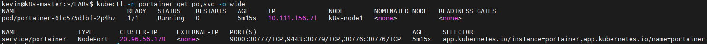
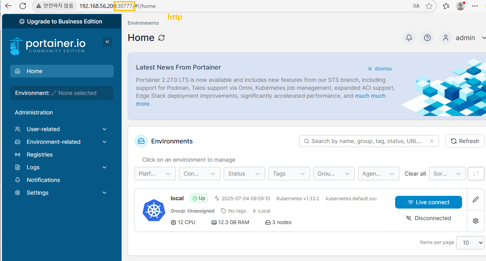
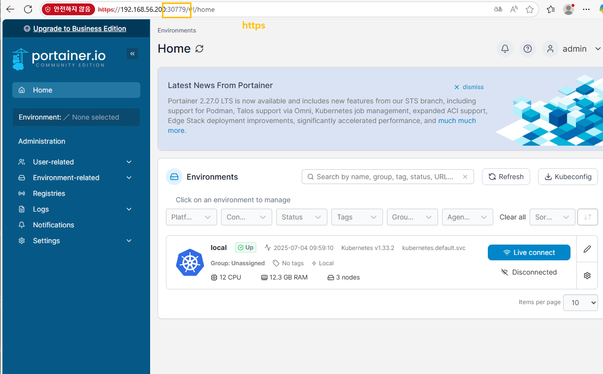
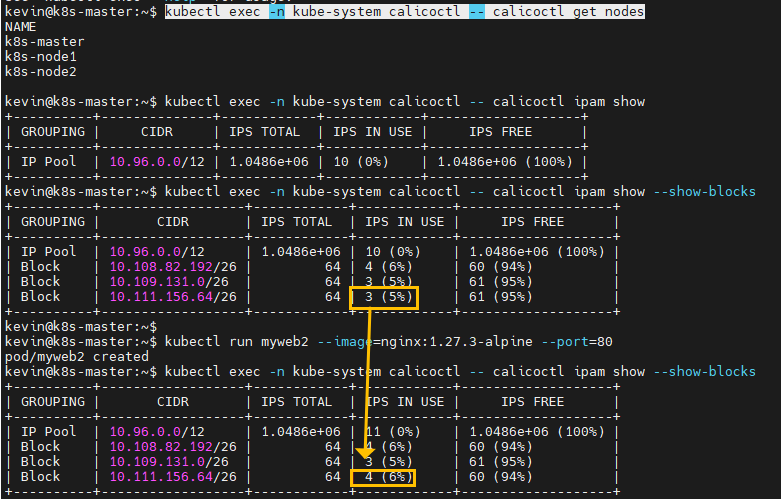
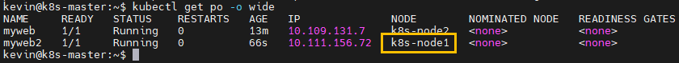
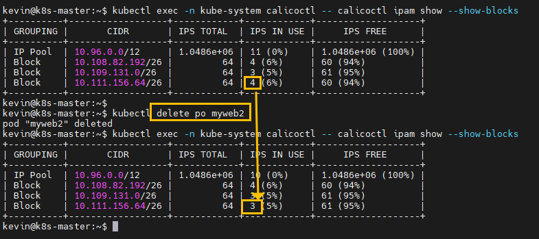
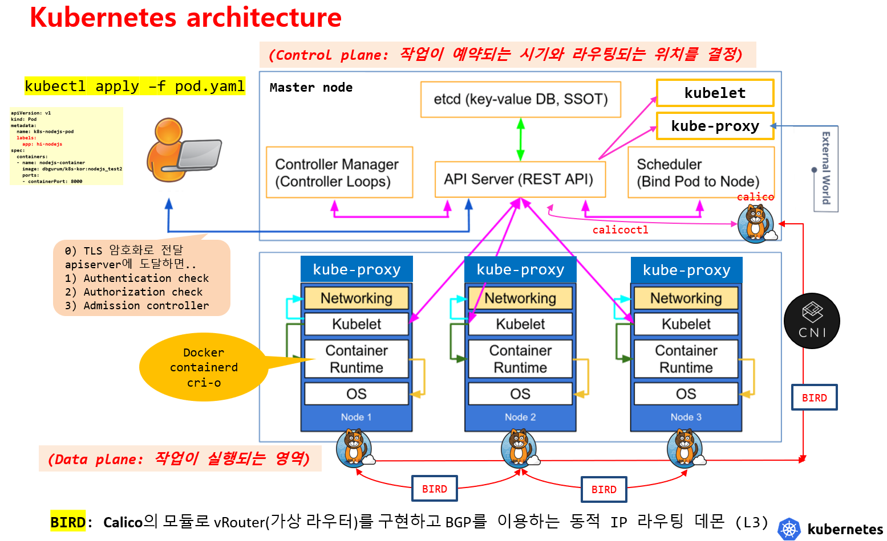
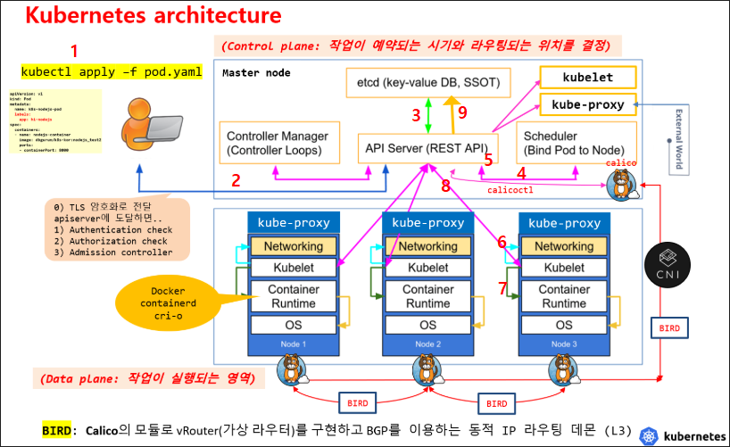
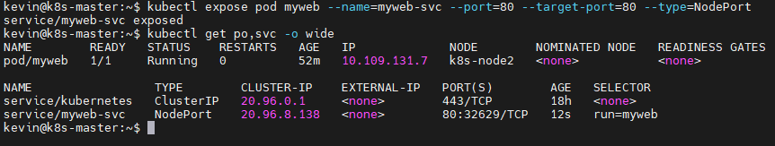

# kubernetes 관리도구

- dashboard
- portainer - docker, kubernetes
- k9s CLI tool
- prometheus & grafana
- kubeshark

## api 조회
```
kubectl api-resources
```

# portainer

샘플

```
curl -O https://raw.githubusercontent.com/portainer/k8s/master/deploy/manifests/portainer/portainer.yaml

kubectl apply -n portainer -f https://raw.githubusercontent.com/portainer/k8s/master/deploy/manifests/portainer/portainer.yaml

```
master

```
vi portainer-pv.yaml

apiVersion: v1
kind: PersistentVolume
metadata:
  name: portainer-pv
  namespace: portainer
spec:
  capacity:
    storage: 10Gi
  accessModes:
  - ReadWriteOnce
  persistentVolumeReclaimPolicy: Retain
  local:
    path: /DATA1
  nodeAffinity:
    required:
      nodeSelectorTerms:
      - matchExpressions:
        - {key: kubernetes.io/hostname, operator: In, values: [k8s-node1]}
```

k8s-node1

```
sudo mkdir /DATA1
sudo chown -R kevin /DATA1
```

master
```
kubectl apply -f portainer-pv.yaml
kubectl apply -n portainer -f https://raw.githubusercontent.com/portainer/k8s/master/deploy/manifests/portainer/portainer.yaml
```

```
kubectl -n portainer get pv,pvc
```








```
kubectl run myweb --image=nginx:1.27.3-alpine --port=80

kubectl describe po myweb
```

## ✅ calicoctl 이란?
### 📌 정의
- **Calico를 관리하는 CLI 툴**
- Kubernetes 네트워킹, IP 관리, 네트워크 정책을 관리하는 데 사용됨

### 📌 주요 기능
- Calico 리소스 관리 (노드, IP Pool, 정책 등)
- 네트워크 정책 생성 및 적용
- BGP 라우팅 설정
- 네트워크 상태 점검

---

## ✅ Calico란?
- Kubernetes의 **CNI (Container Network Interface)** 플러그인
- Pod 간 **네트워크 연결, 라우팅, 보안 정책**을 담당
- 고성능 Layer 3 기반 네트워킹 제공

---

로컬에 도구 설치  calicoctl

```
curl -L https://github.com/projectcalico/calico/releases/download/v3.24.1/calicoctl-linux-amd64 -o calicoctl
```

pod로 관리

```
kubectl apply -f https://docs.projectcalico.org/archive/v3.17/manifests/calicoctl.yaml
```



10.111.156.64/26 대역에 1개가 추가 된 것을 볼 수 있음



이 뜻은 저 대역이 k8s-node1의 대역이라는 뜻



myweb2삭제시 다시 줄어든 것을 확인
# 중요



1,2,3 인증, 권한



파드



호스트 접속


디플로이먼트

서비스 사용하면 좋은점
1. 로드벨런싱
2. 자동생성, IP 재지정 하지만 Label로 자동 연결

클러스터 ip는 백 -> 디비

프런트 -> 백 -> 클러스터 ip

외부에서 프런트만 nodeportip

