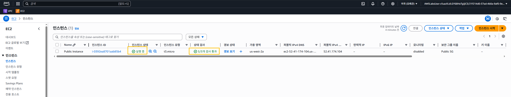

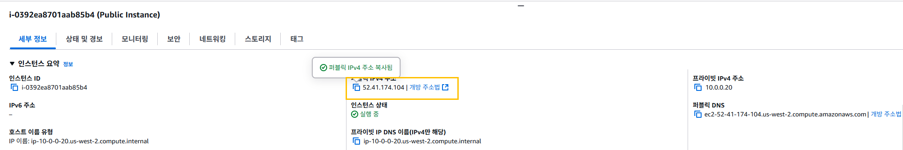

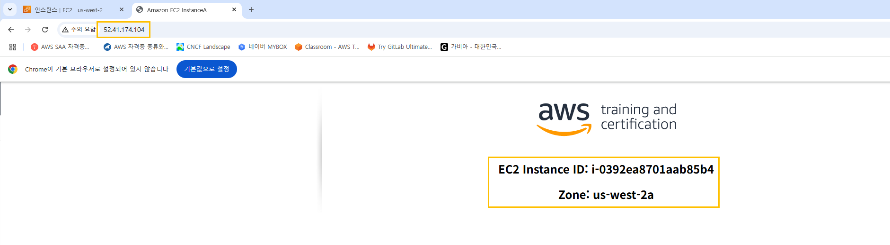

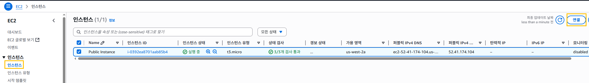

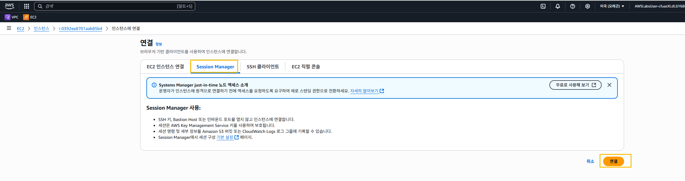

```
cd ~
curl -I https://aws.amazon.com/training/
```
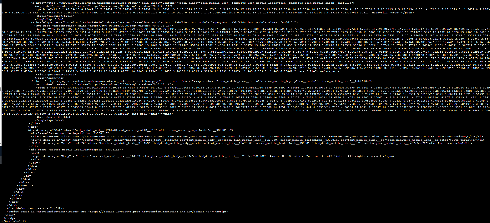

# 과제 9: NAT 게이트웨이를 생성하고 프라이빗 서브넷에서 라우팅 구성

```
AWS 관리 콘솔 브라우저 탭으로 돌아갑니다.

AWS 관리 콘솔 상단의 검색 상자에서 VPC를 검색하여 선택합니다.

왼쪽 탐색 창에서 NAT gateways를 선택합니다.

Create NAT gateway를 선택하고 다음을 구성합니다.

Name - optional: Lab NGW를 입력합니다.
Subnet: 드롭다운 메뉴에서 Public Subnet 을 선택합니다.
Allocate Elastic IP를 선택합니다.
Create NAT gateway를 선택합니다.
```


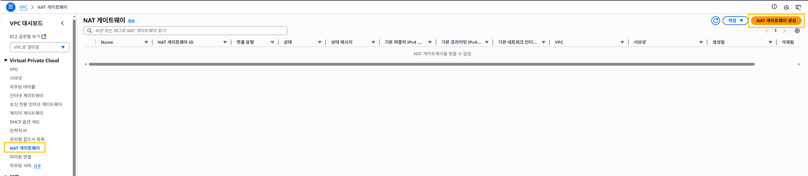

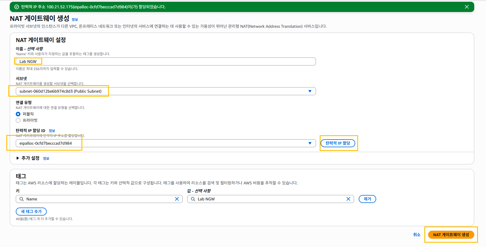

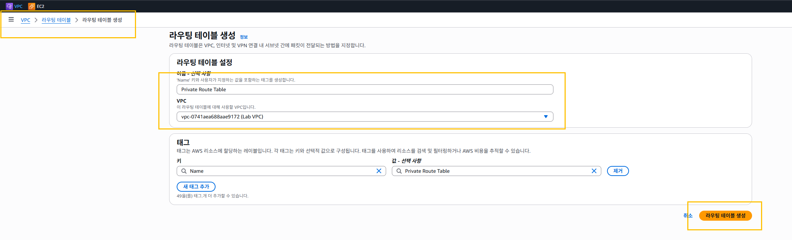

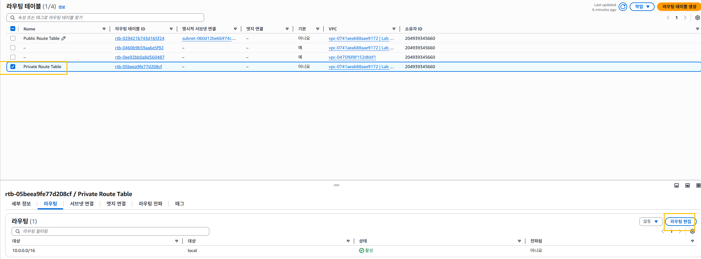

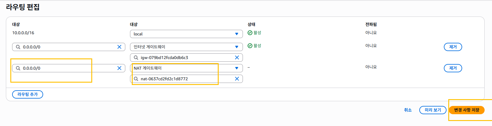

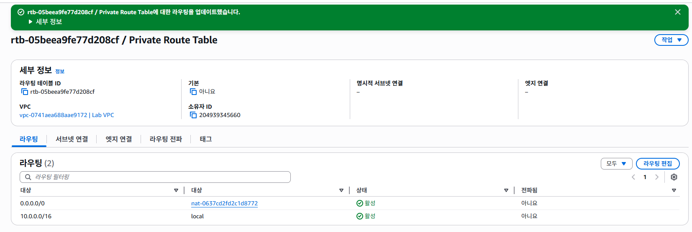

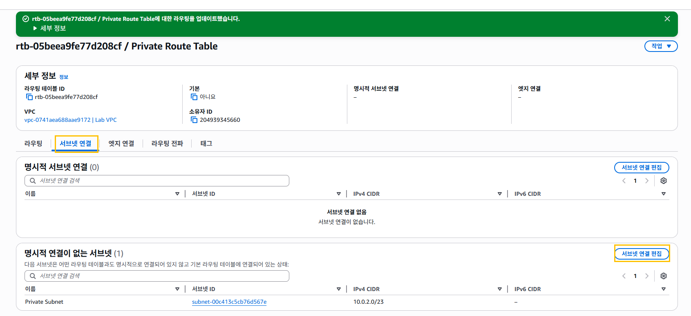

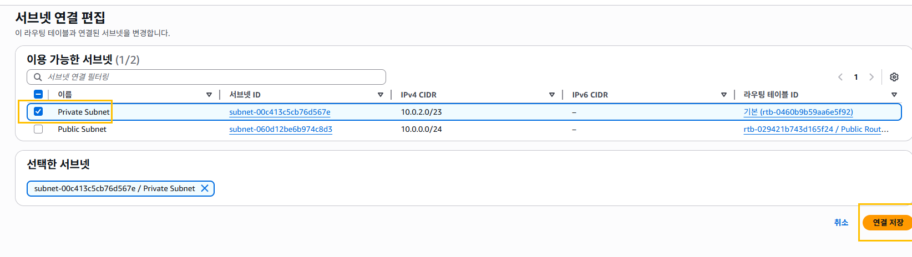

# 과제 10: 프라이빗 리소스용 보안 그룹 생성

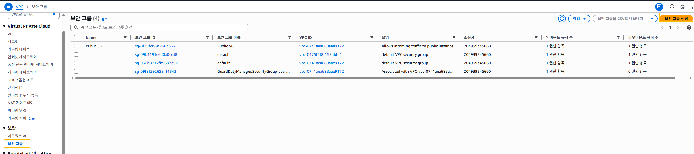

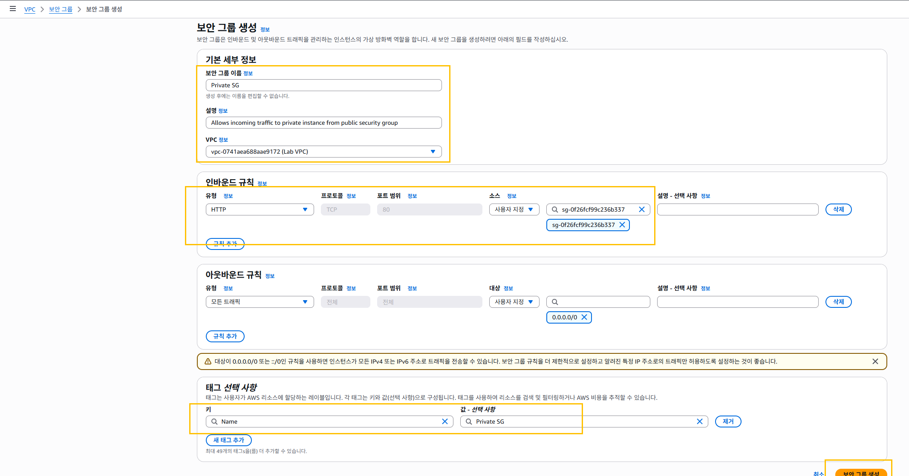

# 과제 11: 프라이빗 서브넷에서 Amazon EC2 인스턴스 시작

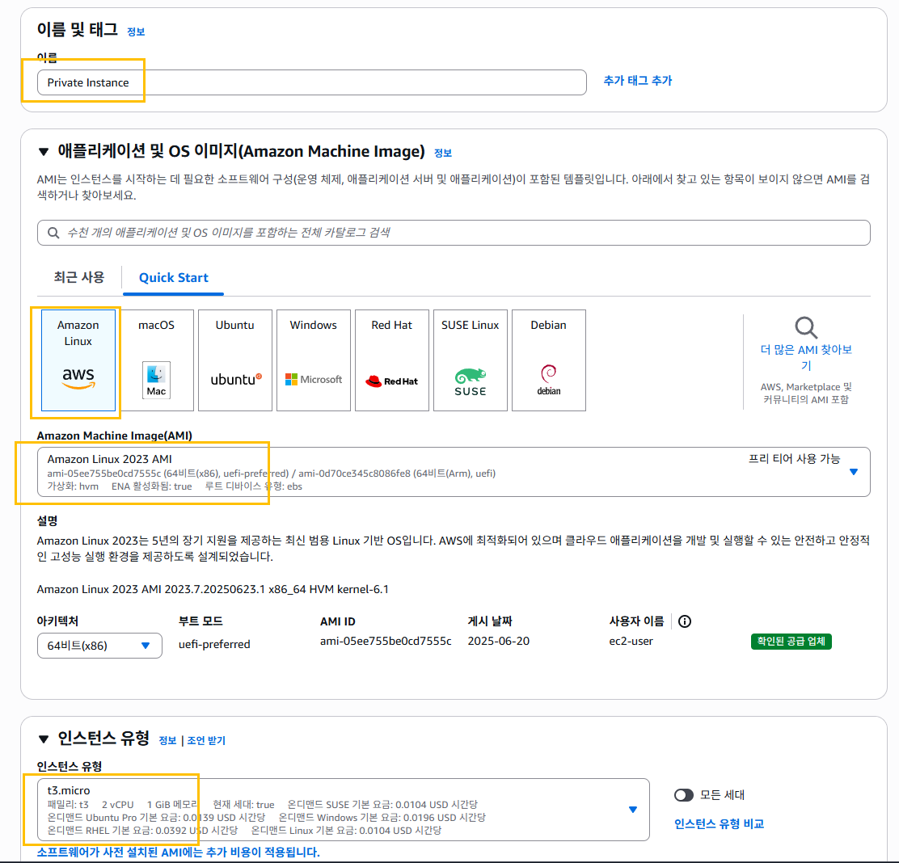

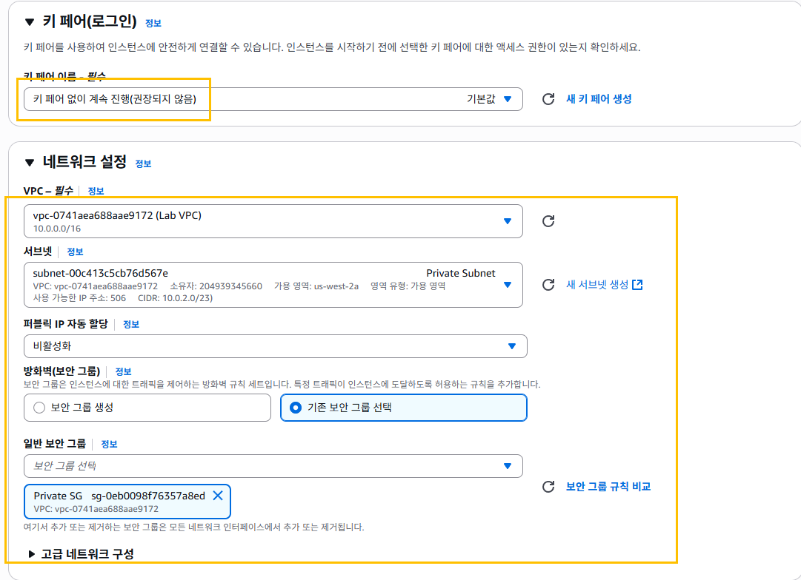

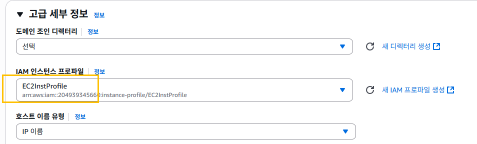

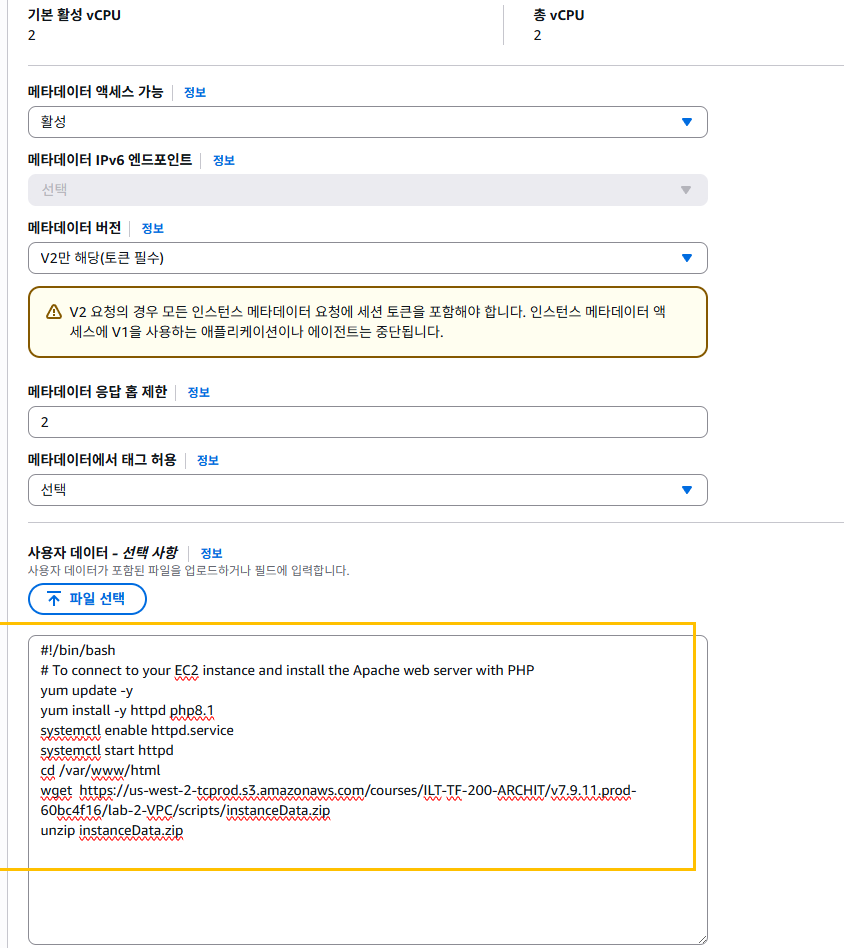

```
#!/bin/bash
# To connect to your EC2 instance and install the Apache web server with PHP
yum update -y
yum install -y httpd php8.1
systemctl enable httpd.service
systemctl start httpd
cd /var/www/html
wget  https://us-west-2-tcprod.s3.amazonaws.com/courses/ILT-TF-200-ARCHIT/v7.9.11.prod-60bc4f16/lab-2-VPC/scripts/instanceData.zip
unzip instanceData.zip

```
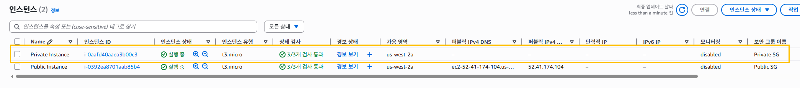

# 과제 12: 프라이빗 서브넷의 Amazon EC2 인스턴스에 연결

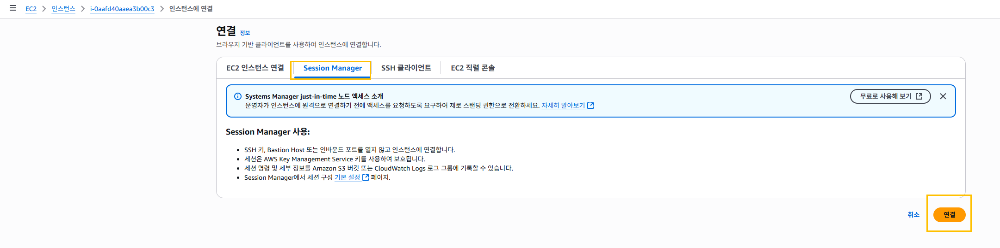

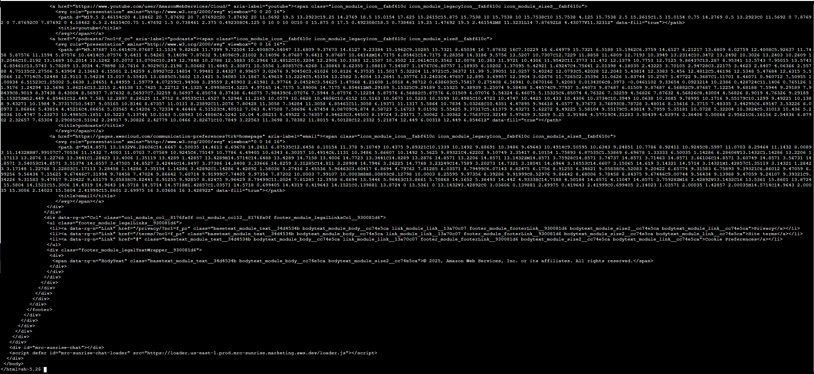

```
cd ~
curl -I https://aws.amazon.com/training/
```

# (선택) 과제 1: 프라이빗 인스턴스 및 퍼블릭 인스턴스 간의 연결 문제 해결

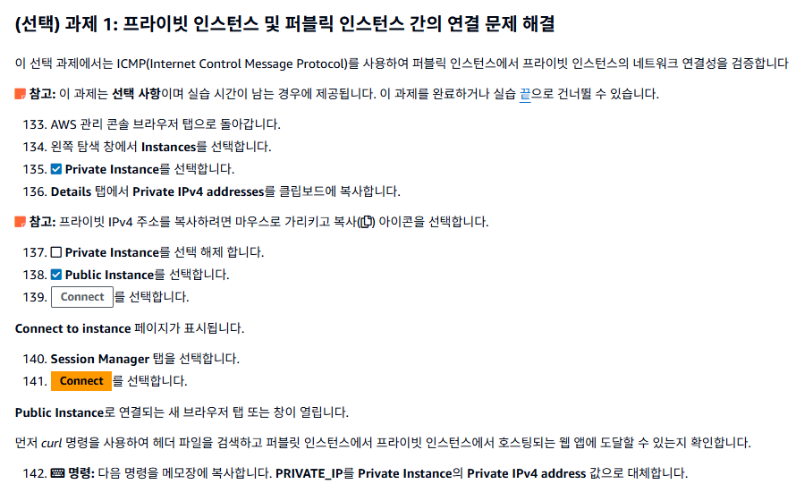
```
curl PRIVATE_IP
```

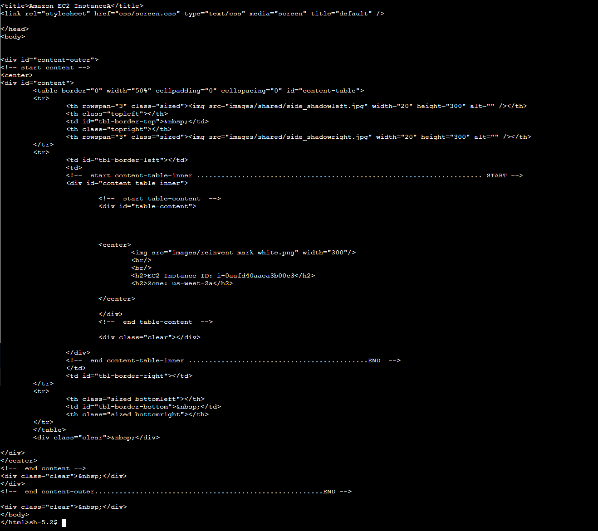

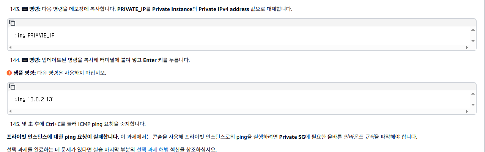

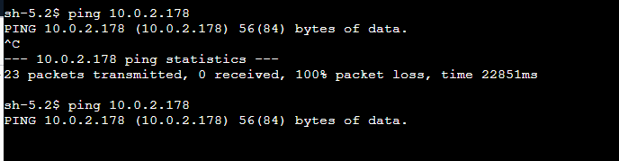

