## 6. 'Vagrrant File'을 이용한 테스트 환경 구축

### 실습 5. 가상 머신 4대(Master Node 1대, Worker Node 3대) 생성 
vagrant up -> vagrant provision으로 저장소 변경

- **Master Node**를  **Master System**이라고 하고 **Worker Node**를 **Node System**이라고 한다.

- **vagrant provision** 은 시스템의 소스 또는 가상 머신에 직접적인 변경 등이 없이 **가상 머신 자체**의 업데이트를 실행하는 명령어이다.                                     

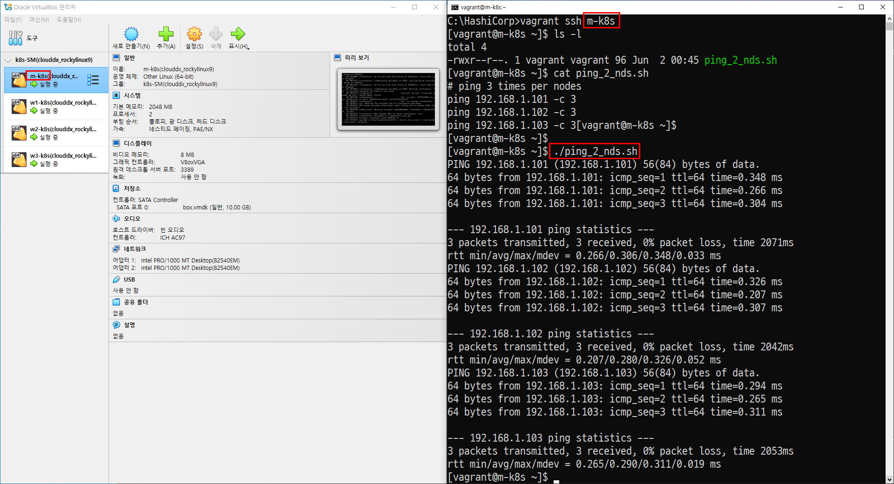

## 7. '터미널 접속 프로그램(super putty)'을 이용한 '다수의 가상 머신' 에 접속

[SuperPuTTy 다운로드](https://github.com/jimradford/superputty/releases)

### SuperPuTTY와 PuTTY 와의 연동
- 'SuperPuTTY'는  'PuTTY'를 통해 실행되기 때문에 'PuTTY'의 위치를 지정해야 한다.

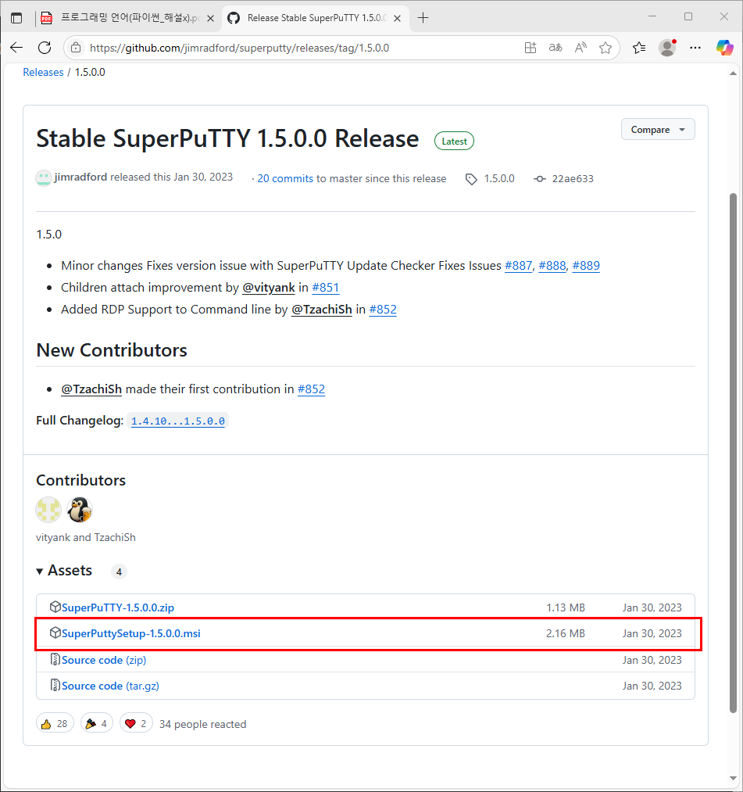

- 기본값으로 푸지게 설치

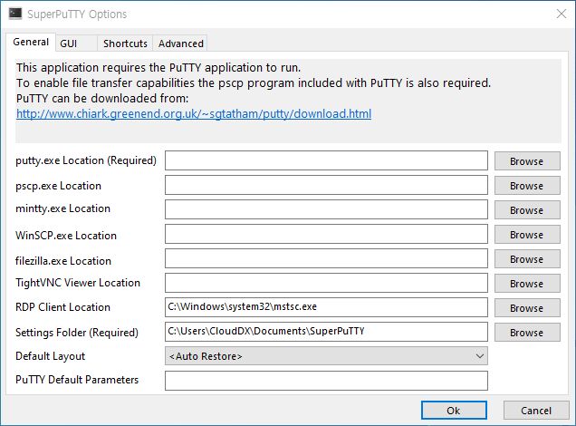

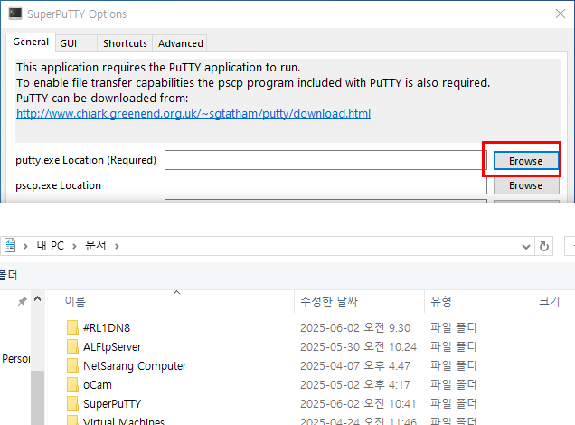

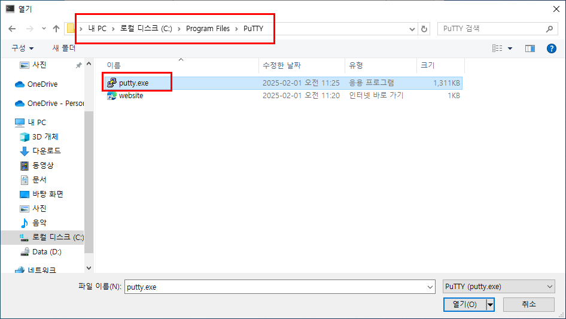

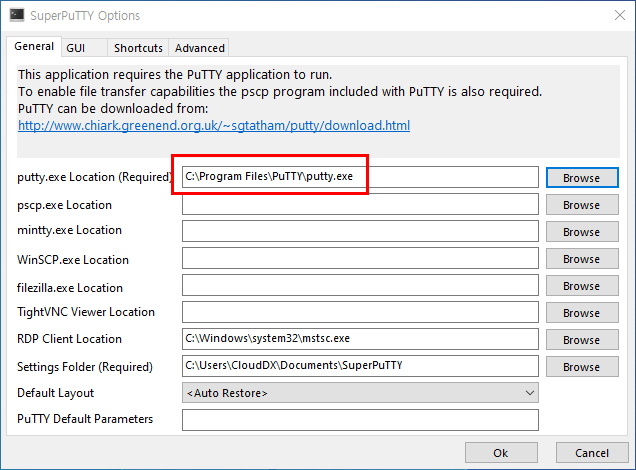

### 'PuTTY'의 설정 내용을 'SuperPuTTY'에 적용

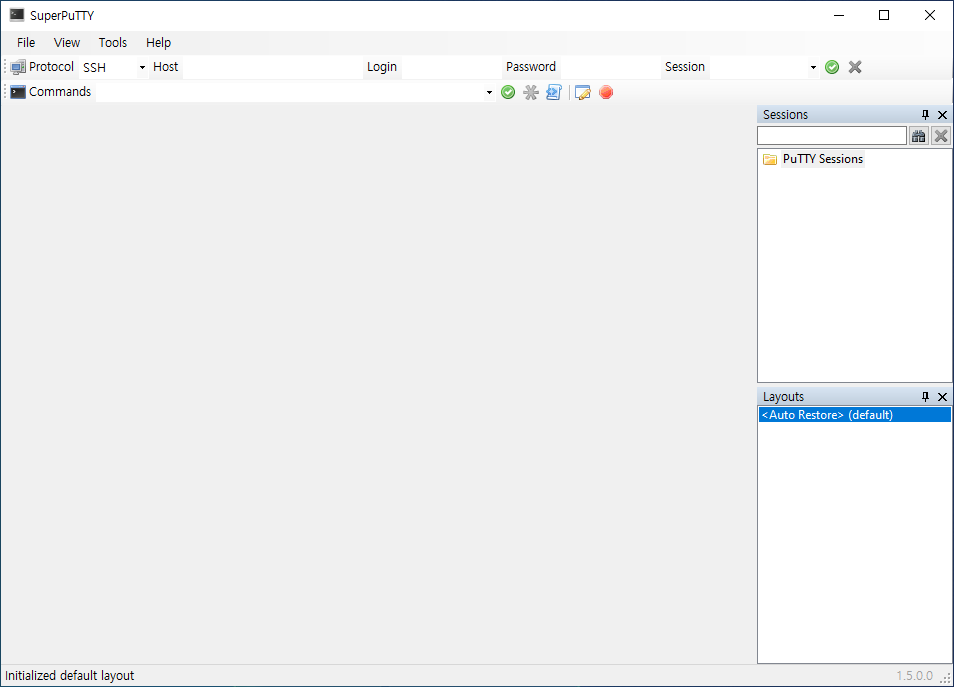

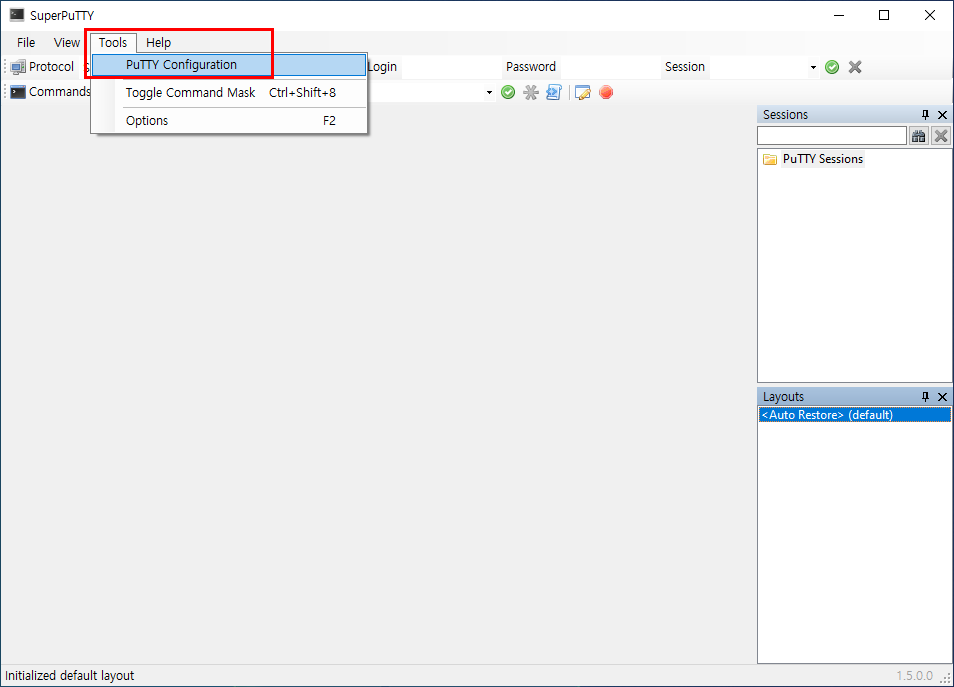

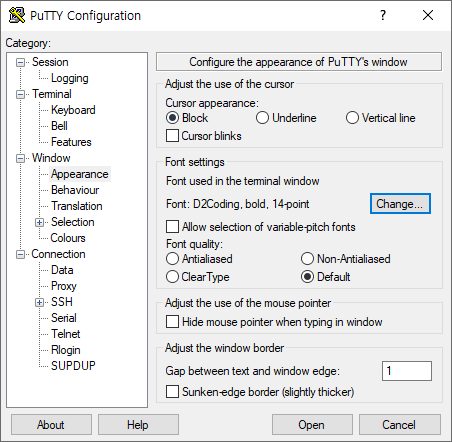

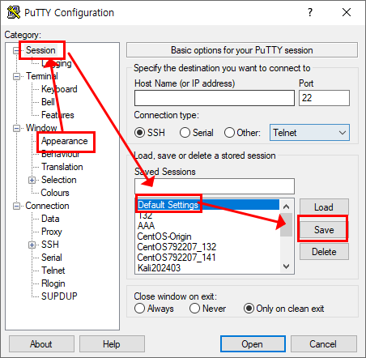

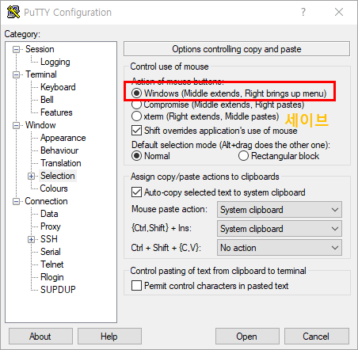

### 다수의 가상 머신 접속을 위한 설정
#### Step 1. 'Master Node System' 등록

- 'Loopback Address 127.0.0.1'으로 접속 가능한 'Session' 생성
    - 현재 가상 머신들은 '192.168.1.0/24' 대역대에 있기 때문에 대부분의 경우 모두 접속이 가능하다.
    - '127.0.0.1'으로 접속하면 '192.168.1.0/24'에서 문제가 발생 해도 다른 문제가 발생되지 않는다.

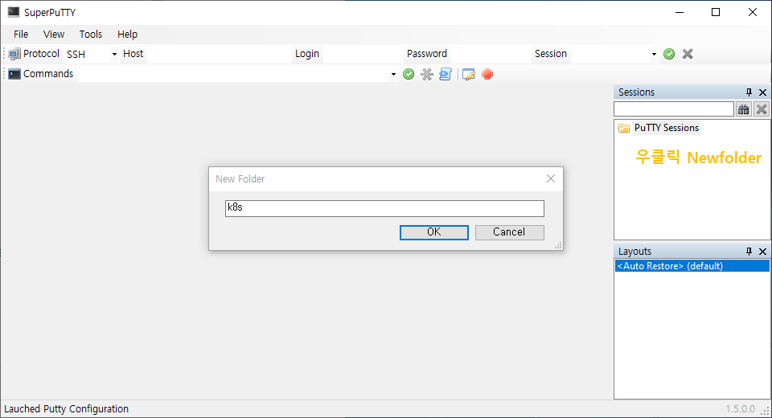

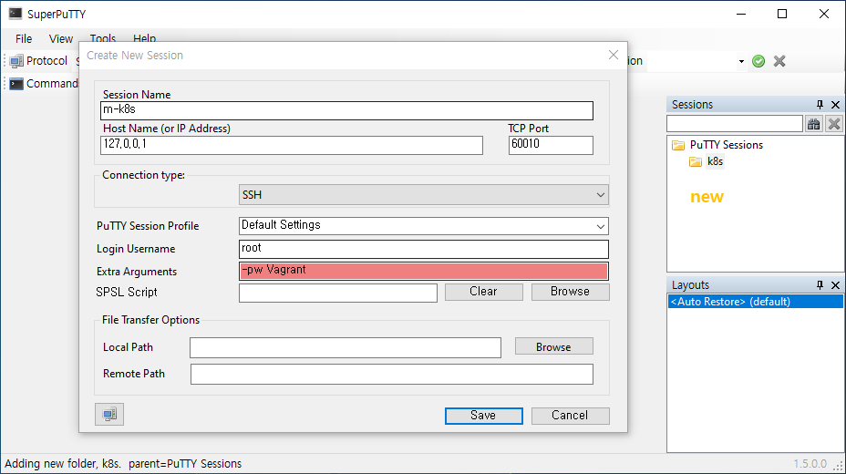

#### Step 2. 'Worker Node System' 등록
- 'Master Node System'을 'copy'를 이용해서 등록한다. 

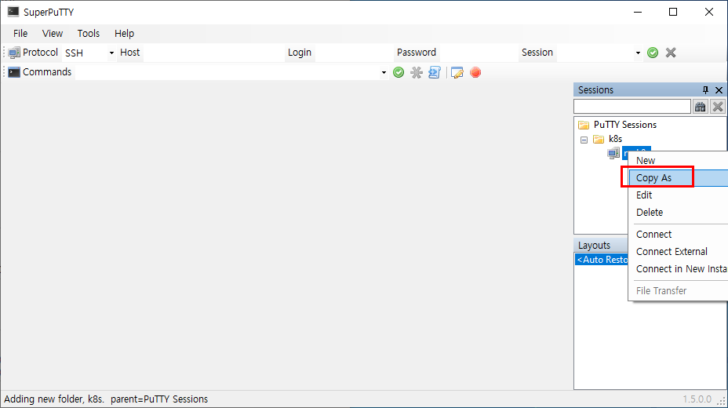

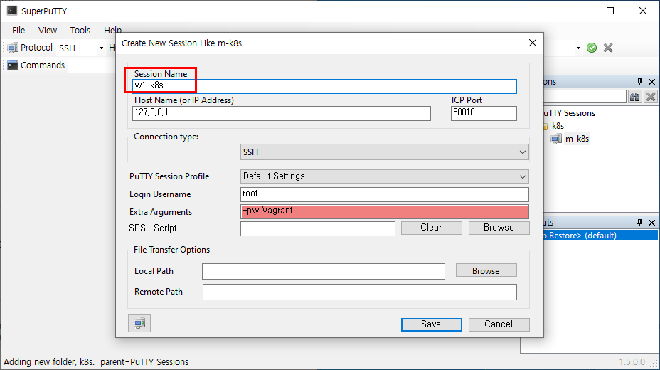

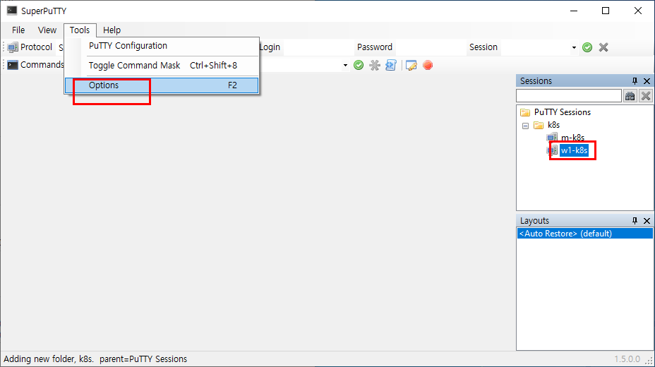

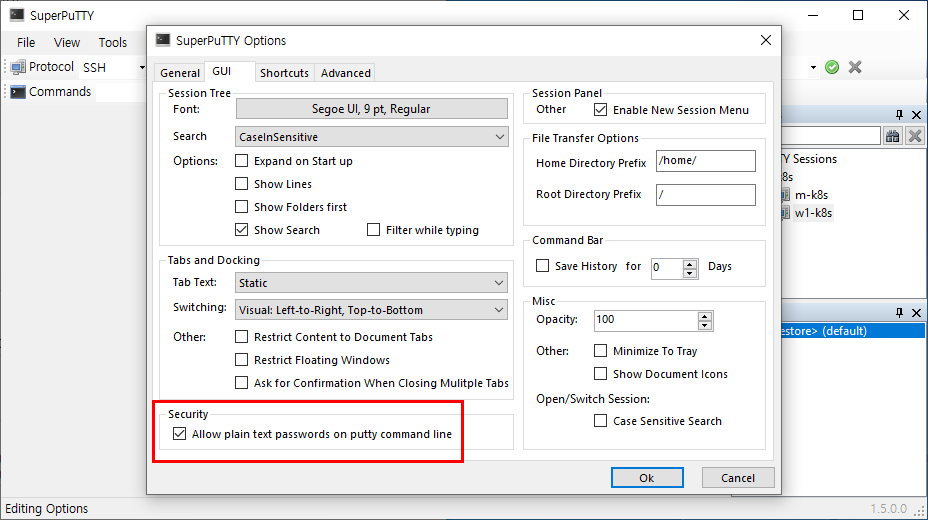

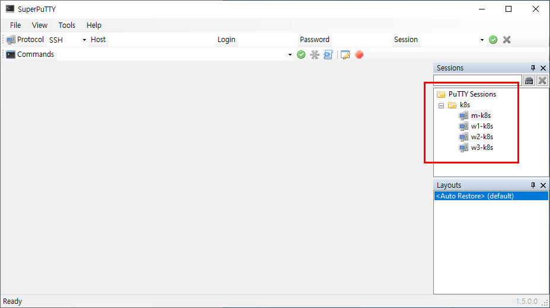

#### Step 3. 모든 가상 머신 한 번에 접속

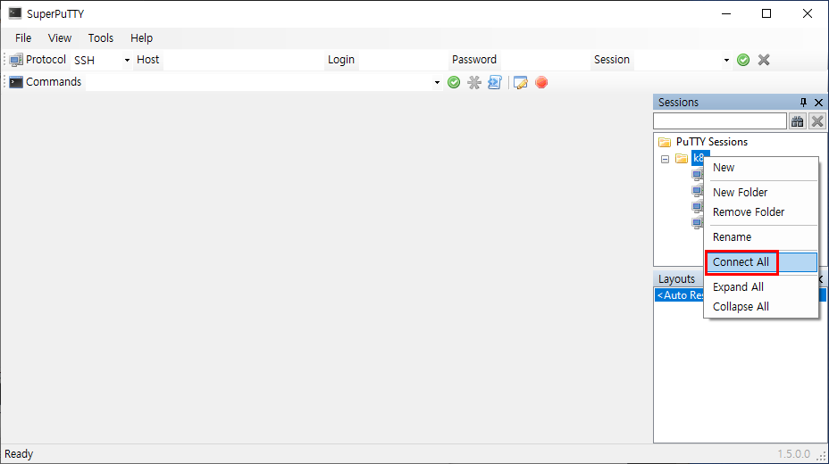

#### Step 4. 'Acess Denied'가 출력될 때

putty 설정이 제대로 적용이 안되어서 나타나는 경우이다.

#### Step 5. 모든 가상 머신에서 동일한 명령 실행
- 'Commands' 옆의 빈 칸에 'hostname'을 입력한다.

#### Step 6. 모든 가상 머신 삭제
- 'Commands' 옆의 빈 칸에 'exit'을 입력한다.
- 'destroy'를 이용한 가상 머신 삭제

## 8. 컨테이너를 다루는 표준 아키텍처, kubernetes

- 개요
    - kubernetes는 컨테이너 관리 도구이지만 실제로 kubernetes는 'Container Orchestration(통합관리)'을 위한 솔루션이다.

- 'Container Orchestration' 솔루션 종류
    - Docker Swarm (도커 스웜)
        - 간단하게 설치하고 사용할 수 있지만 기능이 다양하지 않다. 
        - 소규모 환경에서는 적절하지만 대규모 환경에서는 사용하지 않는다. 
    - Mesos(메소스)
        - 꽤 오래된 클러스터 도구이다.
        - 트위터, 에어비엔비, 애플, 우버 등에서 검증된 솔루션이다. 
        - 분산 관리 시스템과 연동해야 한다.
    
    - NoMad (노매드)
        - 해시코프(Hasicorp)사의 'Container Orchestration'이다.
        - Vagrant를 이용하기 때문에 사요이 간편하다.
        - 기능이 부족하기 때문에 복잡한 여러 기능을 사용하는 환경이 아닌 가볍고 간단한 기능만 가진 환경에서 사용하기 적합하다.
    
    - kubernetes (쿠버네티스)
        - 도입식에는 어렵지만 쉽게 사용할 수 있는 도구들이 있어서 설치가 쉬워지는 추세에 있다
        - 거의 모든 '벤더(개발사)'와 오픈 소스 진영 모두에서 지원하고 있고 그에 맞게 통합 개발되고 있다.