# 노드 유지 보수하기(drain)

## 개요
- 노드의 커널 업데이트를 하거나 메모리 증설 등의 작업이 필요할때는 어쩔 수 없이 노드를 꺼야하는데 이와 같은 노드 유지 보수가 필요한 상황이 된다.
- 이와 같은 경우를 대비해서 'kubernetes'는 drain 기능을 제공한다.
- 'drain' 은 지정된 노드의 'Pod'를 전부 다른 곳으로 이동시켜 해당 노드를 유지보수 할 수 있게 해준다.

## 실행
- 유지보수를 하고자 하는 'Node' 'w3-k8s'를 'Pod'가 없는 상태로 만든다.

- 'w3-k8s'에서 데몬셋을 지울수가 없어서 명령을 실행할 수가 없다는 오류가 출력된다.

- 데몬셋은 각 노드에 1개만 존재하는 'Pod'이기 때문에 'drain'으로는 삭제할 수가 없다.

- 'drain'은 실제로 'Pod'를 옮기는 것이 아니라 노드에서 'Pod'를 삭제하고 다른 곳에 생성한다. 

- 'Pod'는 언제라도 삭제할 수 있기 때문에 'kubernetes'에서 대부분 이동은 'Pod'를 지우고 다시 만드는 과정을 의미한다.

- 'drain' 명령과 '--ignore-daemonsets' 옵션을 함께 사용한다.

- 노드 상태를 확인해 보면 해당 노드가 'cordon'이 적용된 것을 볼 수 있다.

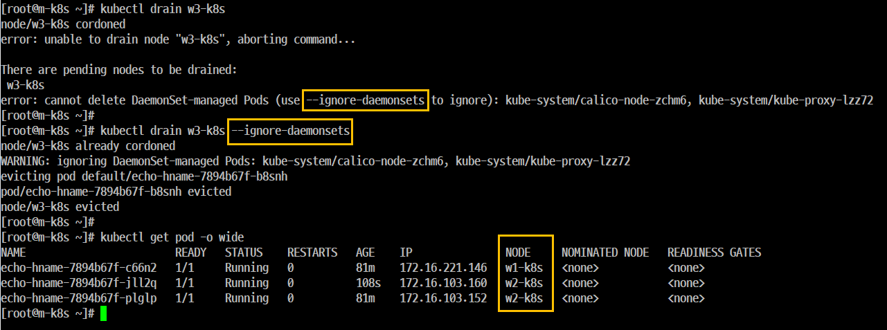

- 유지 보수가 모두 완료 되었다고 가정하고 'uncordon'을 실행해서 스케쥴을 받을 수 있는 상태로 복귀시킨 후 노드의 상태를 확인한다.

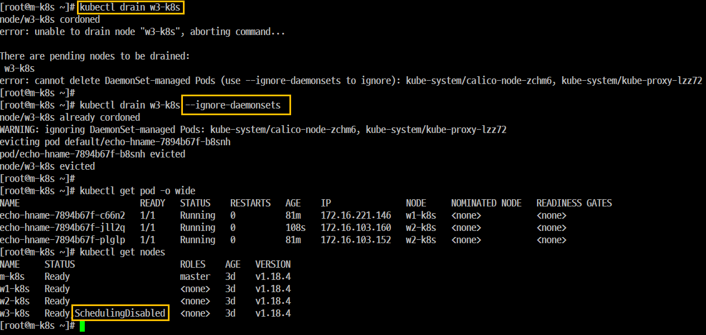

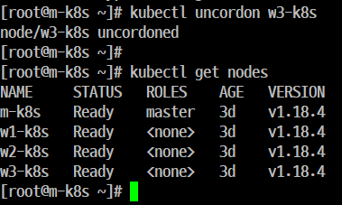

# 파드 업데이트 및 복구
- 개요 kubernetes에서는 피드를 운영하면서 컨테이너에 소운 기능을 추가하거나 치명적인 벅스가 밸생할 수 있는 가능성 등으 필수적으로 시스템 업에이트해야 하는 경우가 생길 수 있다.

- 예상하지 못했던 문제가 발생해서 다시 기존 버전으로 복구해야 할 필요가 발생할 수가 있다.

## 실행
### 현재 상태 확인
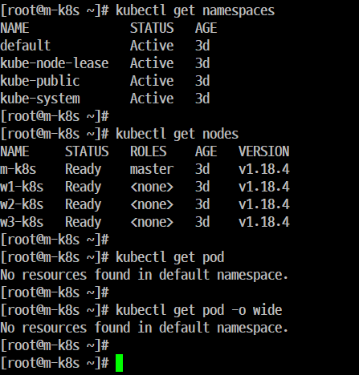

### 컨테이너 버전 업데이트를 테스트 하기 위한 파드를 배포한다.
### '--record' 옵션은 배포한 정보의 히스토리를 기록한다.

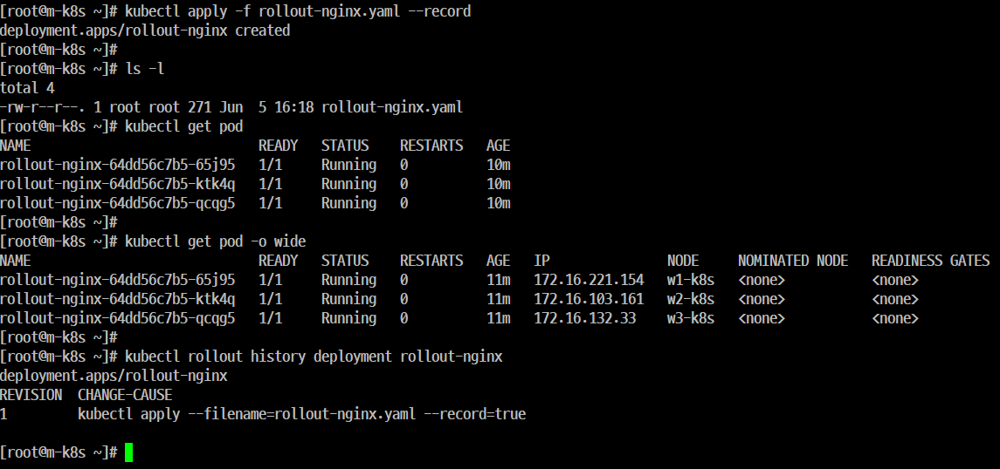

### 기록된 히스토리를 확인한다. 'REVISION'은 오류 발생 시 '임의의 시점'으로 되돌아가기 위한 '이정표' 역할을 한다.

### 파드의 정보를 확인한다.

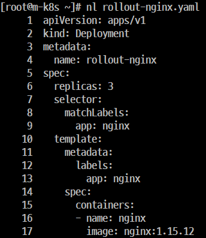

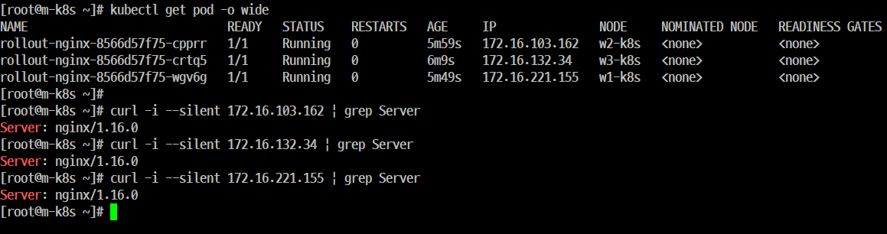

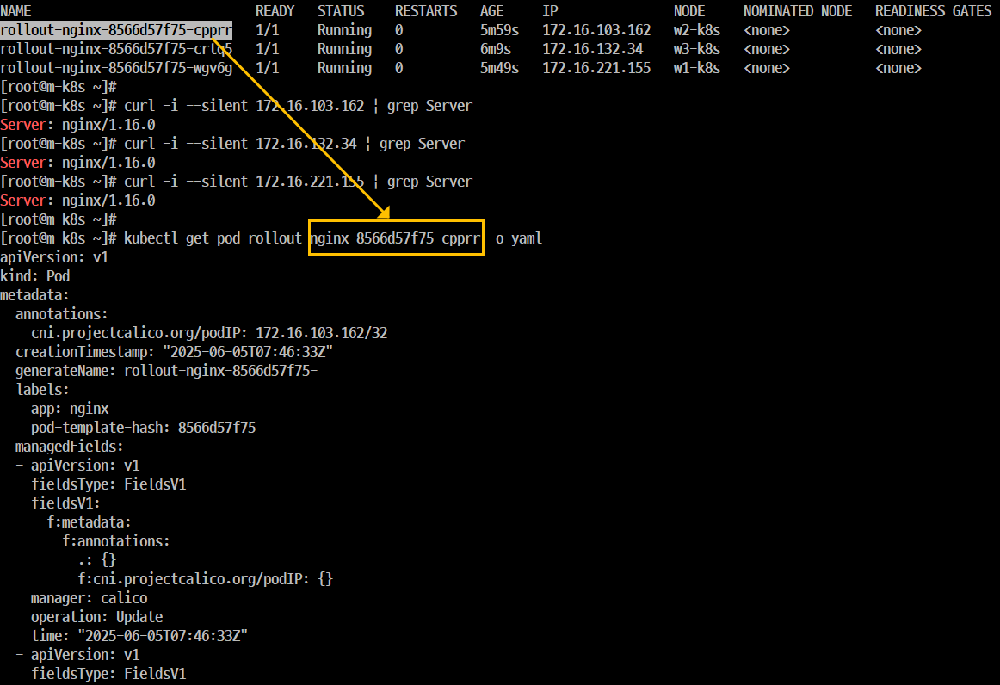

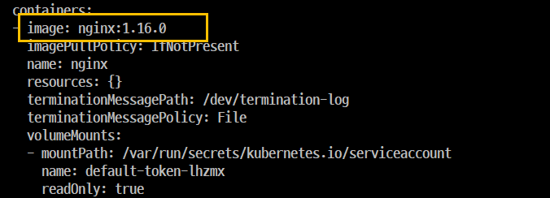

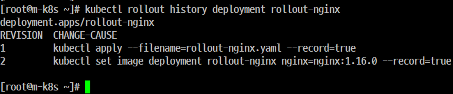

## 업데이트 실패 시 파드 복구

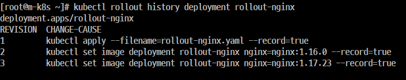

## 특정 시점으로 하드를 복구한다.

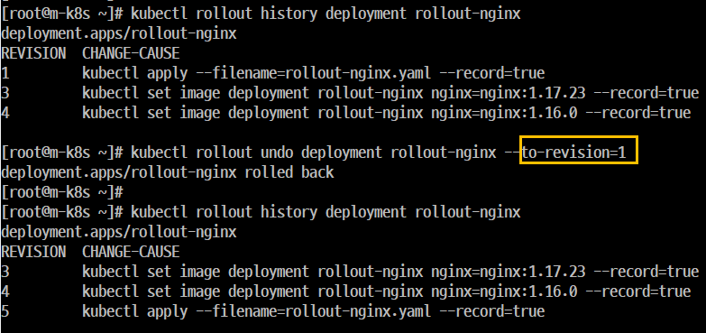

