## 'On-Premis'에서 'LoadBalancer'를 제공하는 'MetaLB'

### 특징
- 'On-Premis'에서 'LoadBalancer'를 사용하려면 내부에 'LoadBalancer' 서비스를 받아주는 구성이 필요한데 이를 지원하는 것이 'MetalLB'이다.

- 'MetalLB'는 베어메탈(Bare Metal, 운영체제가 설치되어 있지 않은 하드웨어)로 구성된 'kubernetes'에서도 'LoadBalancer'를 사용할 수 있게 고안된 프로젝트를 말한다.

- 네트워크를 따로 공부할 필요가 없다 연동 또한 쉽게 설정할 수 있다.

#### Step 1. Deployment를 이용해서 2개의 Pod(lb-hname-pods, lb-ip-pods)를 생성한다.

#### Step 2. 6개의 Pod 확인

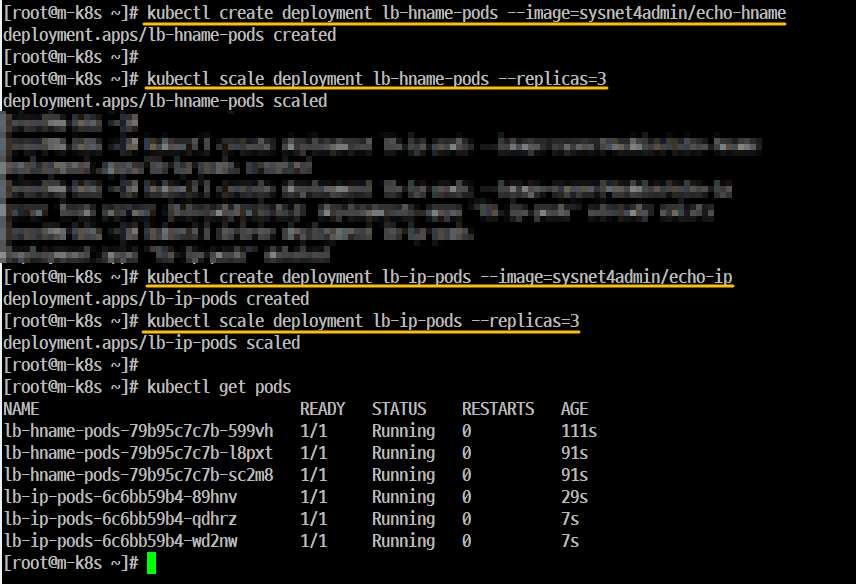

#### Step 3. 사전에 정의되어 있는 'metallb.yaml' 파일을 이용해서 'MetalLB' 를 구성

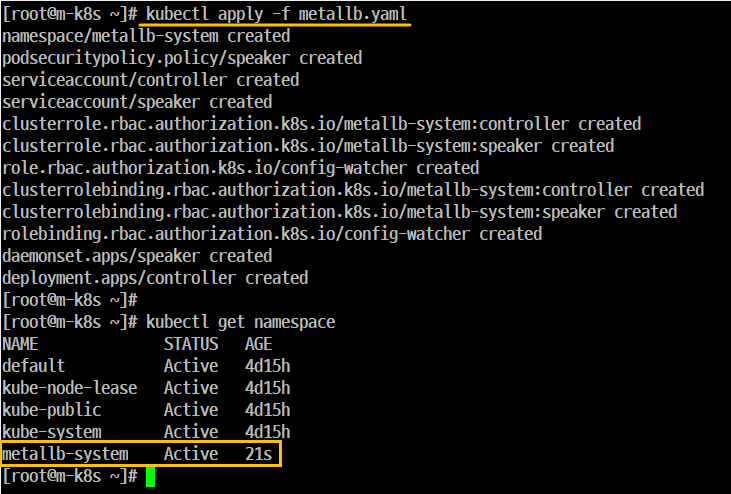

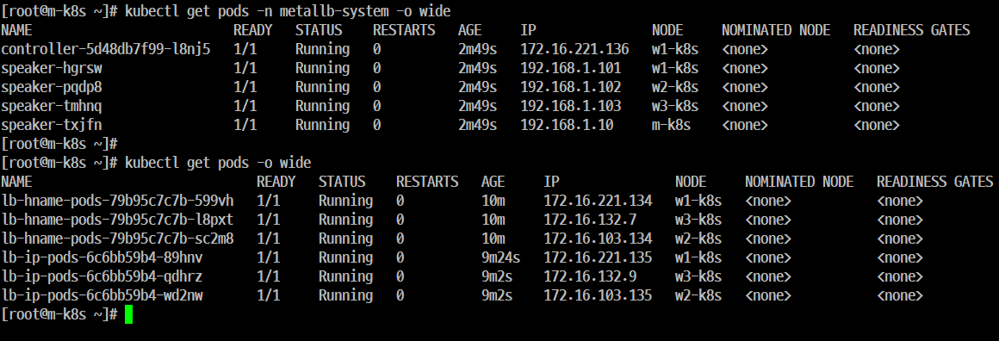

#### Step 4. 배포(running)된 'MetalLB'의 'Pod'가 '5개'인지를 확인하고 'IP'와 '상태'도 확인

#### Step 5. Ingress와 마찬가지로 'MetalLB'도 설정을 적용해야 한다.

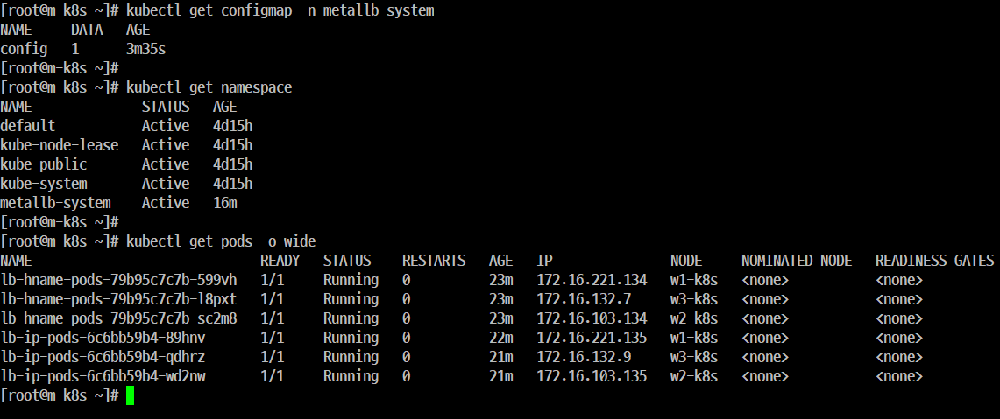

#### Step 6. ConfigMap이 생성되었는지 확인한다.

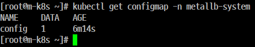

#### Step 7. 'MetalLB' 설정이 올바르게 적용되었는지 확인 

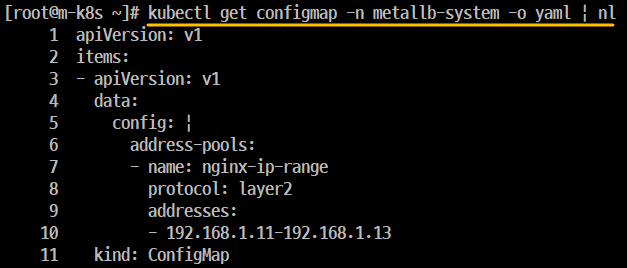
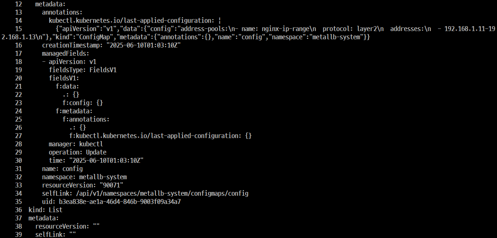

#### Step 8. 각 Deployment(lb-hname-pods, lb-ip-pods)를 'LoadBalancer Service'로 노출한다. 

```
kubectl expose deployment lb-hname-pods --type=LoadBalancer --name=lb-hname-svc --port=80

kubectl expose deployment lb-ip-pods --type=LoadBalancer --name=lb-ip-svc --port=80
```

#### Step 9. 생성된 'LoadBalancer service' 별로 'CLUSTER-IP'와 'EXTERNAL-IP'가 잘 적용되었는지 확인한다.

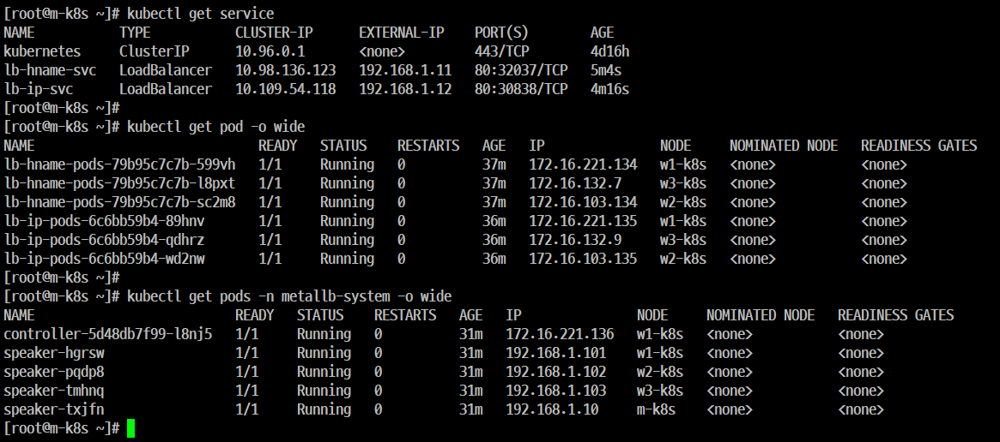

#### Step 10. 'EXTERNAL-IP'가 잘 작동하는지 확인(http://192.168.1.11)

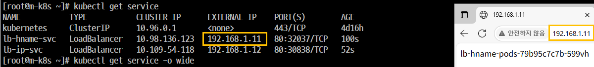

#### Step 11. 'Pod'에 요청 방법과 IP가 표시되는지 확인(http://192.168.1.12)

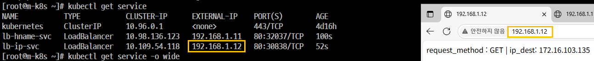

#### Step 12. Powershell을 통해 스크립트를 실행한다.
- 개요
    - 'LoadBalancer'가 정상적으로 동작하면 'http://192.168.1.11'에서 반복인 결과값 출력

- 실행 

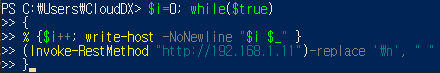

```
PS C:\Users\CloudDX> $i=0; while($true)
>> {
>> % {$i++; write-host -NoNewline "$i $_" }
>> (Invoke-RestMethod "http://192.168.1.11")-replace '\n', " "
>> }
```
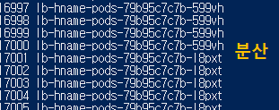

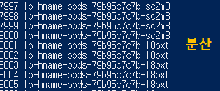

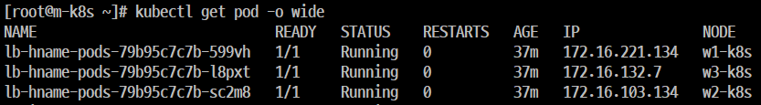

#### Step 13. Pod를 6개로 늘린다.

```
kubectl scale deployment lb-hname-pods --replicas=6
```

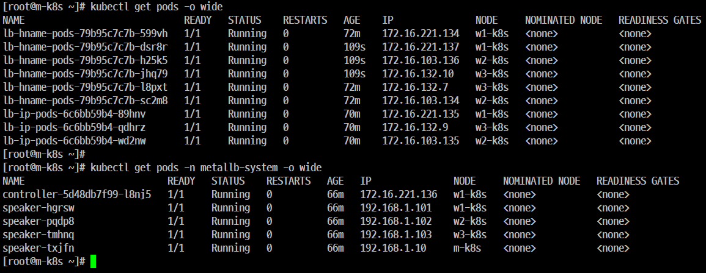

#### Step 14. 늘어난 Pod 6개도 'EXTERNAL-IP'를 통해 접근되는지 확인 한다.

#### Step 15. 'MetalLB'를 제외한 모든 'Pods'와 'Service'를 삭제한다.

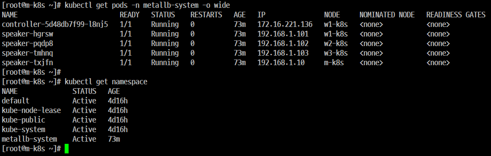
이거 두개 빼고 모두 삭제
