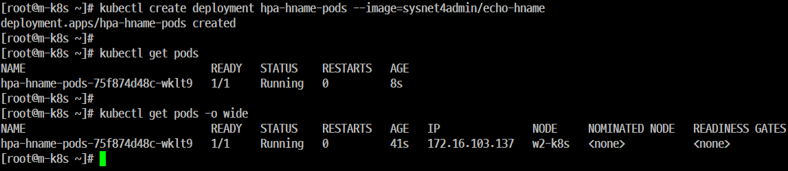
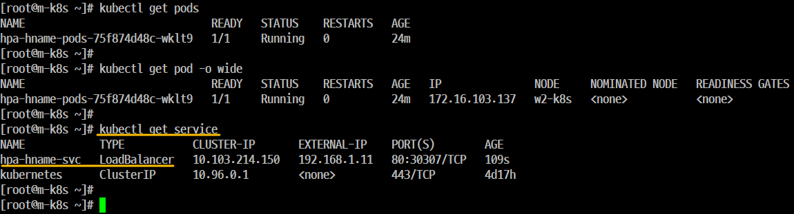
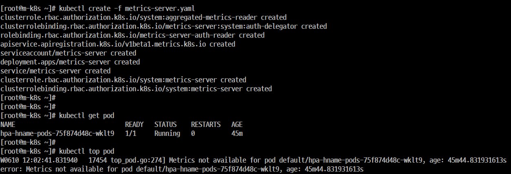
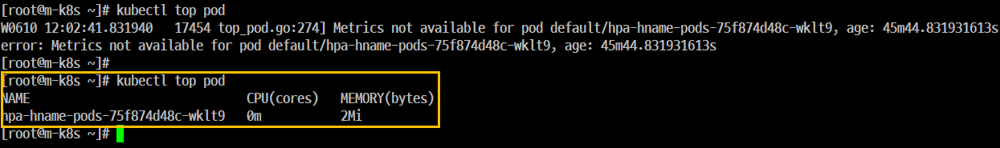
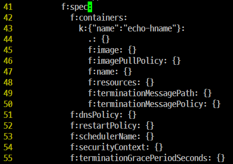
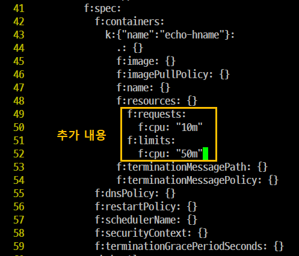
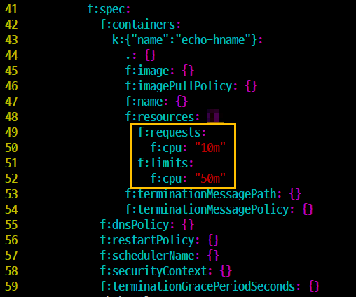
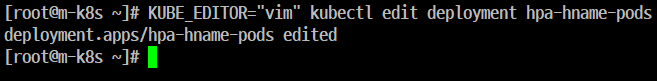
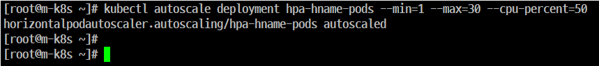
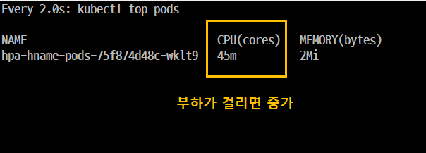

# 부하에 따라 자동으로 'Pod' 수를 조절하는 'HPA(Horizontal Mod Autoscaler)'

## 개요
- 'Pod'에 접근하는 사용자가 갑자기 늘어날 경우 'Pod'는 감당할 수 없는 상태에 빠지게 된다. 즉, '서비스 불가' 라는 결과를 초래할 수가 있다.

- 'Kubenetes'는 이런 경우를 대비해서 부하량에 따라 **Deployment**의 **Pod** 수를 유동적으로 관리하는 기능을 제공하는데 이를 HPA라고 한다.

  

### Step 1. 'Deployment' 1개를 'hpa-hname-pods' 라는 이름으로 생성한다.

### Step 2. 앞에서 이미 설정한 'MetalLB' 설정을 이용해서 expose를 실행하고 'hpa-hname-pods'를 'LoadBalancer Service'로 바로 설정할 수가 있다.
```
kubectl expose deployment hpa-hname-pods --type=LoadBalancer --name=hpa-hname-svc --port=80
```

### Step 3. 설정된 'LoadBalancer Service'와 부여된 IP를 확인한다.



### Step 4. 'HPA'가 작동되려면 'Pod'의 자원이 어느 정도 사용되는지 파악해야 한다.

- 개요
    - 부하를 확인하는 명령은 리눅스의 'top'과 비슷한 'kubectl top pods'가 된다.
- 실행

    ```
    [root@m-k8s ~]# kubectl top pods
    Error from server (NotFound): the server could not find the requested resource (get services http:heapster:)
    ```
- 설명
    - 'heapster'는 'kubernetes' 1.13 이전 버전에서 사용하던 모니터링 도구이다. 
    - 'kubernetes 1.13'부터는 'metrics-server'를 모니터링 도구로 사용하기를 권장.
    - HPA가 자원을 요청할 때 'metrics-server'를 통해 계측 값을 전달 받는다.
    - 현재 'Metrics Server'가 없기 때문에 계측값을 수집하고 전달해주는 'metrics-server'를 설정해야 한다.

### Step 5. 'metrics-server'를 'Object Spec' 파일로 설치할 수 있다. 

- 'Metrics Server'가 적용되지 않기 때문에 오류가 발생한다.



### Step 6. 'Metrics Server'를 설정


- 'CPU, Memory' 값이 매우 낮게 나온다. 

### Step 7. 배포된 'Deployment'를 확인한다.
- 개요
    - scale 기본값이 설정되어 있지 않기 때문에 'Pod' 증설 시점을 알 수가 없다.
    - 따라서 'Pod'에 부하가 걸리기 전에 scale이 실행되게 'Deployment'에 기준값을 기록
    - 'Deployment'를 새로 배포하기 보다는 기존에 배포한 'Deployment' 내용을 'edit'로 직접 수정한다.









```
KUBE_EDITOR="vim" kubectl edit deployment hpa-hname-pods
```

- 수정
    - 'resources: {}'에서 '{}'를 생략한다..
    - 그 아래 다음의 내용을 추가한다. (매우 중요) 절대 'Tab'을 사용해서는 안된다.
    ```
    49                f:requests:
    50                  f:cpu: "10m"
    51                f:limits:
    52                  f:cpu: "50m"
    ```
    - 이 때 추가한 값은 'Pod'마다 주어진 부하량을 결정하는 기준이 된다.
    - 여기서 사용한 단위 'm'은 'milliunits'의 약어로 '1000m'은 '1개의 CPU'가 된다..
    - 따라서 '10m' 'Pod'의 'CPU 0.01' 사용을 기준으로 'Pod' 를 증설하게 설정한 것이다.
    - 또한 순간적으로 한쪽의 'Pod'로 부하가 몰릴 경우를 대비해 CPU 사용 제한을 '0.05'로 주었다.

### Step 8. 'autoscale' 설정
#### 개요
- 'hpa-hname-pods'에 'autoscale'을 설정해서 '특정 조건이 만족되는 경우'에 자동으로 'scale' 명령이 수행되도록 한다.



```
kubectl autoscale deployment hpa-hname-pods --min=1 --max=30 --cpu-percent=50
```

- 'min'은 '최소 Pod의 수', 'max' '최대 Pod의 수'를 말한다.
- 'cpu-percent'는 'CPU 사용량'이 '50%' 를 넘게 되면 'autoscale' 하겠다는 뜻이다.

명령
### Step 9. 테스트
- 엄청난 양의 데이터가 전송이 되어야 추가된 것을 확인할 수가 있다. 

