# 'Grafana'로 모니터링 데이터 시각화 하기

## 개요
- 'Metric' 데이터를 시각화할 때 가장 많이 사용하는 도구이다.

- 'Prometheus'의 데이터 소스를 시각화할 수 있는 오픈 소스 도구이다.

- 'Grafana'를 설치하고 'Prometheus'의 'Metric'을 가져오도록 구성한다.

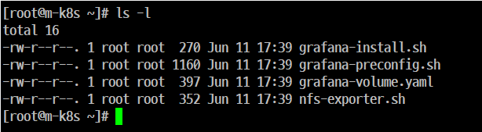

## 'Helm'으로 'Grafana' 설치 

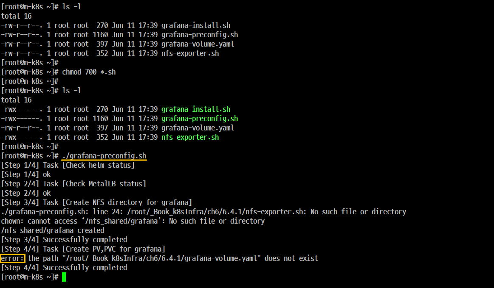

### Step 1. 'kubernetes' 'Grafana' 설치를 위한 스크립트 실행

```
 vi grafana-preconfig.sh
```

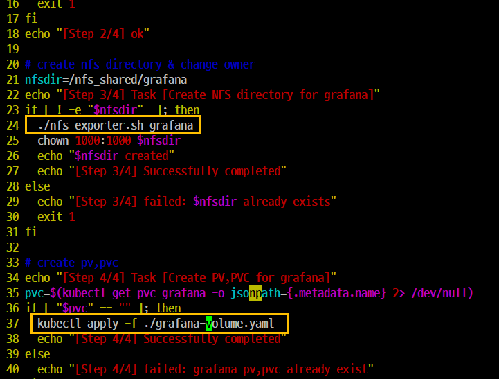

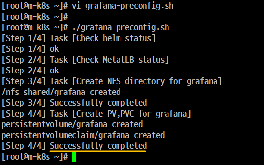

```
./grafana-preconfig.sh
```

### Step 2. 'Grafana' 차트(접속을 위한 가이드) 배포

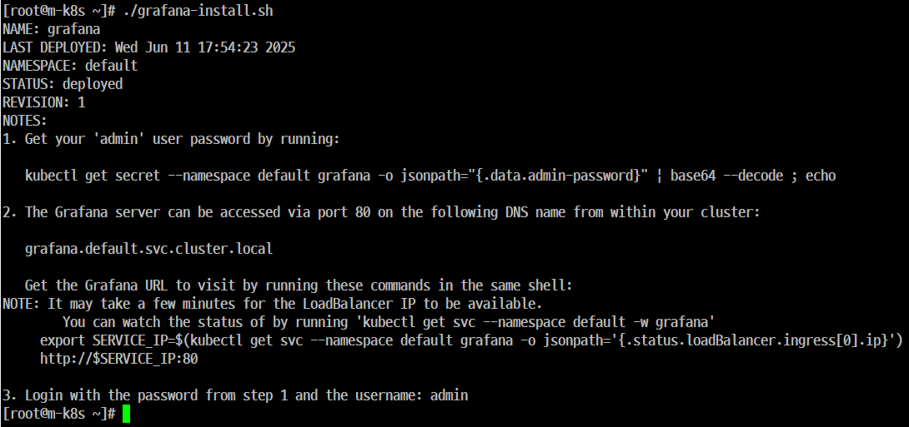

```
./grafana-install.sh
```

### Step 3. 'Grafana'차트가 정상적으로 'kubernetes Cluster'에 설치가 되었는지 확인

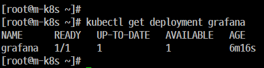

```
 kubectl get deployment grafana
```
### Step 4. 'Grafana' 서비스를 위한 '접속 IP'를 확인

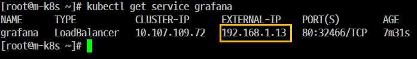

```
kubectl get service grafana
```
### Step 5. 'Grafana' '웹 UI' 접속 

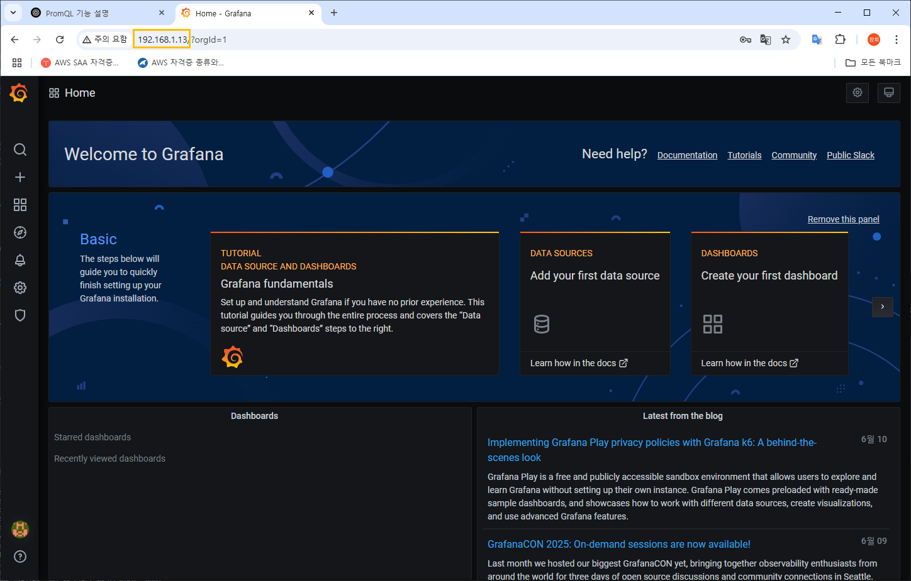

- 초기 아이디와 비번 모두 admin
- 비번 변경 P@ssw0rd

## 'Prometheus'를 데이터 소스로 구성

### Step 1. 데이터 소스 선택

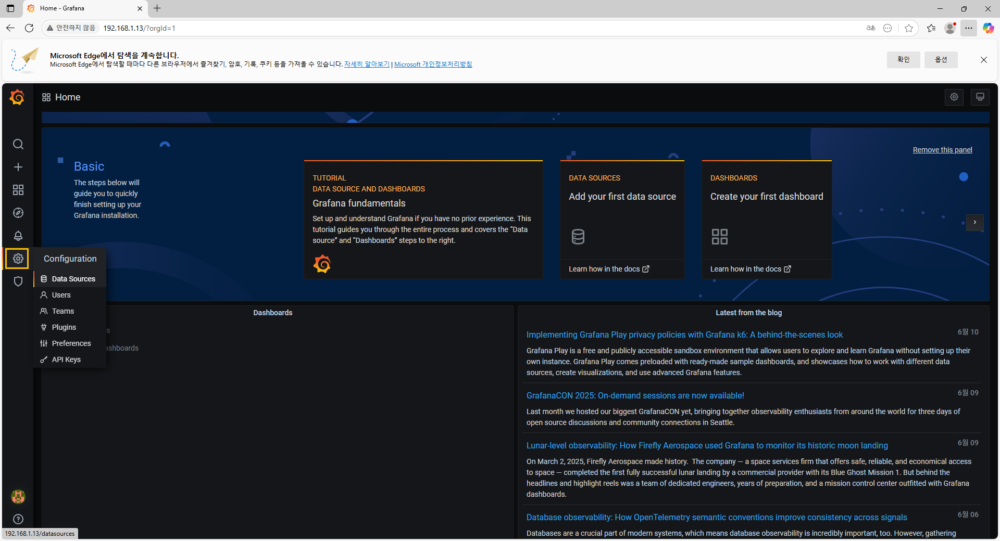

- 왼쪽에 있는 '톱니바퀴' 아이콘을 클릭한다.
- 'configuration' 하단에 있는 'Data Sources'를 클릭한다.

### Step 2. Data Sources 추가

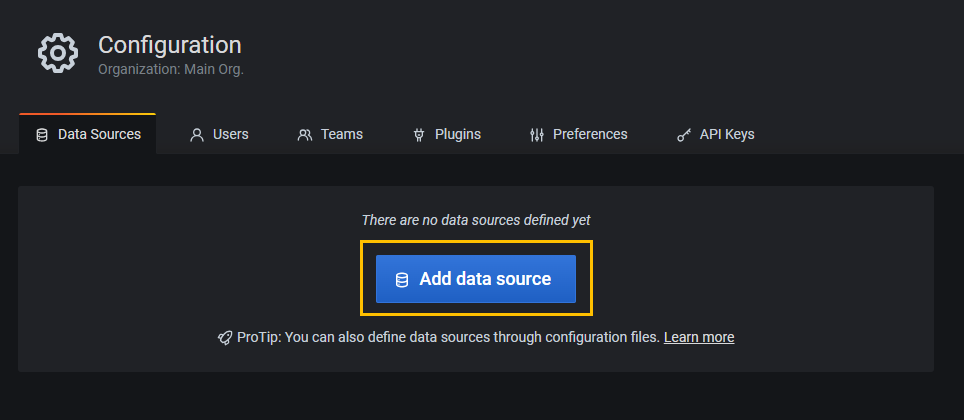

- 하단에 있는 'Add data Source'를 클릭한다.

### Step 3. 'Prometheus'에 마우스를 올린 후 우측에 있는 'Select'를 클릭 한다.

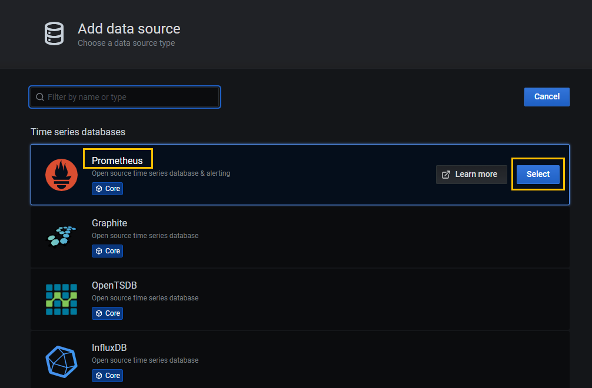

### Step 4. 'Prometheus' 값 설정
- 'Name'은 
    - 'Prometheus' 기본값 그대로 둔다.
- 'URL'
    - '접속 주소'를 입력한다.
    - 'Prometheus Server'의 IP를 적어도 되지만 일반적으로 내부 연결 경로를 입력한다. 
    - 'prometheus-server.default.svc.cluster.local'로 입력한다. 

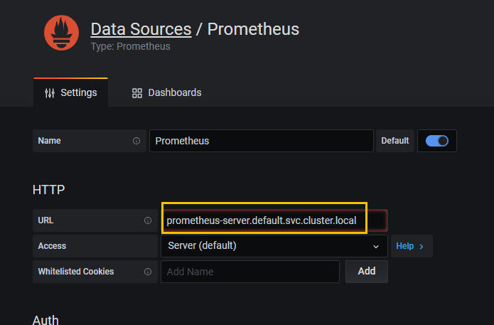

### Step 5. 입력 완료 후 저장하고 테스트한다.
- 화면 맨 밑에 있는 'Save & Test'를 클릭한다.

- Data source is working 이라는 메시지가 초록색으로 나타나면 된다.

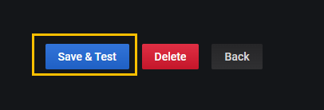

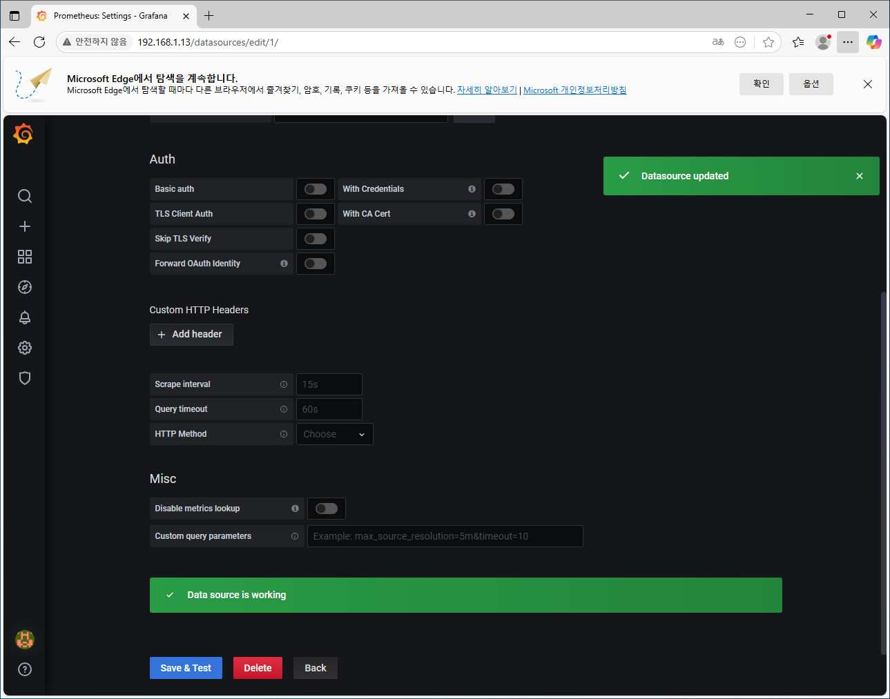

