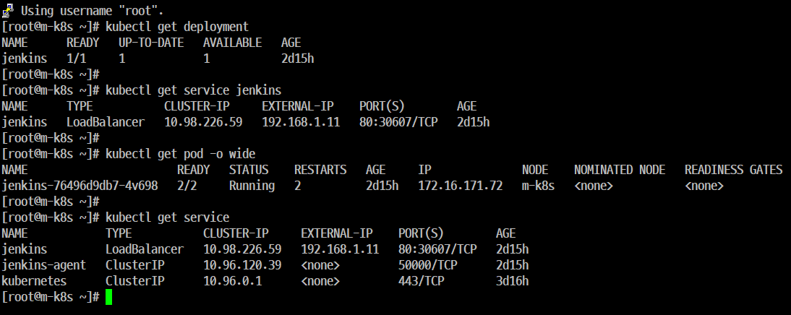
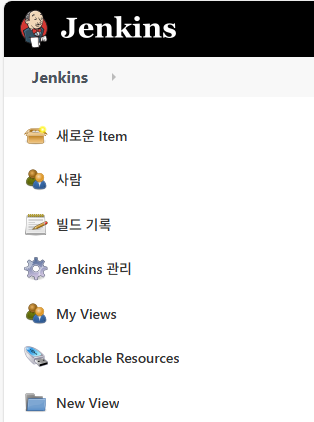
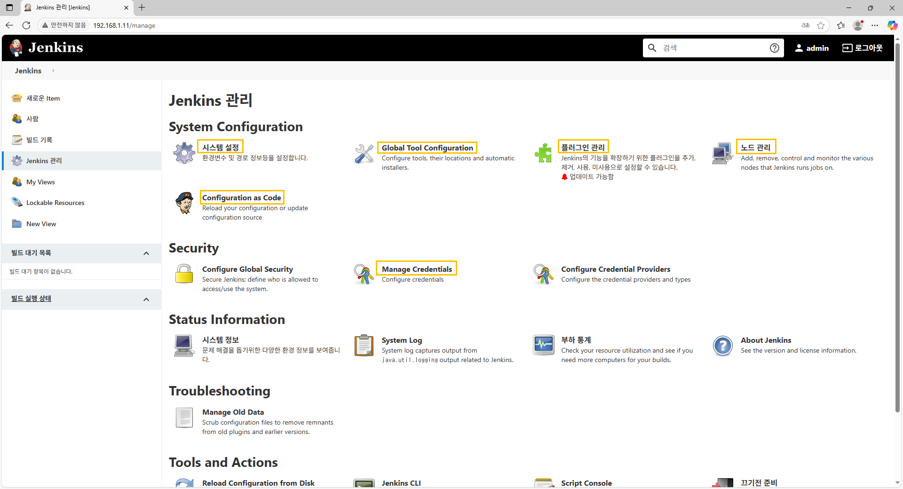
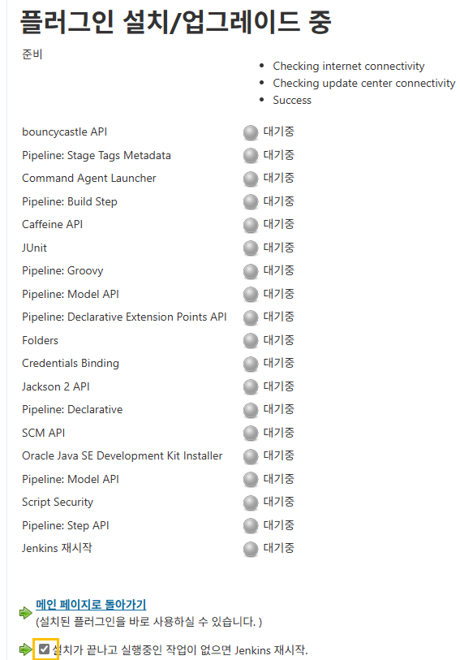

# 'Jenkins' 살펴보기

## 서비스 확인

개요
- 'Jenkins Controller' 'Master Node'에 설치했지만 'jenkins-agent'는 필요 시에 생성되고 작업을 마치면 삭제되는 임시 구조를 하고 있다.

- 'jenkins-agent'에서 작업한 내용들은 삭제가 되기 전에 'jenkins Controller'에 저장해야 하고 이를 위해서 'jenkins-agent'가 항상 동작하고 있어야 한다.

## Jenkins 접속

## 새로운  Item
- Jenkins를 통해서 'Build(작업 또는 작업할 영역)' 할 작업을 말한다.
## 사람
- 사용자를 관리하는 메뉴이다.
- 사용자 정보를 관리하는 방법 2가지
    - jenkins를 구동하는 서버에서 '직접 사용자를 관리'하는 방법
    - jenkins가 별도의 데이터베이스를 가지고 '자체적으로 사용자를 관리' 하는 방법

## 빌드 기록
- jenkins 작업에 대한 성공, 실패, 진행 내역 등을 확인한다.

## Jenkins 관리
- jenkins의 시스템, 보안, 도구, 플러그인(Plug-in), 등 각종 설정을 수행한다.
## My views
- jenkins에서 각종 작업을 분류해 모아서 볼 수 있는 대시보드이다.
## Lockable Resources
- jenkins에서는 한 번에 여러 개의 작업이 동시에 일어날 수 있다.
- 이 때 작업이 진행 중이라면 옵션에 따라 다른 작업은 대기를 해야 한다.
- jenkins에서는 작업이 끝날 때까지 같은 작업을 하지 못하게 하는 잠금 장치를 Lockable Resources로 설정할 수 있다.

## New View
- 대시보드인 View를 생성하는 작업

# 기본 설정

## 시스템 설정 (시스템)
## Global Tool Configuration (빌드에 사용되는 도구)
## 플러그인 관리 (호환성)
## 노드 관리 (노드)
## Configuration as Code (설정을 이전)
## Manage Credentials (보안)

# Jenkins Controller 설정
## 개요
- Jenkins를 사용하기 위해서는 기본적으로 'Controller'와 'Agent' 구동과 과련된 여러 설정이 필요하다.

## Jenkins 시스템 설정

### Step 1. 시스템 메세지
- 'Cloud DX'라고 입력하고 하단에 있는 'Apply'와 '저장'을 순선대로 누른 후 왼쪽 상단에 있는 'Jenkins' 아아콘을 누른다.

- 메인 화면 상단에 'Cloud DX'라고 나타난 것을 확인할 수 있다.

### Step 2. of executors
- 동시에 빌드를 수행할 수 있는 실행기의 갯수를 보정하는 옵션
- 'Controller Node'에서 몇 개까지의 빌드를 실행할 수 있는지 설정한다.

### Step 3. Labels
- 노드를 구분할 수 있는 레이블을 지정한다.
- 레이블을 통해 'Usage' 옵션을 사용하면 특정 작업을 어떤 노드에서 작업할 지 결정할 수 있다.

### Step 4. Usage 
- Jenkins 빌드 작업에 대해 Jenkins 노드가 어떻게 처리할지를 설정한다.
- 'Use this node as much as possible(이 노드를 간으한 많이 사용)' 옵션은 빌드 작업을 수행할 때 별도의 조건 없이 노드에 빌드를 할 수 있는 환경이라면 현재 노드에서 빌드를 진행하도록 설정한다.
- Only build jobs with label exporeesions matching this node(이 노드와 일치하는 레이블 표현식을 가진 작업만 빌드)' 옵션은 빌드와 대상의 레이블이 같아야 빌드를 할 수 있다. 
- 주로 빌드 환경이 다른 플랫폼(os기준)에서 빌드를 수행할 때 사용된다.
### Step 5. 'Quite period'
- 빌드 작업이 시작될 때까지 잠시 대기하는 시간을 설정하는 값이다.
- 단위는 '초' 단위이고 짧은 시간에 변경된 코드에 대해서 중복으로 작업은 수행하지 않고 가장 마지막으로 변경된 코드를 빌드할때 설정한다.
### Step 6. 'SCM checkout retry count'
- 소스 코드 저장소로부터 파일을 가져오지 못한 경우 몇 번 재시도를 할 지 설정
- 'SCM(Source Code Management)'는 개발자들이 소스 코드를 통합하고 관리하면 이력을 추적하기 위해 사용하는 시스템을 말한다.
### Step 7. 'Restricft project naming'
- Jenkins를 통해 만들어지는 작업의 이름 규칙을 설정하는 옵션
- 체크하면 이름 규칙을 편집할 수 있는 영역이 생기며 제약조건은 정규식 패턴으로 작성해 적용할 수 있다.
- 'Nameing Strategy'에 'Streategy'이 'Default'로 되어 있기 때문에 자유롭게 프로젝트 이름을 설정할 수 있다.
### Step 8. Jenkins URL
- 설치된 'jenkins'의 접속 주소이다.
- 'Helm'을 설치할 때 'LoadBalancer'를 통해 설정된 IP인 192.168.1.11을 이미 설정했다. 
### Step 9. Resource root URL
- 빌드 결과물과 같은 내용을 외부에 공개하기 위해 사용되는 주소
- 만약 외부에 결과물을 공개할  수 없는 '가상환경'일 경우에는 설정하지 않는다. 

## Jenkins 'Plug-in' 관리
### 개요
- jenkis는 실행되는 모든 기능을 'Plug-in'으로 구현하도록 설계되어 있다.
- 'plug-in'들을 단독으로 사용하거나 여러 개를 조합해서  CI/CD기능을 만들수 있다.
- Kubernetes 위에 Agent Pod 를 설정할 수 있게 도와주는 'kubernetes Plug-in'
- 'Pipeline Project' 기능더 plug-in 을 통해서 구현된다.
### Step 1. 업데이트된 플러그인 목록
- 이미 업데이트 된 플러그인을 최신 버전으로 올릴 수 있다.
- 만약 업데이트를 할 수 없는 플러그인은 보안 취약점이 발견되었거나 플러그인의 버전이 Jenkins 호환 버전이 아닌 경우에는 설치할 수가 없다.
### Step 2. 설치 가능
- 설치되지 않은 플러그인을 검색해서 현재 Jenkins에서 해당 기능을 추가할 수 있다.
### Step 3. 설치된 플러그인 목록
- 현재 설치된 플러그인의 정보를 확인
### Step 4. 고급
- 외부와 연결되는 'Proxy Server' 설정을 할 수가 있다.
- 외부와 연결되는 'Proxy SErver'를 통해서 내부망에서도 Jenkins를 설치하고 업데이트할 수가 있따.
### Step 5. 작업

 

 

### Step 6. 'Step 3. 설치된 플러그인 목록'에서 설치된 플러그인을 확인한다.

