# 📘 DNS Spoofing (MITM Attack)

## MITM(Man IN the Middle)
- 개요
    - 전달되는 패킷의 MAC Address와 IP뿐만 아니라 패킷의 내용까지도 바꿀 수 있다.
    - 네트워크 통신을 조작하여 내용을 도청 또는 조작하는 공격을 말한다.
    - MITM Attack은 ARP Spoofing 공격을 하면서 Packet Forwarding을 한다.

## ettercap
- 개요
    - MITM 공격을 위한 툴을 말한다.

### 실습
- 실습 환경 (NAT)
- DNS Spoofing
## 터미널에서의 작업
- MITM Attack 성공 후 출력할 문서를 생성
- 사이트 출력이 잘 되는지 확인
- MITM Attack 시 출력될 도메인 설정

```
[samadal@kali ~]$ sudo cd /etc/ettercap/
sudo: cd: command not found
sudo: "cd" is a shell built-in command, it cannot be run directly.
sudo: the -s option may be used to run a privileged shell.
sudo: the -D option may be used to run a command in a specific directory.

[samadal@kali ~]$ cd /etc/ettercap/

[samadal@kali /etc/ettercap]$

[samadal@kali /etc/ettercap]$ ls -l
total 28
-rw-r--r-- 1 root root 10055 Nov 30 01:35 etter.conf
-rw-r--r-- 1 root root  4491 Nov 30 01:35 etter.dns
-rw-r--r-- 1 root root  2799 Aug  1  2020 etter.mdns
-rw-r--r-- 1 root root  1653 Aug  1  2020 etter.nbns        
```
sudo 사용시 오류 발생

```
cd /etc/ettercap
```
```
[samadal@kali /etc/ettercap]$ ls -l
total 36
-rw-r--r-- 1 root root 10055 Nov 30 01:35 etter.conf
-rw-r--r-- 1 root root  4606 Apr 30 22:49 etter.dns
-rw-r--r-- 1 root root  4491 Apr 30 22:45 etter.dns.samadal
-rw-r--r-- 1 root root  2799 Aug  1  2020 etter.mdns
-rw-r--r-- 1 root root  1653 Aug  1  2020 etter.nbns
```
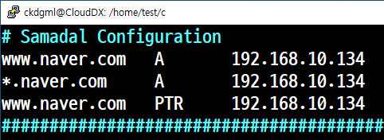

```
vi etter.dns를 복사후 수정
```

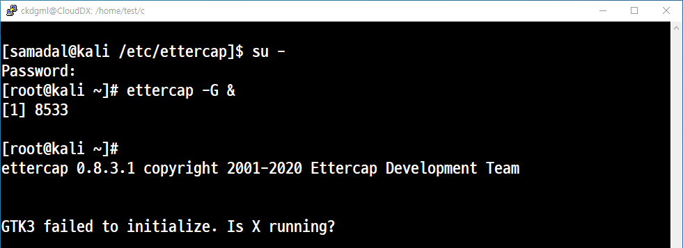

### kali Ettercap에서의 작업
- 패키지 설치 및 실행
```
sudoapt install ettercap-graphical
```
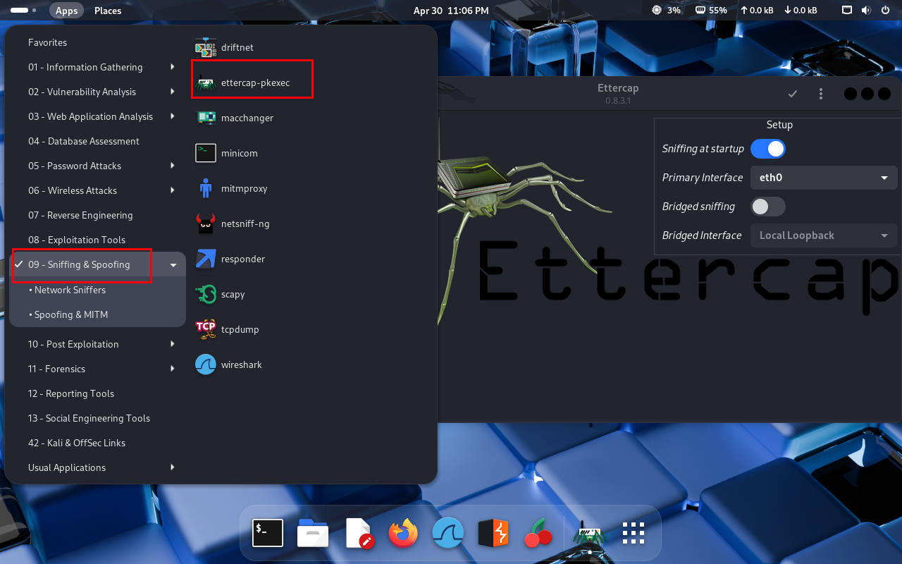

- Ettercap 설정
    - Accept<br>

<br>
- start/stop <br>

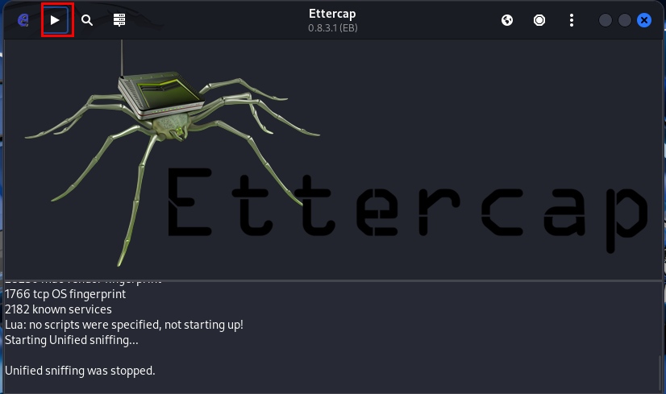<br>

- Ettercap Menu<br>

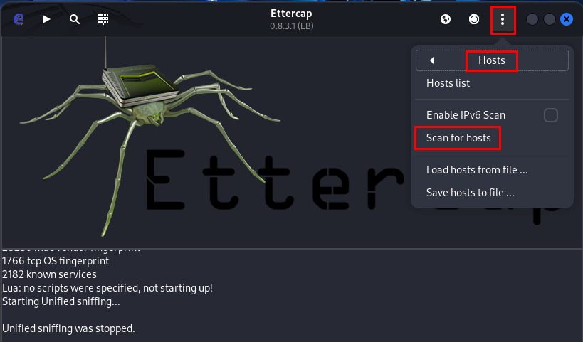<br>

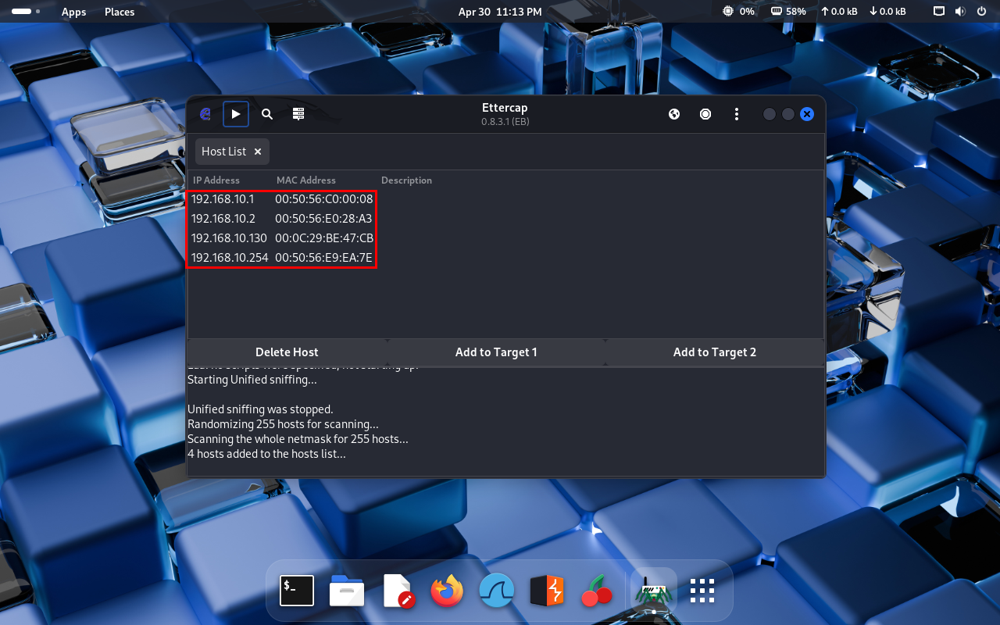<br>

## 

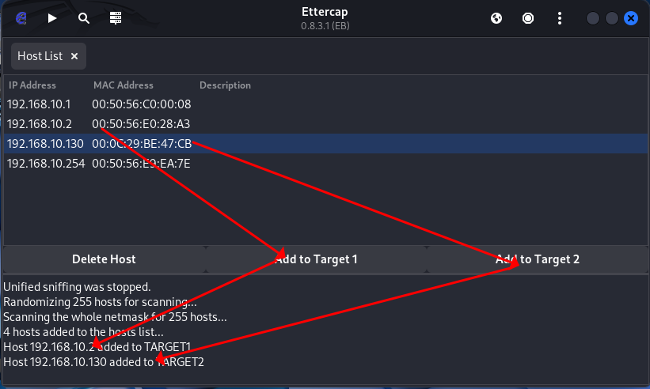<br>

메뉴 → plugins → Manage plugins
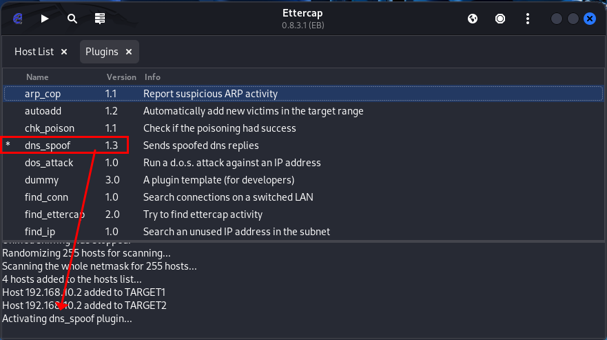<br>

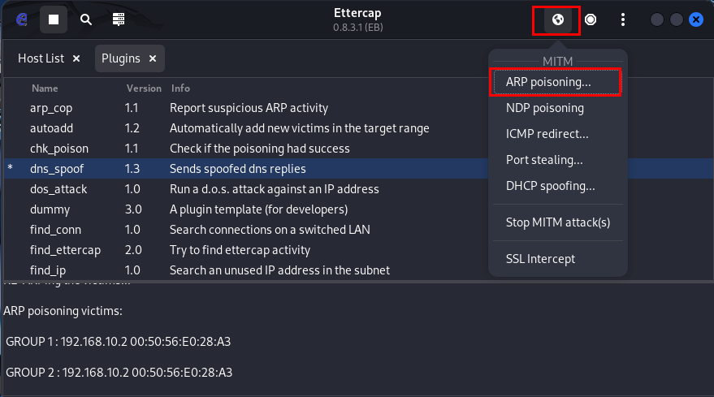<br>

<br>

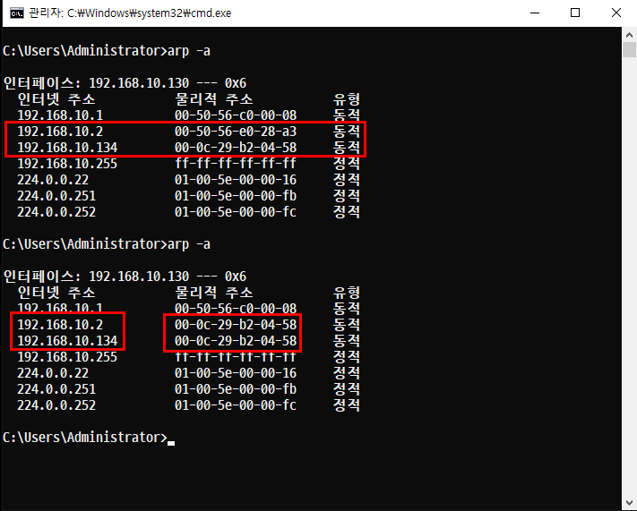<br>

---

### window 10에서의 작업

- MAC address를 확인
- 웹 브라우저를 실행한 후 /etc/etters.dns' 에서 입력한 도메인으로 접속 시도 : 사이트가 '/var/www/html/indedx.html'의 내용이 출력되어야 한다.

### Phishing Site (피싱 사이트)

## 개요
- 개인 정보 **(Private)** 와 **낚시(Fishing)** 의 합성어

### 실습 환경(NAT)
```
- kali              192.168.10.134 / C / 192.168.10.2 / 192.168.10.2
- Windows 10        192.168.10.130 / C / 192.168.10.2 / 192.168.10.2
```
## 실습1. 'index.html' 파일을 이용한 사이트 출력

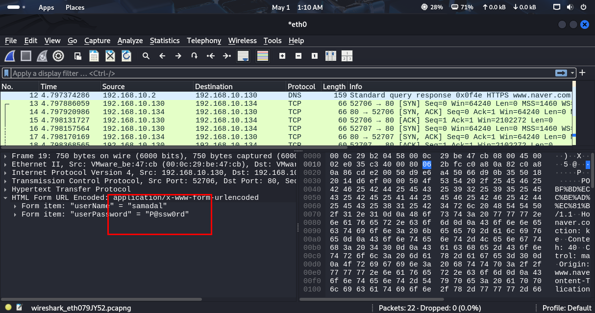<br>


## 실습2. 'naver.com'의 소스를 퍼다가 피싱 사이트 만들기

- FTP 서비스 활성화
    - 패키지 설치
    ```
    sudo apt install vsftpd
    ```

    - 포트추가

    ```
    [samadal@kali /var/www/html]$ sudo ufw status
    Status: active

    To                         Action      From
    --                         ------      ----
    20/tcp                     ALLOW       Anywhere
    21/tcp                     ALLOW       Anywhere
    22/tcp                     ALLOW       Anywhere
    80/tcp                     ALLOW       Anywhere
    20/tcp (v6)                ALLOW       Anywhere (v6)
    21/tcp (v6)                ALLOW       Anywhere (v6)
    22/tcp (v6)                ALLOW       Anywhere (v6)
    80/tcp (v6)                ALLOW       Anywhere (v6)
    ```

    - 데몬 실행

    ```
    sudo systemctl enable vsftpd
    sudo systemctl restart vsftpd
    ```

    - 환경설정

    ```
    sudo vi /etc/vsftpd.conf
    ```
    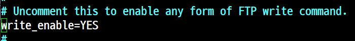<br>
    ```
    sudo systemctl restart vsftpd
    ```

    - 'Host OS'에서 접속 <br>
    호스트에서 네이버에서 소스긁기 → index.html 넣기 <br>

    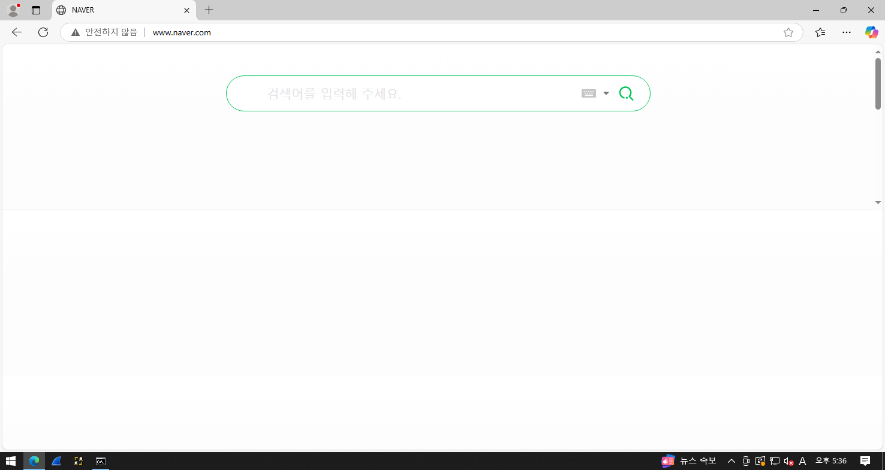<br>

---

## 실습 3. ettercap을 이용한 DHCP Spoofing
### 개요
→ 공격자가 DHCP를 위장하여 조작된 정보를 전송하는 것을 말한다.
- 실습 환경(NAT)
```
kali        192.168.10.134  / c / 192.168.10.131 / 192.168.10.131
WS2022      192.168.10.131  / c /       x        /      x
windows 10  192.168.10.130  / c / 192.168.10.131 / 192.168.10.131
'VMWare
```
## ws2022

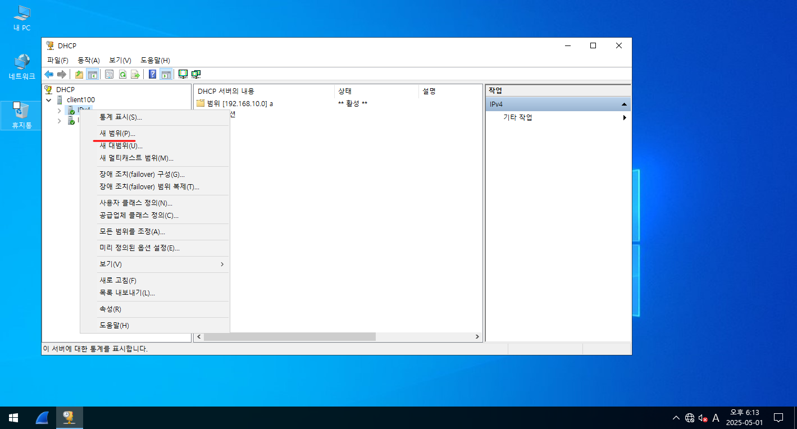<br>

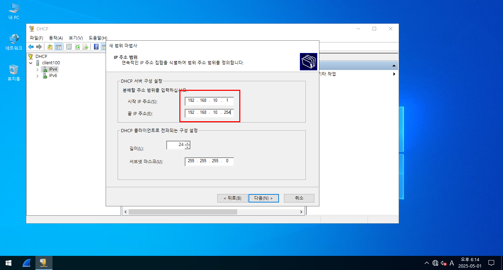<br>

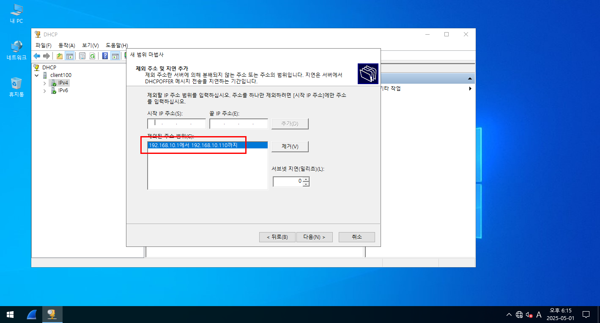<br>

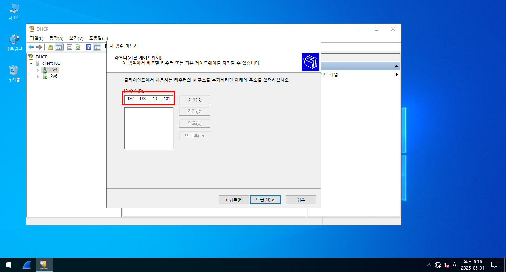<br>


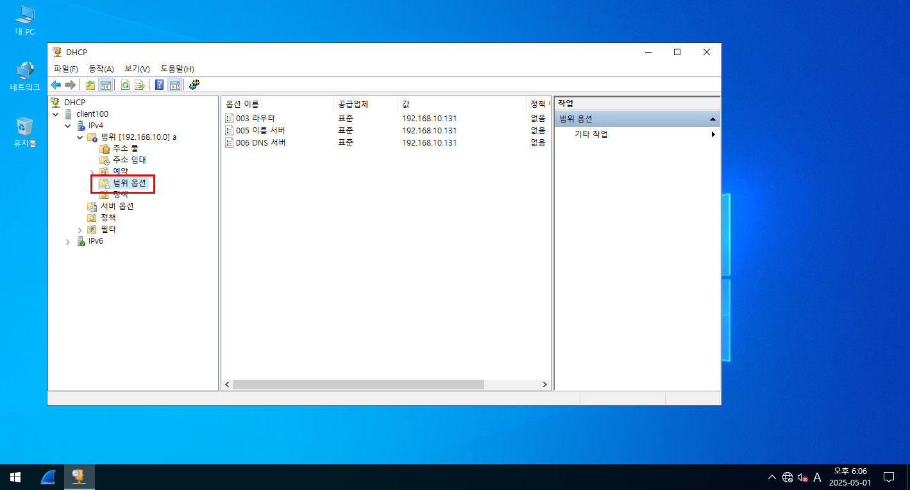<br>
범위옵션 → 옵션구성 3, 5, 6

## windows 10
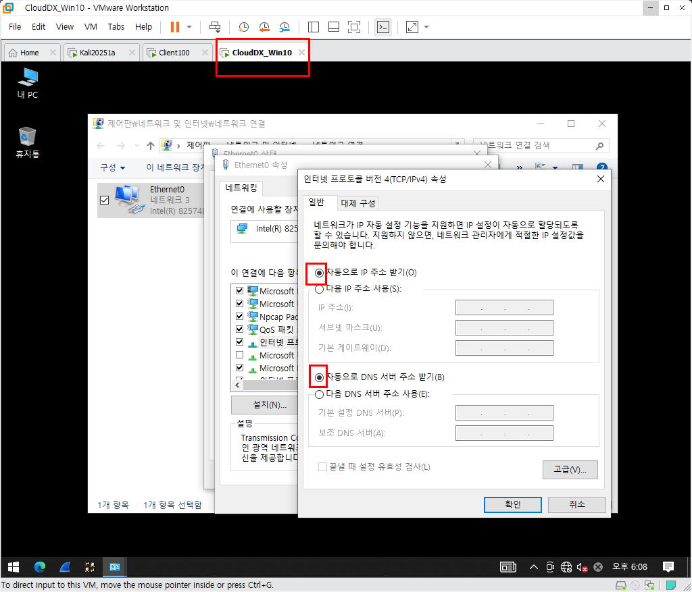<br>
- 자동으로 IP받기<br>

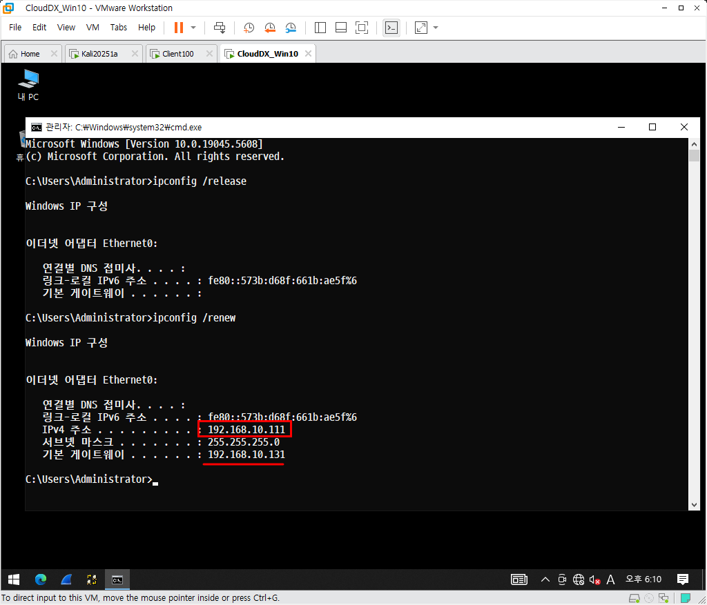<br>

## 예제 2. DHCP Server가 중간자 공격으로 Spoofing 당했을 경우

```
kali        192.168.10.134  / c / 192.168.10.131 / 192.168.10.134
WS2022      192.168.10.131  / c / 192.168.10.134 / 192.168.10.134
windows 10  자동
```

- 문법
```
sudo ettercap -T -M dhcp:<할당할 IP대역 / SM / DNS>
```
- 실행
```
sudo ettercap -T -M dhcp:192.168.10.221-254/255.255.255.0/192.168.10.134
```

- windows 2022 에서의 작업<br>
DHCP Server의 임대 생성에 올라온 IP를 제거한다.<br>
'pc이름'에서 우클릭 후 '모든 작업 다시 시작'을 실행한다.

- windows 10 에서의 작업<br>
환경설정에서 입력되어 있던 IP를 모두 '자동'으로 변경한다.<br>
'ipconfig /release -> ipconfig /renew -> ipconfig /all' 을 순서대로 입력, 실행