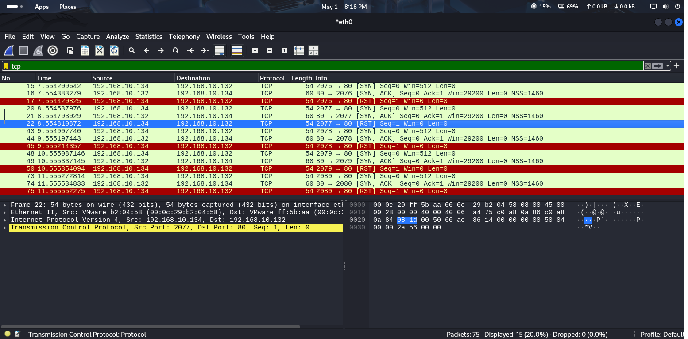
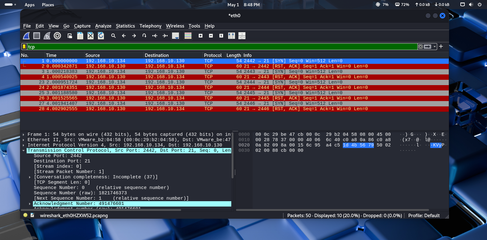
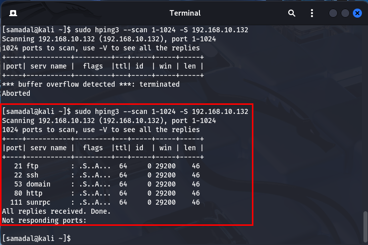
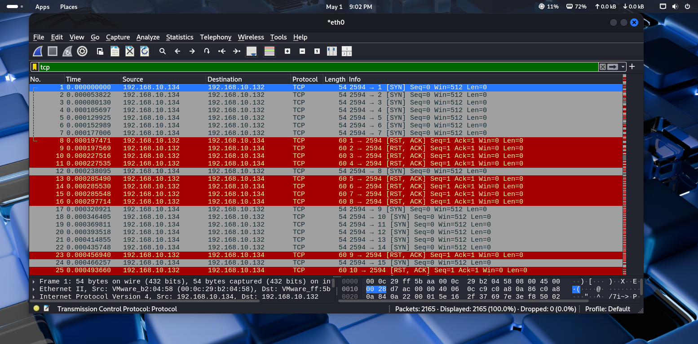
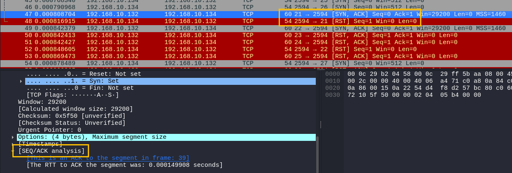

# 📘 DOS and DDOS Attack (서비스 거부 공격)

## 1. 개요

### 🔹 DOS (Denial of Service)
- **정의**  
  시스템에 악의적으로 과도한 트래픽이나 요청을 보내 **리소스를 고갈**시켜 서비스 제공을 방해하는 공격 방식입니다.

- **목적**  
  시스템의 정상적인 동작을 방해하여 **정상 사용자들이 서비스를 이용하지 못하게** 만듭니다.

- **공격 방식 예시**  
  - 특정 서버에 수많은 접속 요청을 보내 **서버의 TCP 연결 수를 고갈**
  - **트래픽 폭주**를 유도해 네트워크 자원 마비
  - 무한 루프나 대기 상태를 유발하는 요청 전송

- **주요 표적**
  - 은행, 결제 대행사(PG사), 루트 네임서버 등 **중요한 인터넷 기반 서비스**

- 🔗 [위키백과 - 서비스 거부 공격](https://ko.wikipedia.org/wiki/%EC%84%9C%EB%B9%84%EC%8A%A4_%EA%B1%B0%EB%B6%80_%EA%B3%B5%EA%B2%A9)

---

### 🔹 DDOS (Distributed Denial of Service)
- **정의**  
  **여러 대의 컴퓨터(좀비 PC)**를 이용해 동시에 하나의 서버를 공격하는 분산 서비스 거부 공격입니다.

- **특징**
  - 공격 규모가 크고 **방어가 매우 어려움**
  - **Botnet**을 이용해 공격을 수행
  - 공격자의 IP가 분산되어 있어 **추적이 어려움**

- **공격 사례**
  - **인터넷 포털 사이트 마비**
  - **금융기관 웹사이트 다운**
  - **게임 서버 장애 유발**

---

# 🔒 hping3를 이용한 포트 스캔 기반 DDoS Attack

## 📝 개요
- `hping3`는 **방화벽 우회, 포트 스캔, TCP/IP 테스트** 등을 지원하는 강력한 네트워크 도구입니다.
- DDoS 공격 시, **목표 서버의 열린 포트를 사전 탐색**하는 데 주로 사용됩니다.

---

## 🖥️ 실습 환경 (Host-only 구성)

| 역할        | 시스템           | IP 주소                            |
|-------------|------------------|-------------------------------------|
| Attacker    | Kali Linux       | 192.168.10.134, / C / 192.168.10.132 / 192.168.10.132      |
| Victim      | CentOS 7.9.2207  | 192.168.10.132, / C / 192.168.10.130,192.168.10.134 / 192.168.10.132                      |
| Zombie Bot  | Windows 10       | 192.168.10.130, / C / 192.168.10.132 / 192.168.10.132      |

> ※ 모든 시스템은 `192.168.10.0/24` 네트워크 대역에 존재하며, 가상 머신으로 구성됨.

---

## ⚙️ hping3 개요

- `hping3`는 일반 `ping`과 달리 **TCP/UDP/ICMP 패킷**을 자유롭게 생성할 수 있는 도구입니다.
- 기능:
  - **포트 스캐닝**
  - **MTU(Maximum Transmission Unit) 측정**
  - **방화벽 탐지 및 우회 테스트**
  - **DoS/DDoS 공격 시뮬레이션**

### 🔸 MTU란?
- MTU(Maximum Transmission Unit): 한 번에 전송 가능한 **최대 패킷 크기**
- **매체에 따라 값이 다르며**, MTU보다 큰 패킷은 분할(fragmentation)되어 전송됨

---

## 🛠️ 기본 사용법

```
hping3 [옵션] <대상 IP 주소>
```

`hping3`는 TCP, UDP, ICMP 패킷을 이용하여 포트 상태를 확인하거나, 방화벽/침입탐지 시스템의 반응을 테스트할 수 있습니다.

---

## 🔬 실습 1. Kali → DNS 서버(192.168.10.132)로 포트 스캔

### 🧾 개요
- TCP 연결의 첫 단계인 **SYN 패킷**을 전송하여 응답 상태를 확인하는 방식
- **SYN/ACK**로 응답이 오면 해당 포트는 **열려 있음(open)**  
- 이후 연결은 맺지 않고 **RST(Reset)**로 종료됨

### 💻 명령어
```
[samadal@kali ~]$ sudo hping3 -S www.gusiya.com -p 80 -c 5
```

- `-S`: TCP SYN 플래그
- `-p 80`: HTTP 기본 포트
- `-c 5`: 5개 패킷만 전송

### ✅ 결론
- 서버가 `SYN/ACK`으로 응답하면 해당 포트는 **연결 가능한 상태**
- 이후 클라이언트가 `RST` 패킷을 보내 연결을 초기화 (3-way 핸드셰이크 미완성)
- 다음 포트를 스캔하기 위해 연결을 종료함



---

## 🔬 실습 2. Kali → Windows 10 (Zombie) 시스템 포트 스캔

### 테스트 1️⃣: 기본 상태 (포트 지정 없이)
```
[samadal@kali ~]$ sudo hping3 -S 192.168.10.130 -c 5
```
- 포트 미지정 시 기본적으로 포트 0번 대상
- 대부분 **응답 없음** 또는 **연결 거부(RST)** 발생

---

### 테스트 2️⃣: 임의 포트 지정 (예: FTP 21번)
```
[samadal@kali ~]$ sudo hping3 -S 192.168.10.130 -p 21 -c 5
```

> 포트만 열려 있고 실제 서비스가 작동하지 않을 경우  
> → `SYN`에 대한 응답은 `RST/ACK`

---

### 테스트 3️⃣: 방화벽 해제 후 테스트
- **제어판 → 방화벽 완전 해제** 필요
- 포트가 열려 있으며 서비스가 활성화된 경우  
  → `SYN/ACK`으로 응답 (정상적인 서비스 감지 가능)

---

### 💡 결론

| 조건                            | 응답 형태      | 의미                         |
|---------------------------------|----------------|------------------------------|
| 포트 닫힘, 서비스 없음         | `RST/ACK`      | 연결 거부 (비활성 상태)      |
| 포트 열림, 서비스 작동 중       | `SYN/ACK`      | 연결 가능 (활성 상태)        |



---

## 실습 3. hping3를 이용한 'CentOS'로의 포트 스캔(열려 있는 포트와 닫혀 있는 포트 검색)

- 열려 있는 포트 검색
- 닫혀 있는 포트 검색 

```
[samadal@kali ~]$ sudo hping3 --scan 1-1024 -S 192.168.10.132
```
<br>

<br>

<br>

---

## 실습 4. (DDoS Attack) 공격 대상 시스템에 '무작위(Random)'의 IP주소를 계속 보낸다.

```
[samadal@kali ~]$ sudo hping3 --rand-source 192.168.10.132 -p 1-1024 -S --flood
```

- 옵션
    - --rand-source (무작위)
    - 192.618.10.132 (대상 IP)
    - -p 1-1024 (스캐닝할 포트)
    - -S (TCP Flag 'SYN')
    - --flood (플로딩)

## 실습 5. tcpdump(스니핑 도구)를 이용한 네트워크 패킷 확인
```
[samadal@kali ~]$sudo hping3 --rand-source 192.168.10.132 -p 1-1024 -S --flood
[samadal@kali ~/Desktop]$ sudo tcpdump
```

## 실습 6. 기타
- 테스트 1. Sync Flooding Attack
    - 'TCP Session'을 연결하는 과정에서 'Sync' 패킷을 많이 보내고 자원을 고갈시키는 공격
    - 명령어

- 테스트 2. Land Attack
    - 공격 대상의 IP를 Source IP로 설정해서 루프를 유발시키고 공격효과를 배로 향상 시키는 공격
    - 명령어
    ```
    [samadal@kali ~]$ sudo hping3 192.168.10.132 -a -S i u40 -c 50
    ```

- 테스트 3. Smurf Attack
    - Source IP를 변경하고 Direct Broadcast를 사용하여 ICMP echo reply 신호를 많이 받아서 부하를 일으키는 공격 
    ```
    sudo hping3 192.168.10.255 -a 192.168.10.134 -S -c 10
    ```
- 테스트 4. DDoS Attack
    ```
    sudo hping3 --flood --rand-source 192.168.10.134
    ```

## 3. 종합 예제

# 🖥️ 시스템 구성

| 역할             | 호스트 OS         | IP 주소          | 서브넷 마스크      | 게이트웨이        | DNS 서버           | 비고         |
|------------------|-------------------|------------------|---------------------|-------------------|--------------------|--------------|
| Primary DNS       | Windows Server 2022 | 192.168.10.50     | 255.255.255.0       | 192.168.10.50     | 192.168.10.50      | AD 미사용     |
|                  | (Bridged)         | 10.10.10.100      | 255.255.255.0       | -                 | -                  |              |
| Web Server        | CentOS 7.9        | 192.168.10.129    | 255.255.255.0       | 192.168.10.50     | 192.168.10.50      |              |
| Testing Client    | Windows 10        | 192.168.10.131    | 255.255.255.0       | 192.168.10.50     | 192.168.10.50      |              |
| Secondary DNS     | Windows Server 2022 | 192.168.11.50     | 255.255.255.0       | 192.168.11.50     | 192.168.10.50      | AD 미사용     |
|                  | (Bridged)         | 10.10.10.200      | 255.255.255.0       | -                 | -                  |              |
| DB Server         | CentOS 7.9        | 192.168.11.130    | 255.255.255.0       | 192.168.11.50     | 192.168.10.50      |              |
| Attacker          | Kali Linux        | 192.168.11.128    | 255.255.255.0       | 192.168.11.50     | 192.168.10.50      |              |

### 테스트
- 위의 시스템 중에서 Testig System만 외부에 두고 나머지는 모두 'ESxi'에 두고 테스트 할 것
- 위의 테스트 중에서 DB, Web, DNS 등을 모두 다른 시스템에 각각 설치하고 관리자는 시스템을 필요로하는 사용자들에게 별도로 부여하고 테스트할 것