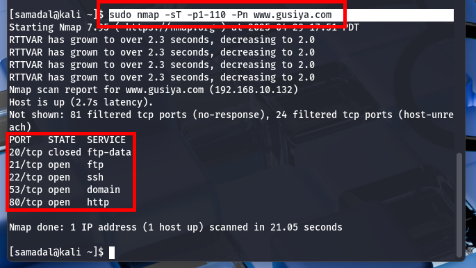
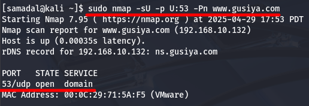
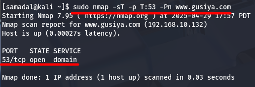
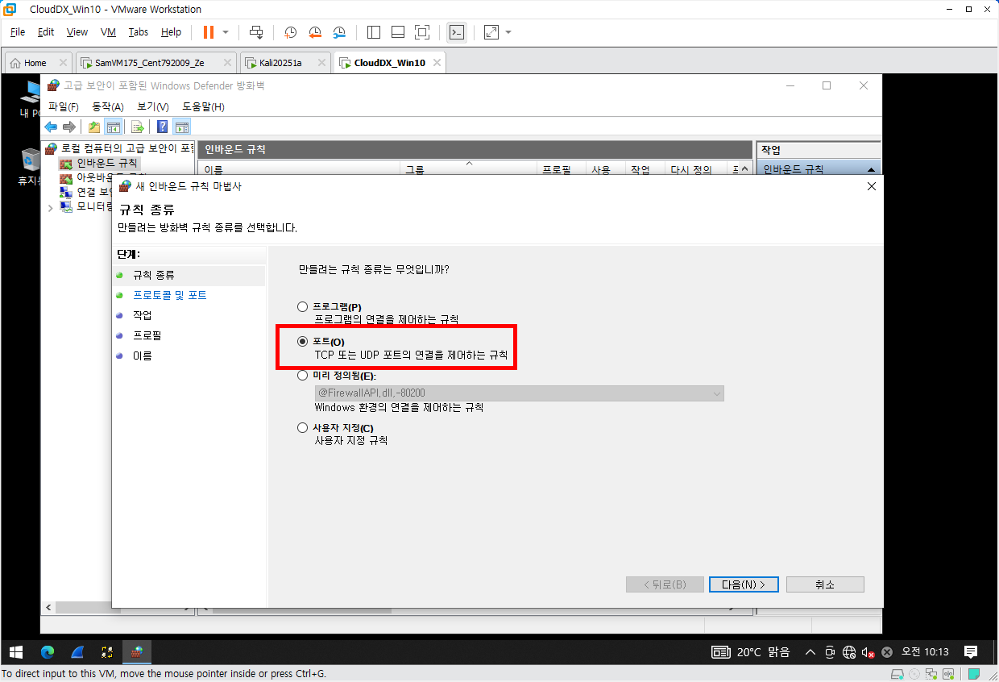
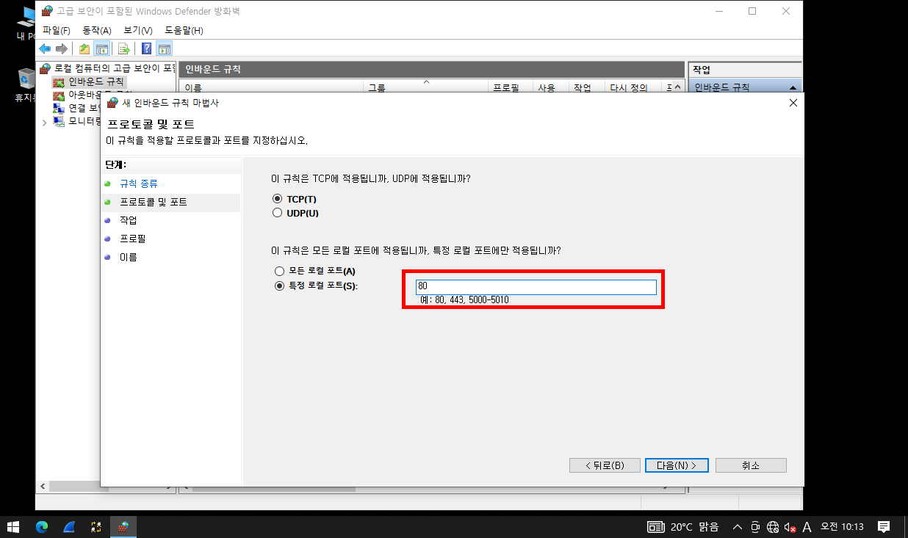
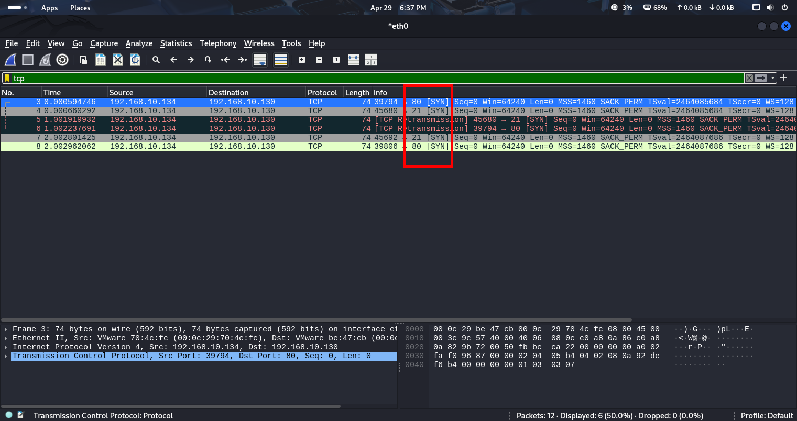
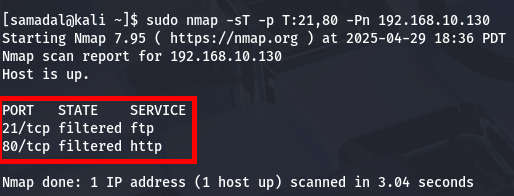

# Port Scanning (포트 스캐닝)

## 1. TCP 연결 설정(3-Way Handshaking) 및 TCP 연결 종료(4-Way Handshaking)

### 개요

- 공격자(Attacker)와 공격 대상(Vimtim) 사이의 연결 상태를 통해 스캐닝할 수 있는 기법을 의미한다.
- 샥스핀을 통해서 확인이 가능하다.

### TCP 연결

공격자 → SYN → 공격대상 → SYN + ACK → 공격자 → ACK(연결 성공) → 공격대상

### TCP 종료

공격자 → FIN(연결 종료 요청) → 공격대상 → ACK(연결 종료 승인)& FIN(연결 종료 요청) → 공격자 → ACK(연결 종료 성공) → 공격대상

---

    'TCP Flag' 용어


    SYN(SYNchronize Sequence Numbers) → 접속을 요청하는 패킷


    ACK(ACKnowledgement) → 응답 패킷


    RST(Connection ReSeT) → 다시 연결 종료 (이미 연결이 되어 있기 때문에 재접속 하지 않도록 끊어버린다.)


    FIN(FINish) → 연결 종료 요청
---

### TCP 연결 리셋(RST, '연결이 끊어졌다' 또는 '연결이 파기되었다')

- Case 1. 존재하지 않는 포트로 연결을 요청할 때<br>
    - 개요<br>
    → Target의 TCP는 연결을 파기하기 위해 RST 전송<br>
    - 유형<br>
    → 공격자 → SYN → 공격대상 → SYN + RST → 공격자

- Case 2. 비정상적인 상황일 때
    - 개요<br>
    → 정상적인 경로(승인된 경로)를 통한 통신이 아닌 상황
    → 해킹을 종료한 후 이루어진다.<br>
    - 유형<br>
    → 공격자 → RST → 공격대상 <br>
    → **TCP 기반(신뢰성을 기반으로 한)** 이기 때문에 연결 또는 종료 시 공격 대상에게 의사를 묻고 진행해야 함에도 불구하고 이와 같은 과정을 거치지 않고 강제로 **연결을 끊겠다** 라고 말하는 것과 동일하다.
- Case 3. Target이 장시간동안 유휴 상태일 때
    - 개요<br>
    → 연결 종료 요청
    - 유형<br>
    → 공격대상 → **난 현재 휴면 상태야!** → 공격자 → RST

---

## 2. Port Scanning

- 개요<br>
→ TCP를 이용한 포트 스캔을 말한다.<br>
→ **3-WAY Handshaking(TCP 연결 과정)** 과정을 거친다.<br>
→ 빠른 포트 스캔을 할 수가 있다.

- nmap<br>
→ 포트를 스캔하기 전에 어떤 시스템이 **(핵심)동작중인지를 먼저 확인**한다.<br>
→ 응답하지 않는 시스템은 스캔을 하지 않는다.<br>
→ 가장 많이 사용하는 포트 스캔 명령이다.<br>

## 실습 환경(Host-only)
- kali <br>
- CentOS with DNS<br>


## 실습 1. 가장 많이 알려진 포트 **(-T(cp), 1000개)** 를 스캐닝한다.

### 📄 TCP RST 패킷 분석 – Kali → CentOS
### 🖥️ 시스템 구성
- 192.168.10.134 → Kali Linux (클라이언트)

- 192.168.10.132 → CentOS (서버)

```
sudo nmap -sT 192.168.10.132
```

## 📊 패킷 캡처 요약 

| No. | Time     | Source         | Destination    | Protocol | Length | Info                                                                   |
|-----|----------|----------------|----------------|----------|--------|------------------------------------------------------------------------|
| 28  | 0.044602 | 192.168.10.134 | 192.168.10.132 | TCP      | 66     | 🛑 RST,ACK to Port 53 (DNS) from **Kali** → **CentOS**, Seq=1 Ack=1   |
| 30  | 0.044649 | 192.168.10.134 | 192.168.10.132 | TCP      | 66     | 🛑 RST,ACK to Port 8080 (HTTP-alt) from **Kali** → **CentOS**         |
| 31  | 0.044680 | 192.168.10.134 | 192.168.10.132 | TCP      | 66     | 🛑 RST,ACK to Port 21 (FTP) from **Kali** → **CentOS**                |
| 32  | 0.044709 | 192.168.10.134 | 192.168.10.132 | TCP      | 66     | 🛑 RST,ACK to Port 80 (HTTP) from **Kali** → **CentOS**               |
| 57  | 0.045527 | 192.168.10.134 | 192.168.10.132 | TCP      | 66     | 🛑 RST,ACK to Port 3306 (MySQL) from **Kali** → **CentOS**            |
| 58  | 0.045559 | 192.168.10.134 | 192.168.10.132 | TCP      | 66     | 🛑 RST,ACK to Port 22 (SSH) from **Kali** → **CentOS**                |

## 🧠 요약 해석
- Kali에서 CentOS의 여러 서비스 포트에 연결 시도 후, 모두 **RST, ACK**로 연결을 즉시 종료함.

- 이런 현상은 다음의 경우 발생 가능:

 1. Kali에서 포트 스캔 도구를 사용 중 (예: nmap의 TCP Connect Scan)

 2. CentOS 측에 서비스가 비활성 상태이거나 방화벽 차단

 3. Kali가 비정상 세션을 감지하고 강제 종료하는 방식의 동작

## 실습 2. 연결된 상태 **(-S(ync))**

## 📄 TCP RST 패킷 분석 – Kali(192.168.10.134) → CentOS(192.168.10.132)
## 🖥️ 시스템 구성
- 192.168.10.134 → Kali Linux (클라이언트)

- 192.168.10.132 → CentOS (서버)

```
sudo nmap -sS 192.168.10.132
```

## 📊 패킷 캡처 요약

| No. | Time     | Source         | Destination    | Protocol | Length | Info                                                                 |
|-----|----------|----------------|----------------|----------|--------|----------------------------------------------------------------------|
| 18  | 0.056224 | 192.168.10.134 | 192.168.10.132 | TCP      | 54     | 🛑 RST to Port 3306 (MySQL) from **Kali**, Seq=1                     |
| 22  | 0.056308 | 192.168.10.134 | 192.168.10.132 | TCP      | 54     | 🛑 RST to Port 8080 (HTTP-alt) from **Kali**, Seq=1                 |
| 24  | 0.056341 | 192.168.10.134 | 192.168.10.132 | TCP      | 54     | 🛑 RST to Port 21 (FTP) from **Kali**, Seq=1                        |
| 32  | 0.058708 | 192.168.10.134 | 192.168.10.132 | TCP      | 54     | 🛑 RST to Port 22 (SSH) from **Kali**, Seq=1                        |
| 39  | 0.058884 | 192.168.10.134 | 192.168.10.132 | TCP      | 54     | 🛑 RST to Port 53 (DNS) from **Kali**, Seq=1                        |
| 50  | 0.059340 | 192.168.10.134 | 192.168.10.132 | TCP      | 54     | 🛑 RST to Port 80 (HTTP) from **Kali**, Seq=1                       |

## 🧠 요약 해석

- 모든 패킷의 송신자는 동일한 **출발지 포트 33665** → 여러 목적지 포트로 `RST` 전송
- 공통점:
  - ⚠️ **ACK 플래그 없음** → 세션 수립 없이 즉시 연결 거부
  - 📭 **데이터 길이 없음** (`Len=0`)
  - 🔎 전형적인 **스텔스 스캔** or **포트 확인을 위한 빠른 RST 시도**

### 가능한 원인

- 🔍 **Kali에서 포트 스캔 도구 실행 중**
  - 예: `nmap -sT` 또는 `nmap -sS`로 포트 반응 유무만 빠르게 확인
- 🔒 **보안 도구에 의한 자동 RST 생성**
  - IDS/IPS 또는 방화벽에서 미확인 연결에 대해 강제 RST 전송
- 🤖 **스크립트나 프로그램이 포트 열림 여부만 확인 후 종료**
  - 예: 커스텀 스캐너, 쉘 스크립트 등이 특정 포트만 빠르게 확인

---

## 실습 3. 포트에서의 '서비스 활성화 유무' 를 스캐닝한다.

- 옵션

→ -S (스캔 타입을 정의)<br>
→ -T (TCP 스캔)<br>
→ -V (Version)<br>
→ -F (특정 포트를 스캔, 잘 알려진 포트만 검색)<br>
--version-intensity <레벨> (스캔 강도 설정)
→ 스캔강도 (0 ~ 5)
- 1(15초마다)<br>
- 2(0.4초마다)<br>
- 3(기본값, 1번만)<br>
- 4(5분 동안만)<br>
- 5(75초 동안만)<br>

```
sudo nmap -sTV -F --version-intensity 0 www.gusiya.com
```

## 실습 4. 모든 포트를 대상으로 검사하지 않았던 포트(Unknown, -P)까지 스캐닝한다.

-  옵션<br>
-p- (모든 포트가 대상)<br>
-Pn (알려지지 않은 포트(Unknown)까지 스캔)

```
sudo nmap -sT -p- -Pn www.gusiya.com
```

## 실습 5. 기타

- 특정 포트를 스캐닝한다.
```
sudo nmap -sT -p22 -Pn www.gusiya.com
```

- 특정 포트 구간(범위 지정)을 스캐닝한다.


```
sudo nmap -sT -p1-110 -Pn www.gusiya.com
```

- UDP 스캐닝 하면서 특정 포트만 스캐닝한다.
```
sudo nmap -sU -p U:53 -Pn www.gusiya.com
```


- TCP 스캐닝 하면서 특정 포트만 스캐닝 한다.
```
sudo nmap -sT -p T:53 -Pn www.gusiya.com
```


- 다수 개의 특정 포트들만 스캐닝한다.
```
sudo nmap -sT -p 53,80,3306 -Pn www.gusiya.com
```

- 다수 개의 특정 포트들(범위 지정)만 스캐닝한다.
```
sudo nmap -sT -p T:21-25 -Pn www.gusiya.com
```

## 실습 6. 응용

### 개요
- kali에서 windows 10으로 포트 스캐닝한 후 샥스핀으로 패킷을 분석한다.
- 포트는 알아서 2~3개 정도만 올린 후 테스트

### 실습환경(Host-only)

### 🖥️ 시스템 구성
- kali      192.168.10.134 / C / 192.168.10.132 / 192.168.10.132
- CentOS     192.168.10.132 / C / x / x
- Windows 10  192.168.10.130 / C / 192.168.10.132 / 192.168.10.132


포트 설정(wf.msc)
 



- 실행
```
sudo nmap -sT 192.168.10.130
sudo nmap -sS 192.168.10.130
sudo nmap -sTv -F --version-intensity 0 192.168.10.130
```




```
sudo nmap -sT -p T:21,80 -Pn 192.168.10.130
```

## 실습 7. 응용 2.
### 🖥️ 시스템 구성

- kali      192.168.10.134 / C / 192.168.10.132 / 192.168.10.132
- CentOS     192.168.10.132 / C / x / x
- Windows 10  192.168.10.130 / C / 192.168.10.132 / 192.168.10.132
- windows Server 2022
