## Terraform 개요

- **핵심 개념**:  
  자원(Server, Storage, Network 등)을 **IaC (Infrastructure as Code)** 방식으로 관리할 수 있게 해주는 **도구(컴퓨터 언어)** 를 의미한다.

- **IaC(Infrastructure as Code)** 란?  
  - 예: Terraform처럼 **프로그래밍 코드로 인프라를 관리**하는 방식  
  - 수동 GUI 설정 대신 **코드로 선언**하고 버전 관리가 가능하다

- **Terraform의 언어**:  
  - **HCL (HashiCorp Configuration Language)** 사용  
  - HashiCorp에서 개발  
  - JSON과 유사하나 **사람이 읽기 쉬운 문법 제공**  
  - Terraform 외에도 HashiCorp 도구에서 많이 사용됨

- **JSON 참고**:  
  - JavaScript 문법 기반의 **데이터 표현 표준 포맷**  
  - 웹 애플리케이션의 **서버-클라이언트 간 데이터 전송**에 주로 사용

- **IaC로 가능한 작업 예시**:
  - 가상 머신(EC2) 생성
  - VPC, 서브넷, 보안 그룹 설정
  - 네트워크 인터페이스 자동 구성
  - 클라우드 리소스 전반 자동 배포 및 관리

- **Terraform의 장점**:  
  - GUI 없이 리소스를 **선언형 코드로 관리**  
  - 코드 기반으로 **인프라를 계획, 적용, 추적** 가능

- **작업 방식**:  
  - 로컬 PC에서 Terraform 코드 작성 및 적용  
  - AWS 콘솔에서 결과 확인

- **적용 범위**:  
  - AWS, GCP, Azure, GitHub, Docker 등 **대부분의 인프라 환경**을 Terraform으로 **구축, 배포, 유지보수** 가능


## Terraform에서 자주 사용되는 용어
- Provisioning(프로비저닝, 공급)
    - 어떤 프로세스 또는 서비스를 실행하기 위한 준비 단계를 말한다.
- Provider(프로바이더, 공급자)
    - 'Terraform'과 외부 서비스를 연결해주는 기능을 하는 모듈을 말한다.
    - 'Terraform'으로 AWS 서비스의 컴퓨팅 자원을 생성하기 위해서는 'AWS Povider'를 먼저 설정해야 한다.
- Resource(리소스, 자원)
    - 특정 프로바이더가 제공해주는 조작 가능한 대상의 최소 단위를 말한다.
- Plan(계획)
    - '.tf' 파일의 내용을 실제로 적용 가능한지 확인하는 작업을 말한다.
- Apply(적용)
    - 'Terraform 프로젝트 아래의 모든 '.tf' 파일의 내용대로 자원을 생성, 수정, 삭제하는 일을 한다. 

## Terraform 진행 단계
- Step 1. init(초기화)
- Step 2. init -update(업데이트)
- Step 3. validate(검증)
- Step 4. plan(계획)
- Step 5. apply(적용)

## 'Terraform' 설치 --window10

- 시스템 구성
### 'AWS CLI' 설치 및 업데이트

- 개요
    - 'Windows AWS CLI'에서는 '현재 설치'를 업데이트 하려면 '이전 버전'을 덮어쓰도록 업데이트를 진행할 때마다 '새 설치 관리자'를 다운로드 한다.

- 설치 방법
    - Windows용 설치관리자를 다운받아서 설치하는 방법
    ```
    https://awscli.amazonaws.com/AWSCLIV2.msi
    ```

    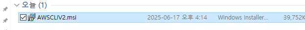

    - 실행창에서 msiexec 명령을 실행하고 MSI 설치 관리자를 실행하는 방법
    ```
    msiexec /i https://awscli.amazonaws.com/AWSCLIV2.msi
    ```            
    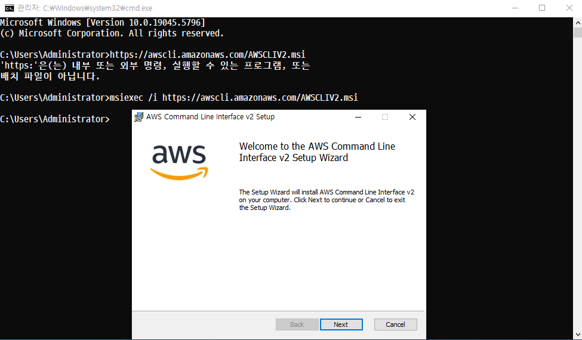

    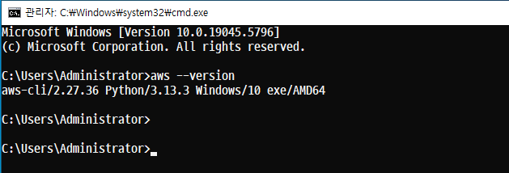

### 'Terraform' 설치
#### 개요
- 가급적 최신 버전을 다운로드 받아서 사용하는 것을 권장한다.

```
https://www.terraform.io/downloads.html
```

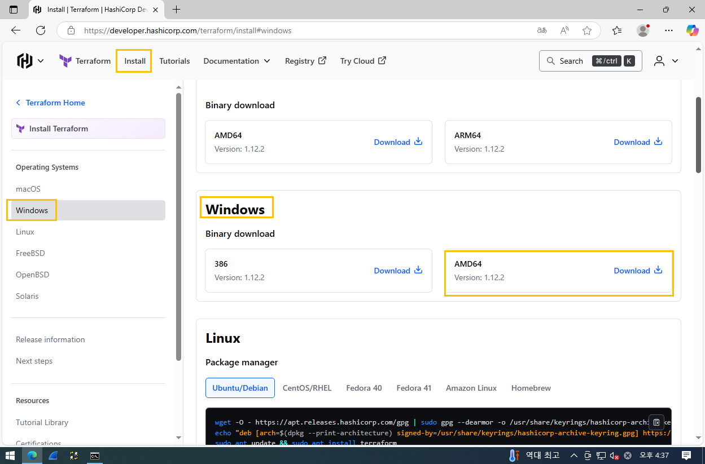

- 압축 파일을 해제한 후 지정된 경로로 이동

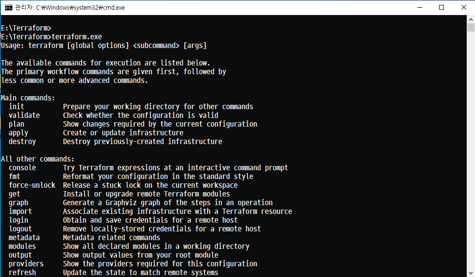

- Windows 환경 변수 등록

```
sysdm.cpl
```
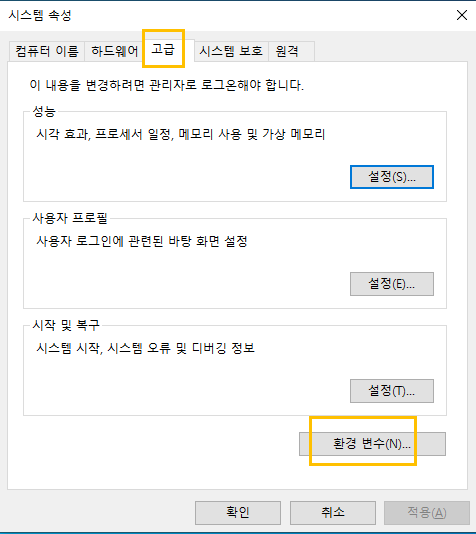

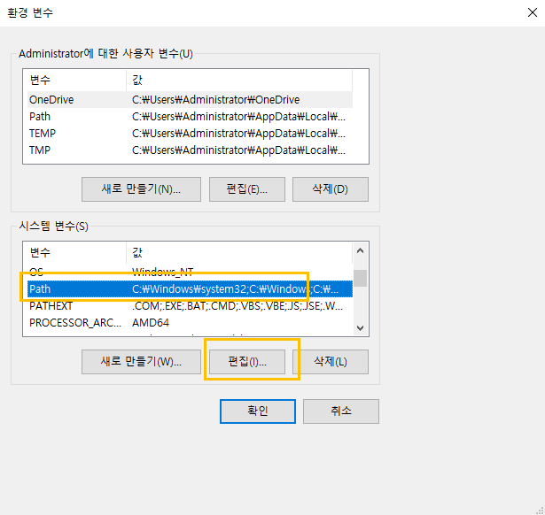

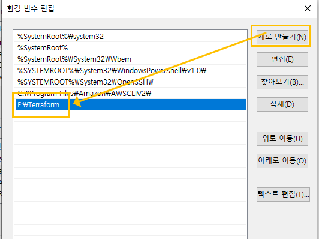

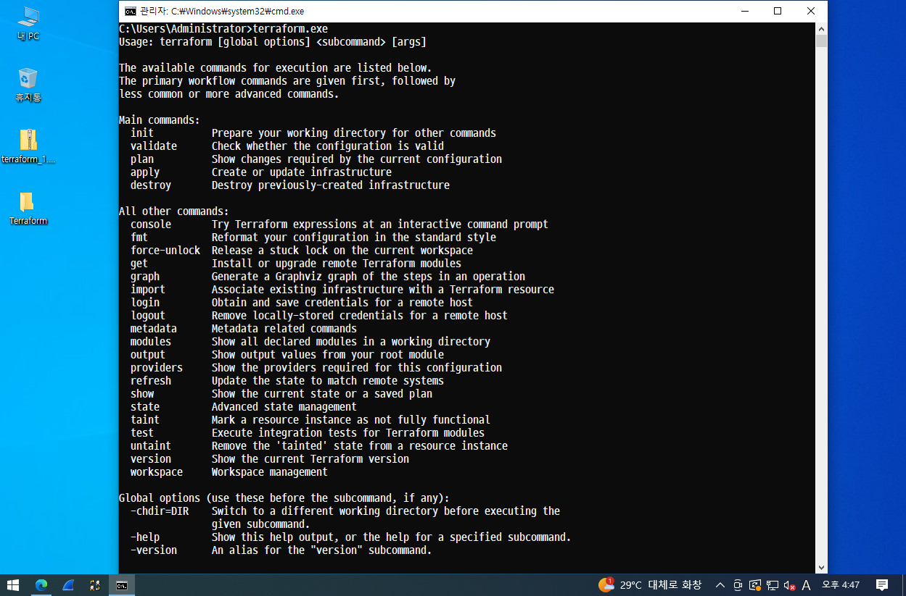

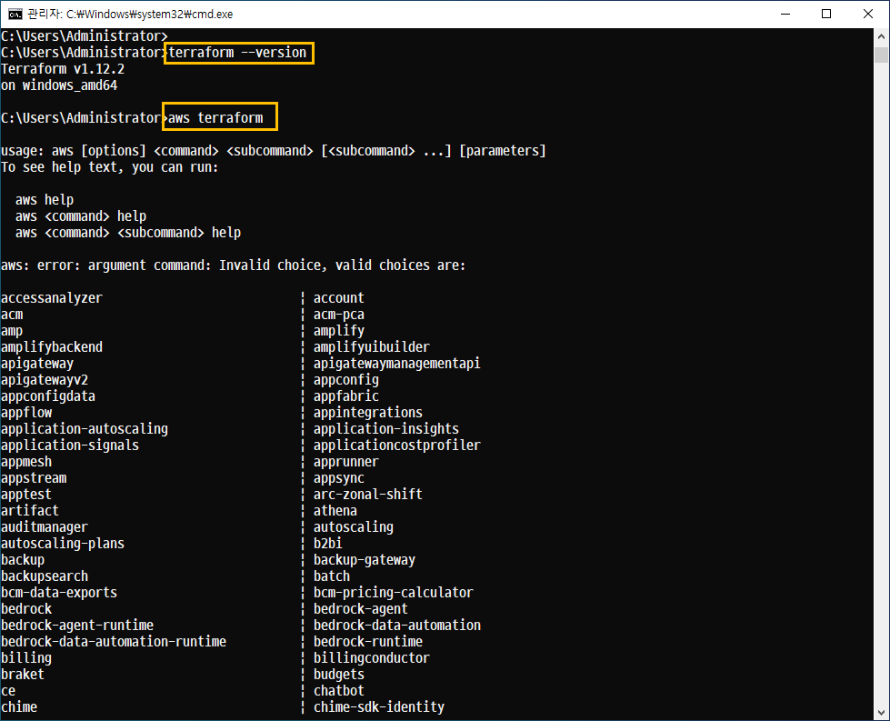

```
sed -i 's/mirrorlist/#mirrorlist/g' /etc/yum.repos.d/CentOS-*

sed -i 's|#baseurl=http://mirror.centos.org|baseurl=http://vault.centos.org|g' /etc/yum.repos.d/CentOS-*

 yum -y update
```

## 'Terraform' 설치 -- centos

### 시스템 구성
64GB추가

### 'AWS CLI' 설치 및 업데이트
```
sdb 에 자동 마운트 걸기
pwd = /sdb/Terraform
```
```
curl "https://awscli.amazonaws.com/awscli-exe-linux-x86_64.zip" -o "awscliv2.zip"
```

unzip하기

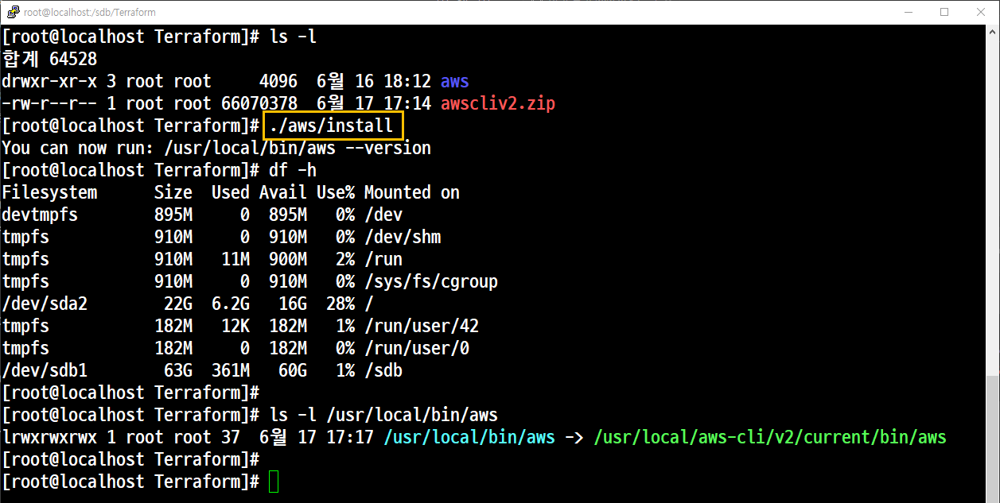

### aws 키 입력
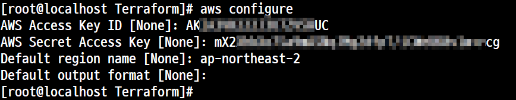

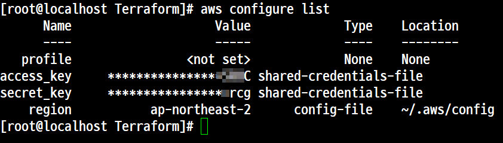

### 'Terraform' 설치

#### 설치

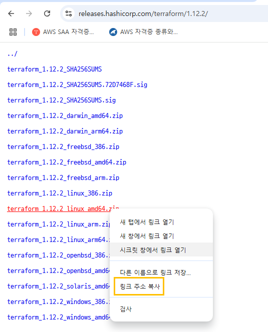

```
wget https://releases.hashicorp.com/terraform/1.12.2/terraform_1.12.2_linux_amd64.zip
```
#### 설치확인

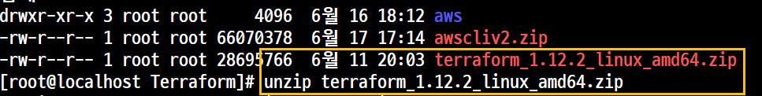


#### 경로와 상관없이 명령어 사용 가능
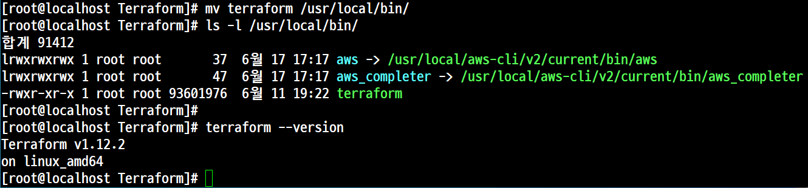

