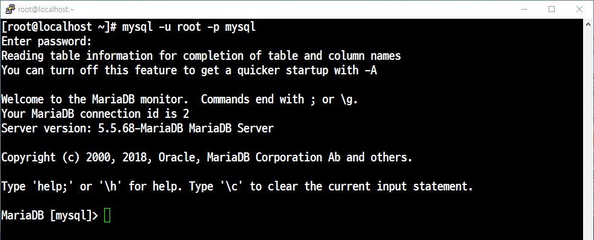
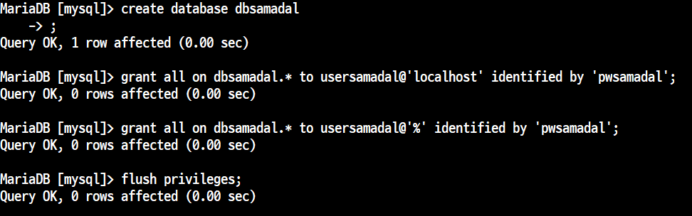

# 📘 DB_계정생성

다운로드

```
yum install -y mariadb-*
```

마리아디비 시작
```
systemctl start mariadb
systemctl enable mariadb
```

포트 및 서비스 추가
```
firewall-cmd --permanent --add-port=3306/tcp → 포트 추가하기

firewall-cmd --permanent --add-service=mysql → 서비스 추가
firewall-cmd --reload
```
### MariDB 접속하기


### 데이터 베이스 확인 및 만들기


