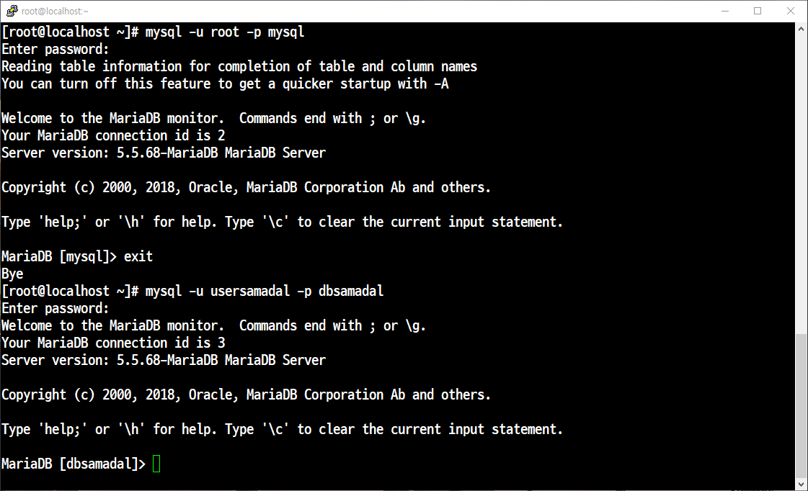

# 📘 DB_계정생성

다운로드

```
yum install -y mariadb-*
```

마리아디비 시작
```
systemctl start mariadb
systemctl enable mariadb
```

포트 및 서비스 추가
```
firewall-cmd --permanent --add-port=3306/tcp → 포트 추가하기

firewall-cmd --permanent --add-service=mysql → 서비스 추가
firewall-cmd --reload
```
### MariDB 접속하기


### 데이터 베이스 확인 및 만들기


## 1. 데이터베이스 생성

```
CREATE DATABASE dbsamadal;
```
- dbsamadal 이라는 이름의 새 데이터베이스(스키마)를 만든다.

## 2. 사용자에게 권한 부여 (localhost 접속용)
```
grant all on dbsamadal.* to usersamadal@'localhost' identified by 'pwsamadal';
```
- usersamadal 사용자가 localhost(서버 자가)에서 접속할 때, dbsamadal 데이터베이스 내의 모든 작업(select, insert, update, delete, ...)을 할 수 있도록 권한을 줌

- 이때 비밀번호는 pwsamadal 로 설정됨.

## 3. 사용자에게 권한 부여 (원격 접속용)

```
GRANT ALL ON dbsamadal.* 
  TO 'usersamadal'@'%' 
  IDENTIFIED BY 'pwsamadal';
```
- %는 "어떤 호스트에서든" 이라는 의미로, 외부(원격)에서도 같은 권한으로 접속하도록 허용합니다.

## 4. 권한 테이블 반영
```
flush privileges;
```
- 위의 GRANT, REVOKE 등 권한 변경 사항을 즉시 적용하도록 MySQL 서버에 알려줌


