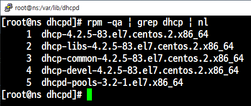
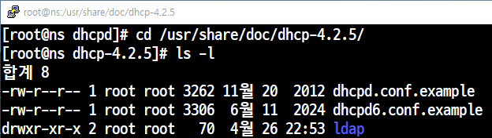
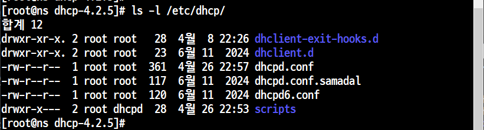
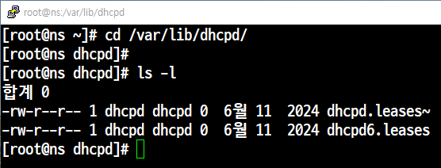
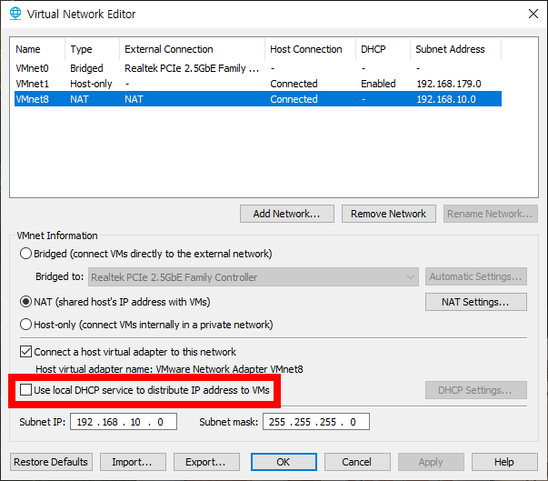
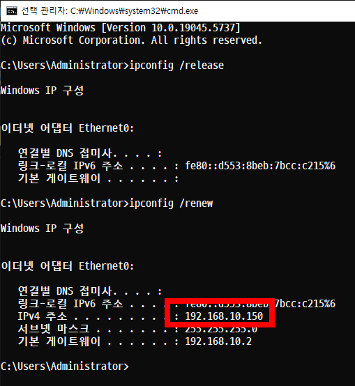

# 📘 DHCP (CentOS) Window10

## 패키지 다운로드

```
yum -y install dhcpd-*
yum -y install dhcp-*
포트 x
서비스 dhcp
데몬 dchpd
```
```
rpm -qa | grep dchp | nl
```



## dhcp 서버 설정 준비
```
cd /usr/share/doc/dhcp-4.2.5
```


## 백업해두기
```
cp -p /etc/dhcp/dhcpd.conf /etc/dhcp/dhcpd.conf.samadal
```

---
- 기존 DHCP 설정 파일을 샘플 파일로 덮어쓰고, 시간/권한도 보존하고 강제로 적용하는 작업

| 옵션 | 이름            | 설명                                                        |
|:----|:----------------|:------------------------------------------------------------|
| -i  | interactive     | 대상 파일이 있으면 덮어쓰기 전에 사용자에게 확인을 요청한다.  |
| -p  | preserve        | 복사할 때 원본 파일의 권한, 소유자, 타임스탬프를 유지한다.    |
| -f  | force           | 복사하려는 파일이 읽기 전용이어도 강제로 덮어쓴다.             |

```
[root@localhost dhcp-4.2.5]# cp -ipf /usr/share/doc/dhcp-4.2.5/dhcpd.conf.example /etc/dhcp/dhcpd.conf
cp: overwrite `/etc/dhcp/dhcpd.conf'? y
[root@localhost dhcp-4.2.5]#
```
---
- DHCP 서버가 클라이언트에게 IP를 할당한 기록을 저장


---
# 📄 DHCP 서버 설정 (`/etc/dhcp/dhcpd.conf`)

```
subnet 192.168.10.0 netmask 255.255.255.0 {
    range 192.168.10.150 192.168.10.180;
    option subnet-mask 255.255.255.0;
    option routers 192.168.10.2;
    option broadcast-address 192.168.10.255;
    option domain-name-servers 192.168.10.2, 168.126.63.1;
    default-lease-time 7200;
    max-lease-time 36000;
}

```
```bash
# 네트워크 대역 설정 (192.168.10.0/24)
subnet 192.168.10.0 netmask 255.255.255.0 {

    # DHCP로 제공할 IP 범위
    range 192.168.10.150 192.168.10.180;

    # 클라이언트에게 제공할 서브넷 마스크
    option subnet-mask 255.255.255.0;

    # 기본 게이트웨이 설정
    option routers 192.168.10.2;

    # 브로드캐스트 주소 설정
    option broadcast-address 192.168.10.255;

    # DNS 서버 설정 (첫 번째는 내부 DNS, 두 번째는 외부 KT DNS)
    option domain-name-servers 192.168.10.2, 168.126.63.1;

    # 기본 임대 시간 (2시간 = 7200초)
    default-lease-time 7200;

    # 최대 임대 시간 (10시간 = 36000초)
    max-lease-time 36000;
}
```
```
systemctl restart dhcpd
```
## Vmware 설정
- 외부에서 받아오는 DHCP를 해제 해준다.<br>


- CentOS와 Window10 모두 NAT로 설정<br>
- Window10 에서 cmd창 열기<br>


```
ipconfig /release
ipconfig /renew
```
하단의 IPv4확인