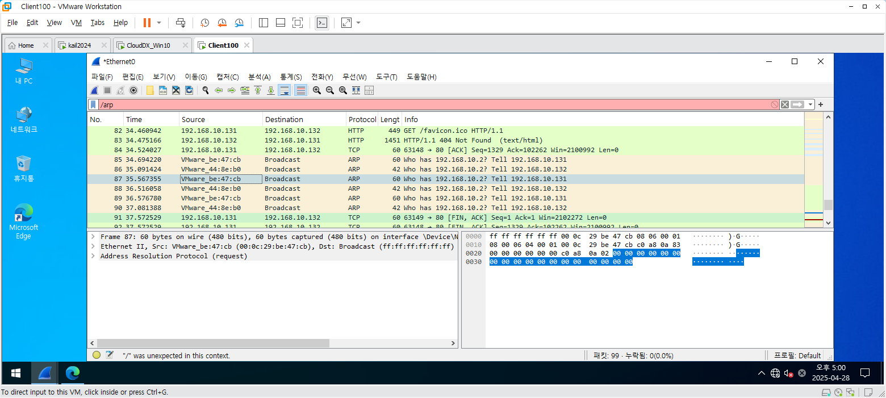
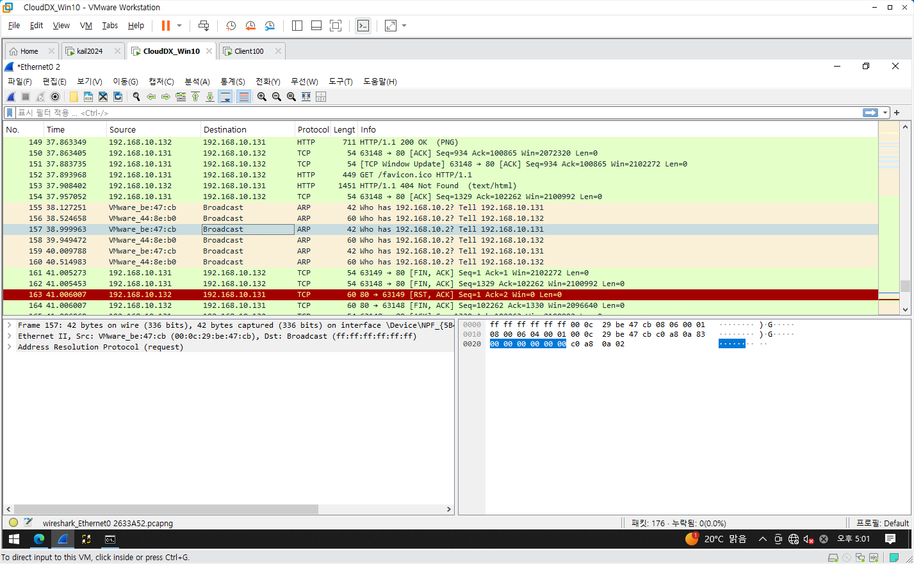
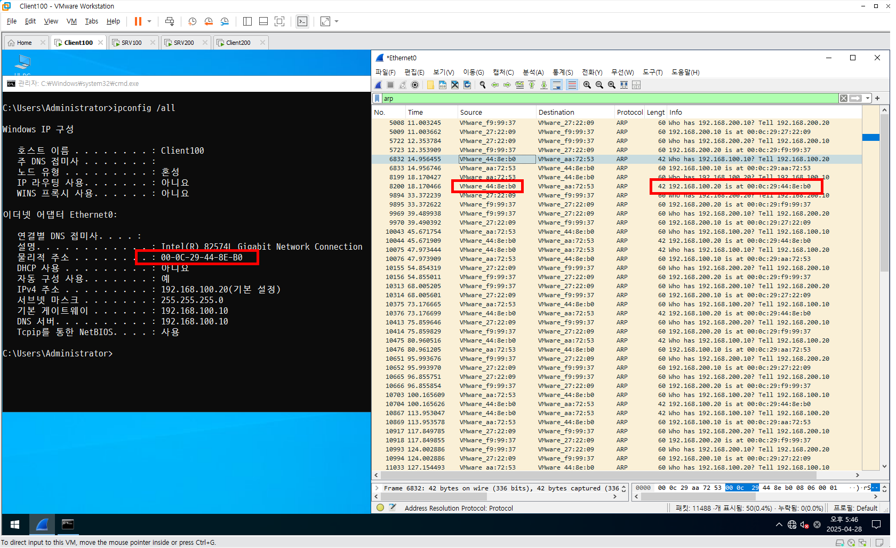
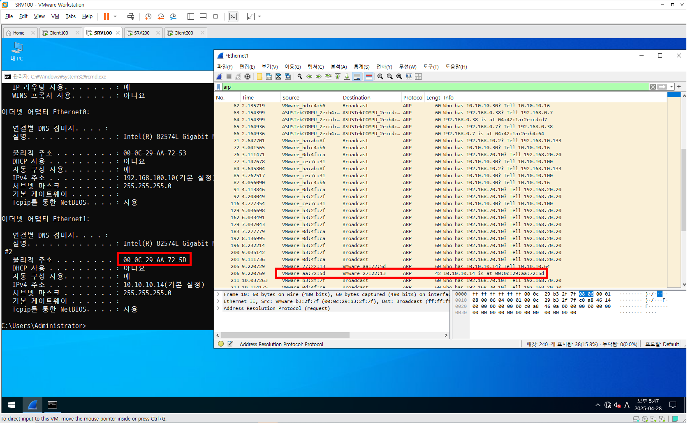
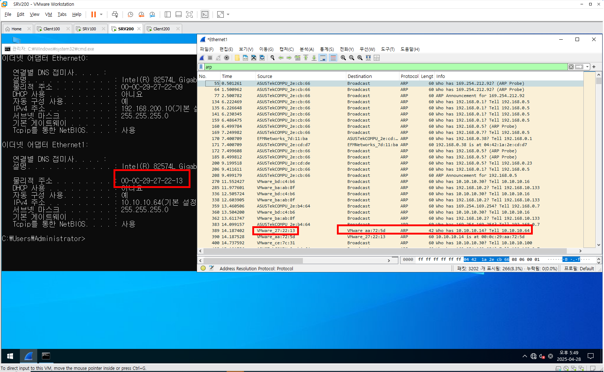
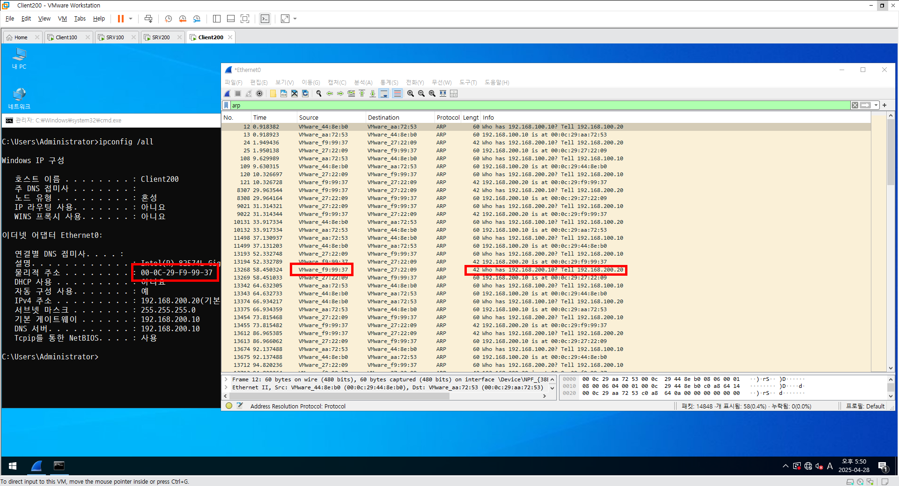

# 📘 패킷 분석

### 실습1. 

- 샥스핀을 이용한 패킷 분석

```  
## 개요

- 패킷 스니핑 툴로써 많이 사용되고 있다.
- 스니퍼로 잘 알려진 '이트리얼(Ethereal)'의 후속 버전이다.
```  
## 실습 1. 데이터 링크 계층(2계층)의 패킷 분석하기

### 실습 환경 (Host-only)

- **Windows 10**  
  - 192.168.10.131 / C Class / 192.168.10.2 / 192.168.10.2
- **Windows Server 2022 (with IIS 웹서버)**   (클100)
  - 192.168.10.132 / C Class / 192.168.10.2 / 192.168.10.2

### 준비사항


- **통신 테스트 확인**  
  - 실행창(cmd)에서 실행  
    - Windows 10 → Windows Server 2022  
      `ping 192.168.10.132`
    - Windows Server 2022 → Windows 10  
      `ping 192.168.10.131`
--  
## 패킷 캡처 준비

- (하지 마라) 두 시스템 모두 Network 설정(ncpa.cpl)에서 'IPv4'만 IP값 입력하고 나머지는 그대로 둔다.
- Server 시스템에 'IIS'를 추가 및 활성화
  - 서버관리자 실행 → '역할 및 기능 추가' 클릭
  - 엔터키 3번 → '웹 서버(IIS)' 체크 → 팝업창 '기능 추가' 클릭
  - 엔터키 3번 → 'FTP 서버'만 체크 (나머지는 설치 안 함)
  - '필요한 경우 자동으로 대상 서버 다시 시작' 체크 → '예' 클릭
  - '설치 시작' 클릭 → 설치 완료 후 'IIS 관리자' 확인

- 각 시스템에서 웹 브라우저로 Server IP 접속 후 'IIS Test Page' 출력 확인
  - Server 시스템 (O)
  - Client 시스템 (O)

- **Wireshark 설치**
  - [Wireshark 공식 사이트](https://www.wireshark.org/) 접속
  - Windows x64 Installer 다운로드 및 기본값으로 설치
```  
## 패킷 캡처

### MAC Address 확인 (ipconfig /all)

- **Server 시스템**
  - MAC 주소: `00-0C-29-44-8E-B0`
  - IP: `192.168.10.132`

- **Client 시스템**
  - MAC 주소: `00-0C-29-BE-47-CB`
  - IP: `192.168.10.131`

### 캡처 절차

- Server와 Client에서 Wireshark 실행
- Client 시스템 웹 브라우저로 Server 시스템 IP 접속
- 'IIS Test Page' 출력 확인 후 Wireshark 캡처 중지
``` 
## 패킷 분석

### ARP (MAC 주소 요청 패킷) 분석

- **필터:** `ARP`

#### 일반 분석 131에서

| Source | Destination | Protocol | Length | Info |
|:---|:---|:---|:---|:---|
| VMware_be:47:cb | Broadcast | ARP | 42 | Who has 192.168.10.132? Tell 192.168.10.131 |
| VMware_44:8e:b0 | VMware_2b:2d:2f | ARP | 60 | 192.168.10.132 is at 00:0c:29:df:99:90 |

- **첫 번째 라인**  
  - Client가 Server MAC 주소를 알기 위해 브로드캐스트

- **두 번째 라인**  
  - Server가 응답하여 MAC 주소를 알려줌

#### 세부 분석 1 (요청 Request, Client → Server)

- `Dst: Broadcast (ff:ff:ff:ff:ff:ff)` → 네트워크 모든 장비 대상
- `Target MAC address: 00:00:00:00:00:00` → 아직 목적지 MAC 모름

#### 세부 분석 2 (응답 Reply, Server → Client)

- Server가 자신의 MAC 주소(`00:0c:29:df:99:90`)를 Client에게 알림
--  
## HTTP 패킷

- MAC 주소 확인 이후, Client가 Server에 HTTP 요청
- **주의:** 여기서 HTTP 패킷 내용은 크게 중요하지 않고, **ARP 분석이 목적**
--  
## ARP 테이블 확인

- **명령어:** `arp -a`
- Client 시스템 결과 예시

```
인터페이스: 192.168.10.131 --- 0x5
  인터넷 주소           물리적 주소           유형
  192.168.10.1          00-50-56-c0-00-08     동적
  192.168.10.2          00-50-56-ec-a4-44     동적
  192.168.10.132        00-0c-29-df-99-90     동적
  192.168.10.255        ff-ff-ff-ff-ff-ff     정적
  224.0.0.22            01-00-5e-00-00-16     정적
  224.0.0.251           01-00-5e-00-00-fb     정적
  224.0.0.252           01-00-5e-00-00-fc     정적
  239.255.255.250       01-00-5e-7f-ff-fa     정적
```

- Client가 Server의 MAC 주소를 정상적으로 기억하고 있음
--  
## 결과

- Wireshark로 캡쳐한 패킷의 하단 세부 내용은 **OSI 7 Layer**와 **TCP/IP 모델** 순서에 따라 계층별로 출력됨

<br>


# 실습 2. 네트워크 계층(3계층)의 패킷 분석하기

## 실습 환경
- 원래는 **라우터** 또는 **공유기**가 있으면 되지만, 없으므로 **Windows Server**의 **라우팅 및 원격 액세스(rrasmamg.msc)**를 통해 작업한다.

- 시스템 구성:
  - **SRV100 (Windows Server 2022)** : 내부(Host Only), 외부(Bridge)
    - 내부망 : `192.168.100.10` (C Class)
    - 외부망 : `10.10.10.100` (C Class)
  - **Client100 (Windows Server 2022)** : Host Only
    - 내부망 : `192.168.100.20` (게이트웨이: `192.168.100.10`)
  - **SRV200 (Windows Server 2022)** : 내부(Host Only), 외부(Bridge)
    - 내부망 : `192.168.200.10` (C Class)
    - 외부망 : `10.10.10.200` (C Class)
  - **Client200 (Windows Server 2022)** : Host Only
    - 내부망 : `192.168.200.20` (게이트웨이: `192.168.200.10`)

## 라우터 설정 (SRV100, SRV200)
- 관리도구의 **라우팅 및 원격 액세스(rrasmgmt.msc)**를 실행하여 설정한다.

## 통신 테스트 확인
- 실행창(cmd)에서 다음 명령어를 입력하여 테스트:

  - Client100 → Client200
    ```bash
    ping -t 192.168.200.20
    ```
  - Client200 → Client100
    ```bash
    ping -t 192.168.100.20
    ```

---

## 패킷 분석 1. SRV100과 SRV200이 외부망일 때

### Client100

- 게이트웨이 존재 여부 확인:
<br>


```
VMware_d8:ea:dc VMware_4b:70:63 ARP 60 Who has 192.168.100.10? Tell 192.168.100.20 VMware_4b:70:63 VMware_d8:ea:dc ARP 60 192.168.100.10 is at 00:0c:29:4b:70:63 VMware_4f:39:1f VMware_d2:a5:d9 ARP 42 Who has 192.168.200.10? Tell 192.168.200.20 VMware_d2:a5:d9 VMware_4f:39:1f ARP 60 192.168.200.10 is at 00:0c:29:d2:a5:d9
```

- 출발지(Client100)와 도착지(Client200) 존재 여부 확인:

```
VMware_d2:a5:d9 VMware_4f:39:1f ARP 60 Who has 192.168.200.20? Tell 192.168.200.10 VMware_4b:70:63 VMware_d8:ea:dc ARP 60 Who has 192.168.100.20? Tell 192.168.100.10
```

- 요청(Request) 및 응답(Reply) 결과로 최종 MAC Address 확인:
```
VMware_4f:39:1f VMware_d2:a5:d9 ARP 42 192.168.200.20 is at 00:0c:29:4f:39:1f VMware_d8:ea:dc VMware_4b:70:63 ARP 60 192.168.100.20 is at 00:0c:29:d8:ea:dc
```

### SRV100
<br>

- Gateway(192.168.14.1)를 통한 호스트 시스템(192.168.14.54) 존재 여부 확인:

```
EFMNetworks_95:18:24 SamsungElect_83:ed:6f ARP 60 Who has 192.168.14.54? Tell 192.168.14.1 SamsungElect_83:ed:6f EFMNetworks_95:18:24 ARP 60 192.168.14.54 is at 98:83:89:83:ed:6f
```

- 외부망끼리 통신 여부 확인:
```
VMware_4b:70:59 VMware_d2:a5:cf ARP 42 Who has 10.10.10.200? Tell 10.10.10.100 VMware_d2:a5:cf VMware_4b:70:59 ARP 60 10.10.10.200 is at 00:0c:29:d2:a5:cf
```

- 호스트 시스템(192.168.14.54)을 통한 Gateway 존재 여부 확인:

```
SamsungElect_83:ed:6f EFMNetworks_95:18:24 ARP 60 Who has 192.168.14.1? Tell 192.168.14.54 EFMNetworks_95:18:24 SamsungElect_83:ed:6f ARP 60 192.168.14.1 is at 58:86:94:95:18:24
```

<br>

<br>
