# 📘 Crontab

## 1. 개요

시스템에서 특정 시간에 원하는 작업을 수행할 수 있도록 해주는 스케쥴링<br>
시스템 백업, 점검 등과 같이 주로 새벽 시간대에 해야 하는 작업들을 자동적으로 해 주는 용도로 많이 사용된다.<br>
실무에서는 'Shell Scripting'과 함께 주로 사용된다.

## 2. 주의 사항

현재 시간을 기준으로 적용되기 때문에 작업할 때는 시스템의 시간을 정확하게 설정을 해야 한다. 즉, Crontab을 설정한 다음 시간을 변경하면 설정 내용이 반영이 안된다.

## 3. 사용법
명령어 
```
crontab -u <사용자명> <옵션>
```
옵션
- 예약된 작업 생성, 수정     crontab -e
- 예약된 작업 리스트 확인    crontab -l
- 예약된 작업 삭제           crontab -r

구분
- <분><시><일><월><요일><명령어>

- 설명
    - 분 (0 ~ 59)
    - 시 (0 ~ 23)
    - 일 (1 ~ 31)
    - 월 (1 ~ 12)
    - 요일 (0(일요일) ~ 6(토요일))
    - 명령어 (리눅스에서 사용 가능한 모든 명령어)
    - '명령어' 필드를 제외한 5개의 필드에 '*'가 있는 경우에는 '모든 것'을 의미한다.즉, 매분, 매시, 매일, 매월, 매주, 

## 4. 실습

### 예제 1. 다음의 조건으로 작업한다.

'매분, 매시, 매일, 매월, 매주' 마다 '/export/home/samadal'에 빈 문서 파일을 생성한다.

```
crontab -u root -e
```
```
* * * * * touch /export/home/samadal/cloud
```

```
[root@localhost ~]#
[root@localhost ~]# ls -l /export/home/samadal/
합계 0
-rw-r--r-- 1 root root 0  5월  7 13:05 cloud
[root@localhost ~]# ls -l /export/home/samadal/
합계 0
-rw-r--r-- 1 root root 0  5월  7 13:06 cloud
```
크론탭 삭제<br>
r 옵션 = remove
```
[root@localhost ~]# crontab -u root -r
[root@localhost ~]#
[root@localhost ~]# crontab -l
no crontab for root
[root@localhost ~]#
```

### 예제 2. 다음의 조건으로 작업한다.

- 매주 화요일 새벽 1시 20분에 접속한 사용자 목록을 파일(who.log)로 저장 <br>
단, 1시 19분에 디렉터리 (/cloud/)를 먼저 생성한다.
### 실행
```
-> 19 1 * * 2 mkdir /cloud
-> 20 1 * * 2 who > /cloud/who.log
```

### 예제 3. 다음의 조건으로 작업한다.
- '예제 2'에서 1시 21분 에 파일(who.log)을 '/tmp' 로 이동하고
디렉터리 (/cloud/)를 삭제한다.

- 실행

```
[root@localhost ~]# crontab -u root -l
19 1 * * 2 mkdir /cloud
20 1 * * 2 who > /cloud/who.log
21 1 * * 2 mv /cloud/who.lg /tmp
21 1 * * 2 rm -rf /cloud
```

### 예제 4. 다음의 조건으로 작업한다.

매일 새벽 6시 정각에 '예제 2'와 '예제 3'을 동일하게 작업한다.<br>
단, 모든 작업은 'Shell Scripting'을 이용하도록 한다.

- 실행

pwd: /export/home/samadal
```
#!/bin/bash

mkdir /cloud
who > /cloud/who.log
mv /cloud/who.log /tmp
rm -rf /cloud
```

### 예제 5. 다음의 조건으로 작업한다.
2025년 5월 5일 오후 5시 25분에 사용자 정보 중 'samadal'에 대한 정보만 파일로 저장한다.<br>

단, 출력된 내용의 저장은 '/tmp'에 'samadal_050517252025.txt'로 저장한다. <br>

또한 시간 정보를 자동으로 입력되도록 한다.

- 실행

date의 특수기능
- day, Date
- month, Minute
- second, Second

```
[root@localhost samadal]# date +'%d'
06
[root@localhost samadal]# date +'%D'
05/06/25
[root@localhost samadal]# date +'%m'
05
[root@localhost samadal]# date +'%M'
05
[root@localhost samadal]# date +'%s'
1746479224
[root@localhost samadal]# date +'%S'
06
```

```
#!/bin/bash
'samadal' /etc/passwd > /tmp/samadal_`date +'%m%d%H%M%Y'`.txt
```

```
[root@localhost samadal]# ls -l /tmp/
합계 4
-rw-r--r-- 1 root root   0  5월  5 17:25 samadal_050517252025.txt
```

```
[root@localhost samadal]# crontab -u root -l
25 17 5 5 * /export/home/samadal/samdate.sh
```

## 기타예제
매 1분마다 사용자를 하나씩 생성하도록 설정<br>
단일 설정에서 여러 개가 동작하도록 설정 <br>
5분마다 실행되도록 설정 <br>
명령어
```
*/5 * * * 
```

같은 작업을 하루에 두 번 실행되도록 설정(공백없이 쉼표로 구분)<br>
명령어
```
0 2,14 * * * 
```
<br>


매일 새벽 4시 30분에 데이터 베이스 파일을 백업하고 백업한 내용을 확인하고 확인한 목록을 파일로 저장

로컬 시스템에 있는 db 백업본을 원격지에 있는 백업서버로 백업하는 방법

- scp를 이용한 방법
    - 로컬 시스템(Private key)과 백업 시스템(public key)에 SSH 보안 설정을 한다.
    - DB Backup
    ```
    mysqldump -uroot -ppwroot mysql > /export/home/samadal/db.sql
    ```
    - SSH 전송
    - scp /export/home/samadal/db.sql samadal@백업서버IP/home/samadal

MariaDB를 이용한 방법
- 원격지에 있는 DB 서버에 접근
```
mysql -h DB서버IP -uroot -p mysql
MariaDB(DB서버)> 
```
이 방법은 원격에 있는 DB에 접근 후 설정 작업을 하는 용도로 밖에 사용할 수가 없다. 즉, SSH를 이용한 백업을 할 수가 없다.

## RSA 공개키

1. without keyGen

: Server에서의 작업(접속을 허용하는 놈, 192.168.10.132)<br>

- 공개키가 저장될 디렉터리 생성
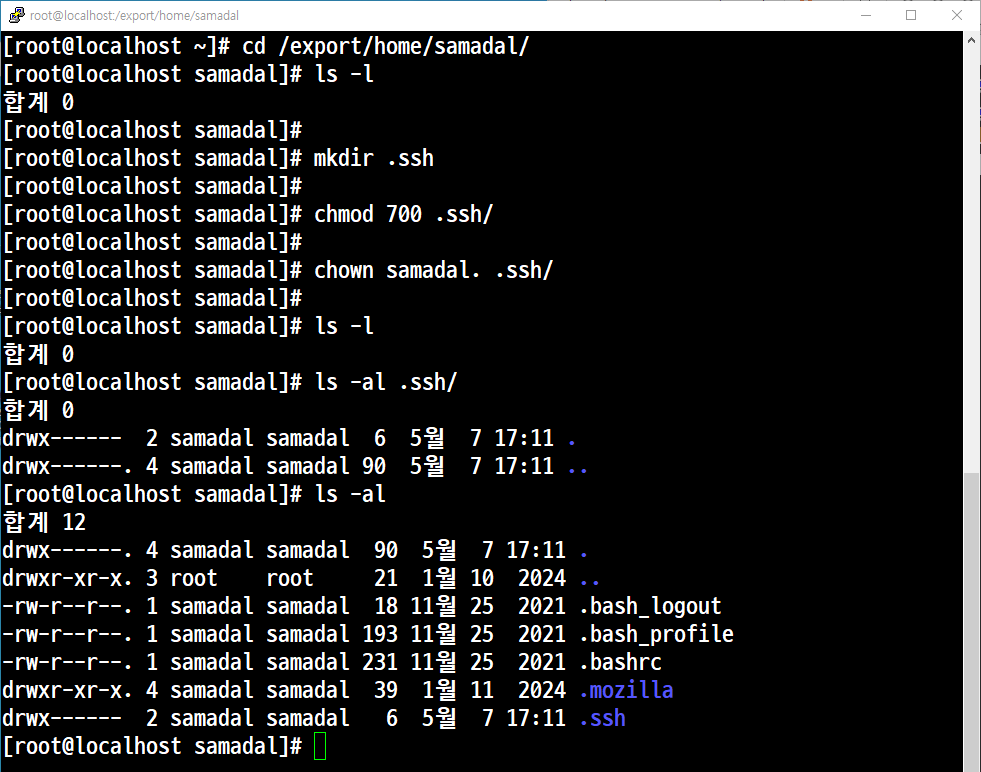

- SSH 환경설정
```
vi /etc/ssh/sshd_config
```

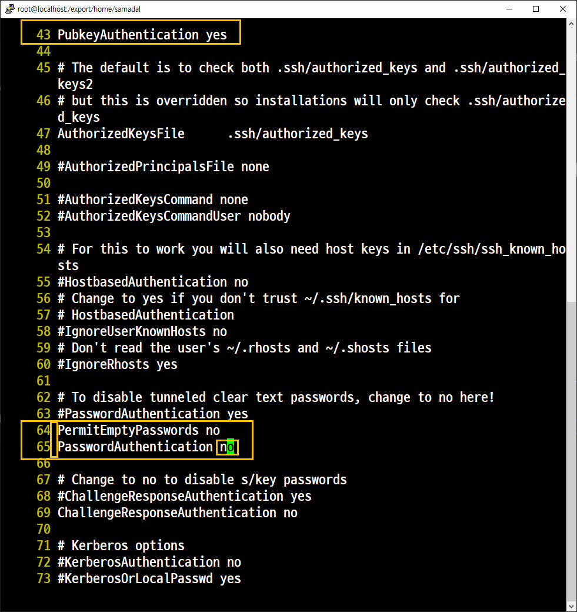

```
systemctl restart sshd
```


: Client에서의 작업(접속을 하는 놈, 192.168.10.137)

- 공개키와 개인키 생성
```
ssh-keygen -t rsa
```
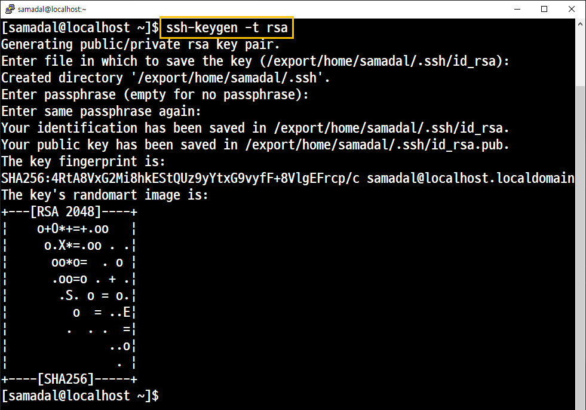

- 생성된 공개키를 Server에 전송

65번 yes로 수정
```
PermitEmptyPasswords no
65번 PasswordAuthentication yes
```
```
[samadal@localhost .ssh]$ scp id_rsa.pub samadal@192.168.10.132:/export/home/samadal/.ssh/authorized_keys
samadal@192.168.10.132's password:
Permission denied, please try again.
samadal@192.168.10.132's password:
Permission denied, please try again.
samadal@192.168.10.132's password:
id_rsa.pub                                                                                      100%  411   713.7KB/s   00:00
[samadal@localhost .ssh]$

```
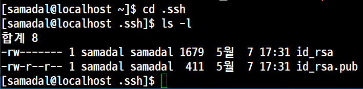
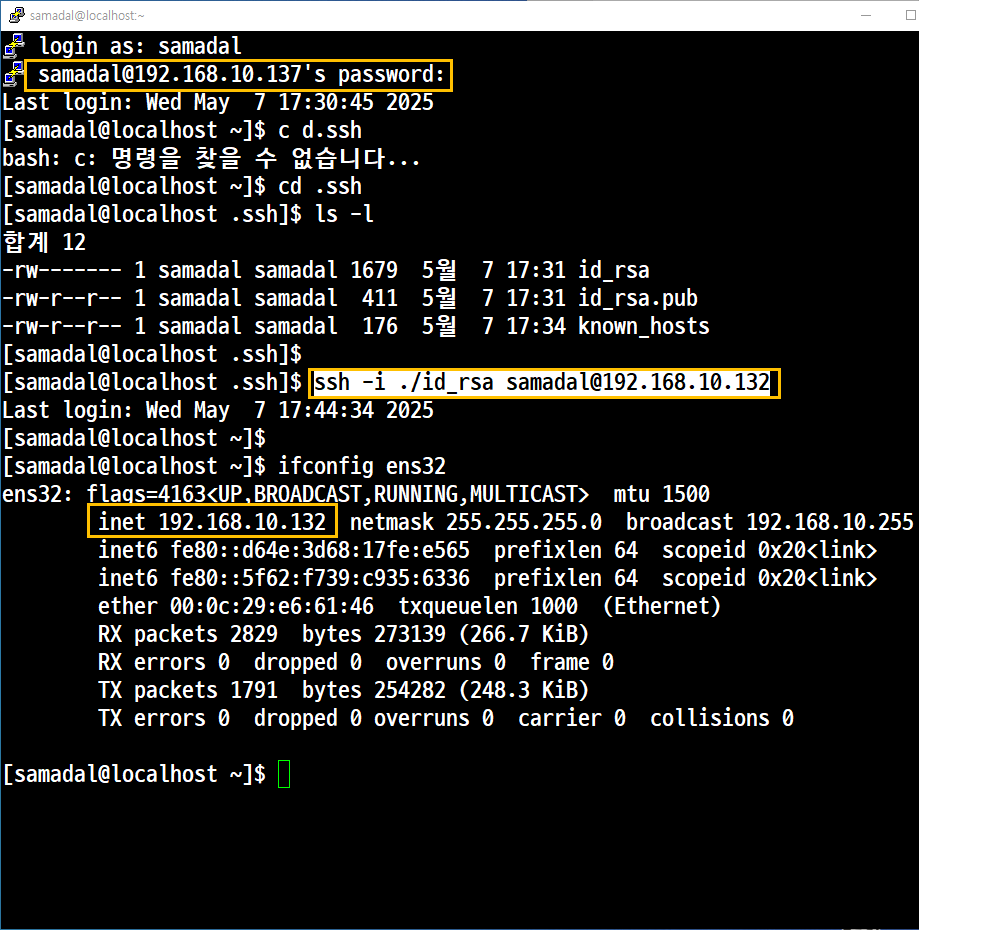


## with keyGen

키 생성(Host OS)

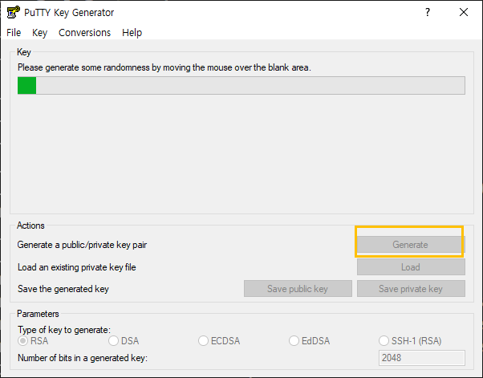
<br>
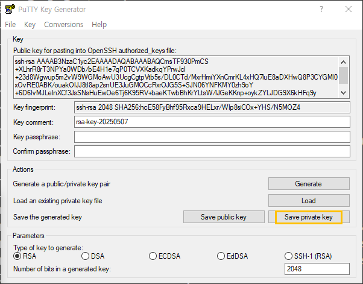
<br>


공용키 전송

pwd: /export/home/samadal/.ssh
```
vi authorized_keys
```
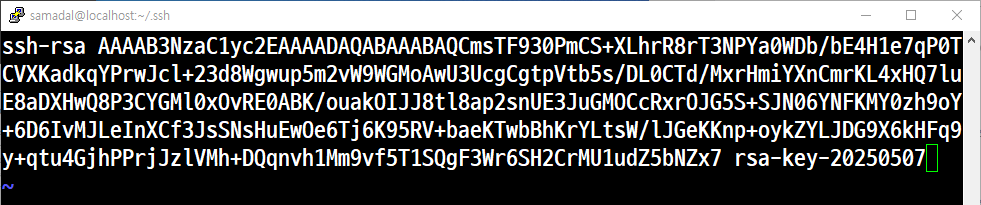
<br>

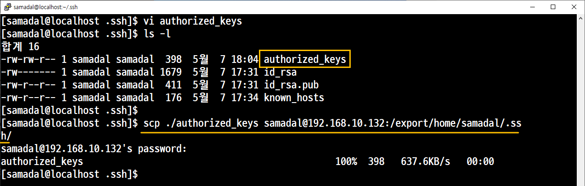
<br>
서버에서 확인
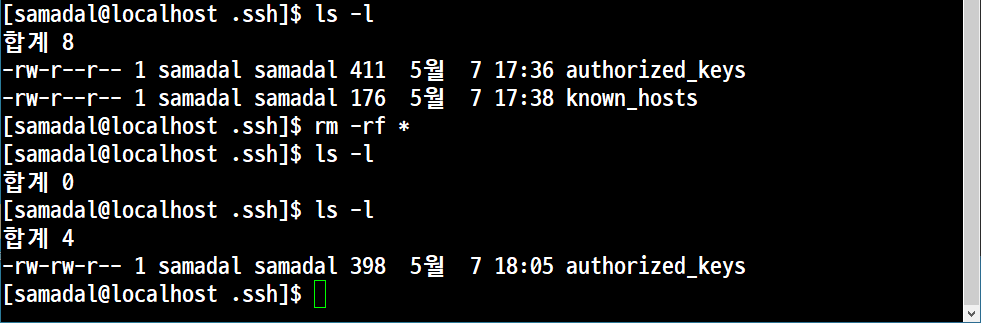
<br>
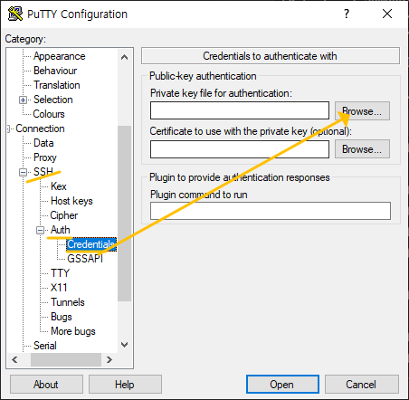
<br>
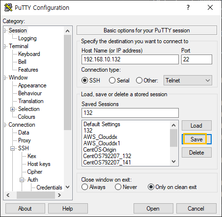
<br>
다시 65번 no 
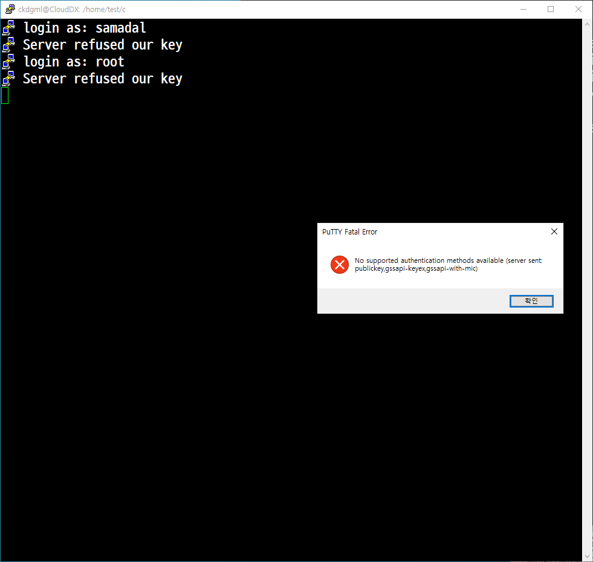
<br>
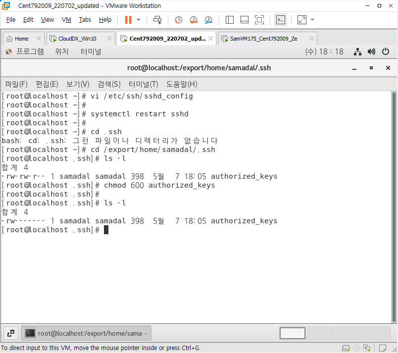
600으로 수정
authorized_keys
<br>
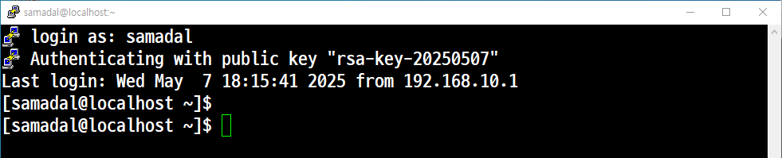
<br>


## 실습 2. 응용
예제 1. 다음의 조건으로 작업한다.
'132번' 시스템에서 CD-ROM을 마운트 한 후 mariadb로 시작하는 모든 패키지를 /cloud 디렉터리에 복사한다.

'137번' 시스템의 '/home/samadal/mariadb.tar.gz'라는 파일로 복사할 것 <br>
이 작업은 매일 새벽 5시 30분에 실행되도록 한다.<br>
모든 작업은 'Shell Scripting' 으로 설정한다.

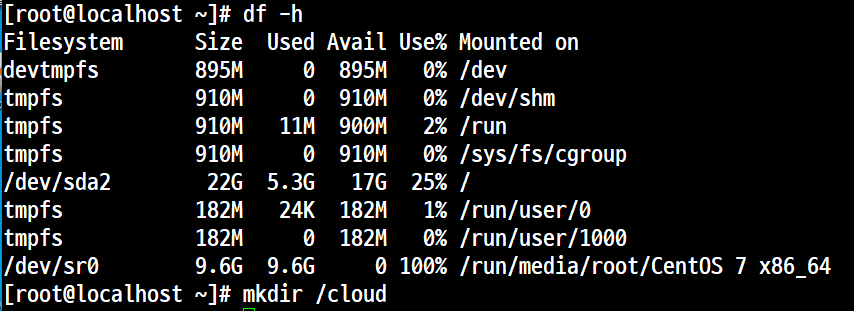

132<br>

mkdir /cloud
```
cd /export/home/samadal

vi mariadb.sh
```
```
!#/bin/bash

cp -p mariadb*.rpm /cloud
```
