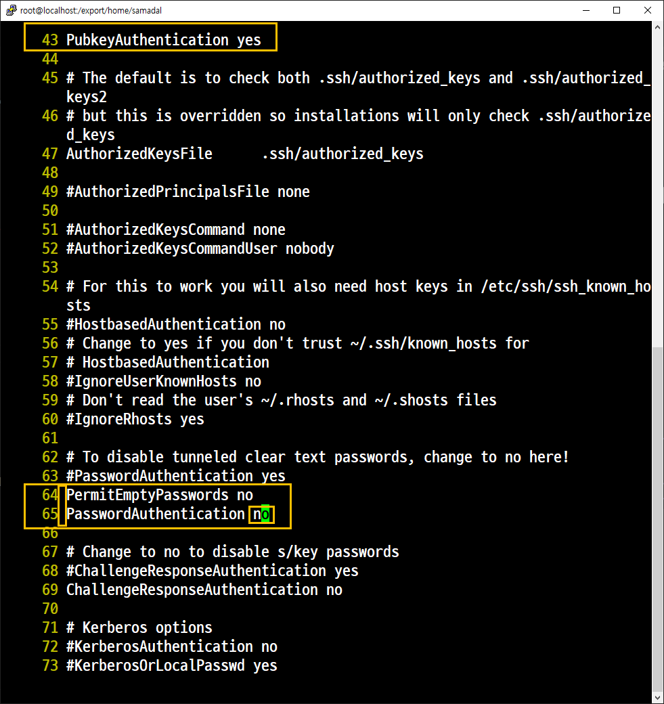
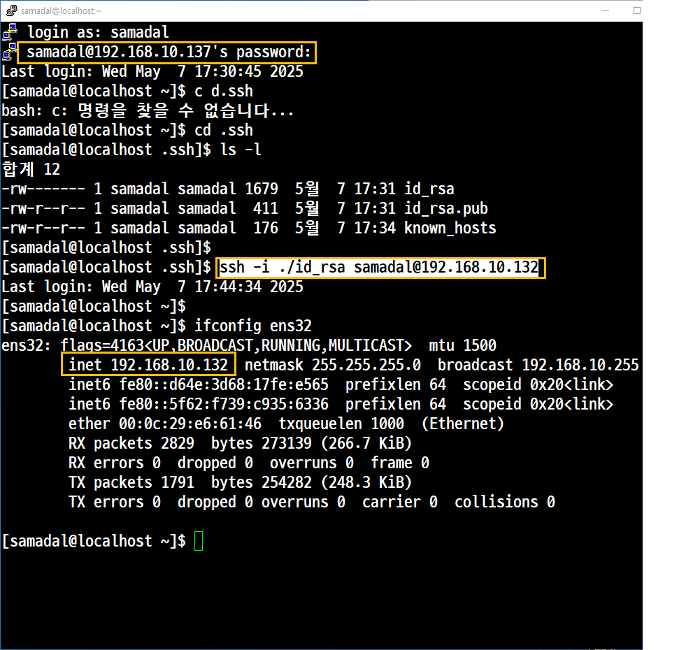
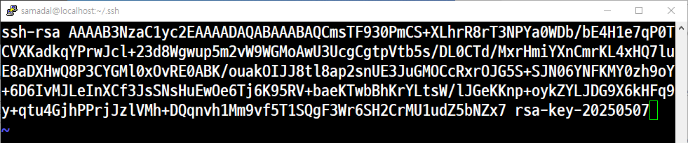
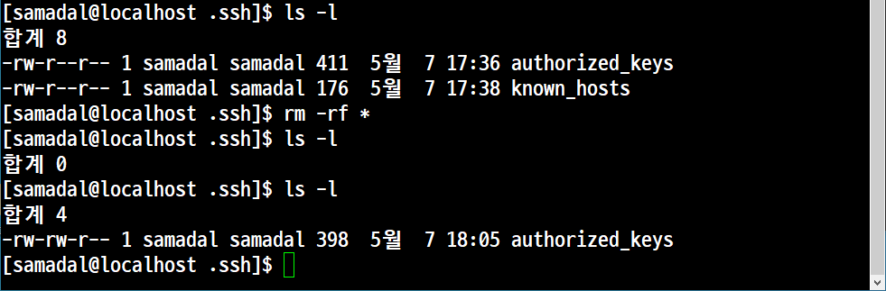
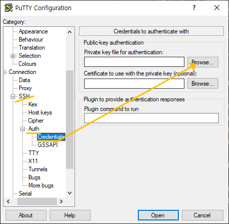
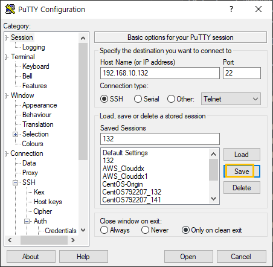

## RSA 공개키

### without keyGen

Server에서의 작업(접속을 허용하는 놈, 192.168.10.132)<br>

- 공개키가 저장될 디렉터리 생성


- SSH 환경설정
```
vi /etc/ssh/sshd_config
```



```
systemctl restart sshd
```


: Client에서의 작업(접속을 하는 놈, 192.168.10.137)

- 공개키와 개인키 생성
```
ssh-keygen -t rsa
```


- 생성된 공개키를 Server에 전송

65번 yes로 수정
```
PermitEmptyPasswords no
65번 PasswordAuthentication yes
```
```
[samadal@localhost .ssh]$ scp id_rsa.pub samadal@192.168.10.132:/export/home/samadal/.ssh/authorized_keys
samadal@192.168.10.132's password:
Permission denied, please try again.
samadal@192.168.10.132's password:
Permission denied, please try again.
samadal@192.168.10.132's password:
id_rsa.pub                                                                                      100%  411   713.7KB/s   00:00
[samadal@localhost .ssh]$

```




## with keyGen

키 생성(Host OS)


<br>

<br>


공용키 전송

pwd: /export/home/samadal/.ssh
```
vi authorized_keys
```

<br>


<br>
서버에서 확인

<br>

<br>

<br>
다시 65번 no 

<br>

600으로 수정
authorized_keys
<br>

<br>