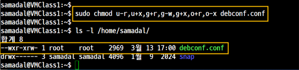
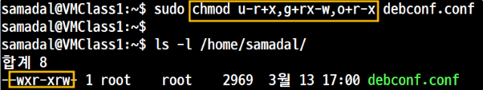
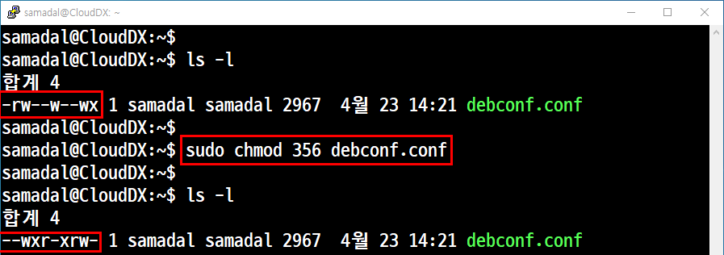

## 🔐 리눅스 권한 (Permissions)

리눅스는 **소유자(user), 그룹(group), 기타(other)** 에 대해 **읽기(read), 쓰기(write), 실행(execute)** 권한을 부여할 수 있음.

### 🧩 권한 구조

```bash
-rwxr-xr--
 ↑  ↑  ↑
 |  |  └── 기타(other)
 |  └───── 그룹(group)
 └──────── 소유자(user)
```
<br>
<br>
### 🔢 권한 기호와 숫자값

| 기호 | 의미       | 숫자 값 |
|:----:|------------|:--------:|
| `r`  | 읽기 (read) |    4     |
| `w`  | 쓰기 (write) |   2     |
| `x`  | 실행 (execute) | 1     |
| `-`  | 권한 없음   |    0     |

- `rwx` = 4 + 2 + 1 = **7**
- `rw-` = 4 + 2 + 0 = **6**
- `r--` = 4 + 0 + 0 = **4**

예시) `chmod 755 somefile` → `rwxr-xr-x`

<br>
<br>

### 🔧 권한 설정 명령어

| 작업 내용             | 명령어 예시                                 |
|----------------------|----------------------------------------------|
| 권한 보기             | `ls -l`                                      |
| 권한 변경 (숫자 방식) | `chmod 755 파일명`                           |
| 권한 변경 (기호 방식) | `chmod u+x 파일명` <br>→ (user에게 실행권 추가) |
| 소유자 변경           | `sudo chown 사용자:그룹 파일명`              |

<br>
<br>

## 🔐 권한 설정 방법 in Linux

리눅스에서는 파일/디렉토리 권한을 다음 **두 가지 방식**으로 설정할 수 있습니다:

---

### 1️⃣ Symbolic Method (기호 방식)

- `u`(user), `g`(group), `o`(others), `a`(all) + `+`, `-`, `=` 기호 조합으로 권한 설정
- 직관적이며 부분적으로 권한을 추가/삭제 가능

```bash
chmod u+x script.sh      # 사용자에게 실행 권한 추가
chmod go-w file.txt      # 그룹/기타 사용자에게 쓰기 권한 제거
chmod a=r file.txt       # 모든 사용자에게 읽기 권한만 설정
```
## 🧪 실습: 권한 변경

### 🔁 symbolic Method 변환 예시  
**623 → 356**  
`rw- -w- -wx` → `-wx r-x rw-`

---

#### ✅ 1. 첫 번째 권한 설정



<br>

---

#### ✅ 2. 두 번째 권한 설정




<br>

### 2️⃣ Numerical Method (숫자 방식)

`r = 4`, `w = 2`, `x = 1` 값을 합산하여 **3자리 숫자**로 권한을 설정합니다.  
한 번에 전체 권한을 명확하게 설정할 수 있어 효율적입니다.

```bash
chmod 755 script.sh      # rwx r-x r-x
chmod 644 file.txt       # rw- r-- r--
chmod 700 myfolder/      # rwx --- ---
```
### 🔁 Numerical Method 변환 예시  
**623 → 356**  
`rw- -w- -wx` → `-wx r-x rw-`

---

#### ✅ 1. 권한 설정


