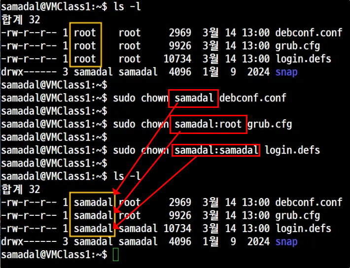

# 📘 소유권(Ownership)

## 📝 개요
- 리눅스에서 파일 및 디렉토리는 각각 **소유자(User), 그룹(Group), 기타 사용자(Others)** 에 의해 관리됩니다.
- 각 소유자는 읽기(r), 쓰기(w), 실행(x) 권한을 별도로 가질 수 있으며, 이 소유자를 변경함으로써 보안과 접근 제어를 할 수 있습니다.

---

## 🔧 명령어 정리

| 기능 | 명령어 예시 | 설명 |
|------|--------------|------|
| 소유자 확인 | `ls -l` | 파일의 소유자 및 그룹을 확인 |
| 소유자 변경 | `sudo chown 사용자 파일명` | 소유자만 변경 |
| 그룹 변경 포함 | `sudo chown 사용자:그룹 파일명` | 소유자 + 그룹 동시에 변경 |
| 재귀 변경 | `sudo chown -R 사용자:그룹 디렉토리` | 하위 디렉토리까지 모두 변경 |

---

## 💡 실습 예제

### ✅ Step 1: 소유자 확인
```bash
ls -l
```
📸 이미지:


---

### ✅ Step 2: 소유자와 그룹 변경
```bash
sudo chown root:root debconf.conf
```
📸 이미지:


---
```bash
sudo chown samadal debconf.conf
sudo chown samadal:root grub.cfg
sudo chown samadal:samadal login.defs
```
📸 이미지:


---
```bash
sudo chown samadal.root debconf.conf
sudo chown samadal. grub.cfg
sudo chown .samadal login.defs
```
📸 이미지:


## 🧠 정리
- 리눅스에서는 파일 접근을 제어하기 위해 소유권을 사용합니다.
- 파일은 **User / Group / Others** 구조로 권한이 적용되며, `chown` 명령으로 이를 제어합니다.
- `-R` 옵션은 디렉토리와 그 내부 모든 파일에도 적용됩니다.

---

## 🔗 참고

