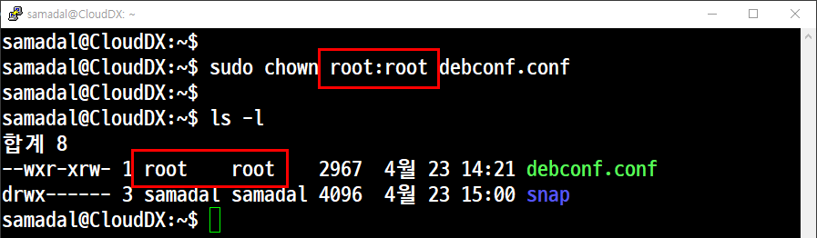
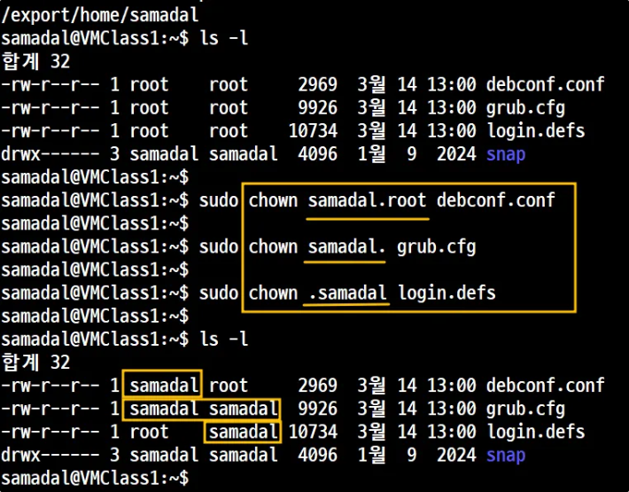
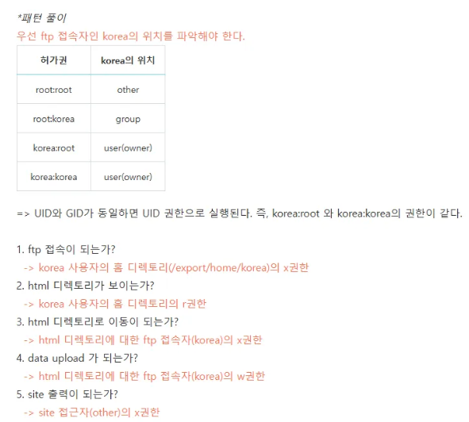
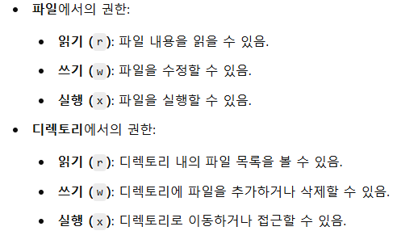

# 📘 소유권(Ownership)

## 📝 개요
- 리눅스에서 파일 및 디렉토리는 각각 **소유자(User), 그룹(Group), 기타 사용자(Others)** 에 의해 관리됩니다.
- 각 소유자는 읽기(r), 쓰기(w), 실행(x) 권한을 별도로 가질 수 있으며, 이 소유자를 변경함으로써 보안과 접근 제어를 할 수 있습니다.

---

## 🔧 명령어 정리

| 기능 | 명령어 예시 | 설명 |
|------|--------------|------|
| 소유자 확인 | `ls -l` | 파일의 소유자 및 그룹을 확인 |
| 소유자 변경 | `sudo chown 사용자 파일명` | 소유자만 변경 |
| 그룹 변경 포함 | `sudo chown 사용자:그룹 파일명` | 소유자 + 그룹 동시에 변경 |
| 재귀 변경 | `sudo chown -R 사용자:그룹 디렉토리` | 하위 디렉토리까지 모두 변경 |

---

## 💡 실습 예제

### ✅ Step 1: 소유자 확인
```bash
ls -l
```


---

### ✅ Step 2: 소유자와 그룹 변경
```bash
sudo chown root:root debconf.conf
```



---
```bash
sudo chown samadal debconf.conf
sudo chown samadal:root grub.cfg
sudo chown samadal:samadal login.defs
```


---
```bash
sudo chown samadal.root debconf.conf
sudo chown samadal. grub.cfg
sudo chown .samadal login.defs
```



## 🧠 정리
- 리눅스에서는 파일 접근을 제어하기 위해 소유권을 사용합니다.
- 파일은 **User / Group / Others** 구조로 권한이 적용되며, `chown` 명령으로 이를 제어합니다.
- `-R` 옵션은 디렉토리와 그 내부 모든 파일에도 적용됩니다.

---

## 🔗 참고
## 🔒 권한 조합 테이블 (숫자 권한 → 권한 분포)

| 권한 | 1 | 2 | 3 | 4 | 5 | | 1 | 2 | 3 | 4 | 5 | | 1 | 2 | 3 | 4 | 5 | | 1 | 2 | 3 | 4 | 5 |
|------|---|---|---|---|---|--|---|---|---|---|---|--|---|---|---|---|---|--|---|---|---|---|---|
| 755  | o | o | o | x | x |  | o | o | o |   |   |  | o | o | o | o | o |  | o | o | o | o | o |
| 570  | o | o | x | x | x |  | o | o | o | o |   |  | o | o | o |   |   |  | o | o | o |   |   |
| 375  | o | o | o | x | x |  | o | o | o | o | o |  | o | o | o | o | o |  | o | o | o | o | o |
| 455  | o | o | o | x | x |  | o | o | o |   |   |  | o | o |   |   |   |  | o | o |   |   |   |
| 001  | o | o | o | x | x |  | o | o |   |   |   |  | o | o |   |   |   |  | o | o |   |   |   |
| 010  | o | o | x | x | x |  | o | o | o |   |   |  | o | o |   |   |   |  | o | o |   |   |   |
| 273  | o | o | o | o | o |  | o | o | o | o | o |  | o | o |   |   |   |  | o | o |   |   |   |
| 135  | o | o | o | x | x |  | o | o | o | o | o |  | o | o | o |   |   |  | o | o | o |   |   |
| 705  | o | o | o | x | x |  | o | o |   |   |   |  | o | o | o | o | o |  | o | o | o | o | o |
| 507  | o | o | o | o | o |  | o | o |   |   |   |  | o | o | o |   |   |  | o | o | o |   |   |
| 316  | o | o | x | x | x |  | o | o | o |   |   |  | o | o | o | o |   |  | o | o | o | o |   |
| 770  | o | o | x | x | x |  | o | o | o | o |   |  | o | o | o | o |   |  | o | o | o | o |   |
| 644  | o | o | x | x | x |  | o | o |   |   |   |  | o | o |   |   |   |  | o | o |   |   |   |
| 027  | o | o | o | o | o |  | o | o |   |   |   |  | o | o |   |   |   |  | o | o |   |   |   |
| 500  | o | o | x | x | x |  | o | o |   |   |   |  | o | o | o |   |   |  | o | o | o |   |   |



<br>


<br>



# 🔐 권한 분석 실습 정리

## 📌 기본 상황 정리

- 로그인 계정: `samadal`
- 홈 디렉토리: `/export/home/samadal` → **1,2번 권한은 항상 `o` (접근 가능)**
- 우리가 권한을 바꾼 경로:  
  - `/export/home/samadal/html`  
  - `/var/www/html`

---

## ✅ 권한에 따른 조건 설명

1. **html 디렉토리로 경로 변경 가능?**  
   → `ftp 접속자`의 **x 권한** 필요  
   > 디렉토리의 x 권한은 디렉토리로의 이동 및 접근 가능 여부를 결정함.

2. **파일 업로드 가능?**  
   → `ftp 접속자`의 **w 권한**

3. **웹 사이트 출력 가능?**  
   → `other`의 **x 권한** 필요

---

## 🧩 UID / GID 기준 분석

### 📂 Case 1: `root : root`

- `samadal`은 **other**가 됨
- → `--- --- ---` 중 `other`(o)의 권한만 보면 됨

| other 권한 | 끝나는 숫자 | 허용 기능 개수 |
|------------|-------------|----------------|
| `rwx`, `-wx` | 3, 7       | 5개 가능       |
| `--x`, `r-x` | 1, 5       | 3개 가능       |
| `---`, `-w-`, `r--`, `rw-` | 0, 2, 4, 6 | 2개 가능       |

---

### 📂 Case 2: `root : samadal`

- `samadal`은 **group**이 됨
- → `group`의 `w`, `x` 와 `other`의 `x`를 확인해야 함

| group 숫자 | other 숫자 | 허용 기능 개수 | 조합 예시 |
|-------------|-------------|----------------|------------|
| 3, 7         | 1, 3, 5, 7   | 5개           | `-31`, `-33`, `-35`, `-37`, `-71`, `-73`, `-75`, `-77` |
| 3, 7         | 0, 2, 4, 6   | 4개           | — |
| 1, 5         | —            | 3개 (x만 있음) | — |
| 기타         | —            | 2개 이하      | — |

---

### 📂 Case 3: `samadal : root`

- `samadal`은 **owner**가 됨
- → `--- --- ---` 중 `user (u)`와 `other (o)` 권한을 모두 봐야 함


