# 📘 HDD(Hard Disk Drive) & Partition(파티션, File System)

## 📝 개요
하드 디스크와 파티션의 타입 및 명명 규칙을 이해한다.

---

## 💽 HDD 유형

### 🧩 시스템이 자동 부여하는 디바이스 이름

#### 🔸 IDE Type  
- 명명 방식: `hd + 문자`  
- 예시: `hda`, `hdb`, `hdc` ...

#### 🔸 SCSI / SATA / USB Type  
- 명명 방식: `sd + 문자`  
- 예시: `sda`, `sdb`, `sdc` ...

---

## 📂 Partition 유형

### 🧩 사용자가 직접 부여하는 파티션 이름

#### 🔹 IDE Type  
- 명명 방식: `hd[문자][숫자]`  
- 예시: `hdb1`, `hdc3`, `hda5`

#### 🔹 SCSI / SATA / USB Type  
- 명명 방식: `sd[문자][숫자]`  
- 예시: `sdb3`, `sda7`, `sdf4`

---

## 🧠 정리

| 유형     | 디스크 명명 | 파티션 명명 예시 |
|----------|--------------|------------------|
| IDE      | `hd[a-z]`     | `hda1`, `hdb3`    |
| SCSI 등  | `sd[a-z]`     | `sda1`, `sdb5`    |


# ⚙️ (매우 중요, 꼭 기억) 작업 순서 - HDD & Partition 설정

---

## 📌 작업 순서 요약

1. **HDD 추가하기**
2. **추가한 HDD 확인하기** (`fdisk -l`)
3. **파티션 설정하기** (`fdisk`)
4. **파티션 포맷하기** (`mkfs`)
5. **파티션 마운트하기** (`mount`)

---

## 🧱 Step 1. HDD 추가하기

### ✅ ① Edit virtual Machine Settings 클릭
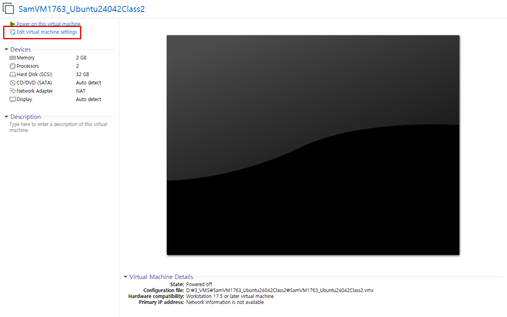

---

### ✅ ② 하단 `Add` 클릭 → `Hard Disk` 선택 후 **Next**
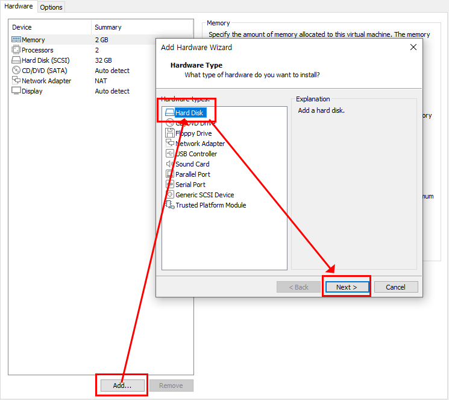

---

### ✅ ③ 연습용이므로 **1GB**로 설정  
→ `Store virtual disk as a single file` 선택 후 **Next**
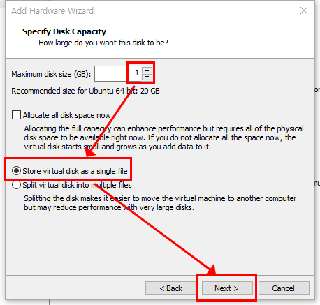

---

### ✅ ④ 추가된 HDD 확인 후 **OK 버튼 클릭**
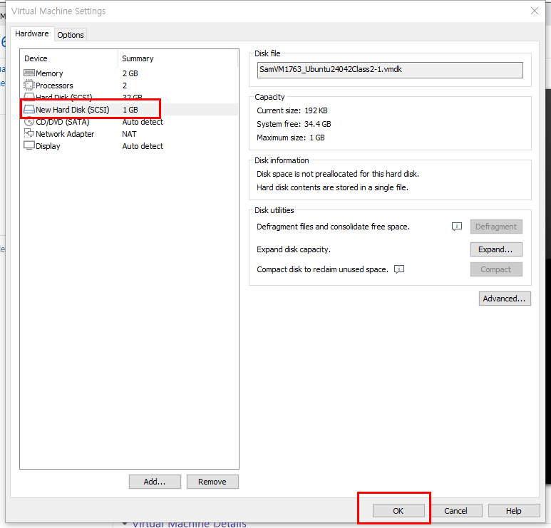

---

### ✅ ⑤ 설정 완료 후 **우분투 실행**
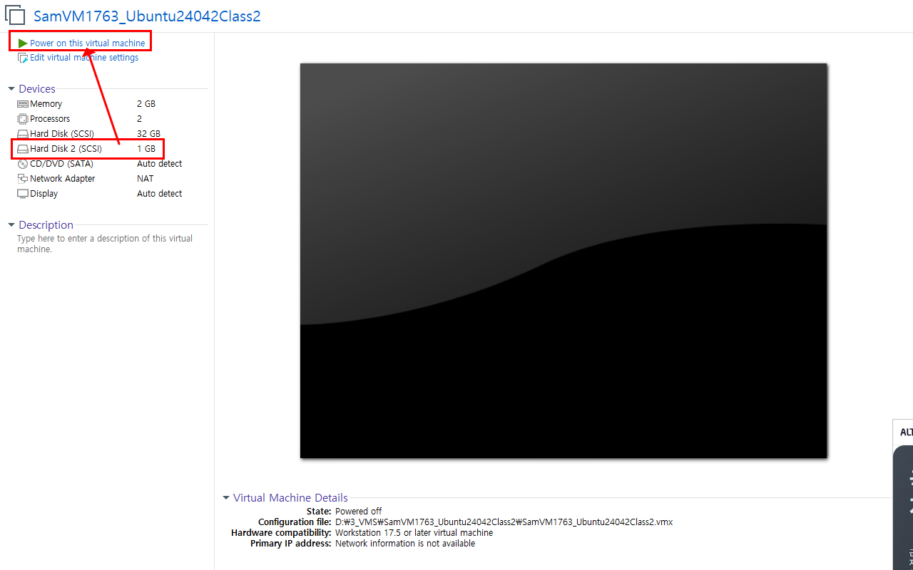

---

## 🧱 Step 2. 추가한 HDD 확인(fdisk -l)하기

‘putty’ 로 원격 접속을 시도한다.


Disk /dev/sda2는 시스템 HDD이며, Disk /dev/sdb는 새로 추가한 HDD
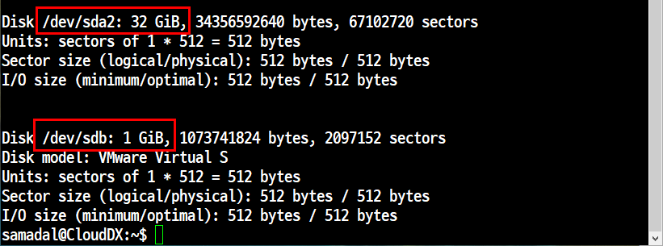
---

## 🧱 step 3. 파티션(File System) 설정(Fdisk)하기

---
- p: 파티션확인 <br>
- n 새로운 파티션 추가 <br>
- d 파티션지우기 <br>
- w저장하고 나가기 <br> 
- q 저장하지 않고 나가기
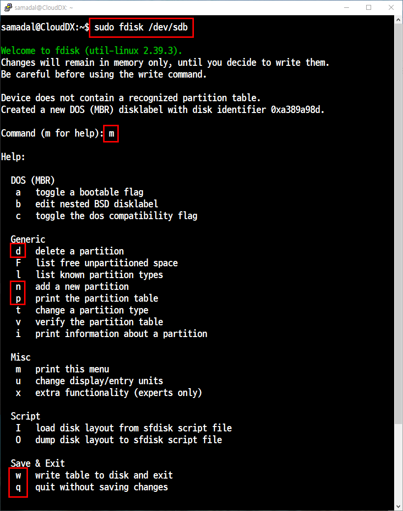
---
생성 후 확인
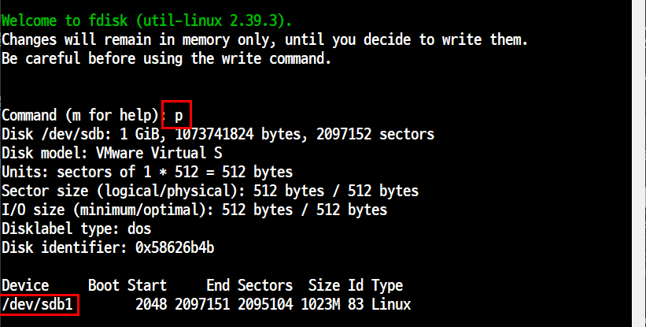
---

## 🧱 step 4. 파티션(File System) 포맷(Format)하기

- 포멧
    
    → 파티션에 데이터를 저장할 수 있는 상태로 만드는 것을 말한다.
    
    → 하드 디스크의 ‘Track’과 ‘Sector’로 구분하는 작업을 말한다.
    
    → ‘mkfs’는 ‘Make File System’을 의미하는데 파티션을 설정한다는 말이다.
    
- 사용법
    ```
    → mkfs.ext4 /dev/<파티션명>
    → mkfs -t ext4 /dev/<파티션명>
파티션을 추가 한 후에 포멧
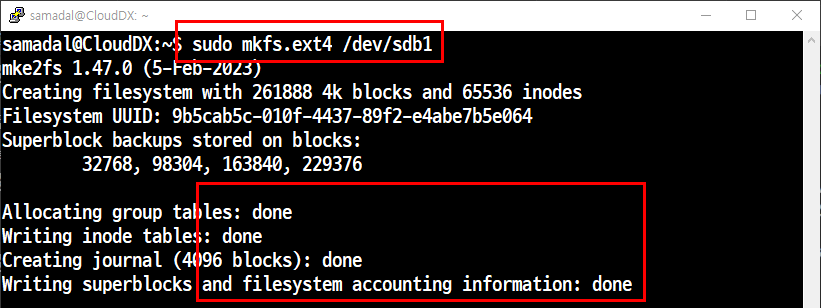

---
## 🧱 step 5. 파티션(File System) 마운트(Mount)하기 (df -h)
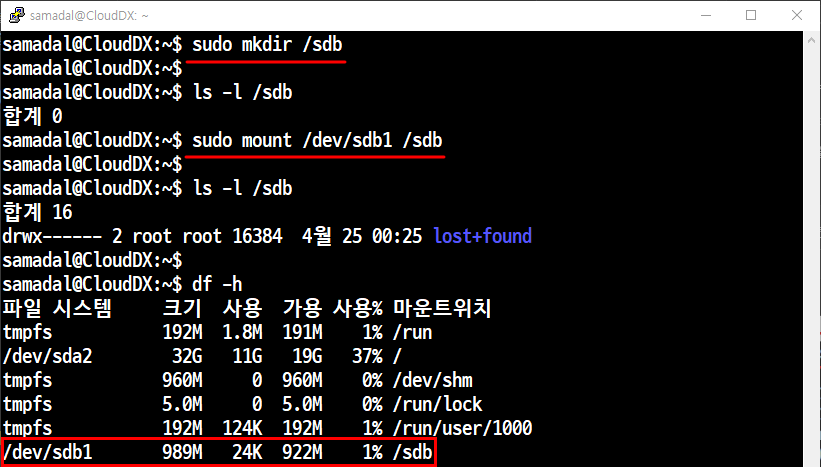

---
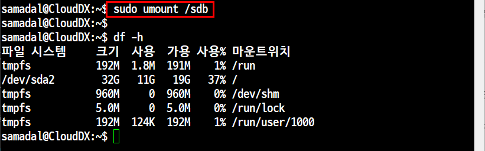

```
sudo umount /디렉터리 <-- 마운트 해제 명령어(마운트 걸린 디렉터리만)
```

## 💡 왜 마운트를 해야 할까?
디스크나 USB 등 저장 장치를
**운영체제가 사용할 수 있게 연결(인식)**해야 하기 때문

리눅스에서는 마운트하지 않으면 디바이스는 존재만 하고 접근이 불가능

## ⚙️ 보너스: 자동 마운트 설정 (fstab)
시스템 부팅 시마다 자동 마운트를 위해 설정

파일 열기: sudo vi /etc/fstab

가장 아래에 한 줄 추가:

예시: /dev/sdb1 /mnt/mydisk ext4 defaults 0 2

저장 후 종료 (Ctrl + O, Enter, Ctrl + X)

적용 테스트 (재부팅 없이):
sudo mount -a → 에러 없으면 성공

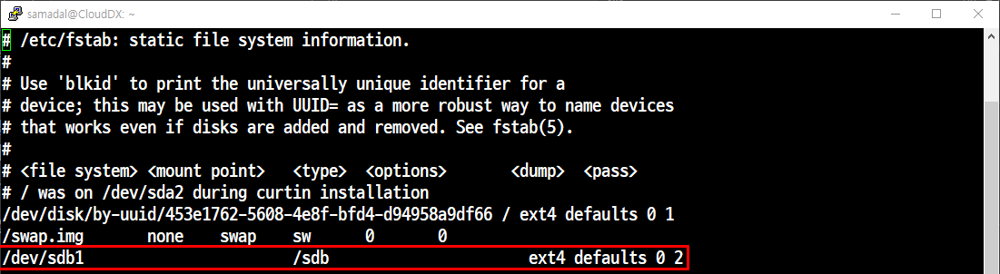

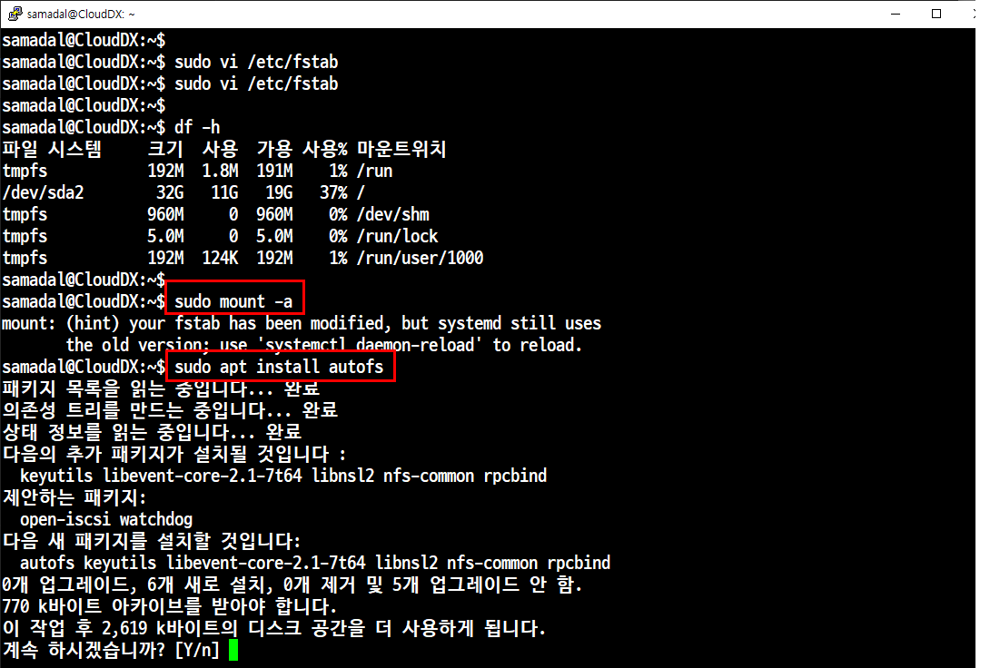

```
sudo mount -a
sudo apt install autofs
```

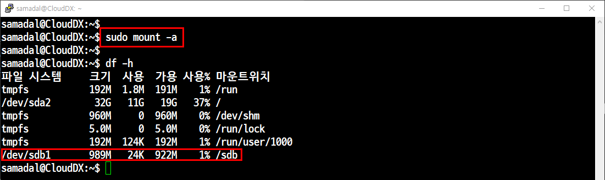
이러면 종료 후 다시 재 실행 해도 자동 마운트 