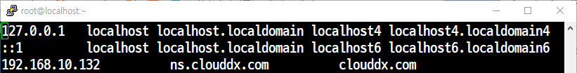
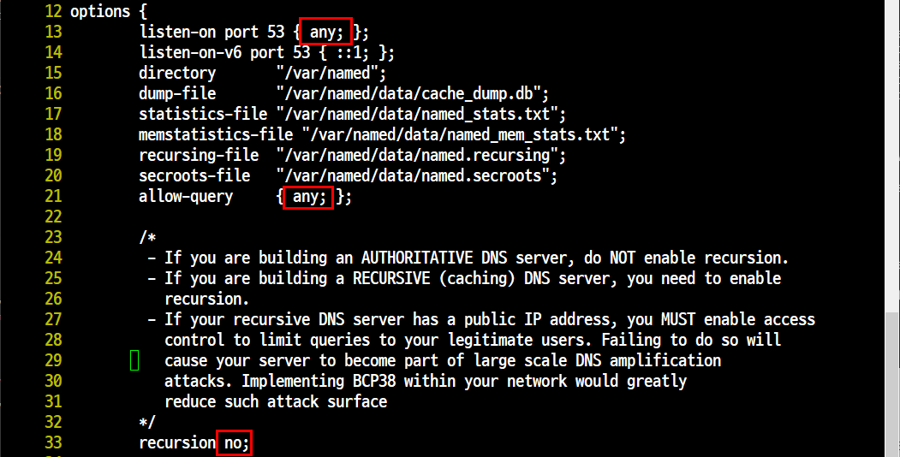
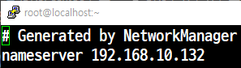
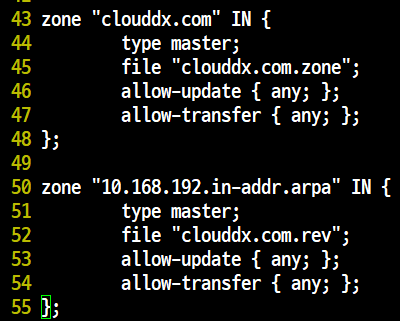
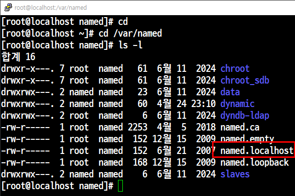
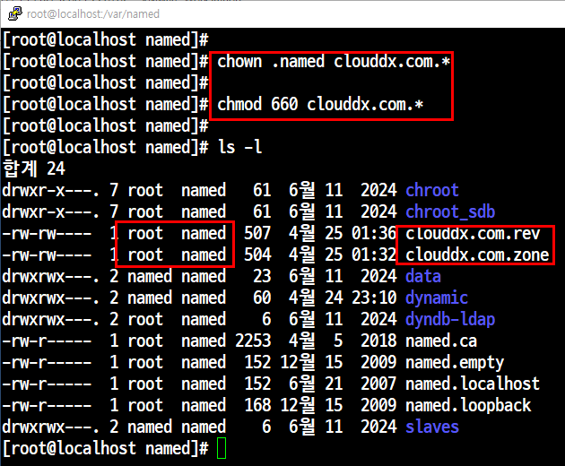
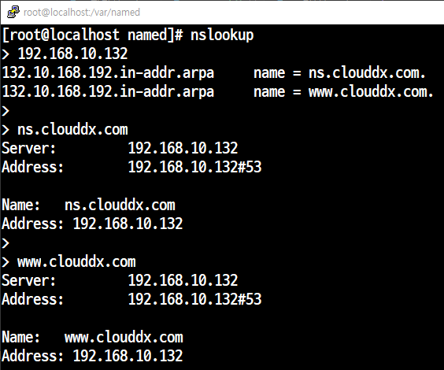
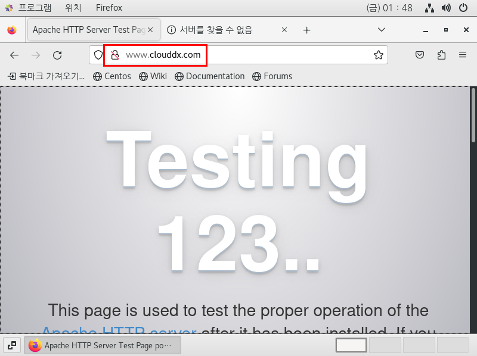
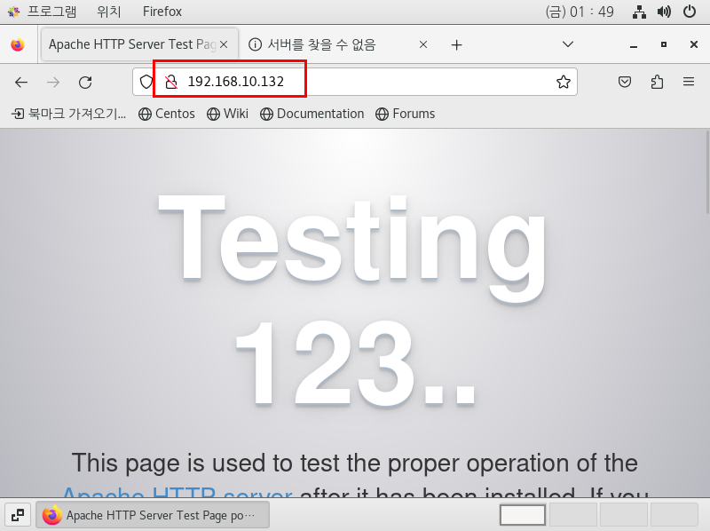

# 📘 [DNS] CentOS

## 📝 개요
- 사람이 기억하기 쉬운 **도메인명**을  
  기계가 처리할 수 있는 **IP 주소**로 변환해주는 시스템

---

## 📦 패키지 설치

```bash
yum -y install httpd-*
yum -y install bind-*
```

## 🔥 DNS 서버 방화벽 설정 (Firewall)
1. **방화벽 설치 및 시작**
```
yum install firewalld -y
systemctl start firewalld
systemctl enable firewalld
```
2. **DNS 포트(53번) 허용**
```
firewall-cmd --permanent --add-port=53/tcp
firewall-cmd --permanent --add-port=53/udp
```
3. **방화벽 재로드**
```
firewall-cmd --reload
```
## 📝 참고
- DNS는 TCP/UDP 모두 사용하므로 두 프로토콜 모두 허용해야 합니다.

- TCP는 주로 Zone 전송, UDP는 일반 질의 응답에 사용됩니다.


## ⚙️ DNS 환경 설정

### `/etc/hosts` 파일 수정

```
vi /etc/hosts
```



### 주요 설정 예시

| IP 주소            | 도메인 이름                  | 설명                               |
|--------------------|------------------------------|------------------------------------|
| 127.0.0.1          | localhost                    | 루프백 주소, 자기 자신 (IPv4)      |
| ::1                | localhost                    | 루프백 주소, 자기 자신 (IPv6)      |
| 192.168.10.132     | ns.clouddx.com clouddx.com   | 도메인들을 해당 IP에 매핑          |

- `localhost` → 자기 자신을 의미  
- `ns.clouddx.com`, `clouddx.com` → 내부 DNS 테스트용 도메인 매핑

---
### `/etc/named.conf` 파일 수정


### **(1) `listen-on port 53 { any; };` (13번 줄)**

- `any` 그대로 유지 → **모든 네트워크 인터페이스**에서 IPv4 DNS 요청을 받을 수 있음.

### **(2) `allow-query { any; };` (21번 줄)**

- `any` 그대로 유지 → **어떤 클라이언트든 DNS 쿼리 요청 가능** (외부에서도 사용 가능).

### **(3) `recursion no;` (33번 줄)**

- `no` 그대로 유지 → 이 서버는 **다른 DNS 서버에 재귀적으로 조회하지 않음**.
---
### `/etc/resolv.conf` 파일 수정


---
### `/etc/named.rfc1912.zones` 파일 수정


---
### `/var/named/` 파일 조회

named.localhost를 clouddx.com.zone 정방향 파일로 복사한다.
```
[root@localhost named]#cp -p named.localhost clouddx.com.zone
```
그리고 zone 파일을 채워준다.
### 정방향 `var/named/clouddx.com.zone` 파일 수정 

```
$TTL 1D
@       IN SOA  ns.clouddx.com. root.clouddx.com. (
                                        0       ; serial
                                        1D      ; refresh
                                        1H      ; retry
                                        1W      ; expire
                                        3H )    ; minimum
        IN      NS      ns.clouddx.com.
        IN      A       192.168.10.132

ns      IN      A       192.168.10.132
www     IN      A       192.168.10.132
```
다음은 zone 파일을 복사하여 역방향 파일인 rev 파일을 만들어준다.

```
cp -p clouddx.com.zone clouddx.com.rev
```
### 역방향 `var/named/clouddx.com.rev` 파일 수정

```
$TTL 1D
@       IN SOA  ns.clouddx.com. root.clouddx.com. (
                                        0       ; serial
                                        1D      ; refresh
                                        1H      ; retry
                                        1W      ; expire
                                        3H )    ; minimum
        IN      NS      ns.clouddx.com.
        IN      A       192.168.10.132

132     IN      PTR     ns.clouddx.com.
132     IN      PTR     www.clouddx.com.
```
### `clouddx.com.zone, clouddx.com.rev`허가권 소유권 변경


---
### 데몬 재실행
- DNS 서버(named)와 웹 서버(httpd)라는 두 개의 데몬을 설정하고, 실행 및 재시작
```
[root@localhost named]# systemctl restart named
[root@localhost named]# systemctl restart httpd
```
---
### `정방향 / 역방향 조회(DNS Query) 테스트` 파일 조회

---

### centOS FireFox에서 `www.clouddx.com` 검색

---

### centOS FireFox에서 `192.168.10.132` 검색

---

## ✅ DNS 서버 구축 마무리

CentOS 환경에서 BIND를 이용한 **DNS 서버 구축 및 검증**이 완료되었습니다.

---

### 🔹 핵심 정리
- `named.conf`를 통한 기본 설정
- 정방향 / 역방향 zone 파일 작성
- DNS 서비스 활성화 및 부팅 시 자동 실행 설정  
  → `systemctl enable named`
- `nslookup`을 통한 도메인 ↔ IP 매핑 검증

---

### 🔹 정상 작동 확인
- **도메인명을 통해 IP 확인 가능**
- **IP 주소를 통해 도메인명 역조회 가능**

✅ 위 두 가지가 모두 된다면 DNS 서버는 정상 동작 중!

---

### 📌 Tip
- 방화벽에서 **53번 포트 (TCP/UDP)** 허용 확인
- 클라이언트의 `/etc/resolv.conf`에 **DNS 서버 IP** 설정
- 설정 변경 후에는 반드시 `systemctl restart named` 실행

---

### 💬 다음 스텝?
이제 해당 DNS 서버를 기반으로:

- 웹 서버 연결
- 메일 서버 연동
- 내부망 도메인 관리 등

다양한 네트워크 실습 환경을 구성할 수 있습니다.

